## 第01课：初识Python

### Python简介

Python是由荷兰人吉多·范罗苏姆（Guido von Rossum）发明的一种编程语言，是目前世界上最受欢迎和拥有最多用户群体的编程语言。

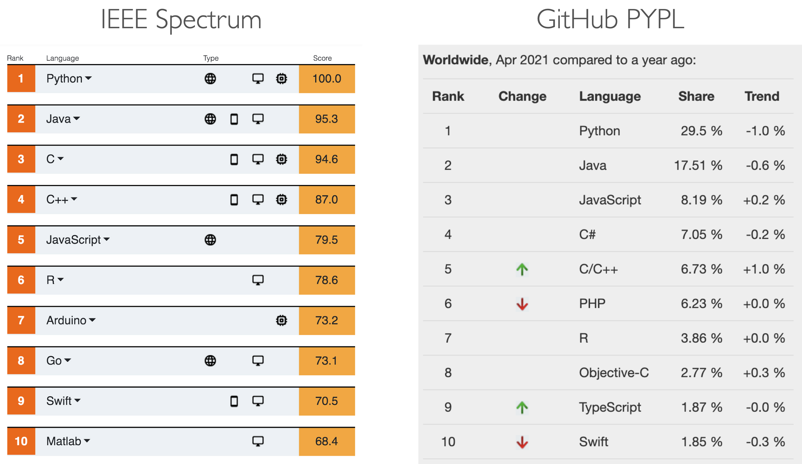

#### Python的历史

1. 1989年圣诞节：Guido开始写Python语言的编译器。
2. 1991年2月：第一个Python解释器诞生，它是用C语言实现的，可以调用C语言的库函数。
3. 1994年1月：Python 1.0正式发布。
4. 2000年10月：Python 2.0发布，Python的整个开发过程更加透明，生态圈开始慢慢形成。
5. 2008年12月：Python 3.0发布，引入了诸多现代编程语言的新特性，但并不完全兼容之前的Python代码。
6. 2020年1月：在Python 2和Python 3共存了11年之后，官方停止了对Python 2的更新和维护，希望用户尽快过渡到Python 3。

> **说明**：大多数软件的版本号一般分为三段，形如A.B.C，其中A表示大版本号，当软件整体重写升级或出现不向后兼容的改变时，才会增加A；B表示功能更新，出现新功能时增加B；C表示小的改动（例如：修复了某个Bug），只要有修改就增加C。

#### Python的优缺点

Python的优点很多，简单为大家列出几点。

1. 简单明确，跟其他很多语言相比，Python更容易上手。
2. 能用更少的代码做更多的事情，提升开发效率。
3. 开放源代码，拥有强大的社区和生态圈。
4. 能够做的事情非常多，有极强的适应性。
5. 能够在Windows、macOS、Linux等各种系统上运行。

Python最主要的缺点是执行效率低，但是当我们更看重产品的开发效率而不是执行效率的时候，Python就是很好的选择。

#### Python的应用领域

目前Python在Web服务器应用开发、云基础设施开发、**网络数据采集**（爬虫）、**数据分析**、量化交易、**机器学习**、**深度学习**、自动化测试、自动化运维等领域都有用武之地。

### 安装Python环境

想要开始你的Python编程之旅，首先得在计算机上安装Python环境，简单的说就是得安装运行Python程序的工具，通常也称之为Python解释器。我们强烈建议大家安装Python 3的环境，很明显它是目前更好的选择。

#### Windows环境

可以在[Python官方网站](https://www.python.org/downloads/)找到下载链接并下载Python 3的安装程序。

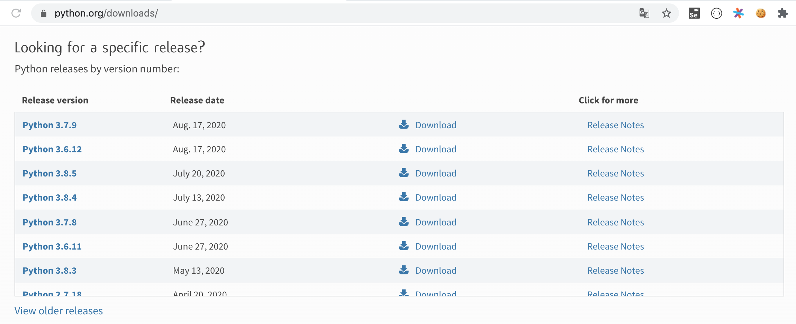

对于Windows操作系统，可以下载“executable installer”。需要注意的是，如果在Windows 7环境下安装Python 3，需要先安装Service Pack 1补丁包，大家可以在Windows的“运行”中输入`winver`命令，从弹出的窗口上可以看到你的系统是否安装了该补丁包。如果没有该补丁包，一定要先通过“Windows Update”或者类似“CCleaner”这样的工具自动安装该补丁包，安装完成后通常需要重启你的Windows系统，然后再开始安装Python环境。

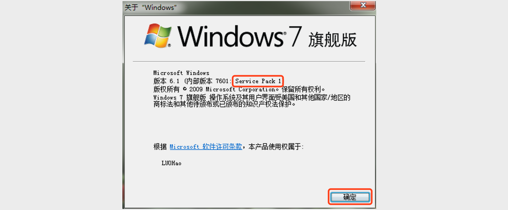

双击运行刚才下载的安装程序，会打开Python环境的安装向导。在执行安装向导的时候，记得勾选“Add Python 3.x to PATH”选项，这个选项会帮助我们将Python的解释器添加到PATH环境变量中（不理解没关系，照做就行），具体的步骤如下图所示。

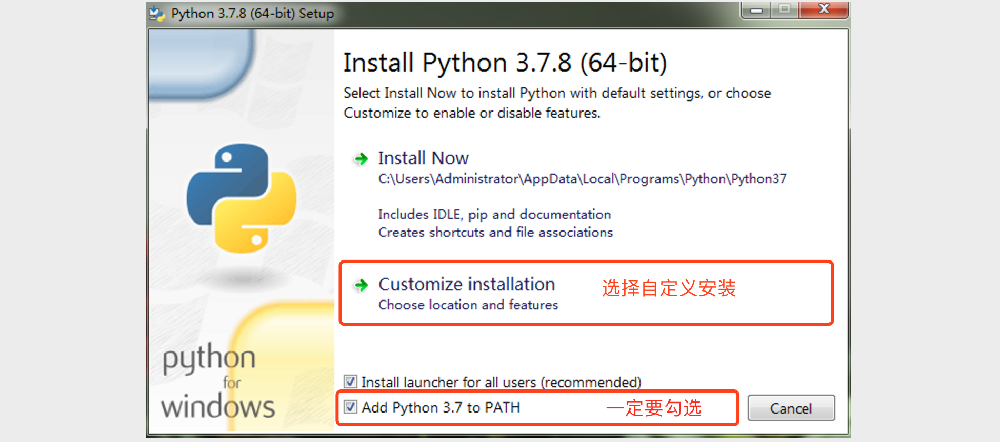

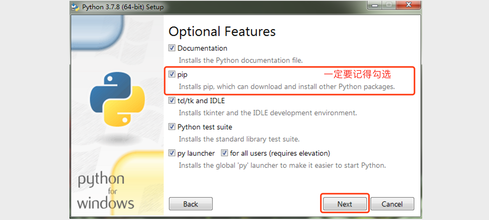

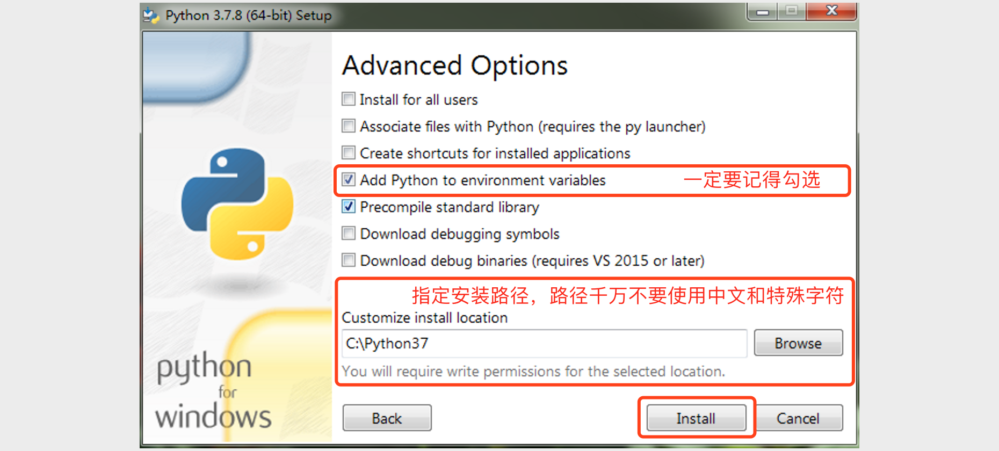

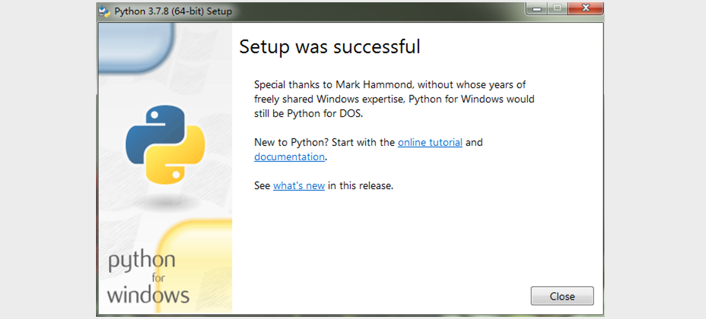

安装完成后可以打开Windows的“命令行提示符”工具（或“PowerShell”）并输入`python --version`或`python -V`来检查安装是否成功，命令行提示符可以在“运行”中输入`cmd`来打开或者在“开始菜单”的附件中找到它。如果看了Python解释器对应的版本号（如：Python 3.7.8），说明你的安装已经成功了，如下图所示。

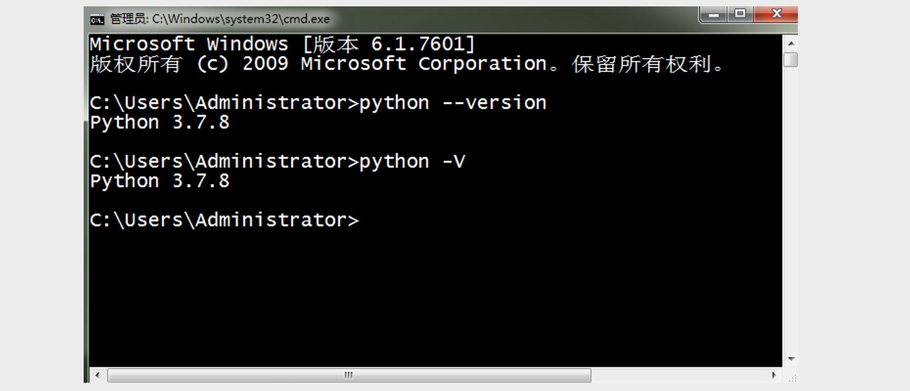

> **说明**：如果安装过程显示安装失败或执行上面的命令报错，很有可能是因为你的Windows系统缺失了一些动态链接库文件或C构建工具导致的问题。可以在[微软官网](https://www.microsoft.com/zh-cn/download/details.aspx?id=48145)下载Visual C++ Redistributable for Visual Studio 2015文件进行修复，64位的系统需要下载有x64标记的安装文件。也可以通过下面的百度云盘地址获取修复工具，运行修复工具，按照如下图所示的方式进行修复，链接: https://pan.baidu.com/s/1iNDnU5UVdDX5sKFqsiDg5Q 提取码: cjs3。
>
> 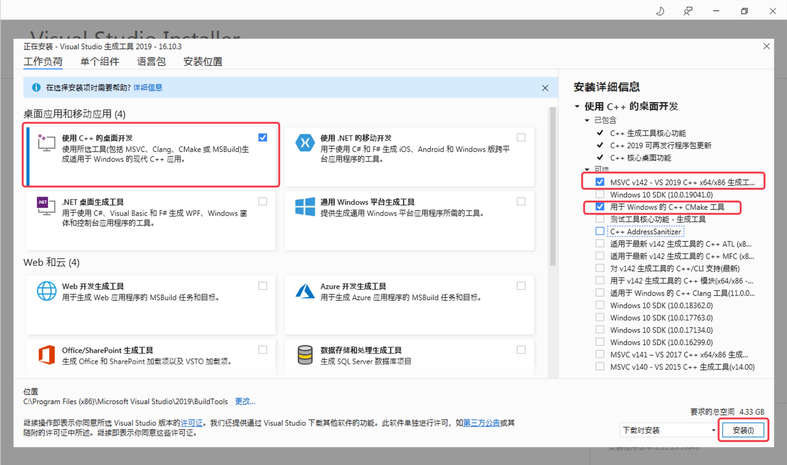

除此之外，你还应该检查一下Python的包管理工具是否已经可用，对应的命令是`pip --version`。

#### macOS环境

macOS自带了Python 2，但是我们需要安装和使用的是Python 3。可以通过Python官方网站提供的[下载链接](<https://www.python.org/downloads/release/python-376/>)找到适合macOS的“macOS installer”来安装Python 3，安装过程基本不需要做任何勾选，直接点击“下一步”即可。安装完成后，可以在macOS的“终端”工具中输入`python3`命令来调用Python 3解释器，因为如果直接输入`python`，将会调用Python 2的解释器。

### 总结

Python语言可以做很多的事情，也值得我们去学习。要使用Python语言，首先需要在自己的计算机上安装Python环境，也就是运行Python程序的Python解释器。

## 第02课：第一个Python程序

在上一课中，我们已经了解了Python语言并安装了运行Python程序所需的环境，相信大家已经迫不及待的想开始自己的Python编程之旅了。首先我们来看看应该在哪里编写我们的Python程序。

### 编写代码的工具

#### 交互式环境

我们打开Windows的“命令提示符”工具，输入命令`python`然后回车就可以进入到Python的交互式环境中。所谓交互式环境，就是我们输入一行代码回车，代码马上会被执行，如果代码有产出结果，那么结果会被显示在窗口中。例如：

```Bash
Python 3.7.6
Type "help", "copyright", "credits" or "license" for more information.
>>> 2 * 3
6
>>> 2 + 3
5
```

> **提示**：使用macOS系统的用户需要打开“终端”工具，输入`python3`进入交互式环境。

如果希望退出交互式环境，可以在交互式环境中输入`quit()`，如下所示。

```Bash
>>> quit()
```

#### 更好的交互式环境 - IPython

Python默认的交互式环境用户体验并不怎么好，我们可以用IPython来替换掉它，因为IPython提供了更为强大的编辑和交互功能。我们可以使用Python的包管理工具`pip`来安装IPython，如下所示。

```bash
pip install ipython
```

> **温馨提示**：在使用上面的命令安装IPython之前，可以先通过`pip config set global.index-url https://pypi.doubanio.com/simple`命令将`pip`的下载源修改为国内的豆瓣网，否则下载安装的过程可能会非常的缓慢。

可以使用下面的命令启动IPython，进入交互式环境。

```bash
ipython
```

#### 文本编辑器 - Visual Studio Code

Visual Studio Code（通常简称为VSCode）是一个由微软开发能够在Windows、 Linux和macOS等操作系统上运行的代码编辑神器。它支持语法高亮、自动补全、多点编辑、运行调试等一系列便捷功能，而且能够支持多种编程语言。如果大家要选择一款高级文本编辑工具，强烈建议使用VSCode。关于VSCode的[下载](https://code.visualstudio.com/)、安装和使用，推荐大家阅读一篇名为[《VScode安装使用》](<https://zhuanlan.zhihu.com/p/106357123>)的文章。

#### 集成开发环境 - PyCharm

如果用Python开发商业项目，我们推荐大家使用更为专业的工具PyCharm。PyCharm是由捷克一家名为[JetBrains](https://www.jetbrains.com/)的公司开发的用于Python项目开发的集成开发环境（IDE)。所谓集成开发环境，通常是指工具中提供了编写代码、运行代码、调试代码、分析代码、版本控制等一系列功能，因此特别适合商业项目的开发。在JetBrains的官方网站上提供了PyCharm的[下载链接](<https://www.jetbrains.com/pycharm/download>)，其中社区版（Community）是免费的但功能相对弱小（其实已经足够强大了），专业版（Professional）功能非常强大，但需要按年或月付费使用，新用户可以试用30天时间。

运行PyCharm，可以看到如下图所示的欢迎界面，可以选择“New Project”来创建一个新的项目。

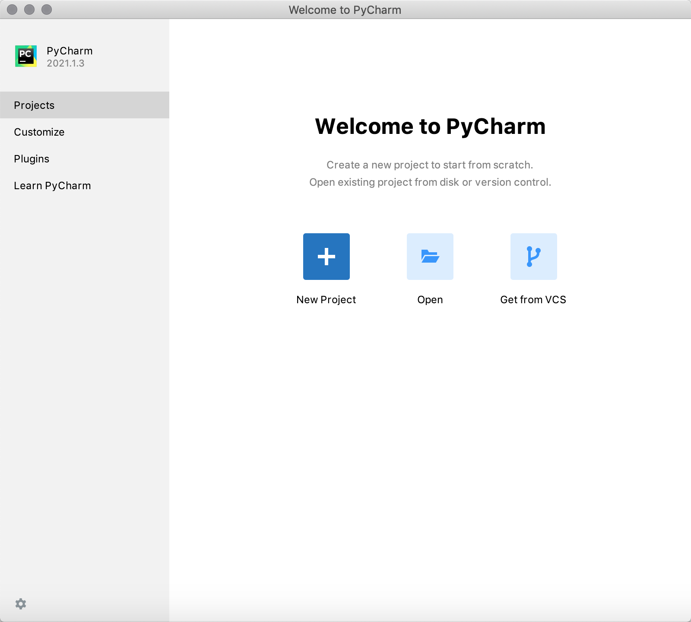

创建项目的时候需要指定项目的路径并创建运行项目的”虚拟环境“，如下图所示。

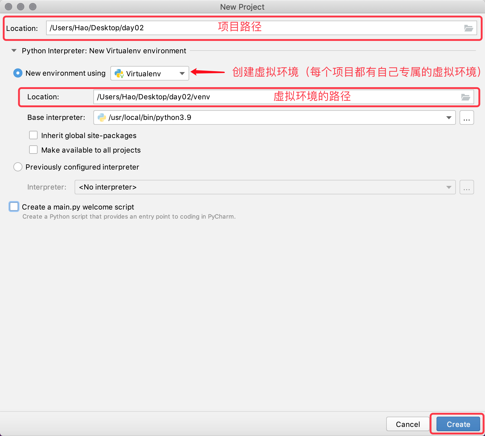

项目创建好以后会出现如下图所示的画面，我们可以通过在项目文件夹上点击鼠标右键，选择“New”菜单下的“Python File”来创建一个Python文件，创建好的Python文件会自动打开进入可编辑的状态。

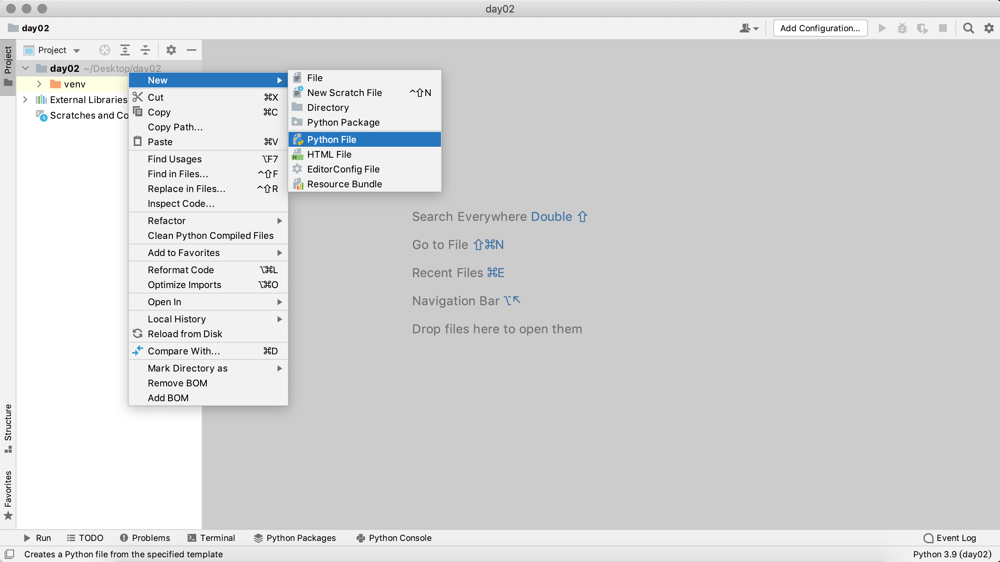

写好代码后，可以在编辑代码的窗口点击鼠标右键，选择“Run”菜单项来运行代码，下面的“Run”窗口会显示代码的执行结果，如下图所示。

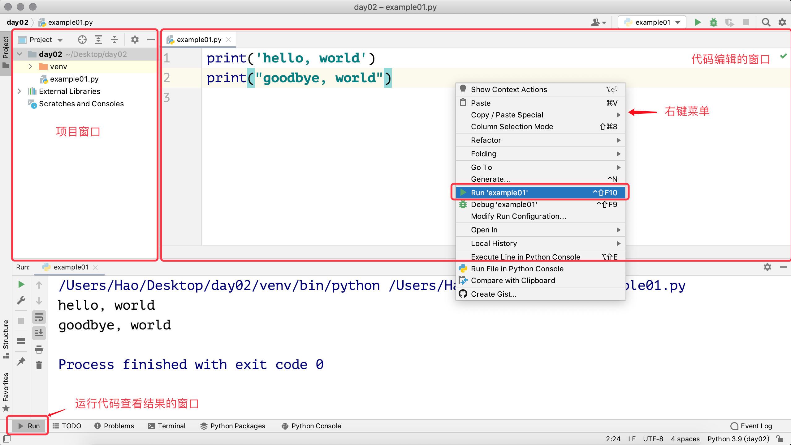

PyCharm常用的快捷键如下表所示，我们也可以在“File”菜单的“Settings”中定制PyCharm的快捷键（macOS系统是在“PyCharm”菜单的“Preferences”中对快捷键进行设置）。

表1. PyCharm常用快捷键。

| 快捷键                                  | 作用                                   |
| --------------------------------------- | -------------------------------------- |
| `ctrl + j`                              | 显示可用的代码模板                     |
| `ctrl + b`                              | 查看函数、类、方法的定义               |
| `ctrl + alt + l`                        | 格式化代码                             |
| `alt + enter`                           | 万能代码修复快捷键                     |
| `ctrl + /`                              | 注释/反注释代码                        |
| `shift + shift`                         | 万能搜索快捷键                         |
| `ctrl + d` / `ctrl + y`                 | 复制/删除一行代码                      |
| `ctrl + shift + -` / `ctrl + shift + +` | 折叠/展开所有代码                      |
| `F2`                                    | 快速定位到错误代码                     |
| `ctrl + alt + F7`                       | 查看哪些地方用到了指定的函数、类、方法 |

> **说明**：使用macOS系统，可以将上面的`ctrl`键换成`command`键，在macOS系统上，可以使用`ctrl + space`组合键来获得万能提示，在Windows系统上不能使用该快捷键，因为它跟Windows默认的切换输入法的快捷键是冲突的，需要重新设置。

### hello, world

按照行业惯例，我们学习任何一门编程语言写的第一个程序都是输出`hello, world`，因为这段代码是伟大的丹尼斯·里奇（C语言之父，和肯·汤普森一起开发了Unix操作系统）和布莱恩·柯尼汉（awk语言的发明者）在他们的不朽著作*The C Programming Language*中写的第一段代码。

```Python
print('hello, world')
```

### 运行程序

如果不使用PyCharm这样的集成开发环境，我们可以将上面的代码命名为`hello.py`，对于Windows操作系统，可以在你保存代码的目录下先按住键盘上的`shift`键再点击鼠标右键，这时候鼠标右键菜单中会出现“命令提示符”选项，点击该选项就可以打开“命令提示符”工具，我们输入下面的命令。

```Shell
python hello.py
```

> **提醒**：我们也可以在任意位置打开“命令提示符”，然后将需要执行的Python代码通过拖拽的方式拖入到“命令提示符”中，这样相当于指定了文件的绝对路径来运行该文件中的Python代码。再次提醒，macOS系统要通过`python3`命令来运行该程序。

你可以尝试将上面程序单引号中的`hello, world`换成其他内容；你也可以尝试着多写几个这样的语句，看看会运行出怎样的结果。需要提醒大家，上面代码中的`print('hello, world')`就是一条完整的语句，我们用Python写程序，最好每一行代码中只有一条语句。虽然使用`;`分隔符可以将多个语句写在一行代码中，但是最好不要这样做，因为代码会变得非常难看。

### 注释你的代码

注释是编程语言的一个重要组成部分，用于在源代码中解释代码的作用从而增强程序的可读性。当然，我们也可以将源代码中暂时不需要运行的代码段通过注释来去掉，这样当你需要重新使用这些代码的时候，去掉注释符号就可以了。简单的说，**注释会让代码更容易看懂但不会影响程序的执行结果**。

Python中有两种形式的注释：

1. 单行注释：以`#`和空格开头，可以注释掉从`#`开始后面一整行的内容。
2. 多行注释：三个引号开头，三个引号结尾，通常用于添加多行说明性内容。

```Python
"""
第一个Python程序 - hello, world

Version: 0.1
Author: 骆昊
"""
# print('hello, world')
print("你好，世界！")
```

### 总结

到这里，我们已经把第一个Python程序运行起来了，是不是很有成就感？只要你坚持学习下去，再过一段时间，我们就可以用Python制作小游戏、编写爬虫程序、完成办公自动化操作等。**写程序本身就是一件很酷的事情**，在未来编程就像英语一样，**对很多人来说或都是必须要掌握的技能**。

## 第03课：Python语言元素之变量

作为一个程序员，可能经常会被外行问到两个问题，其一是“什么是（计算机）程序”，其二是“写（计算机）程序能做什么”，这里我先对这两个问题做一个回答。**程序是指令的集合**，**写程序就是用指令控制计算机做我们想让它做的事情**。那么，为什么要用Python语言来写程序呢？因为**Python语言简单优雅**，相比C、C++、Java这样的编程语言，**Python对初学者更加友好**，当然这并不是说Python不像其他语言那样强大，**Python几乎是无所不能的**，在第一节课的时候，我们就说到了Python可以用于服务器程序开发、云平台开发、数据分析、机器学习等各个领域。当然，Python语言还可以用来粘合其他语言开发的系统，所以也经常被戏称为“**胶水语言**”。

### 一些计算机常识

在开始系统的学习编程之前，我们先来科普一些计算机的基础知识。计算机的硬件系统通常由五大部件构成，包括：**运算器**、**控制器**、**存储器**、**输入设备**和**输出设备**。其中，运算器和控制器放在一起就是我们常说的**中央处理器**，它的功能是执行各种运算和控制指令。刚才我们提到过程序是指令的集合，写程序就是将一系列的指令按照某种方式组织到一起，然后通过这些指令去控制计算机做我们想让它做的事情。目前，我们使用的计算机基本都是“冯·诺依曼体系结构”的计算机，这种计算机有两个关键点：一是要将**存储设备与中央处理器分开**；二是将**数据以二进制方式编码**。

二进制是一种“逢二进一”的计数法，跟我们人类使用的“逢十进一”的计数法本质是一样的。人类因为有十根手指所以使用了十进制，因为在计数时十根手指用完之后就只能用进位的方式来表示更大的数值。当然凡事都有例外，玛雅人可能是因为长年光着脚的原因，把脚趾头也都用上了，于是他们使用了二十进制的计数法。在这种计数法的指导下，玛雅人的历法就与我们平常使用的历法并不相同。按照玛雅人的历法，2012年是上一个所谓的“太阳纪”的最后一年，而2013年则是新的“太阳纪”的开始，后来这件事情被以讹传讹的方式误传为”2012年是玛雅人预言的世界末日“的荒诞说法。今天很多人都在猜测，玛雅文明之所以发展缓慢跟使用了二十进制是有关系的。对于计算机来说，二进制在物理器件上最容易实现的，因为可以用高电压表示1，用低电压表示0。不是所有写程序的人都需要知道十进制与二进制如何转换，大多数时候我们即便不了解这些知识也能写出程序，但是我们必须要知道**计算机是使用二进制计数的**，不管什么**数据到了计算机内存中都是以二进制形式存在的**。

### 变量和类型

要想在计算机内存中保存数据，首先就得说一说变量这个概念。在编程语言中，**变量是数据的载体**，简单的说就是一块用来保存数据的内存空间，**变量的值可以被读取和修改**，这是所有计算和控制的基础。计算机能处理的数据有很多种类型，最常见的就是数值，除了数值之外还有文本、图形、音频、视频等各种各样的数据。虽然数据在计算机中都是以二进制形态存在的，但是我们可以用不同类型的变量来表示数据类型的差异。**Python中的数据类型很多**，而且也**允许我们自定义新的数据类型**（这一点在后面会讲到），这里我们需要先了解几种常用的数据类型。

- 整型（`int`）：Python中可以处理任意大小的整数，而且支持二进制（如`0b100`，换算成十进制是4）、八进制（如`0o100`，换算成十进制是64）、十进制（`100`）和十六进制（`0x100`，换算成十进制是256）的表示法。
- 浮点型（`float`）：浮点数也就是小数，之所以称为浮点数，是因为按照科学记数法表示时，一个浮点数的小数点位置是可变的，浮点数除了数学写法（如`123.456`）之外还支持科学计数法（如`1.23456e2`）。
- 字符串型（`str`）：字符串是以单引号或双引号括起来的任意文本，比如`'hello'`和`"hello"`。
- 布尔型（`bool`）：布尔值只有`True`、`False`两种值，要么是`True`，要么是`False`。

### 变量命名

对于每个变量我们需要给它取一个名字，就如同我们每个人都有自己的名字一样。在Python中，变量命名需要遵循以下这些规则，这些规则又分为必须遵守的硬性规则和建议遵守的非硬性规则。

- 硬性规则：
  - 规则1：变量名由**字母**、数字和**下划线**构成，数字不能开头。需要说明的是，这里说的字母指的是Unicode字符，Unicode称为万国码，囊括了世界上大部分的文字系统，这也就意味着中文、日文、希腊字母等都可以作为变量名中的字符，但是像`!`、`@`、`#`这些特殊字符是不能出现在变量名中的，而且我们强烈建议大家**尽可能使用英文字母**。
  - 规则2：**大小写敏感**，简单的说就是大写的`A`和小写的`a`是两个不同的变量。
  - 规则3：变量名**不要跟Python语言的关键字**（有特殊含义的单词，后面会讲到）和**保留字**（如已有的函数、模块等的名字）**发生重名的冲突**。
- 非硬性规则：
  - 规则1：变量名通常使用小写英文字母，多个单词用下划线进行连接。
  - 规则2：受保护的变量用单个下划线开头。
  - 规则3：私有的变量用两个下划线开头。

规则2和规则3大家暂时不用理解，后面自然会明白的。当然，作为一个专业的程序员，给变量（事实上应该是所有的标识符）命名时做到**见名知意**也非常重要。

### 变量的使用

下面通过例子来说明变量的类型和变量的使用。

```Python
"""
使用变量保存数据并进行加减乘除运算

Version: 0.1
Author: 骆昊
"""
a = 45          # 变量a保存了45
b = 12          # 变量b保存了12
print(a + b)    # 57
print(a - b)    # 33
print(a * b)    # 540
print(a / b)    # 3.75
```

在Python中可以使用`type`函数对变量的类型进行检查。程序设计中函数的概念跟数学上函数的概念基本一致，数学上的函数相信大家并不陌生，它包括了函数名、自变量和因变量。如果暂时不理解函数这个概念也不要紧，我们会在后续的内容中专门讲解函数的定义和使用。

```Python
"""
使用type()检查变量的类型

Version: 0.1
Author: 骆昊
"""
a = 100
b = 12.345
c = 'hello, world'
d = True
print(type(a))    # <class 'int'>
print(type(b))    # <class 'float'>
print(type(c))    # <class 'str'>
print(type(d))    # <class 'bool'>
```

不同类型的变量可以相互转换，这一点可以通过Python的内置函数来实现。

- `int()`：将一个数值或字符串转换成整数，可以指定进制。
- `float()`：将一个字符串转换成浮点数。
- `str()`：将指定的对象转换成字符串形式，可以指定编码。
- `chr()`：将整数转换成该编码对应的字符串（一个字符）。
- `ord()`：将字符串（一个字符）转换成对应的编码（整数）。

下面的例子为大家演示了Python中类型转换的操作。

```Python
"""
Python中的类型转换操作

Version: 0.1
Author: 骆昊
"""
a = 100
b = 12.345
c = 'hello, world'
d = True
# 整数转成浮点数
print(float(a))    # 100.0
# 浮点型转成字符串 (输出字符串时不会看到引号哟)
print(str(b))      # 12.345
# 字符串转成布尔型 (有内容的字符串都会变成True)
print(bool(c))     # True
# 布尔型转成整数 (True会转成1，False会转成0)
print(int(d))      # 1
# 将整数变成对应的字符 (97刚好对应字符表中的字母a)
print(chr(97))     # a
# 将字符转成整数 (Python中字符和字符串表示法相同)
print(ord('a'))    # 97
```

### 总结

在Python程序中，我们可以**使用变量来保存数据**，**变量有不同的类型**，**变量可以做运算**（下一课会有详细的讲解），**也可以通过内置函数来转换变量类型**。
## 第04课：Python语言元素之运算符

Python语言支持很多种运算符，我们先用一个表格为大家列出这些运算符，然后选择一些马上就会用到的运算符为大家进行讲解。

| 运算符                                                       | 描述                           |
| ------------------------------------------------------------ | ------------------------------ |
| `[]` `[:]`                                                   | 下标，切片                     |
| `**`                                                         | 指数                           |
| `~` `+` `-`                                                  | 按位取反, 正负号               |
| `*` `/` `%` `//`                                             | 乘，除，模，整除               |
| `+` `-`                                                      | 加，减                         |
| `>>` `<<`                                                    | 右移，左移                     |
| `&`                                                          | 按位与                         |
| `^` `\|`                                                      | 按位异或，按位或               |
| `<=` `<` `>` `>=`                                            | 小于等于，小于，大于，大于等于 |
| `==` `!=`                                                    | 等于，不等于                   |
| `is`  `is not`                                               | 身份运算符                     |
| `in` `not in`                                                | 成员运算符                     |
| `not` `or` `and`                                             | 逻辑运算符                     |
| `=` `+=` `-=` `*=` `/=` `%=` `//=` `**=` `&=` `|=` `^=` `>>=` `<<=` | （复合）赋值运算符             |

>**说明：** 上面这个表格实际上是按照运算符的优先级从上到下列出了各种运算符。所谓优先级就是在一个运算的表达式中，如果出现了多个运算符，应该先执行哪个运算再执行哪个运算的顺序。在实际开发中，如果搞不清楚运算符的优先级，可以使用圆括号来确保运算的执行顺序。

### 算术运算符

Python中的算术运算符非常丰富，除了大家最为熟悉的加减乘除之外，还有整除运算符、求模（求余数）运算符和求幂运算符。下面的例子为大家展示了算术运算符的使用。

```Python
"""
算术运算符

Version: 0.1
Author: 骆昊
"""
print(321 + 123)     # 加法运算
print(321 - 123)     # 减法运算
print(321 * 123)     # 乘法运算
print(321 / 123)     # 除法运算
print(321 % 123)     # 求模运算
print(321 // 123)    # 整除运算
print(321 ** 123)    # 求幂运算
```

### 赋值运算符

赋值运算符应该是最为常见的运算符，它的作用是将右边的值赋给左边的变量。下面的例子演示了赋值运算符和复合赋值运算符的使用。

```Python
"""
赋值运算符和复合赋值运算符

Version: 0.1
Author: 骆昊
"""
a = 10
b = 3
a += b        # 相当于：a = a + b
a *= a + 2    # 相当于：a = a * (a + 2)
print(a)      # 算一下这里会输出什么
```

###比较运算符和逻辑运算符

比较运算符有的地方也称为关系运算符，包括`==`、`!=`、`<`、`>`、`<=`、`>=`，我相信没有什么好解释的，大家一看就能懂，需要提醒的是比较相等用的是`==`，请注意这里是两个等号，因为`=`是赋值运算符，我们在上面刚刚讲到过，`==`才是比较相等的运算符；比较不相等用的是`!=`，这不同于数学上的不等号，Python 2中曾经使用过`<>`来表示不等关系，大家知道就可以了。比较运算符会产生布尔值，要么是`True`要么是`False`。

逻辑运算符有三个，分别是`and`、`or`和`not`。`and`字面意思是“而且”，所以`and`运算符会连接两个布尔值，如果两个布尔值都是`True`，那么运算的结果就是`True`；左右两边的布尔值有一个是`False`，最终的运算结果就是`False`。相信大家已经想到了，如果`and`左边的布尔值是`False`，不管右边的布尔值是什么，最终的结果都是`False`，所以在做运算的时候右边的值会被跳过（短路处理），这也就意味着在`and`运算符左边为`False`的情况下，右边的表达式根本不会执行。`or`字面意思是“或者”，所以`or`运算符也会连接两个布尔值，如果两个布尔值有任意一个是`True`，那么最终的结果就是`True`。当然，`or`运算符也是有短路功能的，在它左边的布尔值为`True`的情况下，右边的表达式根本不会执行。`not`运算符的后面会跟上一个布尔值，它的作用是得到与该布尔值相反的值，也就是说，`not`后面的布尔值如果是`True`，运算结果就是`False`；而`not`后面的布尔值如果是`False`，运算结果就是`True`。

```Python
"""
比较运算符和逻辑运算符的使用

Version: 0.1
Author: 骆昊
"""
flag0 = 1 == 1
flag1 = 3 > 2
flag2 = 2 < 1
flag3 = flag1 and flag2
flag4 = flag1 or flag2
flag5 = not (1 != 2)
print('flag0 =', flag0)    # flag0 = True
print('flag1 =', flag1)    # flag1 = True
print('flag2 =', flag2)    # flag2 = False
print('flag3 =', flag3)    # flag3 = False
print('flag4 =', flag4)    # flag4 = True
print('flag5 =', flag5)    # flag5 = False
```

> **说明**：比较运算符的优先级高于赋值运算符，所以`flag0 = 1 == 1`先做`1 == 1`产生布尔值`True`，再将这个值赋值给变量`flag0`。`print`函数可以输出多个值，多个值之间可以用`,`进行分隔，输出的内容之间默认以空格分开。

### 运算符的例子

#### 例子1：华氏温度转换为摄氏温度。

> **提示**：华氏温度到摄氏温度的转换公式为：`C = (F - 32) / 1.8`。

```Python
"""
将华氏温度转换为摄氏温度

Version: 0.1
Author: 骆昊
"""
f = float(input('请输入华氏温度: '))
c = (f - 32) / 1.8
print('%.1f华氏度 = %.1f摄氏度' % (f, c))
```

> **说明**：在使用`print`函数输出时，也可以对字符串内容进行格式化处理，上面`print`函数中的字符串`%.1f`是一个占位符，稍后会由一个`float`类型的变量值替换掉它。同理，如果字符串中有`%d`，后面可以用一个`int`类型的变量值替换掉它，而`%s`会被字符串的值替换掉。除了这种格式化字符串的方式外，还可以用下面的方式来格式化字符串，其中`{f:.1f}`和`{c:.1f}`可以先看成是`{f}`和`{c}`，表示输出时会用变量`f`和变量`c`的值替换掉这两个占位符，后面的`:.1f`表示这是一个浮点数，小数点后保留1位有效数字。
>
> ```Python
> print(f'{f:.1f}华氏度 = {c:.1f}摄氏度')
> ```

#### 例子2：输入圆的半径计算计算周长和面积。

```Python
"""
输入半径计算圆的周长和面积

Version: 0.1
Author: 骆昊
"""
radius = float(input('请输入圆的半径: '))
perimeter = 2 * 3.1416 * radius
area = 3.1416 * radius * radius
print('周长: %.2f' % perimeter)
print('面积: %.2f' % area)
```

#### 例子3：输入年份判断是不是闰年。

```Python
"""
输入年份 如果是闰年输出True 否则输出False

Version: 0.1
Author: 骆昊
"""
year = int(input('请输入年份: '))
is_leap = year % 4 == 0 and year % 100 != 0 or year % 400 == 0
print(is_leap)
```

> **说明**：比较运算符会产生布尔值，而逻辑运算符`and`和`or`会对这些布尔值进行组合，最终也是得到一个布尔值，闰年输出`True`，平年输出`False`。

### 总结

通过上面的例子相信大家感受到了，学会使用运算符以及由运算符构成的表达式，就可以帮助我们解决很多实际的问题，**运算符和表达式对于任何一门编程语言都是非常重要的**。
## 第05课：分支结构

### 应用场景

迄今为止，我们写的Python代码都是一条一条语句顺序执行，这种代码结构通常称之为顺序结构。然而仅有顺序结构并不能解决所有的问题，比如我们设计一个游戏，游戏第一关的通关条件是玩家获得1000分，那么在完成本局游戏后，我们要根据玩家得到分数来决定究竟是进入第二关，还是告诉玩家“Game Over”，这里就会产生两个分支，而且这两个分支只有一个会被执行。类似的场景还有很多，我们将这种结构称之为“分支结构”或“选择结构”。给大家一分钟的时间，你应该可以想到至少5个以上这样的例子，赶紧试一试。

### if语句的使用

在Python中，要构造分支结构可以使用`if`、`elif`和`else`关键字。所谓**关键字**就是有特殊含义的单词，像`if`和`else`就是专门用于构造分支结构的关键字，很显然你不能够使用它作为变量名。下面的例子中演示了如何构造一个分支结构。

```Python
"""
用户身份验证

Version: 0.1
Author: 骆昊
"""
username = input('请输入用户名: ')
password = input('请输入口令: ')
# 用户名是admin且密码是123456则身份验证成功否则身份验证失败
if username == 'admin' and password == '123456':
    print('身份验证成功!')
else:
    print('身份验证失败!')
```

需要说明的是，不同于C++、Java等编程语言，Python中没有用花括号来构造代码块而是**使用了缩进的方式来表示代码的层次结构**，如果`if`条件成立的情况下需要执行多条语句，只要保持多条语句具有相同的缩进就可以了。换句话说**连续的代码如果又保持了相同的缩进那么它们属于同一个代码块**，相当于是一个执行的整体。**缩进**可以使用任意数量的空格，但**通常使用4个空格**，强烈建议大家**不要使用制表键来缩进代码**，如果你已经习惯了这么做，可以**设置代码编辑工具将1个制表键自动变成4个空格**，很多的代码编辑工具都支持这项功能。

> **提示**：`if`和`else` 的最后面有一个`:`，它是用英文输入法输入的冒号；程序中输入的`'`、`"`、`=`、`(`、`)`等特殊字符，都是在英文输入法状态下输入的。有很多初学者经常不注意这一点，结果运行代码的时候就会遇到很多莫名其妙的错误提示。**强烈建议**大家在写代码的时候都**打开英文输入法**（注意是英文输入法而不是中文输入法的英文输入模式），这样可以避免很多不必要的麻烦。

如果要构造出更多的分支，可以使用`if...elif...else...`结构或者嵌套的`if...else...`结构，下面的代码演示了如何利用多分支结构实现分段函数求值。

$$
f(x) = \begin{cases} 3x - 5, & (x \gt 1) \\ x + 2, & (-1 \le x \le 1) \\ 5x + 3, & (x \lt -1) \end{cases}
$$

```Python
"""
分段函数求值

Version: 0.1
Author: 骆昊
"""
x = float(input('x = '))
if x > 1:
    y = 3 * x - 5
elif x >= -1:
    y = x + 2
else:
    y = 5 * x + 3
print(f'f({x}) = {y}')
```

当然根据实际开发的需要，分支结构是可以嵌套的，例如判断是否通关以后还要根据你获得的宝物或者道具的数量对你的表现给出等级（比如点亮两颗或三颗星星），那么我们就需要在`if`的内部构造出一个新的分支结构，同理`elif`和`else`中也可以再构造新的分支，我们称之为嵌套的分支结构，也就是说上面的代码也可以写成下面的样子。

```Python
"""
分段函数求值

Version: 0.1
Author: 骆昊
"""
x = float(input('x = '))
if x > 1:
    y = 3 * x - 5
else:
    if x >= -1:
        y = x + 2
    else:
        y = 5 * x + 3
print(f'f({x}) = {y}')
```

> **说明：** 大家可以自己感受和评判一下这两种写法到底是哪一种更好。在[**Python之禅**](https://zhuanlan.zhihu.com/p/111843067)中有这么一句话：“**Flat is better than nested**”，之所以提倡代码“扁平化”，是因为代码嵌套的层次如果很多，会严重的影响代码的可读性，所以使用更为扁平化的结构在很多场景下都是较好的选择。

### 一些例子

#### 例子1：英制单位英寸与公制单位厘米互换。

```Python
"""
英制单位英寸和公制单位厘米互换

Version: 0.1
Author: 骆昊
"""
value = float(input('请输入长度: '))
unit = input('请输入单位: ')
if unit == 'in' or unit == '英寸':
    print('%f英寸 = %f厘米' % (value, value * 2.54))
elif unit == 'cm' or unit == '厘米':
    print('%f厘米 = %f英寸' % (value, value / 2.54))
else:
    print('请输入有效的单位')
```

#### 例子2：百分制成绩转换为等级制成绩。

> **要求**：如果输入的成绩在90分以上（含90分）输出A；80分-90分（不含90分）输出B；70分-80分（不含80分）输出C；60分-70分（不含70分）输出D；60分以下输出E。

```Python
"""
百分制成绩转换为等级制成绩

Version: 0.1
Author: 骆昊
"""
score = float(input('请输入成绩: '))
if score >= 90:
    grade = 'A'
elif score >= 80:
    grade = 'B'
elif score >= 70:
    grade = 'C'
elif score >= 60:
    grade = 'D'
else:
    grade = 'E'
print('对应的等级是:', grade)
```
#### 例子3：输入三条边长，如果能构成三角形就计算周长和面积。

```Python
"""
判断输入的边长能否构成三角形，如果能则计算出三角形的周长和面积

Version: 0.1
Author: 骆昊
"""
a = float(input('a = '))
b = float(input('b = '))
c = float(input('c = '))
if a + b > c and a + c > b and b + c > a:
    peri = a + b + c
    print(f'周长: {peri}')
    half = peri / 2
    area = (half * (half - a) * (half - b) * (half - c)) ** 0.5
    print(f'面积: {area}')
else:
    print('不能构成三角形')
```
> **说明：** 上面通过边长计算三角形面积的公式叫做[海伦公式](https://zh.wikipedia.org/zh-hans/海伦公式)。

### 简单的总结

学会了Python中的分支结构和循环结构，我们就可以用Python程序来解决很多实际的问题了。这一节课相信已经帮助大家记住了`if`、`elif`、`else`这几个关键字以及如何使用它们来构造分支结构，下一节课我们为大家介绍循环结构，学完这两次课你一定会发现，你能写出很多很多非常有意思的代码。继续加油！
## 第06课：循环结构

### 应用场景

我们在写程序的时候，一定会遇到需要重复执行某条指令或某些指令的场景。例如用程序控制机器人踢足球，如果机器人持球而且还没有进入射门范围，那么我们就要一直发出让机器人向球门方向移动的指令。在这个场景中，让机器人向球门方向移动就是一个需要重复的动作，当然这里还会用到上一课讲的分支结构来判断机器人是否持球以及是否进入射门范围。再举一个简单的例子，如果要实现每隔1秒中在屏幕上打印一次“hello, world”并持续打印一个小时，我们肯定不能够直接把`print('hello, world')`这句代码写3600遍，这里我们需要构造循环结构。

所谓循环结构，就是程序中控制某条或某些指令重复执行的结构。在Python中构造循环结构有两种做法，一种是`for-in`循环，另一种是`while`循环。

### for-in循环

如果明确的知道循环执行的次数，我们推荐使用`for-in`循环，例如输出100行的”hello, world“。 被`for-in`循环控制的语句块也是通过缩进的方式来构造的，这一点跟分支结构完全相同，大家看看下面的代码就明白了。

```Python
"""
用for循环实现1~100求和

Version: 0.1
Author: 骆昊
"""
total = 0
for x in range(1, 101):
    total += x
print(total)
```

需要说明的是上面代码中的`range(1, 101)`可以用来构造一个从`1`到`100`的范围，当我们把这样一个范围放到`for-in`循环中，就可以通过前面的循环变量`x`依次取出从`1`到`100`的整数。当然，`range`的用法非常灵活，下面给出了一个例子：

- `range(101)`：可以用来产生0到100范围的整数，需要注意的是取不到101。
- `range(1, 101)`：可以用来产生1到100范围的整数，相当于前面是闭区间后面是开区间。
- `range(1, 101, 2)`：可以用来产生1到100的奇数，其中2是步长，即每次递增的值。
- `range(100, 0, -2)`：可以用来产生100到1的偶数，其中-2是步长，即每次递减的值。

知道了这一点，我们可以用下面的代码来实现1~100之间的偶数求和。

```Python
"""
用for循环实现1~100之间的偶数求和

Version: 0.1
Author: 骆昊
"""
total = 0
for x in range(2, 101, 2):
    total += x
print(total)
```

### while循环

如果要构造不知道具体循环次数的循环结构，我们推荐使用`while`循环。`while`循环通过一个能够产生`bool`值的表达式来控制循环，当表达式的值为`True`时则继续循环，当表达式的值为`False`时则结束循环。

下面我们通过一个“猜数字”的小游戏来看看如何使用`while`循环。猜数字游戏的规则是：计算机出一个`1`到`100`之间的随机数，玩家输入自己猜的数字，计算机给出对应的提示信息（大一点、小一点或猜对了），如果玩家猜中了数字，计算机提示用户一共猜了多少次，游戏结束，否则游戏继续。

```Python
"""
猜数字游戏

Version: 0.1
Author: 骆昊
"""
import random

# 产生一个1-100范围的随机数
answer = random.randint(1, 100)
counter = 0
while True:
    counter += 1
    number = int(input('请输入: '))
    if number < answer:
        print('大一点')
    elif number > answer:
        print('小一点')
    else:
        print('恭喜你猜对了!')
        break
# 当退出while循环的时候显示用户一共猜了多少次
print(f'你总共猜了{counter}次')
```

### break和continue

上面的代码中使用`while True`构造了一个条件恒成立的循环，也就意味着如果不做特殊处理，循环是不会结束的，这也就是常说的“死循环”。为了在用户猜中数字时能够退出循环结构，我们使用了`break`关键字，它的作用是提前结束循环。需要注意的是，`break`只能终止它所在的那个循环，这一点在使用嵌套循环结构时需要引起注意，下面的例子我们会讲到什么是嵌套的循环结构。除了`break`之外，还有另一个关键字是`continue`，它可以用来放弃本次循环后续的代码直接让循环进入下一轮。

### 嵌套的循环结构

和分支结构一样，循环结构也是可以嵌套的，也就是说在循环中还可以构造循环结构。下面的例子演示了如何通过嵌套的循环来输出一个乘法口诀表（九九表）。

```Python
"""
打印乘法口诀表

Version: 0.1
Author: 骆昊
"""
for i in range(1, 10):
    for j in range(1, i + 1):
        print(f'{i}*{j}={i * j}', end='\t')
    print()
```

很显然，在上面的代码中，外层循环用来控制一共会产生`9`行的输出，而内层循环用来控制每一行会输出多少列。内层循环中的输出就是九九表一行中的所有列，所以在内层循环完成时，有一个`print()`来实现换行输出的效果。

### 循环的例子

#### 例子1：输入一个正整数判断它是不是素数。

> **提示**：素数指的是只能被1和自身整除的大于1的整数。

```Python
"""
输入一个正整数判断它是不是素数

Version: 0.1
Author: 骆昊
"""
num = int(input('请输入一个正整数: '))
end = int(num ** 0.5)
is_prime = True
for x in range(2, end + 1):
    if num % x == 0:
        is_prime = False
        break
if is_prime and num != 1:
    print(f'{num}是素数')
else:
    print(f'{num}不是素数')
```

#### 例子2：输入两个正整数，计算它们的最大公约数和最小公倍数。

> **提示**：两个数的最大公约数是两个数的公共因子中最大的那个数；两个数的最小公倍数则是能够同时被两个数整除的最小的那个数。

```Python
"""
输入两个正整数计算它们的最大公约数和最小公倍数

Version: 0.1
Author: 骆昊
"""

x = int(input('x = '))
y = int(input('y = '))
for factor in range(x, 0, -1):
    if x % factor == 0 and y % factor == 0:
        print(f'{x}和{y}的最大公约数是{factor}')
        print(f'{x}和{y}的最小公倍数是{x * y // factor}')
        break
```

### 简单的总结

学会了Python中的分支结构和循环结构，我们就可以解决很多实际的问题了。通过这节课的学习，大家应该已经知道了可以用`for`和`while`关键字来构造循环结构。**如果知道循环的次数，我们通常使用**`for`**循环**；如果**循环次数不能确定，可以用**`while`**循环**。在循环中还**可以使用**`break`**来提前结束循环**。
## 第07课：分支和循环结构的应用

通过上两节课的学习，大家对Python中的分支和循环结构已经有了感性的认识。**分支和循环结构**的重要性不言而喻，它**是构造程序逻辑的基础**，对于初学者来说也是比较困难的部分。大部分初学者在学习了分支和循环结构后都能理解它们的用途和用法，但是遇到实际问题的时候又无法下手；**看懂别人的代码很容易，但是要自己写出同样的代码却又很难**。如果你也有同样的问题和困惑，千万不要沮丧，这只是因为你才刚刚开始编程之旅，**你的练习量还没有达到让你可以随心所欲的写出代码的程度**，只要加强编程练习，这个问题迟早都会解决的。下面我们就为大家讲解一些经典的案例。

### 经典小案例

#### 例子1：寻找水仙花数。

> **说明**：水仙花数也被称为超完全数字不变数、自恋数、自幂数、阿姆斯特朗数，它是一个3位数，该数字每个位上数字的立方之和正好等于它本身，例如：$ 153=1^3+5^3+3^3 $。

这个题目的关键是将一个三位数拆分为个位、十位、百位，这一点利用Python中的`//`（整除）和`%`（求模）运算符其实很容易做到，代码如下所示。

```Python
"""
找出所有水仙花数

Version: 0.1
Author: 骆昊
"""
for num in range(100, 1000):
    low = num % 10
    mid = num // 10 % 10
    high = num // 100
    if num == low ** 3 + mid ** 3 + high ** 3:
        print(num)
```

上面利用`//`和`%`拆分一个数的小技巧在写代码的时候还是很常用的。我们要将一个不知道有多少位的正整数进行反转，例如将`12345`变成`54321`，也可以利用这两个运算来实现，代码如下所示。

```Python
"""
正整数的反转

Version: 0.1
Author: 骆昊
"""
num = int(input('num = '))
reversed_num = 0
while num > 0:
    reversed_num = reversed_num * 10 + num % 10
    num //= 10
print(reversed_num)
```

#### 例子2：百钱百鸡问题。

> **说明**：百钱百鸡是我国古代数学家[张丘建](https://baike.baidu.com/item/%E5%BC%A0%E4%B8%98%E5%BB%BA/10246238)在《算经》一书中提出的数学问题：鸡翁一值钱五，鸡母一值钱三，鸡雏三值钱一。百钱买百鸡，问鸡翁、鸡母、鸡雏各几何？翻译成现代文是：公鸡5元一只，母鸡3元一只，小鸡1元三只，用100块钱买一百只鸡，问公鸡、母鸡、小鸡各有多少只？

```Python
"""
《百钱百鸡》问题

Version: 0.1
Author: 骆昊
"""
# 假设公鸡的数量为x，x的取值范围是0到20
for x in range(0, 21):
    # 假设母鸡的数量为y，y的取值范围是0到33
    for y in range(0, 34):
        z = 100 - x - y
        if 5 * x + 3 * y + z // 3 == 100 and z % 3 == 0:
            print(f'公鸡: {x}只, 母鸡: {y}只, 小鸡: {z}只')
```

上面使用的方法叫做**穷举法**，也称为**暴力搜索法**，这种方法通过一项一项的列举备选解决方案中所有可能的候选项并检查每个候选项是否符合问题的描述，最终得到问题的解。这种方法看起来比较笨拙，但对于运算能力非常强大的计算机来说，通常都是一个可行的甚至是不错的选择，只要问题的解存在就能够找到它。

#### 例子3：CRAPS赌博游戏。

> **说明**：CRAPS又称花旗骰，是美国拉斯维加斯非常受欢迎的一种的桌上赌博游戏。该游戏使用两粒骰子，玩家通过摇两粒骰子获得点数进行游戏。简化后的规则是：玩家第一次摇骰子如果摇出了7点或11点，玩家胜；玩家第一次如果摇出2点、3点或12点，庄家胜；玩家如果摇出其他点数则玩家继续摇骰子，如果玩家摇出了7点，庄家胜；如果玩家摇出了第一次摇的点数，玩家胜；其他点数玩家继续摇骰子，直到分出胜负。

```Python
"""
Craps赌博游戏
我们设定游戏开始时玩家有1000元的赌注
游戏结束的条件是玩家破产（输光所有的赌注）

Version: 0.1
Author: 骆昊
"""
from random import randint

money = 1000
while money > 0:
    print(f'你的总资产为: {money}元')
    go_on = False
    # 下注金额必须大于0小于等于玩家总资产
    while True:
        debt = int(input('请下注: '))
        if 0 < debt <= money:
            break
    # 第一次摇色子
    # 用1到6均匀分布的随机数模拟摇色子得到的点数
    first = randint(1, 6) + randint(1, 6)
    print(f'\n玩家摇出了{first}点')
    if first == 7 or first == 11:
        print('玩家胜!\n')
        money += debt
    elif first == 2 or first == 3 or first == 12:
        print('庄家胜!\n')
        money -= debt
    else:
        go_on = True
    # 第一次摇色子没有分出胜负游戏继续
    while go_on:
        go_on = False
        current = randint(1, 6) + randint(1, 6)
        print(f'玩家摇出了{current}点')
        if current == 7:
            print('庄家胜!\n')
            money -= debt
        elif current == first:
            print('玩家胜!\n')
            money += debt
        else:
            go_on = True
print('你破产了, 游戏结束!')
```

#### 例子4：斐波那契数列。

> **说明**：斐波那契数列（Fibonacci sequence），通常也被称作黄金分割数列，是意大利数学家莱昂纳多·斐波那契（Leonardoda Fibonacci）在《计算之书》中研究在理想假设条件下兔子成长率问题而引入的数列，因此这个数列也常被戏称为“兔子数列”。斐波那契数列的特点是数列的前两个数都是1，从第三个数开始，每个数都是它前面两个数的和，按照这个规律，斐波那契数列的前10个数是：`1, 1, 2, 3, 5, 8, 13, 21, 34, 55`。斐波那契数列在现代物理、准晶体结构、化学等领域都有直接的应用。

```Python
"""
输出斐波那契数列前20个数

Version: 0.1
Author: 骆昊
"""

a, b = 0, 1
for _ in range(20):
    a, b = b, a + b
    print(a)
```

#### 例子5：打印100以内的素数。

> **说明**：素数指的是只能被1和自身整除的正整数（不包括1）。

```Python
"""
输出100以内的素数

Version: 0.1
Author: 骆昊
"""
for num in range(2, 100):
    # 假设num是素数
    is_prime = True
    # 在2到num-1之间找num的因子
    for factor in range(2, num):
        # 如果找到了num的因子，num就不是素数
        if num % factor == 0:
            is_prime = False
            break
    # 如果布尔值为True在num是素数
    if is_prime:
        print(num)
```

### 简单的总结

还是那句话：**分支结构和循环结构非常重要**，是构造程序逻辑的基础，**一定要通过大量的练习来达到融会贯通**。刚才讲到的CRAPS赌博游戏那个例子可以作为一个标准，如果你能很顺利的完成这段代码，那么分支和循环结构的知识你就已经掌握了。

## 第08课：常用数据结构之列表

在开始本节课的内容之前，我们先给大家一个编程任务，将一颗色子掷`6000`次，统计每个点数出现的次数。这个任务对大家来说应该是非常简单的，我们可以用`1`到`6`均匀分布的随机数来模拟掷色子，然后用`6`个变量分别记录每个点数出现的次数，相信大家都能写出下面的代码。

```Python
import random

f1 = 0
f2 = 0
f3 = 0
f4 = 0
f5 = 0
f6 = 0
for _ in range(6000):
    face = random.randint(1, 6)
    if face == 1:
        f1 += 1
    elif face == 2:
        f2 += 1
    elif face == 3:
        f3 += 1
    elif face == 4:
        f4 += 1
    elif face == 5:
        f5 += 1
    else:
        f6 += 1
print(f'1点出现了{f1}次')
print(f'2点出现了{f2}次')
print(f'3点出现了{f3}次')
print(f'4点出现了{f4}次')
print(f'5点出现了{f5}次')
print(f'6点出现了{f6}次')
```

看看上面的代码，相信大家一定觉得它非常的“笨重”和“丑陋”，更可怕的是，如果要统计掷两颗或者更多的色子统计每个点数出现的次数，那就需要定义更多的变量，写更多的分支结构。讲到这里，相信大家一定想问：有没有办法用一个变量来保存多个数据，有没有办法用统一的代码对多个数据进行操作？答案是肯定的，在Python中我们可以通过容器类型的变量来保存和操作多个数据，我们首先为大家介绍列表（list）这种新的数据类型。

### 定义和使用列表

在Python中，**列表是由一系元素按特定顺序构成的数据序列**，这样就意味着定义一个列表类型的变量，**可以保存多个数据**，而且**允许有重复的数据**。跟上一课我们讲到的字符串类型一样，列表也是一种结构化的、非标量类型，操作一个列表类型的变量，除了可以使用运算符还可以使用它的方法。

在Python中，可以使用`[]`字面量语法来定义列表，列表中的多个元素用逗号进行分隔，代码如下所示。

```Python
items1 = [35, 12, 99, 68, 55, 87]
items2 = ['Python', 'Java', 'Go', 'Kotlin']
```

除此以外，还可以通过Python内置的`list`函数将其他序列变成列表。准确的说，`list`并不是一个普通的函数，它是创建列表对象的构造器（后面会讲到对象和构造器这两个概念）。

```Python
items1 = list(range(1, 10))
print(items1)    # [1, 2, 3, 4, 5, 6, 7, 8, 9]
items2 = list('hello')
print(items2)    # ['h', 'e', 'l', 'l', 'o']
```

需要说明的是，列表是一种可变数据类型，也就是说列表可以添加元素、删除元素、更新元素，这一点跟我们上一课讲到的字符串有着鲜明的差别。字符串是一种不可变数据类型，也就是说对字符串做拼接、重复、转换大小写、修剪空格等操作的时候会产生新的字符串，原来的字符串并没有发生任何改变。

#### 列表的运算符

和字符串类型一样，列表也支持拼接、重复、成员运算、索引和切片以及比较运算，对此我们不再进行赘述，请大家参考下面的代码。

```Python
items1 = [35, 12, 99, 68, 55, 87]
items2 = [45, 8, 29]

# 列表的拼接
items3 = items1 + items2
print(items3)    # [35, 12, 99, 68, 55, 87, 45, 8, 29]

# 列表的重复
items4 = ['hello'] * 3
print(items4)    # ['hello', 'hello', 'hello']

# 列表的成员运算
print(100 in items3)        # False
print('hello' in items4)    # True

# 获取列表的长度(元素个数)
size = len(items3)
print(size)                 # 9

# 列表的索引
print(items3[0], items3[-size])        # 35 35
items3[-1] = 100
print(items3[size - 1], items3[-1])    # 100 100

# 列表的切片
print(items3[:5])          # [35, 12, 99, 68, 55]
print(items3[4:])          # [55, 87, 45, 8, 100]
print(items3[-5:-7:-1])    # [55, 68]
print(items3[::-2])        # [100, 45, 55, 99, 35]

# 列表的比较运算
items5 = [1, 2, 3, 4]
items6 = list(range(1, 5))
# 两个列表比较相等性比的是对应索引位置上的元素是否相等
print(items5 == items6)    # True
items7 = [3, 2, 1]
# 两个列表比较大小比的是对应索引位置上的元素的大小
print(items5 <= items7)    # True
```

值得一提的是，由于列表是可变类型，所以通过索引操作既可以获取列表中的元素，也可以更新列表中的元素。对列表做索引操作一样要注意索引越界的问题，对于有`N`个元素的列表，正向索引的范围是`0`到`N-1`，负向索引的范围是`-1`到`-N`，如果超出这个范围，将引发`IndexError`异常，错误信息为：`list index out of range`。

#### 列表元素的遍历

如果想逐个取出列表中的元素，可以使用`for`循环的，有以下两种做法。

方法一：

```Python
items = ['Python', 'Java', 'Go', 'Kotlin']

for index in range(len(items)):
    print(items[index])
```

方法二：

```Python
items = ['Python', 'Java', 'Go', 'Kotlin']

for item in items:
    print(item)
```

讲到这里，我们可以用列表的知识来重构上面“掷色子统计每个点数出现次数”的代码。

```Python
import random

counters = [0] * 6
for _ in range(6000):
    face = random.randint(1, 6)
    counters[face - 1] += 1
for face in range(1, 7):
    print(f'{face}点出现了{counters[face - 1]}次')
```

上面的代码中，我们用`counters`列表中的六个元素分别表示1到6的点数出现的次数，最开始的时候六个元素的值都是`0`。接下来用随机数模拟掷色子，如果摇出1点`counters[0]`的值加`1`，如果摇出2点`counters[1]`的值加`1`，以此类推。大家感受一下，这段代码是不是比之前的代码要简单优雅很多。

### 列表的方法

和字符串一样，列表类型的方法也很多，下面为大家讲解比较重要的方法。

#### 添加和删除元素

```Python
items = ['Python', 'Java', 'Go', 'Kotlin']

# 使用append方法在列表尾部添加元素
items.append('Swift')
print(items)    # ['Python', 'Java', 'Go', 'Kotlin', 'Swift']
# 使用insert方法在列表指定索引位置插入元素
items.insert(2, 'SQL')
print(items)    # ['Python', 'Java', 'SQL', 'Go', 'Kotlin', 'Swift']

# 删除指定的元素
items.remove('Java')
print(items)    # ['Python', 'SQL', 'Go', 'Kotlin', 'Swift']
# 删除指定索引位置的元素
items.pop(0)
items.pop(len(items) - 1)
print(items)    # ['SQL', 'Go', 'Kotlin']

# 清空列表中的元素
items.clear()
print(items)    # []
```

需要提醒大家，在使用`remove`方法删除元素时，如果要删除的元素并不在列表中，会引发`ValueError`异常，错误消息是：`list.remove(x): x not in list`。在使用`pop`方法删除元素时，如果索引的值超出了范围，会引发`IndexError`异常，错误消息是：`pop index out of range`。

从列表中删除元素其实还有一种方式，就是使用Python中的`del`关键字后面跟要删除的元素，这种做法跟使用`pop`方法指定索引删除元素没有实质性的区别，但后者会返回删除的元素，前者在性能上略优（`del`对应字节码指令是`DELETE_SUBSCR`，而`pop`对应的字节码指令是`CALL_METHOD`和`POP_TOP`，不理解就跳过，不用管它！！！）。

```Python
items = ['Python', 'Java', 'Go', 'Kotlin']
del items[1]
print(items)    # ['Python', 'Go', 'Kotlin']
```

#### 元素位置和次数

列表类型的`index`方法可以查找某个元素在列表中的索引位置；因为列表中允许有重复的元素，所以列表类型提供了`count`方法来统计一个元素在列表中出现的次数。请看下面的代码。

```Python
items = ['Python', 'Java', 'Java', 'Go', 'Kotlin', 'Python']

# 查找元素的索引位置
print(items.index('Python'))       # 0
print(items.index('Python', 2))    # 5
# 注意：虽然列表中有'Java'，但是从索引为3这个位置开始后面是没有'Java'的
print(items.index('Java', 3))      # ValueError: 'Java' is not in list
```

再来看看下面这段代码。

```Python
items = ['Python', 'Java', 'Java', 'Go', 'Kotlin', 'Python']

# 查找元素出现的次数
print(items.count('Python'))    # 2
print(items.count('Go'))        # 1
print(items.count('Swfit'))     # 0
```

#### 元素排序和反转

列表的`sort`操作可以实现列表元素的排序，而`reverse`操作可以实现元素的反转，代码如下所示。

```Python
items = ['Python', 'Java', 'Go', 'Kotlin', 'Python']

# 排序
items.sort()
print(items)    # ['Go', 'Java', 'Kotlin', 'Python', 'Python']
# 反转
items.reverse()
print(items)    # ['Python', 'Python', 'Kotlin', 'Java', 'Go']
```

### 列表的生成式

在Python中，列表还可以通过一种特殊的字面量语法来创建，这种语法叫做生成式。我们给出两段代码，大家可以做一个对比，看看哪一种方式更加简单优雅。

通过`for`循环为空列表添加元素。

```Python
# 创建一个由1到9的数字构成的列表
items1 = []
for x in range(1, 10):
    items1.append(x)
print(items1)

# 创建一个由'hello world'中除空格和元音字母外的字符构成的列表
items2 = []
for x in 'hello world':
    if x not in ' aeiou':
        items2.append(x)
print(items2)

# 创建一个由个两个字符串中字符的笛卡尔积构成的列表
items3 = []
for x in 'ABC':
    for y in '12':
        items3.append(x + y)
print(items3)
```

通过生成式创建列表。

```Python
# 创建一个由1到9的数字构成的列表
items1 = [x for x in range(1, 10)]
print(items1)    # [1, 2, 3, 4, 5, 6, 7, 8, 9]

# 创建一个由'hello world'中除空格和元音字母外的字符构成的列表
items2 = [x for x in 'hello world' if x not in ' aeiou']
print(items2)    # ['h', 'l', 'l', 'w', 'r', 'l', 'd']

# 创建一个由个两个字符串中字符的笛卡尔积构成的列表
items3 = [x + y for x in 'ABC' for y in '12']
print(items3)    # ['A1', 'A2', 'B1', 'B2', 'C1', 'C2']
```

下面这种方式不仅代码简单优雅，而且性能也优于上面使用`for`循环和`append`方法向空列表中追加元素的方式。可以简单跟大家交待下为什么生成式拥有更好的性能，那是因为Python解释器的字节码指令中有专门针对生成式的指令（`LIST_APPEND`指令）；而`for`循环是通过方法调用（`LOAD_METHOD`和`CALL_METHOD`指令）的方式为列表添加元素，方法调用本身就是一个相对耗时的操作。对这一点不理解也没有关系，记住“**强烈建议用生成式语法来创建列表**”这个结论就可以了。

### 嵌套的列表

Python语言没有限定列表中的元素必须是相同的数据类型，也就是说一个列表中的元素可以任意的数据类型，当然也包括列表。如果列表中的元素又是列表，那么我们可以称之为嵌套的列表。嵌套的列表可以用来表示表格或数学上的矩阵，例如：我们想保存5个学生3门课程的成绩，可以定义一个保存5个元素的列表保存5个学生的信息，而每个列表元素又是3个元素构成的列表，分别代表3门课程的成绩。但是，一定要注意下面的代码是有问题的。

```Python
scores = [[0] * 3] * 5
print(scores)    # [[0, 0, 0], [0, 0, 0], [0, 0, 0], [0, 0, 0], [0, 0, 0]]
```

看上去我们好像创建了一个`5 * 3`的嵌套列表，但实际上当我们录入第一个学生的第一门成绩后，你就会发现问题来了，我们看看下面代码的输出。

```Python
# 嵌套的列表需要多次索引操作才能获取元素
scores[0][0] = 95
print(scores)
# [[95, 0, 0], [95, 0, 0], [95, 0, 0], [95, 0, 0], [95, 0, 0]]
```

我们不去过多的解释为什么会出现这样的问题，如果想深入研究这个问题，可以通过[Python Tutor](<http://www.pythontutor.com/visualize.html>)网站的可视化代码执行功能，看看创建列表时计算机内存中发生了怎样的变化，下面的图就是在这个网站上生成的。建议大家不去纠结这个问题，现阶段只需要记住不能用`[[0] * 3] * 5]`这种方式来创建嵌套列表就行了。那么创建嵌套列表的正确做法是什么呢，下面的代码会给你答案。

```Python
scores = [[0] * 3 for _ in range(5)]
scores[0][0] = 95
print(scores)
# [[95, 0, 0], [0, 0, 0], [0, 0, 0], [0, 0, 0], [0, 0, 0]]
```

### 简单的总结

Python中的列表底层是一个可以动态扩容的数组，列表元素在内存中也是连续存储的，所以可以实现随机访问（通过一个有效的索引获取到对应的元素且操作时间与列表元素个数无关）。我们暂时不去触碰这些底层存储细节以及列表每个方法的渐近时间复杂度（执行这个方法耗费的时间跟列表元素个数的关系），等需要的时候再告诉大家。现阶段，大家只需要知道**列表是容器**，可以**保存各种类型的数据**，**可以通过索引操作列表元素**，知道这些就足够了。
## 第09课：常用数据结构之元组

上一节课为大家讲解了Python中的列表，它是一种容器型数据类型，我们可以通过定义列表类型的变量来保存和操作多个元素。当然，Python中容器型的数据类型肯定不止列表一种，接下来我们为大家讲解另一种重要的容器型数据类型，它的名字叫元组（tuple）。

### 定义和使用元组

在Python中，元组也是多个元素按照一定的顺序构成的序列。元组和列表的不同之处在于，元组是不可变类型，这就意味着元组类型的变量一旦定义，其中的元素不能再添加或删除，而且元素的值也不能进行修改。定义元组通常使用`()`字面量语法，也建议大家使用这种方式来创建元组。元组类型支持的运算符跟列表是一样。下面的代码演示了元组的定义和运算。

```Python
# 定义一个三元组
t1 = (30, 10, 55)
# 定义一个四元组
t2 = ('骆昊', 40, True, '四川成都')

# 查看变量的类型
print(type(t1), type(t2))    # <class 'tuple'> <class 'tuple'>
# 查看元组中元素的数量
print(len(t1), len(t2))      # 3 4

# 通过索引运算获取元组中的元素
print(t1[0], t1[-3])         # 30 30
print(t2[3], t2[-1])         # 四川成都 四川成都

# 循环遍历元组中的元素
for member in t2:
    print(member)

# 成员运算
print(100 in t1)    # False
print(40 in t2)     # True

# 拼接
t3 = t1 + t2
print(t3)           # (30, 10, 55, '骆昊', 40, True, '四川成都')

# 切片
print(t3[::3])      # (30, '骆昊', '四川成都')

# 比较运算
print(t1 == t3)    # False
print(t1 >= t3)    # False
print(t1 < (30, 11, 55))    # True
```

一个元组中如果有两个元素，我们就称之为二元组；一个元组中如果五个元素，我们就称之为五元组。需要提醒大家注意的是，`()`表示空元组，但是如果元组中只有一个元素，需要加上一个逗号，否则`()`就不是代表元组的字面量语法，而是改变运算优先级的圆括号，所以`('hello', )`和`(100, )`才是一元组，而`('hello')`和`(100)`只是字符串和整数。我们可以通过下面的代码来加以验证。

```Python
# 空元组
a = ()
print(type(a))    # <class 'tuple'>
# 不是元组
b = ('hello')
print(type(b))    # <class 'str'>
c = (100)
print(type(c))    # <class 'int'>
# 一元组
d = ('hello', )
print(type(d))    # <class 'tuple'>
e = (100, )
print(type(e))    # <class 'tuple'>
```

### 元组的应用场景

讲到这里，相信大家一定迫切的想知道元组有哪些应用场景，我们给大家举几个例子。

#### 例子1：打包和解包操作。

当我们把多个用逗号分隔的值赋给一个变量时，多个值会打包成一个元组类型；当我们把一个元组赋值给多个变量时，元组会解包成多个值然后分别赋给对应的变量，如下面的代码所示。

```Python
# 打包
a = 1, 10, 100
print(type(a), a)    # <class 'tuple'> (1, 10, 100)
# 解包
i, j, k = a
print(i, j, k)       # 1 10 100
```

在解包时，如果解包出来的元素个数和变量个数不对应，会引发`ValueError`异常，错误信息为：`too many values to unpack`（解包的值太多）或`not enough values to unpack`（解包的值不足）。

```Python
a = 1, 10, 100, 1000
# i, j, k = a             # ValueError: too many values to unpack (expected 3)
# i, j, k, l, m, n = a    # ValueError: not enough values to unpack (expected 6, got 4)
```

有一种解决变量个数少于元素的个数方法，就是使用星号表达式，我们之前讲函数的可变参数时使用过星号表达式。有了星号表达式，我们就可以让一个变量接收多个值，代码如下所示。需要注意的是，用星号表达式修饰的变量会变成一个列表，列表中有0个或多个元素。还有在解包语法中，星号表达式只能出现一次。

```Python
a = 1, 10, 100, 1000
i, j, *k = a
print(i, j, k)          # 1 10 [100, 1000]
i, *j, k = a
print(i, j, k)          # 1 [10, 100] 1000
*i, j, k = a
print(i, j, k)          # [1, 10] 100 1000
*i, j = a
print(i, j)             # [1, 10, 100] 1000
i, *j = a
print(i, j)             # 1 [10, 100, 1000]
i, j, k, *l = a
print(i, j, k, l)       # 1 10 100 [1000]
i, j, k, l, *m = a
print(i, j, k, l, m)    # 1 10 100 1000 []
```

需要说明一点，解包语法对所有的序列都成立，这就意味着对列表以及我们之前讲到的`range`函数返回的范围序列都可以使用解包语法。大家可以尝试运行下面的代码，看看会出现怎样的结果。

```Python
a, b, *c = range(1, 10)
print(a, b, c)
a, b, c = [1, 10, 100]
print(a, b, c)
a, *b, c = 'hello'
print(a, b, c)
```

#### 例子2：交换两个变量的值。

交换两个变量的值是编程语言中的一个经典案例，在很多编程语言中，交换两个变量的值都需要借助一个中间变量才能做到，如果不用中间变量就需要使用比较晦涩的位运算来实现。在Python中，交换两个变量`a`和`b`的值只需要使用如下所示的代码。

```Python
a, b = b, a
```

同理，如果要将三个变量`a`、`b`、`c`的值互换，即`b`赋给`a`，`c`赋给`b`，`a`赋给`c`，也可以如法炮制。

```Python
a, b, c = b, c, a
```

需要说明的是，上面并没有用到打包和解包语法，Python的字节码指令中有`ROT_TWO`和`ROT_THREE`这样的指令可以实现这个操作，效率是非常高的。但是如果有多于三个变量的值要依次互换，这个时候没有直接可用的字节码指令，执行的原理就是我们上面讲解的打包和解包操作。

### 元组和列表的比较

这里还有一个非常值得探讨的问题，Python中已经有了列表类型，为什么还需要元组这样的类型呢？这个问题对于初学者来说似乎有点困难，不过没有关系，我们先抛出观点，大家可以一边学习一边慢慢体会。

1. 元组是不可变类型，**不可变类型更适合多线程环境**，因为它降低了并发访问变量的同步化开销。关于这一点，我们会在后面讲解多线程的时候为大家详细论述。

2. 元组是不可变类型，通常**不可变类型在创建时间和占用空间上面都优于对应的可变类型**。我们可以使用`sys`模块的`getsizeof`函数来检查保存相同元素的元组和列表各自占用了多少内存空间。我们也可以使用`timeit`模块的`timeit`函数来看看创建保存相同元素的元组和列表各自花费的时间，代码如下所示。

   ```Python
   import sys
   import timeit
   
   a = list(range(100000))
   b = tuple(range(100000))
   print(sys.getsizeof(a), sys.getsizeof(b))    # 900120 800056
   
   print(timeit.timeit('[1, 2, 3, 4, 5, 6, 7, 8, 9]'))
   print(timeit.timeit('(1, 2, 3, 4, 5, 6, 7, 8, 9)'))
   ```

3. Python中的元组和列表是可以相互转换的，我们可以通过下面的代码来做到。

   ```Python
   # 将元组转换成列表
   info = ('骆昊', 175, True, '四川成都')
   print(list(info))       # ['骆昊', 175, True, '四川成都']
   # 将列表转换成元组
   fruits = ['apple', 'banana', 'orange']
   print(tuple(fruits))    # ('apple', 'banana', 'orange')
   ```

### 简单的总结

**列表和元组都是容器型的数据类型**，即一个变量可以保存多个数据。**列表是可变数据类型**，**元组是不可变数据类型**，所以列表添加元素、删除元素、清空、排序等方法对于元组来说是不成立的。但是列表和元组都可以进行**拼接**、**成员运算**、**索引和切片**这些操作，后面我们要讲到的字符串类型也是这样，因为字符串就是字符按一定顺序构成的序列，在这一点上三者并没有什么区别。我们**推荐大家使用列表的生成式语法来创建列表**，它很好用，也是Python中非常有特色的语法。
## 第10课：字符串的使用

第二次世界大战促使了现代电子计算机的诞生，世界上的第一台通用电子计算机叫ENIAC（电子数值积分计算机），诞生于美国的宾夕法尼亚大学，占地167平米，重量27吨，每秒钟大约能够完成约5000次浮点运算，如下图所示。ENIAC诞生之后被应用于导弹弹道的计算，而数值计算也是现代电子计算机最为重要的一项功能。

./imgs/

随着时间的推移，虽然数值运算仍然是计算机日常工作中最为重要的组成部分，但是今天的计算机还要处理大量的以文本形式存在的信息。如果我们希望通过Python程序来操作本这些文本信息，就必须要先了解字符串这种数据类型以及与它相关的知识。

### 字符串的定义

所谓**字符串**，就是**由零个或多个字符组成的有限序列**，一般记为：
$$
s = a_1a_2 \cdots a_n \,\,\,\,\, (0 \le n \le \infty)
$$
在Python程序中，如果我们把单个或多个字符用单引号或者双引号包围起来，就可以表示一个字符串。字符串中的字符可以是特殊符号、英文字母、中文字符、日文的平假名或片假名、希腊字母、[Emoji字符](<http://www.ruanyifeng.com/blog/2017/04/emoji.html>)等。

```Python
s1 = 'hello, world!'
s2 = "你好，世界！"
print(s1, s2)
# 以三个双引号或单引号开头的字符串可以折行
s3 = '''
hello, 
world!
'''
print(s3, end='')
```

> **提示**：`print`函数中的`end=''`表示输出后不换行，即将默认的结束符`\n`（换行符）更换为`''`（空字符）。

### 转义字符和原始字符串

可以在字符串中使用`\`（反斜杠）来表示转义，也就是说`\`后面的字符不再是它原来的意义，例如：`\n`不是代表反斜杠和字符`n`，而是表示换行；`\t`也不是代表反斜杠和字符`t`，而是表示制表符。所以如果字符串本身又包含了`'`、`"`、`\`这些特殊的字符，必须要通过`\`进行转义处理。例如要输出一个带单引号或反斜杠的字符串，需要用如下所示的方法。

```Python
s1 = '\'hello, world!\''
print(s1)
s2 = '\\hello, world!\\'
print(s2)
```

Python中的字符串可以`r`或`R`开头，这种字符串被称为原始字符串，意思是字符串中的每个字符都是它本来的含义，没有所谓的转义字符。例如，在字符串`'hello\n'`中，`\n`表示换行；而在`r'hello\n'`中，`\n`不再表示换行，就是反斜杠和字符`n`。大家可以运行下面的代码，看看会输出什么。

```Python
# 字符串s1中\t是制表符，\n是换行符
s1 = '\time up \now'
print(s1)
# 字符串s2中没有转义字符，每个字符都是原始含义
s2 = r'\time up \now'
print(s2)
```

Python中还允许在`\`后面还可以跟一个八进制或者十六进制数来表示字符，例如`\141`和`\x61`都代表小写字母`a`，前者是八进制的表示法，后者是十六进制的表示法。另外一种表示字符的方式是在`\u`后面跟Unicode字符编码，例如`\u9a86\u660a`代表的是中文“骆昊”。运行下面的代码，看看输出了什么。

```Python
s1 = '\141\142\143\x61\x62\x63'
s2 = '\u9a86\u660a'
print(s1, s2)
```

### 字符串的运算

Python为字符串类型提供了非常丰富的运算符，我们可以使用`+`运算符来实现字符串的拼接，可以使用`*`运算符来重复一个字符串的内容，可以使用`in`和`not in`来判断一个字符串是否包含另外一个字符串，我们也可以用`[]`和`[:]`运算符从字符串取出某个字符或某些字符。

#### 拼接和重复

下面的例子演示了使用`+`和`*`运算符来实现字符串的拼接和重复操作。

```Python
s1 = 'hello' + ' ' + 'world'
print(s1)    # hello world
s2 = '!' * 3
print(s2)    # !!!
s1 += s2     # s1 = s1 + s2
print(s1)    # hello world!!!
s1 *= 2      # s1 = s1 * 2
print(s1)    # hello world!!!hello world!!!
```

用`*`实现字符串的重复是非常有意思的一个运算符，在很多编程语言中，要表示一个有10个`a`的字符串，你只能写成`"aaaaaaaaaa"`，但是在Python中，你可以写成`'a' * 10`。你可能觉得`"aaaaaaaaaa"`这种写法也没有什么不方便的，那么想一想，如果字符`a`要重复100次或者1000次又会如何呢？

#### 比较运算

对于两个字符串类型的变量，可以直接使用比较运算符比较两个字符串的相等性或大小。需要说明的是，因为字符串在计算机内存中也是以二进制形式存在的，那么字符串的大小比较比的是每个字符对应的编码的大小。例如`A`的编码是`65`， 而`a`的编码是`97`，所以`'A' < 'a'`的结果相当于就是`65 < 97`的结果，很显然是`True`；而`'boy' < 'bad'`，因为第一个字符都是`'b'`比不出大小，所以实际比较的是第二个字符的大小，显然`'o' < 'a'`的结果是`False`，所以`'boy' < 'bad'`的结果也是`False`。如果不清楚两个字符对应的编码到底是多少，可以使用`ord`函数来获得，例如`ord('A')`的值是`65`，而`ord('昊')`的值是`26122`。下面的代码为大家展示了字符串的比较运算。

```Python
s1 = 'a whole new world'
s2 = 'hello world'
print(s1 == s2, s1 < s2)      # False True
print(s2 == 'hello world')    # True
print(s2 == 'Hello world')    # False
print(s2 != 'Hello world')    # True
s3 = '骆昊'
print(ord('骆'), ord('昊'))               # 39558 26122
s4 = '王大锤'
print(ord('王'), ord('大'), ord('锤'))    # 29579 22823 38180
print(s3 > s4, s3 <= s4)      # True False
```

需要强调一下的是，字符串的比较运算比较的是字符串的内容，Python中还有一个`is`运算符（身份运算符），如果用`is`来比较两个字符串，它比较的是两个变量对应的字符串对象的内存地址（不理解先跳过），简单的说就是两个变量是否对应内存中的同一个字符串。看看下面的代码就比较清楚`is`运算符的作用了。

```Python
s1 = 'hello world'
s2 = 'hello world'
s3 = s2
# 比较字符串的内容
print(s1 == s2, s2 == s3)    # True True
# 比较字符串的内存地址
print(s1 is s2, s2 is s3)    # False True
```

#### 成员运算

Python中可以用`in`和`not in`判断一个字符串中是否存在另外一个字符或字符串，`in`和`not in`运算通常称为成员运算，会产生布尔值`True`或`False`，代码如下所示。

```Python
s1 = 'hello, world'
print('wo' in s1)    # True
s2 = 'goodbye'
print(s2 in s1)      # False
```

#### 获取字符串长度

获取字符串长度没有直接的运算符，而是使用内置函数`len`，我们在上节课的提到过这个内置函数，代码如下所示。

```Python
s = 'hello, world'
print(len(s))                   # 12
print(len('goodbye, world'))    # 14
```

#### 索引和切片

如果希望从字符串中取出某个字符，我们可以对字符串进行索引运算，运算符是`[n]`，其中`n`是一个整数，假设字符串的长度为`N`，那么`n`可以是从`0`到`N-1`的整数，其中`0`是字符串中第一个字符的索引，而`N-1`是字符串中最后一个字符的索引，通常称之为正向索引；在Python中，字符串的索引也可以是从`-1`到`-N`的整数，其中`-1`是最后一个字符的索引，而`-N`则是第一个字符的索引，通常称之为负向索引。注意，因为**字符串是不可变类型**，所以**不能通过索引运算修改字符串中的字符**。

```Python
s = 'abc123456'
N = len(s)

# 获取第一个字符
print(s[0], s[-N])    # a a

# 获取最后一个字符
print(s[N-1], s[-1])  # 6 6

# 获取索引为2或-7的字符
print(s[2], s[-7])    # c c

# 获取索引为5和-4的字符
print(s[5], s[-4])    # 3 3
```

需要提醒大家注意的是，在进行索引操作时，如果索引越界（正向索引不在`0`到`N-1`范围，负向索引不在`-1`到`-N`范围），会引发`IndexError`异常，错误提示信息为：`string index out of range`（字符串索引超出范围）。

如果要从字符串中取出多个字符，我们可以对字符串进行切片，运算符是`[i:j:k]`，其中`i`是开始索引，索引对应的字符可以取到；`j`是结束索引，索引对应的字符不能取到；`k`是步长，默认值为`1`，表示从前向后获取相邻字符的连续切片，所以`:k`部分可以省略。假设字符串的长度为`N`，当`k > 0`时表示正向切片（从前向后获取字符），如果没有给出`i`和`j`的值，则`i`的默认值是`0`，`j`的默认值是`N`；当`k < 0`时表示负向切片（从后向前获取字符），如果没有给出`i`和`j`的值，则`i`的默认值是`-1`，j的默认值是`-N - 1`。如果不理解，直接看下面的例子，记住第一个字符的索引是`0`或`-N`，最后一个字符的索引是`N-1`或`-1`就行了。

```Python
s = 'abc123456'

# i=2, j=5, k=1的正向切片操作
print(s[2:5])       # c12

# i=-7, j=-4, k=1的正向切片操作
print(s[-7:-4])     # c12

# i=2, j=9, k=1的正向切片操作
print(s[2:])        # c123456

# i=-7, j=9, k=1的正向切片操作
print(s[-7:])       # c123456

# i=2, j=9, k=2的正向切片操作
print(s[2::2])      # c246

# i=-7, j=9, k=2的正向切片操作
print(s[-7::2])     # c246

# i=0, j=9, k=2的正向切片操作
print(s[::2])       # ac246

# i=1, j=-1, k=2的正向切片操作
print(s[1:-1:2])    # b135

# i=7, j=1, k=-1的负向切片操作
print(s[7:1:-1])    # 54321c

# i=-2, j=-8, k=-1的负向切片操作
print(s[-2:-8:-1])  # 54321c

# i=7, j=-10, k=-1的负向切片操作
print(s[7::-1])     # 54321cba

# i=-1, j=1, k=-1的负向切片操作
print(s[:1:-1])     # 654321c

# i=0, j=9, k=1的正向切片
print(s[:])         # abc123456

# i=0, j=9, k=2的正向切片
print(s[::2])       # ac246

# i=-1, j=-10, k=-1的负向切片
print(s[::-1])      # 654321cba

# i=-1, j=-10, k=-2的负向切片
print(s[::-2])      # 642ca
```

#### 循环遍历每个字符

如果希望从字符串中取出每个字符，可以使用`for`循环对字符串进行遍历，有两种方式。

方式一：

```Python
s1 = 'hello'
for index in range(len(s1)):
    print(s1[index])
```

方式二：

```Python
s1 = 'hello'
for ch in s1:
    print(ch)
```

### 字符串的方法

在Python中，我们可以通过字符串类型自带的方法对字符串进行操作和处理，对于一个字符串类型的变量，我们可以用`变量名.方法名()`的方式来调用它的方法。所谓方法其实就是跟某个类型的变量绑定的函数，后面我们讲面向对象编程的时候还会对这一概念详加说明。

#### 大小写相关操作

下面的代码演示了和字符串大小写变换相关的方法。

```Python
s1 = 'hello, world!'

# 使用capitalize方法获得字符串首字母大写后的字符串
print(s1.capitalize())   # Hello, world!
# 使用title方法获得字符串每个单词首字母大写后的字符串
print(s1.title())        # Hello, World!
# 使用upper方法获得字符串大写后的字符串
print(s1.upper())        # HELLO, WORLD!

s2 = 'GOODBYE'
# 使用lower方法获得字符串小写后的字符串
print(s2.lower())        # goodbye
```

#### 查找操作

如果想在一个字符串中从前向后查找有没有另外一个字符串，可以使用字符串的`find`或`index`方法。

```Python
s = 'hello, world!'

# find方法从字符串中查找另一个字符串所在的位置
# 找到了返回字符串中另一个字符串首字符的索引
print(s.find('or'))        # 8
# 找不到返回-1
print(s.find('shit'))      # -1
# index方法与find方法类似
# 找到了返回字符串中另一个字符串首字符的索引
print(s.index('or'))       # 8
# 找不到引发异常
print(s.index('shit'))     # ValueError: substring not found
```

在使用`find`和`index`方法时还可以通过方法的参数来指定查找的范围，也就是查找不必从索引为`0`的位置开始。`find`和`index`方法还有逆向查找（从后向前查找）的版本，分别是`rfind`和`rindex`，代码如下所示。

```Python
s = 'hello good world!'

# 从前向后查找字符o出现的位置(相当于第一次出现)
print(s.find('o'))       # 4
# 从索引为5的位置开始查找字符o出现的位置
print(s.find('o', 5))    # 7
# 从后向前查找字符o出现的位置(相当于最后一次出现)
print(s.rfind('o'))      # 12
```

#### 性质判断

可以通过字符串的`startswith`、`endswith`来判断字符串是否以某个字符串开头和结尾；还可以用`is`开头的方法判断字符串的特征，这些方法都返回布尔值，代码如下所示。

```Python
s1 = 'hello, world!'

# startwith方法检查字符串是否以指定的字符串开头返回布尔值
print(s1.startswith('He'))    # False
print(s1.startswith('hel'))   # True
# endswith方法检查字符串是否以指定的字符串结尾返回布尔值
print(s1.endswith('!'))       # True

s2 = 'abc123456'

# isdigit方法检查字符串是否由数字构成返回布尔值
print(s2.isdigit())    # False
# isalpha方法检查字符串是否以字母构成返回布尔值
print(s2.isalpha())    # False
# isalnum方法检查字符串是否以数字和字母构成返回布尔值
print(s2.isalnum())    # True
```

#### 格式化字符串

在Python中，字符串类型可以通过`center`、`ljust`、`rjust`方法做居中、左对齐和右对齐的处理。如果要在字符串的左侧补零，也可以使用`zfill`方法。

```Python
s = 'hello, world'

# center方法以宽度20将字符串居中并在两侧填充*
print(s.center(20, '*'))  # ****hello, world****
# rjust方法以宽度20将字符串右对齐并在左侧填充空格
print(s.rjust(20))        #         hello, world
# ljust方法以宽度20将字符串左对齐并在右侧填充~
print(s.ljust(20, '~'))   # hello, world~~~~~~~~
# 在字符串的左侧补零
print('33'.zfill(5))      # 00033
print('-33'.zfill(5))     # -0033
```

我们之前讲过，在用`print`函数输出字符串时，可以用下面的方式对字符串进行格式化。

```Python
a = 321
b = 123
print('%d * %d = %d' % (a, b, a * b))
```

当然，我们也可以用字符串的方法来完成字符串的格式，代码如下所示。

```Python
a = 321
b = 123
print('{0} * {1} = {2}'.format(a, b, a * b))
```

从Python 3.6开始，格式化字符串还有更为简洁的书写方式，就是在字符串前加上`f`来格式化字符串，在这种以`f`打头的字符串中，`{变量名}`是一个占位符，会被变量对应的值将其替换掉，代码如下所示。

```Python
a = 321
b = 123
print(f'{a} * {b} = {a * b}')
```

如果需要进一步控制格式化语法中变量值的形式，可以参照下面的表格来进行字符串格式化操作。

| 变量值      | 占位符     | 格式化结果    | 说明 |
| ----------- | ---------- | ------------- | ---- |
| `3.1415926` | `{:.2f}`   | `'3.14'`      | 保留小数点后两位 |
| `3.1415926` | `{:+.2f}`  | `'+3.14'`       | 带符号保留小数点后两位 |
| `-1`        | `{:+.2f}`  | `'-1.00'` | 带符号保留小数点后两位 |
| `3.1415926` | `{:.0f}`   | `'3'` | 不带小数 |
| `123`       | `{:0>10d}` | `'0000000123'` | 左边补`0`，补够10位 |
| `123`       | `{:x<10d}` | `'123xxxxxxx'` | 右边补`x` ，补够10位 |
| `123`       | `{:>10d}`  | `'       123'` | 左边补空格，补够10位 |
| `123`       | `{:<10d}` | `'123       '` | 右边补空格，补够10位 |
| `123456789` | `{:,}`     | `'123,456,789'` | 逗号分隔格式 |
| `0.123`     | `{:.2%}`   | `'12.30%'`    | 百分比格式 |
| `123456789` | `{:.2e}`   | `'1.23e+08'`  | 科学计数法格式 |

#### 修剪操作

字符串的`strip`方法可以帮我们获得将原字符串修剪掉左右两端空格之后的字符串。这个方法非常有实用价值，通常用来将用户输入中因为不小心键入的头尾空格去掉，`strip`方法还有`lstrip`和`rstrip`两个版本，相信从名字大家已经猜出来这两个方法是做什么用的。

```Python
s = '   jackfrued@126.com  \t\r\n'
# strip方法获得字符串修剪左右两侧空格之后的字符串
print(s.strip())    # jackfrued@126.com
```

#### 替换操作

如果希望用新的内容替换字符串中指定的内容，可以使用`replace`方法，代码如下所示。`replace`方法的第一个参数是被替换的内容，第二个参数是替换后的内容，还可以通过第三个参数指定替换的次数。

```Python
s = 'hello, world'
print(s.replace('o', '@'))     # hell@, w@rld
print(s.replace('o', '@', 1))  # hell@, world
```

#### 拆分/合并操作

可以使用字符串的`split`方法将一个字符串拆分为多个字符串（放在一个列表中），也可以使用字符串的`join`方法将列表中的多个字符串连接成一个字符串，代码如下所示。

```Python
s = 'I love you'
words = s.split()
print(words)            # ['I', 'love', 'you']
print('#'.join(words))  # I#love#you
```

需要说明的是，`split`方法默认使用空格进行拆分，我们也可以指定其他的字符来拆分字符串，而且还可以指定最大拆分次数来控制拆分的效果，代码如下所示。

```Python
s = 'I#love#you#so#much'
words = s.split('#')
print(words)  # ['I', 'love', 'you', 'so', 'much']
words = s.split('#', 3)
print(words)  # ['I', 'love', 'you', 'so#much']
```

#### 编码/解码操作

Python中除了字符串`str`类型外，还有一种表示二进制数据的字节串类型（`bytes`）。所谓字节串，就是**由零个或多个字节组成的有限序列**。通过字符串的`encode`方法，我们可以按照某种编码方式将字符串编码为字节串，我们也可以使用字节串的`decode`方法，将字节串解码为字符串，代码如下所示。

```Python
a = '骆昊'
b = a.encode('utf-8')
c = a.encode('gbk')
print(b, c)  # b'\xe9\xaa\x86\xe6\x98\x8a' b'\xc2\xe6\xea\xbb'
print(b.decode('utf-8'))
print(c.decode('gbk'))
```

注意，如果编码和解码的方式不一致，会导致乱码问题（无法再现原始的内容）或引发`UnicodeDecodeError`错误导致程序崩溃。

#### 其他方法

对于字符串类型来说，还有一个常用的操作是对字符串进行匹配检查，即检查字符串是否满足某种特定的模式。例如，一个网站对用户注册信息中用户名和邮箱的检查，就属于模式匹配检查。实现模式匹配检查的工具叫做正则表达式，Python语言通过标准库中的`re`模块提供了对正则表达式的支持，我们会在后续的课程中为大家讲解这个知识点。

### 简单的总结

知道如何表示和操作字符串对程序员来说是非常重要的，因为我们需要处理文本信息，Python中操作字符串可以用拼接、切片等运算符，也可以使用字符串类型的方法。

## 第11课：常用数据结构之集合

在学习了列表和元组之后，我们再来学习一种容器型的数据类型，它的名字叫集合（set）。说到集合这个词大家一定不会陌生，在数学课本上就有这个概念。通常我们对集合的定义是“**把一定范围的、确定的、可以区别的事物当作一个整体来看待**”，集合中的各个事物通常称为集合的**元素**。集合应该满足以下特性：

1. **无序性**：一个集合中，每个元素的地位都是相同的，元素之间是无序的。
2. **互异性**：一个集合中，任何两个元素都是不相同的，即元素在集合中只能出现一次。
3. **确定性**：给定一个集合和一个任意元素，该元素要么属这个集合，要么不属于这个集合，二者必居其一，不允许有模棱两可的情况出现。

Python程序中的集合跟数学上的集合是完全一致的，需要强调的是上面所说的无序性和互异性。无序性说明集合中的元素并不像列中的元素那样一个挨着一个，可以通过索引实现随机访问（随机访问指的是给定一个有效的范围，随机抽取出一个数字，然后通过这个数字可以获取到对应的元素），所以Python中的**集合肯定不能够支持索引运算**。另外，集合的互异性决定了**集合中不能有重复元素**，这一点也是集合区别于列表的关键，说得更直白一些就是，Python中的集合类型会对其中的元素做去重处理。Python中的集合一定是支持`in`和`not in`成员运算的，这样就可以确定一个元素是否属于集合，也就是上面所说的集合的确定性。**集合的成员运算在性能上要优于列表的成员运算**，这是集合的底层存储特性（哈希存储）决定的，此处我们暂时不做讨论，大家可以先记下这个结论。

### 创建集合

在Python中，创建集合可以使用`{}`字面量语法，`{}`中需要至少有一个元素，因为没有元素的`{}`并不是空集合而是一个空字典，我们下一节课就会大家介绍字典的知识。当然，也可以使用内置函数`set`来创建一个集合，准确的说`set`并不是一个函数，而是创建集合对象的构造器，这个知识点我们很快也会讲到，现在不理解跳过它就可以了。要创建空集合可以使用`set()`；也可以将其他序列转换成集合，例如：`set('hello')`会得到一个包含了4个字符的集合（重复的`l`会被去掉）。除了这两种方式，我们还可以使用生成式语法来创建集合，就像我们之前用生成式创建列表那样。要知道集合中有多少个元素，还是使用内置函数`len`；使用`for`循环可以实现对集合元素的遍历。

```Python
# 创建集合的字面量语法(重复元素不会出现在集合中)
set1 = {1, 2, 3, 3, 3, 2}
print(set1)         # {1, 2, 3}
print(len(set1))    # 3

# 创建集合的构造器语法(后面会讲到什么是构造器)
set2 = set('hello')
print(set2)         # {'h', 'l', 'o', 'e'}

# 将列表转换成集合(可以去掉列表中的重复元素)
set3 = set([1, 2, 3, 3, 2, 1])
print(set3)         # {1, 2, 3}

# 创建集合的生成式语法(将列表生成式的[]换成{})
set4 = {num for num in range(1, 20) if num % 3 == 0 or num % 5 == 0}
print(set4)         # {3, 5, 6, 9, 10, 12, 15, 18}

# 集合元素的循环遍历
for elem in set4:
    print(elem)
```

需要提醒大家，集合中的元素必须是`hashable`类型。所谓`hashable`类型指的是能够计算出哈希码的数据类型，大家可以暂时将哈希码理解为和变量对应的唯一的ID值。通常不可变类型都是`hashable`类型，如整数、浮点、字符串、元组等，而可变类型都不是`hashable`类型，因为可变类型无法确定唯一的ID值，所以也就不能放到集合中。集合本身也是可变类型，所以集合不能够作为集合中的元素，这一点在使用集合的时候一定要注意。

### 集合的运算

Python为集合类型提供了非常丰富的运算符，主要包括：成员运算、交集运算、并集运算、差集运算、比较运算（相等性、子集、超集）等。

#### 成员运算

可以通过成员运算`in`和`not in `检查元素是否在集合中，代码如下所示。

```Python
set1 = {11, 12, 13, 14, 15}
print(10 in set1)        # False 
print(15 in set1)        # True
set2 = {'Python', 'Java', 'Go', 'Swift'}
print('Ruby' in set2)    # False
print('Java' in set2)    # True
```

#### 交并差运算

Python中的集合跟数学上的集合一样，可以进行交集、并集、差集等运算，而且可以通过运算符和方法调用两种方式来进行操作，代码如下所示。

```Python
set1 = {1, 2, 3, 4, 5, 6, 7}
set2 = {2, 4, 6, 8, 10}

# 交集
# 方法一: 使用 & 运算符
print(set1 & set2)                # {2, 4, 6}
# 方法二: 使用intersection方法
print(set1.intersection(set2))    # {2, 4, 6}

# 并集
# 方法一: 使用 | 运算符
print(set1 | set2)         # {1, 2, 3, 4, 5, 6, 7, 8, 10}
# 方法二: 使用union方法
print(set1.union(set2))    # {1, 2, 3, 4, 5, 6, 7, 8, 10}

# 差集
# 方法一: 使用 - 运算符
print(set1 - set2)              # {1, 3, 5, 7}
# 方法二: 使用difference方法
print(set1.difference(set2))    # {1, 3, 5, 7}

# 对称差
# 方法一: 使用 ^ 运算符
print(set1 ^ set2)                        # {1, 3, 5, 7, 8, 10}
# 方法二: 使用symmetric_difference方法
print(set1.symmetric_difference(set2))    # {1, 3, 5, 7, 8, 10}
# 方法三: 对称差相当于两个集合的并集减去交集
print((set1 | set2) - (set1 & set2))      # {1, 3, 5, 7, 8, 10}
```

通过上面的代码可以看出，对两个集合求交集，`&`运算符和`intersection`方法的作用是完全相同的，使用运算符的方式更直观而且代码也比较简短。相信大家对交集、并集、差集、对称差这几个概念是比较清楚的，如果没什么印象了可以看看下面的图。

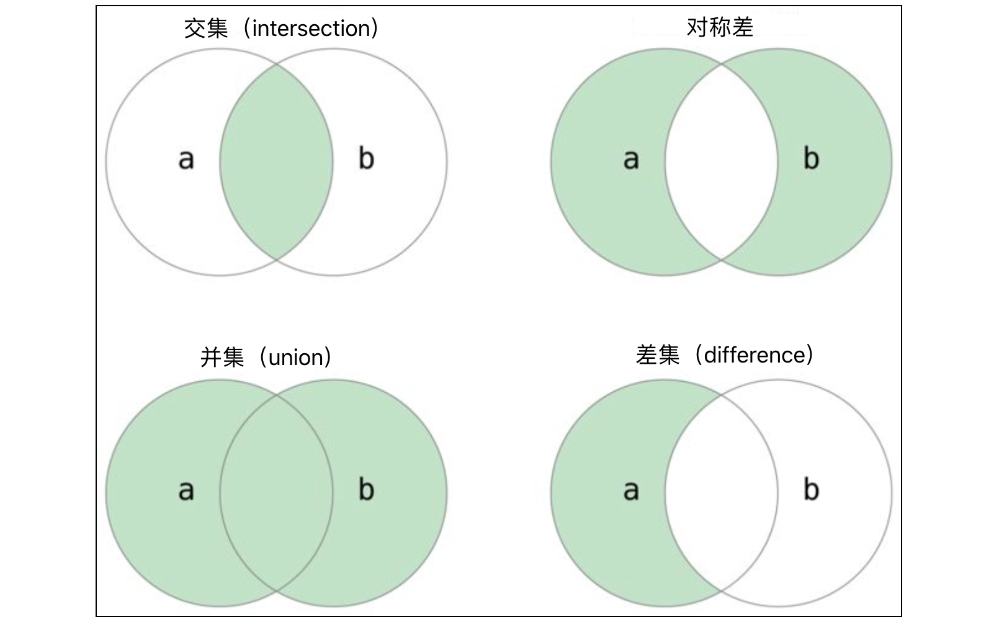

集合的交集、并集、差集运算还可以跟赋值运算一起构成复合赋值运算，如下所示。

```Python
set1 = {1, 3, 5, 7}
set2 = {2, 4, 6}
# 将set1和set2求并集再赋值给set1
# 也可以通过set1.update(set2)来实现
set1 |= set2
print(set1)    # {1, 2, 3, 4, 5, 6, 7}
set3 = {3, 6, 9}
# 将set1和set3求交集再赋值给set1
# 也可以通过set1.intersection_update(set3)来实现
set1 &= set3
print(set1)    # {3, 6}
```

#### 比较运算

两个集合可以用`==`和`!=`进行相等性判断，如果两个集合中的元素完全相同，那么`==`比较的结果就是`True`，否则就是`False`。如果集合`A`的任意一个元素都是集合`B`的元素，那么集合`A`称为集合`B`的子集，即对于$ \forall{a} \in {A}$，均有$ {a} \in {B} $，则$ {A} \subseteq {B} $，`A`是`B`的子集，反过来也可以称`B`是`A`的超集。如果`A`是`B`的子集且`A`不等于`B`，那么`A`就是`B`的真子集。Python为集合类型提供了判断子集和超集的运算符，其实就是我们非常熟悉的`<`和`>`运算符，代码如下所示。

```Python
set1 = {1, 3, 5}
set2 = {1, 2, 3, 4, 5}
set3 = set2
# <运算符表示真子集，<=运算符表示子集
print(set1 < set2, set1 <= set2)    # True True
print(set2 < set3, set2 <= set3)    # False True
# 通过issubset方法也能进行子集判断
print(set1.issubset(set2))      # True

# 反过来可以用issuperset或>运算符进行超集判断
print(set2.issuperset(set1))    # True
print(set2 > set1)              # True
```


### 集合的方法

Python中的集合是可变类型，我们可以通过集合类型的方法为集合添加或删除元素。

```Python
# 创建一个空集合
set1 = set()

# 通过add方法添加元素
set1.add(33)
set1.add(55)
set1.update({1, 10, 100, 1000})
print(set1)    # {33, 1, 100, 55, 1000, 10}

# 通过discard方法删除指定元素
set1.discard(100)
set1.discard(99)
print(set1)    # {1, 10, 33, 55, 1000}

# 通过remove方法删除指定元素，建议先做成员运算再删除
# 否则元素如果不在集合中就会引发KeyError异常
if 10 in set1:
    set1.remove(10)
print(set1)    # {33, 1, 55, 1000}

# pop方法可以从集合中随机删除一个元素并返回该元素
print(set1.pop())

# clear方法可以清空整个集合
set1.clear()

print(set1)    # set()
```

如果要判断两个集合有没有相同的元素可以使用`isdisjoint`方法，没有相同元素返回`True`，否则返回`False`，代码如下所示。

```Python
set1 = {'Java', 'Python', 'Go', 'Kotlin'}
set2 = {'Kotlin', 'Swift', 'Java', 'Objective-C', 'Dart'}
set3 = {'HTML', 'CSS', 'JavaScript'}
print(set1.isdisjoint(set2))    # False
print(set1.isdisjoint(set3))    # True
```

### 不可变集合

Python中还有一种不可变类型的集合，名字叫`frozenset`。`set`跟`frozenset`的区别就如同`list`跟`tuple`的区别，`frozenset`由于是不可变类型，能够计算出哈希码，因此它可以作为`set`中的元素。除了不能添加和删除元素，`frozenset`在其他方面跟`set`基本是一样的，下面的代码简单的展示了`frozenset`的用法。

```Python
set1 = frozenset({1, 3, 5, 7})
set2 = frozenset(range(1, 6))
print(set1 & set2)    # frozenset({1, 3, 5})
print(set1 | set2)    # frozenset({1, 2, 3, 4, 5, 7})
print(set1 - set2)    # frozenset({7})
print(set1 < set2)    # False
```

### 简单的总结

Python中的集合底层使用了**哈希存储**的方式，对于这一点我们暂时不做介绍，在后面的课程有需要的时候再为大家讲解集合的底层原理，现阶段大家只需要知道**集合是一种容器**，元素必须是`hashable`类型，与列表不同的地方在于集合中的元素**没有序**、**不能用索引运算**、**不能重复**。
## 第12课：常用数据结构之字典

迄今为止，我们已经为大家介绍了Python中的三种容器型数据类型，但是这些数据类型仍然不足以帮助我们解决所有的问题。例如，我们要保存一个人的信息，包括姓名、年龄、体重、单位地址、家庭住址、本人手机号、紧急联系人手机号等信息，你会发现我们之前学过的列表、元组和集合都不是最理想的选择。

```Python
person1 = ['王大锤', 55, 60, '科华北路62号', '中同仁路8号', '13122334455', '13800998877']
person2 = ('王大锤', 55, 60, '科华北路62号', '中同仁路8号', '13122334455', '13800998877')
person3 = {'王大锤', 55, 60, '科华北路62号', '中同仁路8号', '13122334455', '13800998877'}
```

集合肯定是最不合适的，因为集合有去重特性，如果一个人的年龄和体重相同，那么集合中就会少一项信息；同理，如果这个人的家庭住址和单位地址是相同的，那么集合中又会少一项信息。另一方面，虽然列表和元组可以把一个人的所有信息都保存下来，但是当你想要获取这个人的手机号时，你得先知道他的手机号是列表或元组中的第6个还是第7个元素；当你想获取一个人的家庭住址时，你还得知道家庭住址是列表或元组中的第几项。总之，在遇到上述的场景时，列表、元组、字典都不是最合适的选择，我们还需字典（dictionary）类型，这种数据类型最适合把相关联的信息组装到一起，并且可以帮助我们解决程序中为真实事物建模的问题。

说到字典这个词，大家一定不陌生，读小学的时候每个人基本上都有一本《新华字典》，如下图所示。


Python程序中的字典跟现实生活中的字典很像，它以键值对（键和值的组合）的方式把数据组织到一起，我们可以通过键找到与之对应的值并进行操作。就像《新华字典》中，每个字（键）都有与它对应的解释（值）一样，每个字和它的解释合在一起就是字典中的一个条目，而字典中通常包含了很多个这样的条目。

### 创建和使用字典

在Python中创建字典可以使用`{}`字面量语法，这一点跟上一节课讲的集合是一样的。但是字典的`{}`中的元素是以键值对的形式存在的，每个元素由`:`分隔的两个值构成，`:`前面是键，`:`后面是值，代码如下所示。

```Python
xinhua = {
    '麓': '山脚下',
    '路': '道，往来通行的地方；方面，地区：南～货，外～货；种类：他俩是一～人',
    '蕗': '甘草的别名',
    '潞': '潞水，水名，即今山西省的浊漳河；潞江，水名，即云南省的怒江'
}
print(xinhua)
person = {
    'name': '王大锤', 'age': 55, 'weight': 60, 'office': '科华北路62号',
    'home': '中同仁路8号', 'tel': '13122334455', 'econtact': '13800998877'
}
print(person)
```

通过上面的代码，相信大家已经看出来了，用字典来保存一个人的信息远远优于使用列表或元组，因为我们可以用`:`前面的键来表示条目的含义，而`:`后面就是这个条目所对应的值。

当然，如果愿意，我们也可以使用内置函数`dict`或者是字典的生成式语法来创建字典，代码如下所示。

```Python
# dict函数(构造器)中的每一组参数就是字典中的一组键值对
person = dict(name='王大锤', age=55, weight=60, home='中同仁路8号')
print(person)    # {'name': '王大锤', 'age': 55, 'weight': 60, 'home': '中同仁路8号'}

# 可以通过Python内置函数zip压缩两个序列并创建字典
items1 = dict(zip('ABCDE', '12345'))
print(items1)    # {'A': '1', 'B': '2', 'C': '3', 'D': '4', 'E': '5'}
items2 = dict(zip('ABCDE', range(1, 10)))
print(items2)    # {'A': 1, 'B': 2, 'C': 3, 'D': 4, 'E': 5}

# 用字典生成式语法创建字典
items3 = {x: x ** 3 for x in range(1, 6)}
print(items3)     # {1: 1, 2: 8, 3: 27, 4: 64, 5: 125}
```

想知道字典中一共有多少组键值对，仍然是使用`len`函数；如果想对字典进行遍历，可以用`for`循环，但是需要注意，`for`循环只是对字典的键进行了遍历，不过没关系，在讲完字典的运算后，我们可以通过字典的键获取到和这个键对应的值。

```Python
person = {'name': '王大锤', 'age': 55, 'weight': 60, 'office': '科华北路62号'}
print(len(person))    # 4
for key in person:
    print(key)
```

### 字典的运算

对于字典类型来说，成员运算和索引运算肯定是最为重要的，前者可以判定指定的键在不在字典中，后者可以通过键获取对应的值或者向字典中加入新的键值对。值得注意的是，字典的索引不同于列表的索引，列表中的元素因为有属于自己有序号，所以列表的索引是一个整数；字典中因为保存的是键值对，所以字典的索引是键值对中的键，通过索引操作可以修改原来的值或者向字典中存入新的键值对。需要**特别提醒**大家注意的是，**字典中的键必须是不可变类型**，例如整数（`int`）、浮点数（`float`）、字符串（`str`）、元组（`tuple`）等类型的值；显然，列表（`list`）和集合（`set`）是不能作为字典中的键的，当然字典类型本身也不能再作为字典中的键，因为字典也是可变类型，但是字典可以作为字典中的值。关于可变类型不能作为字典中的键的原因，我们在后面的课程中再为大家详细说明。这里，我们先看看下面的代码，了解一下字典的成员运算和索引运算。

```Python
person = {'name': '王大锤', 'age': 55, 'weight': 60, 'office': '科华北路62号'}
# 检查name和tel两个键在不在person字典中
print('name' in person, 'tel' in person)    # True False
# 通过age修将person字典中对应的值修改为25
if 'age' in person:
    person['age'] = 25
# 通过索引操作向person字典中存入新的键值对
person['tel'] = '13122334455'
person['signature'] = '你的男朋友是一个盖世垃圾，他会踏着五彩祥云去迎娶你的闺蜜'
print('name' in person, 'tel' in person)    # True True
# 检查person字典中键值对的数量
print(len(person))    # 6
# 对字典的键进行循环并通索引运算获取键对应的值
for key in person:
    print(f'{key}: {person[key]}')
```

 需要注意，在通过索引运算获取字典中的值时，如指定的键没有在字典中，将会引发`KeyError`异常。

### 字典的方法

字典类型的方法基本上都跟字典的键值对操作相关，可以通过下面的例子来了解这些方法的使用。例如，我们要用一个字典来保存学生的信息，我们可以使用学生的学号作为字典中的键，通过学号做索引运算就可以得到对应的学生；我们可以把字典的值也做成一个字典，这样就可以用多组键值对分别存储学生的姓名、性别、年龄、籍贯等信息，代码如下所示。

```Python
# 字典中的值又是一个字典(嵌套的字典)
students = {
    1001: {'name': '狄仁杰', 'sex': True, 'age': 22, 'place': '山西大同'},
    1002: {'name': '白元芳', 'sex': True, 'age': 23, 'place': '河北保定'},
    1003: {'name': '武则天', 'sex': False, 'age': 20, 'place': '四川广元'}
}

# 使用get方法通过键获取对应的值，如果取不到不会引发KeyError异常而是返回None或设定的默认值
print(students.get(1002))    # {'name': '白元芳', 'sex': True, 'age': 23, 'place': '河北保定'}
print(students.get(1005))    # None
print(students.get(1005, {'name': '无名氏'}))    # {'name': '无名氏'}

# 获取字典中所有的键
print(students.keys())      # dict_keys([1001, 1002, 1003])
# 获取字典中所有的值
print(students.values())    # dict_values([{...}, {...}, {...}])
# 获取字典中所有的键值对
print(students.items())     # dict_items([(1001, {...}), (1002, {....}), (1003, {...})])
# 对字典中所有的键值对进行循环遍历
for key, value in students.items():
    print(key, '--->', value)

# 使用pop方法通过键删除对应的键值对并返回该值
stu1 = students.pop(1002)
print(stu1)             # {'name': '白元芳', 'sex': True, 'age': 23, 'place': '河北保定'}
print(len(students))    # 2
# stu2 = students.pop(1005)    # KeyError: 1005
stu2 = students.pop(1005, {})
print(stu2)             # {}

# 使用popitem方法删除字典中最后一组键值对并返回对应的二元组
# 如果字典中没有元素，调用该方法将引发KeyError异常
key, value = students.popitem()
print(key, value)    # 1003 {'name': '武则天', 'sex': False, 'age': 20, 'place': '四川广元'}

# setdefault可以向字典中存入新的键值对或返回指定的键对应的值
result = students.setdefault(1005, {'name': '方启鹤', 'sex': True})
print(result)        # {'name': '方启鹤', 'sex': True}
print(students)      # {1001: {...}, 1005: {...}}

# 使用update更新字典元素，相同的键会用新值覆盖掉旧值，不同的键会添加到字典中
others = {
    1005: {'name': '乔峰', 'sex': True, 'age': 32, 'place': '北京大兴'},
    1010: {'name': '王语嫣', 'sex': False, 'age': 19},
    1008: {'name': '钟灵', 'sex': False}
}
students.update(others)
print(students)      # {1001: {...}, 1005: {...}, 1010: {...}, 1008: {...}}
```

跟列表一样，从字典中删除元素也可以使用`del`关键字，在删除元素的时候如果指定的键索引不到对应的值，一样会引发`KeyError`异常，具体的做法如下所示。

```Python
person = {'name': '王大锤', 'age': 25, 'sex': True}
del person['age']
print(person)    # {'name': '王大锤', 'sex': True}
```

### 字典的应用

我们通过几个简单的例子来讲解字典的应用。

**例子1**：输入一段话，统计每个英文字母出现的次数。

```Python
sentence = input('请输入一段话: ')
counter = {}
for ch in sentence:
    if 'A' <= ch <= 'Z' or 'a' <= ch <= 'z':
        counter[ch] = counter.get(ch, 0) + 1
for key, value in counter.items():
    print(f'字母{key}出现了{value}次.')
```

**例子2**：在一个字典中保存了股票的代码和价格，找出股价大于100元的股票并创建一个新的字典。

> **说明**：可以用字典的生成式语法来创建这个新字典。

```Python
stocks = {
    'AAPL': 191.88,
    'GOOG': 1186.96,
    'IBM': 149.24,
    'ORCL': 48.44,
    'ACN': 166.89,
    'FB': 208.09,
    'SYMC': 21.29
}
stocks2 = {key: value for key, value in stocks.items() if value > 100}
print(stocks2)
```

### 简单的总结

Python程序中的字典跟现实生活中字典非常像，允许我们**以键值对的形式保存数据**，再**通过键索引对应的值**。这是一种非常**有利于数据检索**的数据类型，底层原理我们在后续的课程中为大家讲解。再次提醒大家注意，**字典中的键必须是不可变类型**，字典中的值可以是任意类型。
## 第13课：函数和模块

在讲解本节课的内容之前，我们先来研究一道数学题，请说出下面的方程有多少组正整数解。
$$
x_1 + x_2 + x_3 + x_4 = 8
$$
你可能已经想到了，这个问题其实等同于将`8`个苹果分成四组且每组至少一个苹果有多少种方案，因此该问题还可以进一步等价于在分隔`8`个苹果的`7`个空隙之间插入三个隔板将苹果分成四组有多少种方案，也就是从`7`个空隙选出`3`个空隙放入隔板的组合数，所以答案是$ C_7^3=35 $。组合数的计算公式如下所示。
$$
C_M^N = \frac {M!} {N!(M-N)!}
$$
根据我们前面学习的知识，可以用循环做累乘的方式来计算阶乘，那么通过下面的Python代码我们就可以计算出组合数$ C_M^N $的值，代码如下所示。

```Python
"""
输入M和N计算C(M,N)

Version: 0.1
Author: 骆昊
"""
m = int(input('m = '))
n = int(input('n = '))
# 计算m的阶乘
fm = 1
for num in range(1, m + 1):
    fm *= num
# 计算n的阶乘
fn = 1
for num in range(1, n + 1):
    fn *= num
# 计算m-n的阶乘
fk = 1
for num in range(1, m - n + 1):
    fk *= num
# 计算C(M,N)的值
print(fm // fn // fk)
```

### 函数的作用

不知大家是否注意到，上面的代码中我们做了三次求阶乘，虽然`m`、`n`、`m - n`的值各不相同，但是三段代码并没有实质性的区别，属于重复代码。世界级的编程大师*Martin Fowler*先生曾经说过：“**代码有很多种坏味道，重复是最坏的一种！**”。要写出高质量的代码首先要解决的就是重复代码的问题。对于上面的代码来说，我们可以将计算阶乘的功能封装到一个称为“函数”的代码块中，在需要计算阶乘的地方，我们只需要“调用函数”就可以了。

### 定义函数

数学上的函数通常形如`y = f(x)`或者`z = g(x, y)`这样的形式，在`y = f(x)`中，`f`是函数的名字，`x`是函数的自变量，`y`是函数的因变量；而在`z = g(x, y)`中，`g`是函数名，`x`和`y`是函数的自变量，`z`是函数的因变量。Python中的函数跟这个结构是一致的，每个函数都有自己的名字、自变量和因变量。我们通常把Python中函数的自变量称为函数的参数，而因变量称为函数的返回值。

在Python中可以使用`def`关键字来定义函数，和变量一样每个函数也应该有一个漂亮的名字，命名规则跟变量的命名规则是一致的（赶紧想一想我们之前讲过的变量的命名规则）。在函数名后面的圆括号中可以放置传递给函数的参数，就是我们刚才说到的函数的自变量，而函数执行完成后我们会通过`return`关键字来返回函数的执行结果，就是我们刚才说的函数的因变量。一个函数要执行的代码块（要做的事情）也是通过缩进的方式来表示的，跟之前分支和循环结构的代码块是一样的。大家不要忘了`def`那一行的最后面还有一个`:`，之前提醒过大家，那是在英文输入法状态下输入的冒号。

我们可以通过函数对上面的代码进行重构。**所谓重构，是在不影响代码执行结果的前提下对代码的结构进行调整。**重构之后的代码如下所示。

```Python
"""
输入M和N计算C(M,N)

Version: 0.1
Author: 骆昊
"""


# 定义函数：def是定义函数的关键字、fac是函数名，num是参数（自变量）
def fac(num):
    """求阶乘"""
    result = 1
    for n in range(1, num + 1):
        result *= n
    # 返回num的阶乘（因变量）
    return result


m = int(input('m = '))
n = int(input('n = '))
# 当需要计算阶乘的时候不用再写重复的代码而是直接调用函数fac
# 调用函数的语法是在函数名后面跟上圆括号并传入参数
print(fac(m) // fac(n) // fac(m - n))
```

> **说明**：事实上，Python标准库的`math`模块中有一个名为`factorial`的函数已经实现了求阶乘的功能，我们可以直接使用该函数来计算阶乘。**将来我们使用的函数，要么是自定义的函数，要么是Python标准库或者三方库中提供的函数**。

### 函数的参数

#### 参数的默认值

如果函数中没有`return`语句，那么函数默认返回代表空值的`None`。另外，在定义函数时，函数也可以没有自变量，但是函数名后面的圆括号是必须有的。Python中还允许函数的参数拥有默认值，我们可以把之前讲过的一个例子“CRAPS赌博游戏”中摇色子获得点数的功能封装成函数，代码如下所示。

```Python
"""
参数的默认值

Version: 0.1
Author: 骆昊
"""
from random import randint


# 定义摇色子的函数，n表示色子的个数，默认值为2
def roll_dice(n=2):
    """摇色子返回总的点数"""
    total = 0
    for _ in range(n):
        total += randint(1, 6)
    return total


# 如果没有指定参数，那么n使用默认值2，表示摇两颗色子
print(roll_dice())
# 传入参数3，变量n被赋值为3，表示摇三颗色子获得点数
print(roll_dice(3))
```

我们再来看一个更为简单的例子。

```Python
def add(a=0, b=0, c=0):
    """三个数相加求和"""
    return a + b + c


# 调用add函数，没有传入参数，那么a、b、c都使用默认值0
print(add())         # 0
# 调用add函数，传入一个参数，那么该参数赋值给变量a, 变量b和c使用默认值0
print(add(1))        # 1
# 调用add函数，传入两个参数，1和2分别赋值给变量a和b，变量c使用默认值0
print(add(1, 2))     # 3
# 调用add函数，传入三个参数，分别赋值给a、b、c三个变量
print(add(1, 2, 3))  # 6
# 传递参数时可以不按照设定的顺序进行传递，但是要用“参数名=参数值”的形式
print(add(c=50, a=100, b=200))    # 350
```

> **注意**：带默认值的参数必须放在不带默认值的参数之后，否则将产生`SyntaxError`错误，错误消息是：`non-default argument follows default argument`，翻译成中文的意思是“没有默认值的参数放在了带默认值的参数后面”。

#### 可变参数

接下来，我们还可以实现一个对任意多个数求和的`add`函数，因为Python语言中的函数可以通过星号表达式语法来支持可变参数。所谓可变参数指的是在调用函数时，可以向函数传入`0`个或任意多个参数。将来我们以团队协作的方式开发商业项目时，很有可能要设计函数给其他人使用，但有的时候我们并不知道函数的调用者会向该函数传入多少个参数，这个时候可变参数就可以派上用场。下面的代码演示了用可变参数实现对任意多个数求和的`add`函数。

```Python
"""
可变参数

Version: 0.1
Author: 骆昊
"""


# 用星号表达式来表示args可以接收0个或任意多个参数
def add(*args):
    total = 0
    # 可变参数可以放在for循环中取出每个参数的值
    for val in args:
        if type(val) in (int, float):
            total += val
    return total


# 在调用add函数时可以传入0个或任意多个参数
print(add())
print(add(1))
print(add(1, 2))
print(add(1, 2, 3))
print(add(1, 3, 5, 7, 9))
```

### 用模块管理函数

不管用什么样的编程语言来写代码，给变量、函数起名字都是一个让人头疼的问题，因为我们会遇到**命名冲突**这种尴尬的情况。最简单的场景就是在同一个`.py`文件中定义了两个同名的函数，如下所示。

```Python
def foo():
    print('hello, world!')


def foo():
    print('goodbye, world!')

    
foo()    # 大家猜猜调用foo函数会输出什么
```

当然上面的这种情况我们很容易就能避免，但是如果项目是团队协作多人开发的时候，团队中可能有多个程序员都定义了名为`foo`的函数，这种情况下怎么解决命名冲突呢？答案其实很简单，Python中每个文件就代表了一个模块（module），我们在不同的模块中可以有同名的函数，在使用函数的时候我们通过`import`关键字导入指定的模块再使用**完全限定名**的调用方式就可以区分到底要使用的是哪个模块中的`foo`函数，代码如下所示。

`module1.py`

```Python
def foo():
    print('hello, world!')
```

`module2.py`

```Python
def foo():
    print('goodbye, world!')
```

`test.py`

```Python
import module1
import module2

# 用“模块名.函数名”的方式（完全限定名）调用函数，
module1.foo()    # hello, world!
module2.foo()    # goodbye, world!
```

在导入模块时，还可以使用`as`关键字对模块进行别名，这样我们可以使用更为简短的完全限定名。

`test.py`

```Python
import module1 as m1
import module2 as m2

m1.foo()    # hello, world!
m2.foo()    # goodbye, world!
```

上面的代码我们导入了定义函数的模块，我们也可以使用`from...import...`语法从模块中直接导入需要使用的函数，代码如下所示。

`test.py`

```Python
from module1 import foo

foo()    # hello, world!

from module2 import foo

foo()    # goodbye, world!
```

但是，如果我们如果从两个不同的模块中导入了同名的函数，后导入的函数会覆盖掉先前的导入，就像下面的代码中，调用`foo`会输出`hello, world!`，因为我们先导入了`module2`的`foo`，后导入了`module1`的`foo` 。如果两个`from...import...`反过来写，就是另外一番光景了。

`test.py`

```Python
from module2 import foo
from module1 import foo

foo()    # hello, world!
```

如果想在上面的代码中同时使用来自两个模块中的`foo`函数也是有办法的，大家可能已经猜到了，还是用`as`关键字对导入的函数进行别名，代码如下所示。

`test.py`

```Python
from module1 import foo as f1
from module2 import foo as f2

f1()    # hello, world!
f2()    # goodbye, world!
```

### 标准库中的模块和函数

Python标准库中提供了大量的模块和函数来简化我们的开发工作，我们之前用过的`random`模块就为我们提供了生成随机数和进行随机抽样的函数；而`time`模块则提供了和时间操作相关的函数；上面求阶乘的函数在Python标准库中的`math`模块中已经有了，实际开发中并不需要我们自己编写，而`math`模块中还包括了计算正弦、余弦、指数、对数等一系列的数学函数。随着我们进一步的学习Python编程知识，我们还会用到更多的模块和函数。

Python标准库中还有一类函数是不需要`import`就能够直接使用的，我们将其称之为内置函数，这些内置函数都是很有用也是最常用的，下面的表格列出了一部分的内置函数。

| 函数    | 说明                                                         |
| ------- | ------------------------------------------------------------ |
| `abs`   | 返回一个数的绝对值，例如：`abs(-1.3)`会返回`1.3`。           |
| `bin`   | 把一个整数转换成以`'0b'`开头的二进制字符串，例如：`bin(123)`会返回`'0b1111011'`。 |
| `chr`   | 将Unicode编码转换成对应的字符，例如：`chr(8364)`会返回`'€'`。 |
| `hex`   | 将一个整数转换成以`'0x'`开头的十六进制字符串，例如：`hex(123)`会返回`'0x7b'`。 |
| `input` | 从输入中读取一行，返回读到的字符串。                         |
| `len`   | 获取字符串、列表等的长度。                                   |
| `max`   | 返回多个参数或一个可迭代对象中的最大值，例如：`max(12, 95, 37)`会返回`95`。 |
| `min`   | 返回多个参数或一个可迭代对象中的最小值，例如：`min(12, 95, 37)`会返回`12`。 |
| `oct`   | 把一个整数转换成以`'0o'`开头的八进制字符串，例如：`oct(123)`会返回`'0o173'`。 |
| `open`  | 打开一个文件并返回文件对象。                                 |
| `ord`   | 将字符转换成对应的Unicode编码，例如：`ord('€')`会返回`8364`。 |
| `pow`   | 求幂运算，例如：`pow(2, 3)`会返回`8`；`pow(2, 0.5)`会返回`1.4142135623730951`。 |
| `print` | 打印输出。                                                   |
| `range` | 构造一个范围序列，例如：`range(100)`会产生`0`到`99`的整数序列。 |
| `round` | 按照指定的精度对数值进行四舍五入，例如：`round(1.23456, 4)`会返回`1.2346`。 |
| `sum`   | 对一个序列中的项从左到右进行求和运算，例如：`sum(range(1, 101))`会返回`5050`。 |
| `type`  | 返回对象的类型，例如：`type(10)`会返回`int`；而` type('hello')`会返回`str`。 |

###  简单的总结

**函数是对功能相对独立且会重复使用的代码的封装**。学会使用定义和使用函数，就能够写出更为优质的代码。当然，Python语言的标准库中已经为我们提供了大量的模块和常用的函数，用好这些模块和函数就能够用更少的代码做更多的事情；如果这些模块和函数不能满足我们的要求，我们就需要自定义函数，然后用模块的概念来管理这些自定义函数。## 第14课：函数的应用

接下来我们通过一些案例来为大家讲解函数的应用。

### 经典小案例

#### 案例1：设计一个生成验证码的函数。

> **说明**：验证码由数字和英文大小写字母构成，长度可以用参数指定。

```Python
import random
import string

ALL_CHARS = string.digits + string.ascii_letters


def generate_code(code_len=4):
    """生成指定长度的验证码
    
    :param code_len: 验证码的长度(默认4个字符)
    :return: 由大小写英文字母和数字构成的随机验证码字符串
    """
    return ''.join(random.choices(ALL_CHARS, k=code_len))
```

可以用下面的代码生成10组随机验证码来测试上面的函数。

```Python
for _ in range(10):
    print(generate_code()) 
```

> **说明**：`random`模块的`sample`和`choices`函数都可以实现随机抽样，`sample`实现无放回抽样，这意味着抽样取出的字符是不重复的；`choices`实现有放回抽样，这意味着可能会重复选中某些字符。这两个函数的第一个参数代表抽样的总体，而参数`k`代表抽样的数量。

#### 案例2：设计一个函数返回给定文件的后缀名。

> **说明**：文件名通常是一个字符串，而文件的后缀名指的是文件名中最后一个`.`后面的部分，也称为文件的扩展名，它是某些操作系统用来标记文件类型的一种机制，例如在Windows系统上，后缀名`exe`表示这是一个可执行程序，而后缀名`txt`表示这是一个纯文本文件。需要注意的是，在Linux和macOS系统上，文件名可以以`.`开头，表示这是一个隐藏文件，像`.gitignore`这样的文件名，`.`后面并不是后缀名，这个文件没有后缀名或者说后缀名为`''`。

```Python
def get_suffix(filename, ignore_dot=True):
    """获取文件名的后缀名
    
    :param filename: 文件名
    :param ignore_dot: 是否忽略后缀名前面的点
    :return: 文件的后缀名
    """
    # 从字符串中逆向查找.出现的位置
    pos = filename.rfind('.')
    # 通过切片操作从文件名中取出后缀名
    if pos <= 0:
        return ''
    return filename[pos + 1:] if ignore_dot else filename[pos:]
```

可以用下面的代码对上面的函数做一个简单的测验。

```Python
print(get_suffix('readme.txt'))       # txt
print(get_suffix('readme.txt.md'))    # md
print(get_suffix('.readme'))          #
print(get_suffix('readme.'))          #
print(get_suffix('readme'))           #
```

上面的`get_suffix`函数还有一个更为便捷的实现方式，就是直接使用`os.path`模块的`splitext`函数，这个函数会将文件名拆分成带路径的文件名和扩展名两个部分，然后返回一个二元组，二元组中的第二个元素就是文件的后缀名（包含`.`），如果要去掉后缀名中的`.`，可以做一个字符串的切片操作，代码如下所示。

```Python
from os.path import splitext


def get_suffix(filename, ignore_dot=True):
    return splitext(filename)[1][1:]
```

> **思考**：如果要给上面的函数增加一个参数，用来控制文件的后缀名是否包含`.`，应该怎么做？

#### 案例3：写一个判断给定的正整数是不是质数的函数。

```Python
def is_prime(num: int) -> bool:
    """判断一个正整数是不是质数

    :param num: 正整数
    :return: 如果是质数返回True，否则返回False
    """
    for i in range(2, int(num ** 0.5) + 1):
        if num % i == 0:
            return False
    return num != 1
```

#### 案例4：写出计算两个正整数最大公约数和最小公倍数的函数。

代码一：

```Python
def gcd_and_lcm(x: int, y: int) -> int:
    """求最大公约数和最小公倍数"""
    a, b = x, y
    while b % a != 0:
        a, b = b % a, a
    return a, x * y // a
```

代码二：

```Python
def gcd(x: int, y: int) -> int:
    """求最大公约数"""
    while y % x != 0:
        x, y = y % x, x
    return x


def lcm(x: int, y: int) -> int:
    """求最小公倍数"""
    return x * y // gcd(x, y)
```

> **思考**：请比较上面的代码一和代码二，想想哪种做法是更好的选择。

#### 案例5：写出计算一组样本数据描述性统计信息的函数。

```Python
import math


def ptp(data):
    """求极差（全距）"""
    return max(data) - min(data)


def average(data):
    """求均值"""
    return sum(data) / len(data)


def variance(data):
    """求方差"""
    x_bar = average(data)
    temp = [(num - x_bar) ** 2 for num in data]
    return sum(temp) / (len(temp) - 1)


def standard_deviation(data):
    """求标准差"""
    return math.sqrt(variance(data))


def median(data):
    """找中位数"""
    temp, size = sorted(data), len(data)
    if size % 2 != 0:
        return temp[size // 2]
    else:
        return average(temp[size // 2 - 1:size // 2 + 1])
```

### 简单的总结

在写代码尤其是开发商业项目的时候，一定要有意识的**将相对独立且重复出现的功能封装成函数**，这样不管是自己还是团队的其他成员都可以通过调用函数的方式来使用这些功能。
## 第15课：函数使用进阶

前面我们讲到了关于函数的知识，我们还讲到过Python中常用的数据类型，这些类型的变量都可以作为函数的参数或返回值，用好函数还可以让我们做更多的事情。

### 关键字参数

下面是一个判断传入的三条边长能否构成三角形的函数，在调用函数传入参数时，我们可以指定参数名，也可以不指定参数名，代码如下所示。

```Python
def is_triangle(a, b, c):
    print(f'a = {a}, b = {b}, c = {c}')
    return a + b > c and b + c > a and a + c > b


# 调用函数传入参数不指定参数名按位置对号入座
print(is_triangle(1, 2, 3))
# 调用函数通过“参数名=参数值”的形式按顺序传入参数
print(is_triangle(a=1, b=2, c=3))
# 调用函数通过“参数名=参数值”的形式不按顺序传入参数
print(is_triangle(c=3, a=1, b=2))
```

在没有特殊处理的情况下，函数的参数都是**位置参数**，也就意味着传入参数的时候对号入座即可，如上面代码的第7行所示，传入的参数值`1`、`2`、`3`会依次赋值给参数`a`、`b`、`c`。当然，也可以通过`参数名=参数值`的方式传入函数所需的参数，因为指定了参数名，传入参数的顺序可以进行调整，如上面代码的第9行和第11行所示。

调用函数时，如果希望函数的调用者必须以`参数名=参数值`的方式传参，可以用**命名关键字参数**（keyword-only argument）取代位置参数。所谓命名关键字参数，是在函数的参数列表中，写在`*`之后的参数，代码如下所示。

```Python
def is_triangle(*, a, b, c):
    print(f'a = {a}, b = {b}, c = {c}')
    return a + b > c and b + c > a and a + c > b


# TypeError: is_triangle() takes 0 positional arguments but 3 were given
# print(is_triangle(3, 4, 5))
# 传参时必须使用“参数名=参数值”的方式，位置不重要
print(is_triangle(a=3, b=4, c=5))
print(is_triangle(c=5, b=4, a=3))
```

> **注意**：上面的`is_triangle`函数，参数列表中的`*`是一个分隔符，`*`前面的参数都是位置参数，而`*`后面的参数就是命名关键字参数。

我们之前讲过在函数的参数列表中可以使用**可变参数**`*args`来接收任意数量的参数，但是我们需要看看，`*args`是否能够接收带参数名的参数。

```Python
def calc(*args):
    result = 0
    for arg in args:
        if type(arg) in (int, float):
            result += arg
    return result


print(calc(a=1, b=2, c=3))
```

执行上面的代码会引发`TypeError`错误，错误消息为`calc() got an unexpected keyword argument 'a'`，由此可见，`*args`并不能处理带参数名的参数。我们在设计函数时，如果既不知道调用者会传入的参数个数，也不知道调用者会不会指定参数名，那么同时使用可变参数和**关键字参数**。关键字参数会将传入的带参数名的参数组装成一个字典，参数名就是字典中键值对的键，而参数值就是字典中键值对的值，代码如下所示。

```Python
def calc(*args, **kwargs):
    result = 0
    for arg in args:
        if type(arg) in (int, float):
            result += arg
    for value in kwargs.values():
        if type(value) in (int, float):
            result += value
    return result


print(calc())                  # 0
print(calc(1, 2, 3))           # 6
print(calc(a=1, b=2, c=3))     # 6
print(calc(1, 2, c=3, d=4))    # 10
```

> **提示**：**不带参数名的参数（位置参数）必须出现在带参数名的参数（关键字参数）之前**，否则将会引发异常。例如，执行`calc(1, 2, c=3, d=4, 5)`将会引发`SyntaxError`错误，错误消息为`positional argument follows keyword argument`，翻译成中文意思是“位置参数出现在关键字参数之后”。

### 高阶函数的用法

在前面几节课中，我们讲到了面向对象程序设计，在面向对象的世界中，一切皆为对象，所以类和函数也是对象。函数的参数和返回值可以是任意类型的对象，这就意味着**函数本身也可以作为函数的参数或返回值**，这就是所谓的**高阶函数**。

如果我们希望上面的`calc`函数不仅仅可以做多个参数求和，还可以做多个参数求乘积甚至更多的二元运算，我们就可以使用高阶函数的方式来改写上面的代码，将加法运算从函数中移除掉，具体的做法如下所示。

```Python
def calc(*args, init_value, op, **kwargs):
    result = init_value
    for arg in args:
        if type(arg) in (int, float):
            result = op(result, arg)
    for value in kwargs.values():
        if type(value) in (int, float):
            result = op(result, value)
    return result
```

注意，上面的函数增加了两个参数，其中`init_value`代表运算的初始值，`op`代表二元运算函数。经过改造的`calc`函数不仅仅可以实现多个参数的累加求和，也可以实现多个参数的累乘运算，代码如下所示。

```Python
def add(x, y):
    return x + y


def mul(x, y):
    return x * y


print(calc(1, 2, 3, init_value=0, op=add, x=4, y=5))      # 15
print(calc(1, 2, x=3, y=4, z=5, init_value=1, op=mul))    # 120
```

通过对高阶函数的运用，`calc`函数不再和加法运算耦合，所以灵活性和通用性会变强，这是一种解耦合的编程技巧，但是最初学者来说可能会稍微有点难以理解。需要注意的是，将函数作为参数和调用函数是有显著的区别的，**调用函数需要在函数名后面跟上圆括号，而把函数作为参数时只需要函数名即可**。上面的代码也可以不用定义`add`和`mul`函数，因为Python标准库中的`operator`模块提供了代表加法运算的`add`和代表乘法运算的`mul`函数，我们直接使用即可，代码如下所示。

```Python
import operator

print(calc(1, 2, 3, init_value=0, op=operator.add, x=4, y=5))      # 15
print(calc(1, 2, x=3, y=4, z=5, init_value=1, op=operator.mul))    # 120
```

Python内置函数中有不少高阶函数，我们前面提到过的`filter`和`map`函数就是高阶函数，前者可以实现对序列中元素的过滤，后者可以实现对序列中元素的映射，例如我们要去掉一个整数列表中的奇数，并对所有的偶数求平方得到一个新的列表，就可以直接使用这两个函数来做到，具体的做法是如下所示。

```Python
def is_even(num):
    return num % 2 == 0


def square(num):
    return num ** 2


numbers1 = [35, 12, 8, 99, 60, 52]
numbers2 = list(map(square, filter(is_even, numbers1)))
print(numbers2)    # [144, 64, 3600, 2704]
```

当然，要完成上面代码的功能，也可以使用列表生成式，列表生成式的做法更为简单优雅。

```Python
numbers1 = [35, 12, 8, 99, 60, 52]
numbers2 = [num ** 2 for num in numbers1 if num % 2 == 0]
print(numbers2)    # [144, 64, 3600, 2704]
```

### Lambda函数

在使用高阶函数的时候，如果作为参数或者返回值的函数本身非常简单，一行代码就能够完成，那么我们可以使用**Lambda函数**来表示。Python中的Lambda函数是没有的名字函数，所以很多人也把它叫做**匿名函数**，匿名函数只能有一行代码，代码中的表达式产生的运算结果就是这个匿名函数的返回值。上面代码中的`is_even`和`square`函数都只有一行代码，我们可以用Lambda函数来替换掉它们，代码如下所示。

```Python
numbers1 = [35, 12, 8, 99, 60, 52]
numbers2 = list(map(lambda x: x ** 2, filter(lambda x: x % 2 == 0, numbers1)))
print(numbers2)    # [144, 64, 3600, 2704]
```

通过上面的代码可以看出，定义Lambda函数的关键字是`lambda`，后面跟函数的参数，如果有多个参数用逗号进行分隔；冒号后面的部分就是函数的执行体，通常是一个表达式，表达式的运算结果就是Lambda函数的返回值，不需要写`return` 关键字。

如果需要使用加减乘除这种简单的二元函数，也可以用Lambda函数来书写，例如调用上面的`calc`函数时，可以通过传入Lambda函数来作为`op`参数的参数值。当然，`op`参数也可以有默认值，例如我们可以用一个代表加法运算的Lambda函数来作为`op`参数的默认值。

```Python
def calc(*args, init_value=0, op=lambda x, y: x + y, **kwargs):
    result = init_value
    for arg in args:
        if type(arg) in (int, float):
            result = op(result, arg)
    for value in kwargs.values():
        if type(value) in (int, float):
            result = op(result, value)
    return result


# 调用calc函数，使用init_value和op的默认值
print(calc(1, 2, 3, x=4, y=5))    # 15
# 调用calc函数，通过lambda函数给op参数赋值
print(calc(1, 2, 3, x=4, y=5, init_value=1, op=lambda x, y: x * y))    # 120
```

> **提示**：注意上面的代码中的`calc`函数，它同时使用了可变参数、关键字参数、命名关键字参数，其中命名关键字参数要放在可变参数和关键字参数之间，传参时先传入可变参数，关键字参数和命名关键字参数的先后顺序并不重要。

有很多函数在Python中用一行代码就能实现，我们可以用Lambda函数来定义这些函数，调用Lambda函数就跟调用普通函数一样，代码如下所示。

```Python
import operator, functools

# 一行代码定义求阶乘的函数
fac = lambda num: functools.reduce(operator.mul, range(1, num + 1), 1)
# 一行代码定义判断素数的函数
is_prime = lambda x: x > 1 and all(map(lambda f: x % f, range(2, int(x ** 0.5) + 1)))

# 调用Lambda函数
print(fac(10))        # 3628800
print(is_prime(9))    # False
```

> **提示1**：上面使用的`reduce`函数是Python标准库`functools`模块中的函数，它可以实现对数据的归约操作，通常情况下，**过滤**（filter）、**映射**（map）和**归约**（reduce）是处理数据中非常关键的三个步骤，而Python的标准库也提供了对这三个操作的支持。
>
> **提示2**：上面使用的`all`函数是Python内置函数，如果传入的序列中所有布尔值都是`True`，`all`函数就返回`True`，否则`all`函数就返回`False`。

###  简单的总结

Python中的函数可以使用可变参数`*args`和关键字参数`**kwargs`来接收任意数量的参数，而且传入参数时可以带上参数名也可以没有参数名，可变参数会被处理成一个元组，而关键字参数会被处理成一个字典。**Python中的函数是一等函数，可以赋值给变量，也可以作为函数的参数和返回值**，这也就意味着我们可以在Python中使用高阶函数。如果我们要定义的函数非常简单，只有一行代码且不需要函数名，可以使用Lambda函数（匿名函数）。
## 第16课：函数的高级应用

在上一节课中，我们已经对函数进行了更为深入的研究，还探索了Python中的高阶函数和Lambda函数。在这些知识的基础上，这节课我们为大家分享两个和函数相关的内容，一个是装饰器，一个是函数的递归调用。

### 装饰器

装饰器是Python中**用一个函数装饰另外一个函数或类并为其提供额外功能**的语法现象。装饰器本身是一个函数，它的参数是被装饰的函数或类，它的返回值是一个带有装饰功能的函数。很显然，装饰器是一个高阶函数，它的参数和返回值都是函数。下面我们先通过一个简单的例子来说明装饰器的写法和作用，假设已经有名为`downlaod`和`upload`的两个函数，分别用于文件的上传和下载，下面的代码用休眠一段随机时间的方式模拟了下载和上传需要花费的时间，并没有联网做上传下载。

> **说明**：用Python语言实现联网的上传下载也很简单，继续你的学习，这个环节很快就会来到。

```Python
import random
import time


def download(filename):
    print(f'开始下载{filename}.')
    time.sleep(random.randint(2, 6))
    print(f'{filename}下载完成.')

    
def upload(filename):
    print(f'开始上传{filename}.')
    time.sleep(random.randint(4, 8))
    print(f'{filename}上传完成.')

    
download('MySQL从删库到跑路.avi')
upload('Python从入门到住院.pdf')
```

现在我们希望知道调用`download`和`upload`函数做文件上传下载到底用了多少时间，这个应该如何实现呢？相信很多小伙伴已经想到了，我们可以在函数开始执行的时候记录一个时间，在函数调用结束后记录一个时间，两个时间相减就可以计算出下载或上传的时间，代码如下所示。

```Python
start = time.time()
download('MySQL从删库到跑路.avi')
end = time.time()
print(f'花费时间: {end - start:.3f}秒')
start = time.time()
upload('Python从入门到住院.pdf')
end = time.time()
print(f'花费时间: {end - start:.3f}秒')
```

通过上面的代码，我们可以得到下载和上传花费的时间，但不知道大家是否注意到，上面记录时间、计算和显示执行时间的代码都是重复代码。有编程经验的人都知道，**重复的代码是万恶之源**，那么有没有办法在不写重复代码的前提下，用一种简单优雅的方式记录下函数的执行时间呢？在Python中，装饰器就是解决这类问题的最佳选择。我们可以把记录函数执行时间的功能封装到一个装饰器中，在有需要的地方直接使用这个装饰器就可以了，代码如下所示。

```Python
import time


# 定义装饰器函数，它的参数是被装饰的函数或类
def record_time(func):
    
    # 定义一个带装饰功能（记录被装饰函数的执行时间）的函数
    # 因为不知道被装饰的函数有怎样的参数所以使用*args和**kwargs接收所有参数
    # 在Python中函数可以嵌套的定义（函数中可以再定义函数）
    def wrapper(*args, **kwargs):
        # 在执行被装饰的函数之前记录开始时间
        start = time.time()
        # 执行被装饰的函数并获取返回值
        result = func(*args, **kwargs)
        # 在执行被装饰的函数之后记录结束时间
        end = time.time()
        # 计算和显示被装饰函数的执行时间
        print(f'{func.__name__}执行时间: {end - start:.3f}秒')
        # 返回被装饰函数的返回值（装饰器通常不会改变被装饰函数的执行结果）
        return result
    
    # 返回带装饰功能的wrapper函数
    return wrapper
```

使用上面的装饰器函数有两种方式，第一种方式就是直接调用装饰器函数，传入被装饰的函数并获得返回值，我们可以用这个返回值直接覆盖原来的函数，那么在调用时就已经获得了装饰器提供的额外的功能（记录执行时间），大家可以试试下面的代码就明白了。

```Python
download = record_time(download)
upload = record_time(upload)
download('MySQL从删库到跑路.avi')
upload('Python从入门到住院.pdf')
```

上面的代码中已经没有重复代码了，虽然写装饰器会花费一些心思，但是这是一个一劳永逸的骚操作，如果还有其他的函数也需要记录执行时间，按照上面的代码如法炮制即可。

在Python中，使用装饰器很有更为便捷的**语法糖**（编程语言中添加的某种语法，这种语法对语言的功能没有影响，但是使用更加方法，代码的可读性也更强，我们将其称之为“语法糖”或“糖衣语法”），可以用`@装饰器函数`将装饰器函数直接放在被装饰的函数上，效果跟上面的代码相同，下面是完整的代码。

```Python
import random
import time


def record_time(func):

    def wrapper(*args, **kwargs):
        start = time.time()
        result = func(*args, **kwargs)
        end = time.time()
        print(f'{func.__name__}执行时间: {end - start:.3f}秒')
        return result

    return wrapper


@record_time
def download(filename):
    print(f'开始下载{filename}.')
    time.sleep(random.randint(2, 6))
    print(f'{filename}下载完成.')


@record_time
def upload(filename):
    print(f'开始上传{filename}.')
    time.sleep(random.randint(4, 8))
    print(f'{filename}上传完成.')


download('MySQL从删库到跑路.avi')
upload('Python从入门到住院.pdf')
```

上面的代码，我们通过装饰器语法糖为`download`和`upload`函数添加了装饰器，这样调用`download`和`upload`函数时，会记录下函数的执行时间。事实上，被装饰后的`download`和`upload`函数是我们在装饰器`record_time`中返回的`wrapper`函数，调用它们其实就是在调用`wrapper`函数，所以拥有了记录函数执行时间的功能。

如果希望取消装饰器的作用，那么在定义装饰器函数的时候，需要做一些额外的工作。Python标准库`functools`模块的`wraps`函数也是一个装饰器，我们将它放在`wrapper`函数上，这个装饰器可以帮我们保留被装饰之前的函数，这样在需要取消装饰器时，可以通过被装饰函数的`__wrapped__`属性获得被装饰之前的函数。

```Python
import random
import time

from functools import wraps


def record_time(func):

    @wraps(func)
    def wrapper(*args, **kwargs):
        start = time.time()
        result = func(*args, **kwargs)
        end = time.time()
        print(f'{func.__name__}执行时间: {end - start:.3f}秒')
        return result

    return wrapper


@record_time
def download(filename):
    print(f'开始下载{filename}.')
    time.sleep(random.randint(2, 6))
    print(f'{filename}下载完成.')


@record_time
def upload(filename):
    print(f'开始上传{filename}.')
    time.sleep(random.randint(4, 8))
    print(f'{filename}上传完成.')


download('MySQL从删库到跑路.avi')
upload('Python从入门到住院.pdf')
# 取消装饰器
download.__wrapped__('MySQL必知必会.pdf')
upload = upload.__wrapped__
upload('Python从新手到大师.pdf')
```

**装饰器函数本身也可以参数化**，简单的说就是通过我们的装饰器也是可以通过调用者传入的参数来定制的，这个知识点我们在后面用到它的时候再为大家讲解。

### 递归调用

Python中允许函数嵌套定义，也允许函数之间相互调用，而且一个函数还可以直接或间接的调用自身。函数自己调用自己称为递归调用，那么递归调用有什么用处呢？现实中，有很多问题的定义本身就是一个递归定义，例如我们之前讲到的阶乘，非负整数`N`的阶乘是`N`乘以`N-1`的阶乘，即$ N! = N \times (N-1)! $，定义的左边和右边都出现了阶乘的概念，所以这是一个递归定义。既然如此，我们可以使用递归调用的方式来写一个求阶乘的函数，代码如下所示。

```Python
def fac(num):
    if num in (0, 1):
        return 1
    return num * fac(num - 1)
```

上面的代码中，`fac`函数中又调用了`fac`函数，这就是所谓的递归调用。代码第2行的`if`条件叫做递归的收敛条件，简单的说就是什么时候要结束函数的递归调用，在计算阶乘时，如果计算到`0`或`1`的阶乘，就停止递归调用，直接返回`1`；代码第4行的`num * fac(num - 1)`是递归公式，也就是阶乘的递归定义。下面，我们简单的分析下，如果用`fac(5)`计算`5`的阶乘，整个过程会是怎样的。

```Python
# 递归调用函数入栈
# 5 * fac(4)
# 5 * (4 * fac(3))
# 5 * (4 * (3 * fac(2)))
# 5 * (4 * (3 * (2 * fac(1))))
# 停止递归函数出栈
# 5 * (4 * (3 * (2 * 1)))
# 5 * (4 * (3 * 2))
# 5 * (4 * 6)
# 5 * 24
# 120
print(fac(5))    # 120
```

注意，函数调用会通过内存中称为“栈”（stack）的数据结构来保存当前代码的执行现场，函数调用结束后会通过这个栈结构恢复之前的执行现场。栈是一种先进后出的数据结构，这也就意味着最早入栈的函数最后才会返回，而最后入栈的函数会最先返回。例如调用一个名为`a`的函数，函数`a`的执行体中又调用了函数`b`，函数`b`的执行体中又调用了函数`c`，那么最先入栈的函数是`a`，最先出栈的函数是`c`。每进入一个函数调用，栈就会增加一层栈帧（stack frame），栈帧就是我们刚才提到的保存当前代码执行现场的结构；每当函数调用结束后，栈就会减少一层栈帧。通常，内存中的栈空间很小，因此递归调用的次数如果太多，会导致栈溢出（stack overflow），所以**递归调用一定要确保能够快速收敛**。我们可以尝试执行`fac(5000)`，看看是不是会提示`RecursionError`错误，错误消息为：`maximum recursion depth exceeded in comparison`（超出最大递归深度），其实就是发生了栈溢出。

我们使用的Python官方解释器，默认将函数调用的栈结构最大深度设置为`1000`层。如果超出这个深度，就会发生上面说的`RecursionError`。当然，我们可以使用`sys`模块的`setrecursionlimit`函数来改变递归调用的最大深度，例如：`sys.setrecursionlimit(10000)`，这样就可以让上面的`fac(5000)`顺利执行出结果，但是我们不建议这样做，因为让递归快速收敛才是我们应该做的事情，否则就应该考虑使用循环递推而不是递归。

再举一个之前讲过的生成斐波那契数列的例子，因为斐波那契数列前两个数都是`1`，从第3个数开始，每个数是前两个数相加的和，可以记为`f(n) = f(n - 1) + f(n - 2)`，很显然这又是一个递归的定义，所以我们可以用下面的递归调用函数来计算第​`n`个斐波那契数。

```Python
def fib(n):
    if n in (1, 2):
        return 1
    return fib(n - 1) + fib(n - 2)


# 打印前20个斐波那契数
for i in range(1, 21):
    print(fib(i))
```

需要提醒大家，上面计算斐波那契数的代码虽然看起来非常简单明了，但执行性能是比较糟糕的，原因大家可以自己思考一下，更好的做法还是之前讲过的使用循环递推的方式，代码如下所示。

```Python
def fib(n):
    a, b = 0, 1
    for _ in range(n):
        a, b = b, a + b
    return a
```

###  简单的总结

装饰器是Python中的特色语法，**可以通过装饰器来增强现有的函数**，这是一种非常有用的编程技巧。一些复杂的问题用函数递归调用的方式写起来真的很简单，但是**函数的递归调用一定要注意收敛条件和递归公式**，找到递归公式才有机会使用递归调用，而收敛条件确定了递归什么时候停下来。函数调用通过内存中的栈空间来保存现场和恢复现场，栈空间通常都很小，所以**递归如果不能迅速收敛，很可能会引发栈溢出错误，从而导致程序的崩溃**。
## 第17课：面向对象编程入门

面向对象编程是一种非常流行的**编程范式**（programming paradigm），所谓编程范式就是**程序设计的方法论**，简单的说就是程序员对程序的认知和理解以及他们编写代码的方式。

在前面的课程中，我们说过“**程序是指令的集合**”，运行程序时，程序中的语句会变成一条或多条指令，然后由CPU（中央处理器）去执行。为了简化程序的设计，我们又讲到了函数，**把相对独立且经常重复使用的代码放置到函数中**，在需要使用这些代码的时候调用函数即可。如果一个函数的功能过于复杂和臃肿，我们又可以进一步**将函数进一步拆分为多个子函数**来降低系统的复杂性。

不知大家是否发现，我们的编程工作其实是写程序的人按照计算机的工作方式通过代码控制机器完成任务。但是，计算机的工作方式与人类正常的思维模式是不同的，如果编程就必须抛弃人类正常的思维方式去迎合计算机，编程的乐趣就少了很多，而“每个人都应该学习编程”的豪言壮语也就只能喊喊口号而已。这里，我想说的并不是我们不能按照计算机的工作方式去编写代码，但是当我们需要开发一个复杂的系统时，这种方式会让代码过于复杂，从而导致开发和维护工作都变得举步维艰。

随着软件复杂性的增加，编写正确可靠的代码会变成了一项极为艰巨的任务，这也是很多人都坚信“软件开发是人类改造世界所有活动中最为复杂的活动”的原因。如何用程序描述复杂系统和解决复杂问题，就成为了所有程序员必须要思考和直面的问题。诞生于上世纪70年代的Smalltalk语言让软件开发者看到了希望，因为它引入了一种新的编程范式叫面向对象编程。在面向对象编程的世界里，程序中的**数据和操作数据的函数是一个逻辑上的整体**，我们称之为**对象**，**对象可以接收消息**，解决问题的方法就是**创建对象并向对象发出各种各样的消息**；通过消息传递，程序中的多个对象可以协同工作，这样就能构造出复杂的系统并解决现实中的问题。当然，面向对象编程的雏形还可以向前追溯到更早期的Simula语言，但这不是我们现在要讨论的重点。

> **说明：** 今天我们使用的很多高级程序设计语言都支持面向对象编程，但是面向对象编程也不是解决软件开发中所有问题的“银弹”，或者说在软件开发这个行业目前还找不到这种所谓的“银弹”。关于这个问题，大家可以参考IBM360系统之父弗雷德里克·布鲁克斯所发表的论文《没有银弹：软件工程的本质性与附属性工作》或软件工程的经典著作《人月神话》一书。

### 类和对象

如果要用一句话来概括面向对象编程，我认为下面的说法是相当精辟和准确的。

> **面向对象编程**：把一组数据和处理数据的方法组成**对象**，把行为相同的对象归纳为**类**，通过**封装**隐藏对象的内部细节，通过**继承**实现类的特化和泛化，通过**多态**实现基于对象类型的动态分派。

这句话对初学者来说可能不那么容易理解，但是我可以先为大家圈出几个关键词：**对象**（object）、**类**（class）、**封装**（encapsulation）、**继承**（inheritance）、**多态**（polymorphism）。

我们先说说类和对象这两个词。在面向对象编程中，**类是一个抽象的概念，对象是一个具体的概念**。我们把同一类对象的共同特征抽取出来就是一个类，比如我们经常说的人类，这是一个抽象概念，而我们每个人就是人类的这个抽象概念下的实实在在的存在，也就是一个对象。简而言之，**类是对象的蓝图和模板，对象是类的实例，是可以接受消息的实体**。

在面向对象编程的世界中，**一切皆为对象**，**对象都有属性和行为**，**每个对象都是独一无二的**，而且**对象一定属于某个类**。对象的属性是对象的静态特征，对象的行为是对象的动态特征。按照上面的说法，如果我们把拥有共同特征的对象的属性和行为都抽取出来，就可以定义出一个类。


### 定义类

在Python中，可以使用`class`关键字加上类名来定义类，通过缩进我们可以确定类的代码块，就如同定义函数那样。在类的代码块中，我们需要写一些函数，我们说过类是一个抽象概念，那么这些函数就是我们对一类对象共同的动态特征的提取。写在类里面的函数我们通常称之为**方法**，方法就是对象的行为，也就是对象可以接收的消息。方法的第一个参数通常都是`self`，它代表了接收这个消息的对象本身。

```Python
class Student:

    def study(self, course_name):
        print(f'学生正在学习{course_name}.')

    def play(self):
        print(f'学生正在玩游戏.')
```

### 创建和使用对象

在我们定义好一个类之后，可以使用构造器语法来创建对象，代码如下所示。

```Python
stu1 = Student()
stu2 = Student()
print(stu1)    # <__main__.Student object at 0x10ad5ac50>
print(stu2)    # <__main__.Student object at 0x10ad5acd0> 
print(hex(id(stu1)), hex(id(stu2)))    # 0x10ad5ac50 0x10ad5acd0
```

在类的名字后跟上圆括号就是所谓的构造器语法，上面的代码创建了两个学生对象，一个赋值给变量`stu1`，一个复制给变量`stu2`。当我们用`print`函数打印`stu1`和`stu2`两个变量时，我们会看到输出了对象在内存中的地址（十六进制形式），跟我们用`id`函数查看对象标识获得的值是相同的。现在我们可以告诉大家，我们定义的变量其实保存的是一个对象在内存中的逻辑地址（位置），通过这个逻辑地址，我们就可以在内存中找到这个对象。所以`stu3 = stu2`这样的赋值语句并没有创建新的对象，只是用一个新的变量保存了已有对象的地址。

接下来，我们尝试给对象发消息，即调用对象的方法。刚才的`Student`类中我们定义了`study`和`play`两个方法，两个方法的第一个参数`self`代表了接收消息的学生对象，`study`方法的第二个参数是学习的课程名称。Python中，给对象发消息有两种方式，请看下面的代码。

```Python
# 通过“类.方法”调用方法，第一个参数是接收消息的对象，第二个参数是学习的课程名称
Student.study(stu1, 'Python程序设计')    # 学生正在学习Python程序设计.
# 通过“对象.方法”调用方法，点前面的对象就是接收消息的对象，只需要传入第二个参数
stu1.study('Python程序设计')             # 学生正在学习Python程序设计.

Student.play(stu2)    # 学生正在玩游戏.
stu2.play()           # 学生正在玩游戏. 
```

### 初始化方法

大家可能已经注意到了，刚才我们创建的学生对象只有行为没有属性，如果要给学生对象定义属性，我们可以修改`Student`类，为其添加一个名为`__init__`的方法。在我们调用`Student`类的构造器创建对象时，首先会在内存中获得保存学生对象所需的内存空间，然后通过自动执行`__init__`方法，完成对内存的初始化操作，也就是把数据放到内存空间中。所以我们可以通过给`Student`类添加`__init__`方法的方式为学生对象指定属性，同时完成对属性赋初始值的操作，正因如此，`__init__`方法通常也被称为初始化方法。

我们对上面的`Student`类稍作修改，给学生对象添加`name`（姓名）和`age`（年龄）两个属性。

```Python
class Student:
    """学生"""

    def __init__(self, name, age):
        """初始化方法"""
        self.name = name
        self.age = age

    def study(self, course_name):
        """学习"""
        print(f'{self.name}正在学习{course_name}.')

    def play(self):
        """玩耍"""
        print(f'{self.name}正在玩游戏.')
```

修改刚才创建对象和给对象发消息的代码，重新执行一次，看看程序的执行结果有什么变化。

```Python
# 由于初始化方法除了self之外还有两个参数
# 所以调用Student类的构造器创建对象时要传入这两个参数
stu1 = Student('骆昊', 40)
stu2 = Student('王大锤', 15)
stu1.study('Python程序设计')    # 骆昊正在学习Python程序设计.
stu2.play()                    # 王大锤正在玩游戏.
```

### 打印对象

上面我们通过`__init__`方法在创建对象时为对象绑定了属性并赋予了初始值。在Python中，以两个下划线`__`（读作“dunder”）开头和结尾的方法通常都是有特殊用途和意义的方法，我们一般称之为**魔术方法**或**魔法方法**。如果我们在打印对象的时候不希望看到对象的地址而是看到我们自定义的信息，可以通过在类中放置`__repr__`魔术方法来做到，该方法返回的字符串就是用`print`函数打印对象的时候会显示的内容，代码如下所示。

```Python
class Student:
    """学生"""

    def __init__(self, name, age):
        """初始化方法"""
        self.name = name
        self.age = age

    def study(self, course_name):
        """学习"""
        print(f'{self.name}正在学习{course_name}.')

    def play(self):
        """玩耍"""
        print(f'{self.name}正在玩游戏.')
    
    def __repr__(self):
        return f'{self.name}: {self.age}'


stu1 = Student('骆昊', 40)
print(stu1)        # 骆昊: 40
students = [stu1, Student('李元芳', 36), Student('王大锤', 25)]
print(students)    # [骆昊: 40, 李元芳: 36, 王大锤: 25]
```


### 面向对象的支柱

面向对象编程有三大支柱，就是我们之前给大家划重点的时候圈出的三个词：**封装**、**继承**和**多态**。后面两个概念在下一节课中会详细说明，这里我们先说一下什么是封装。我自己对封装的理解是：**隐藏一切可以隐藏的实现细节，只向外界暴露简单的调用接口**。我们在类中定义的对象方法其实就是一种封装，这种封装可以让我们在创建对象之后，只需要给对象发送一个消息就可以执行方法中的代码，也就是说我们在只知道方法的名字和参数（方法的外部视图），不知道方法内部实现细节（方法的内部视图）的情况下就完成了对方法的使用。

举一个例子，假如要控制一个机器人帮我倒杯水，如果不使用面向对象编程，不做任何的封装，那么就需要向这个机器人发出一系列的指令，如站起来、向左转、向前走5步、拿起面前的水杯、向后转、向前走10步、弯腰、放下水杯、按下出水按钮、等待10秒、松开出水按钮、拿起水杯、向右转、向前走5步、放下水杯等，才能完成这个简单的操作，想想都觉得麻烦。按照面向对象编程的思想，我们可以将倒水的操作封装到机器人的一个方法中，当需要机器人帮我们倒水的时候，只需要向机器人对象发出倒水的消息就可以了，这样做不是更好吗？

在很多场景下，面向对象编程其实就是一个三步走的问题。第一步定义类，第二步创建对象，第三步给对象发消息。当然，有的时候我们是不需要第一步的，因为我们想用的类可能已经存在了。之前我们说过，Python内置的`list`、`set`、`dict`其实都不是函数而是类，如果要创建列表、集合、字典对象，我们就不用自定义类了。当然，有的类并不是Python标准库中直接提供的，它可能来自于第三方的代码，如何安装和使用三方代码在后续课程中会进行讨论。在某些特殊的场景中，我们会用到名为“内置对象”的对象，所谓“内置对象”就是说上面三步走的第一步和第二步都不需要了，因为类已经存在而且对象已然创建过了，直接向对象发消息就可以了，这也就是我们常说的“开箱即用”。

### 经典案例

#### 案例1：定义一个类描述数字时钟。

```Python
import time


# 定义数字时钟类
class Clock(object):
    """数字时钟"""

    def __init__(self, hour=0, minute=0, second=0):
        """初始化方法
        :param hour: 时
        :param minute: 分
        :param second: 秒
        """
        self.hour = hour
        self.min = minute
        self.sec = second

    def run(self):
        """走字"""
        self.sec += 1
        if self.sec == 60:
            self.sec = 0
            self.min += 1
            if self.min == 60:
                self.min = 0
                self.hour += 1
                if self.hour == 24:
                    self.hour = 0

    def show(self):
        """显示时间"""
        return f'{self.hour:0>2d}:{self.min:0>2d}:{self.sec:0>2d}'


# 创建时钟对象
clock = Clock(23, 59, 58)
while True:
    # 给时钟对象发消息读取时间
    print(clock.show())
    # 休眠1秒钟
    time.sleep(1)
    # 给时钟对象发消息使其走字
    clock.run()
```

#### 案例2：定义一个类描述平面上的点，要求提供计算到另一个点距离的方法。

```Python
class Point(object):
    """屏面上的点"""

    def __init__(self, x=0, y=0):
        """初始化方法
        :param x: 横坐标
        :param y: 纵坐标
        """
        self.x, self.y = x, y

    def distance_to(self, other):
        """计算与另一个点的距离
        :param other: 另一个点
        """
        dx = self.x - other.x
        dy = self.y - other.y
        return (dx * dx + dy * dy) ** 0.5

    def __str__(self):
        return f'({self.x}, {self.y})'


p1 = Point(3, 5)
p2 = Point(6, 9)
print(p1, p2)
print(p1.distance_to(p2))
```

### 简单的总结

面向对象编程是一种非常流行的编程范式，除此之外还有**指令式编程**、**函数式编程**等编程范式。由于现实世界是由对象构成的，而对象是可以接收消息的实体，所以**面向对象编程更符合人类正常的思维习惯**。类是抽象的，对象是具体的，有了类就能创建对象，有了对象就可以接收消息，这就是面向对象编程的基础。定义类的过程是一个抽象的过程，找到对象公共的属性属于数据抽象，找到对象公共的方法属于行为抽象。抽象的过程是一个仁者见仁智者见智的过程，对同一类对象进行抽象可能会得到不同的结果，如下图所示。


> **说明：** 本节课的插图来自于 Grady Booc 等撰写的《面向对象分析与设计》一书，该书是讲解面向对象编程的经典著作，有兴趣的读者可以购买和阅读这本书来了解更多的面向对象的相关知识。

## 第18课：面向对象编程进阶

上一节课我们讲解了Python面向对象编程的基础知识，这一节课我们继续来讨论面向对象编程相关的内容。

### 可见性和属性装饰器

在很多面向对象编程语言中，对象的属性通常会被设置为私有（private）或受保护（protected）的成员，简单的说就是不允许直接访问这些属性；对象的方法通常都是公开的（public），因为公开的方法是对象能够接受的消息，也是对象暴露给外界的调用接口，这就是所谓的访问可见性。在Python中，可以通过给对象属性名添加前缀下划线的方式来说明属性的访问可见性，例如，可以用`__name`表示一个私有属性，`_name`表示一个受保护属性，代码如下所示。

```Python
class Student:

    def __init__(self, name, age):
        self.__name = name
        self.__age = age

    def study(self, course_name):
        print(f'{self.__name}正在学习{course_name}.')


stu = Student('王大锤', 20)
stu.study('Python程序设计')
print(stu.__name)
```

上面代码的最后一行会引发`AttributeError`（属性错误）异常，异常消息为：`'Student' object has no attribute '__name'`。由此可见，以`__`开头的属性`__name`是私有的，在类的外面无法直接访问，但是类里面的`study`方法中可以通过`self.__name`访问该属性。

需要提醒大家的是，Python并没有从语法上严格保证私有属性的私密性，它只是给私有的属性和方法换了一个名字来阻挠对它们的访问，事实上如果你知道更换名字的规则仍然可以访问到它们，我们可以对上面的代码稍作修改就可以访问到私有的属性。

```Python
class Student:

    def __init__(self, name, age):
        self.__name = name
        self.__age = age

    def study(self, course_name):
        print(f'{self.__name}正在学习{course_name}.')


stu = Student('王大锤', 20)
stu.study('Python程序设计')
print(stu._Student__name, stu._Student__age)
```

Python中有一句名言：“**We are all consenting adults here**”（大家都是成年人）。Python语言的设计者认为程序员要为自己的行为负责，而不是由Python语言本身来严格限制访问可见性，而大多数的程序员都认为**开放比封闭要好**，把对象的属性私有化并不是编程语言必须的东西，所以Python并没有从语法上做出最严格的限定。

Python中可以通过`property`装饰器为“私有”属性提供读取和修改的方法，之前我们提到过，装饰器通常会放在类、函数或方法的声明之前，通过一个`@`符号表示将装饰器应用于类、函数或方法。

```Python
class Student:

    def __init__(self, name, age):
        self.__name = name
        self.__age = age

    # 属性访问器(getter方法) - 获取__name属性
    @property
    def name(self):
        return self.__name
    
    # 属性修改器(setter方法) - 修改__name属性
    @name.setter
    def name(self, name):
        # 如果name参数不为空就赋值给对象的__name属性
        # 否则将__name属性赋值为'无名氏'，有两种写法
        # self.__name = name if name else '无名氏'
        self.__name = name or '无名氏'
    
    @property
    def age(self):
        return self.__age


stu = Student('王大锤', 20)
print(stu.name, stu.age)    # 王大锤 20
stu.name = ''
print(stu.name)    # 无名氏
# stu.age = 30     # AttributeError: can't set attribute
```

在实际项目开发中，我们并不经常使用私有属性，属性装饰器的使用也比较少，所以上面的知识点大家简单了解一下就可以了。

### 动态属性

Python是一门动态语言，维基百科对动态语言的解释是：“在运行时可以改变其结构的语言，例如新的函数、对象、甚至代码可以被引进，已有的函数可以被删除或是其他结构上的变化。动态语言非常灵活，目前流行的Python和JavaScript都是动态语言，除此之外如PHP、Ruby等也都属于动态语言，而C、C++等语言则不属于动态语言”。

在Python中，我们可以动态为对象添加属性，这是Python作为动态类型语言的一项特权，代码如下所示。需要提醒大家的是，对象的方法其实本质上也是对象的属性，如果给对象发送一个无法接收的消息，引发的异常仍然是`AttributeError`。

```Python
class Student:

    def __init__(self, name, age):
        self.name = name
        self.age = age


stu = Student('王大锤', 20)
# 为Student对象动态添加sex属性
stu.sex = '男'
```

如果不希望在使用对象时动态的为对象添加属性，可以使用Python的`__slots__`魔法。对于`Student`类来说，可以在类中指定`__slots__ = ('name', 'age')`，这样`Student`类的对象只能有`name`和`age`属性，如果想动态添加其他属性将会引发异常，代码如下所示。

```Python
class Student:
    __slots__ = ('name', 'age')

    def __init__(self, name, age):
        self.name = name
        self.age = age


stu = Student('王大锤', 20)
# AttributeError: 'Student' object has no attribute 'sex'
stu.sex = '男'
```

### 静态方法和类方法

之前我们在类中定义的方法都是对象方法，换句话说这些方法都是对象可以接收的消息。除了对象方法之外，类中还可以有静态方法和类方法，这两类方法是发给类的消息，二者并没有实质性的区别。在面向对象的世界里，一切皆为对象，我们定义的每一个类其实也是一个对象，而静态方法和类方法就是发送给类对象的消息。那么，什么样的消息会直接发送给类对象呢？

举一个例子，定义一个三角形类，通过传入三条边的长度来构造三角形，并提供计算周长和面积的方法。计算周长和面积肯定是三角形对象的方法，这一点毫无疑问。但是在创建三角形对象时，传入的三条边长未必能构造出三角形，为此我们可以先写一个方法来验证给定的三条边长是否可以构成三角形，这种方法很显然就不是对象方法，因为在调用这个方法时三角形对象还没有创建出来。我们可以把这类方法设计为静态方法或类方法，也就是说这类方法不是发送给三角形对象的消息，而是发送给三角形类的消息，代码如下所示。

```Python
class Triangle(object):
    """三角形类"""

    def __init__(self, a, b, c):
        """初始化方法"""
        self.a = a
        self.b = b
        self.c = c

    @staticmethod
    def is_valid(a, b, c):
        """判断三条边长能否构成三角形(静态方法)"""
        return a + b > c and b + c > a and a + c > b

    # @classmethod
    # def is_valid(cls, a, b, c):
    #     """判断三条边长能否构成三角形(类方法)"""
    #     return a + b > c and b + c > a and a + c > b

    def perimeter(self):
        """计算周长"""
        return self.a + self.b + self.c

    def area(self):
        """计算面积"""
        p = self.perimeter() / 2
        return (p * (p - self.a) * (p - self.b) * (p - self.c)) ** 0.5
```

上面的代码使用`staticmethod`装饰器声明了`is_valid`方法是`Triangle`类的静态方法，如果要声明类方法，可以使用`classmethod`装饰器。可以直接使用`类名.方法名`的方式来调用静态方法和类方法，二者的区别在于，类方法的第一个参数是类对象本身，而静态方法则没有这个参数。简单的总结一下，**对象方法、类方法、静态方法都可以通过`类名.方法名`的方式来调用，区别在于方法的第一个参数到底是普通对象还是类对象，还是没有接受消息的对象**。静态方法通常也可以直接写成一个独立的函数，因为它并没有跟特定的对象绑定。

### 继承和多态

面向对象的编程语言支持在已有类的基础上创建新类，从而减少重复代码的编写。提供继承信息的类叫做父类（超类、基类），得到继承信息的类叫做子类（派生类、衍生类）。例如，我们定义一个学生类和一个老师类，我们会发现他们有大量的重复代码，而这些重复代码都是老师和学生作为人的公共属性和行为，所以在这种情况下，我们应该先定义人类，再通过继承，从人类派生出老师类和学生类，代码如下所示。

```Python
class Person:
    """人类"""

    def __init__(self, name, age):
        self.name = name
        self.age = age
    
    def eat(self):
        print(f'{self.name}正在吃饭.')
    
    def sleep(self):
        print(f'{self.name}正在睡觉.')


class Student(Person):
    """学生类"""
    
    def __init__(self, name, age):
        # super(Student, self).__init__(name, age)
        super().__init__(name, age)
    
    def study(self, course_name):
        print(f'{self.name}正在学习{course_name}.')


class Teacher(Person):
    """老师类"""

    def __init__(self, name, age, title):
        # super(Teacher, self).__init__(name, age)
        super().__init__(name, age)
        self.title = title
    
    def teach(self, course_name):
        print(f'{self.name}{self.title}正在讲授{course_name}.')


stu1 = Student('白元芳', 21)
stu2 = Student('狄仁杰', 22)
teacher = Teacher('武则天', 35, '副教授')
stu1.eat()
stu2.sleep()
teacher.teach('Python程序设计')
stu1.study('Python程序设计')
```

继承的语法是在定义类的时候，在类名后的圆括号中指定当前类的父类。如果定义一个类的时候没有指定它的父类是谁，那么默认的父类是`object`类。`object`类是Python中的顶级类，这也就意味着所有的类都是它的子类，要么直接继承它，要么间接继承它。Python语言允许多重继承，也就是说一个类可以有一个或多个父类，关于多重继承的问题我们在后面会有更为详细的讨论。在子类的初始化方法中，我们可以通过`super().__init__()`来调用父类初始化方法，`super`函数是Python内置函数中专门为获取当前对象的父类对象而设计的。从上面的代码可以看出，子类除了可以通过继承得到父类提供的属性和方法外，还可以定义自己特有的属性和方法，所以子类比父类拥有的更多的能力。在实际开发中，我们经常会用子类对象去替换掉一个父类对象，这是面向对象编程中一个常见的行为，也叫做“里氏替换原则”（Liskov Substitution Principle）。

子类继承父类的方法后，还可以对方法进行重写（重新实现该方法），不同的子类可以对父类的同一个方法给出不同的实现版本，这样的方法在程序运行时就会表现出多态行为（调用相同的方法，做了不同的事情）。多态是面向对象编程中最精髓的部分，当然也是对初学者来说最难以理解和灵活运用的部分，我们会在下一节课中用专门的例子来讲解多态这个知识点。

### 简单的总结

Python是动态语言，Python中的对象可以动态的添加属性。在面向对象的世界中，**一切皆为对象**，我们定义的类也是对象，所以**类也可以接收消息**，对应的方法是类方法或静态方法。通过继承，我们**可以从已有的类创建新类**，实现对已有类代码的复用。
## 第18课：面向对象编程应用

面向对象编程对初学者来说不难理解但很难应用，虽然我们为大家总结过面向对象的三步走方法（定义类、创建对象、给对象发消息），但是说起来容易做起来难。**大量的编程练习**和**阅读优质的代码**可能是这个阶段最能够帮助到大家的两件事情。接下来我们还是通过经典的案例来剖析面向对象编程的知识，同时也通过这些案例为大家讲解如何运用之前学过的Python知识。

### 经典案例

#### 案例1：扑克游戏。

> **说明**：简单起见，我们的扑克只有52张牌（没有大小王），游戏需要将52张牌发到4个玩家的手上，每个玩家手上有13张牌，按照黑桃、红心、草花、方块的顺序和点数从小到大排列，暂时不实现其他的功能。

使用面向对象编程方法，首先需要从问题的需求中找到对象并抽象出对应的类，此外还要找到对象的属性和行为。当然，这件事情并不是特别困难，我们可以从需求的描述中找出名词和动词，名词通常就是对象或者是对象的属性，而动词通常是对象的行为。扑克游戏中至少应该有三类对象，分别是牌、扑克和玩家，牌、扑克、玩家三个类也并不是孤立的。类和类之间的关系可以粗略的分为**is-a关系（继承）**、**has-a关系（关联）**和**use-a关系（依赖）**。很显然扑克和牌是has-a关系，因为一副扑克有（has-a）52张牌；玩家和牌之间不仅有关联关系还有依赖关系，因为玩家手上有（has-a）牌而且玩家使用了（use-a）牌。

牌的属性显而易见，有花色和点数。我们可以用0到3的四个数字来代表四种不同的花色，但是这样的代码可读性会非常糟糕，因为我们并不知道黑桃、红心、草花、方块跟0到3的数字的对应关系。如果一个变量的取值只有有限多个选项，我们可以使用枚举。与C、Java等语言不同的是，Python中没有声明枚举类型的关键字，但是可以通过继承`enum`模块的`Enum`类来创建枚举类型，代码如下所示。

```Python
from enum import Enum


class Suite(Enum):
    """花色(枚举)"""
    SPADE, HEART, CLUB, DIAMOND = range(4)
```

通过上面的代码可以看出，定义枚举类型其实就是定义符号常量，如`SPADE`、`HEART`等。每个符号常量都有与之对应的值，这样表示黑桃就可以不用数字`0`，而是用`Suite.SPADE`；同理，表示方块可以不用数字`3`， 而是用`Suite.DIAMOND`。注意，使用符号常量肯定是优于使用字面常量的，因为能够读懂英文就能理解符号常量的含义，代码的可读性会提升很多。Python中的枚举类型是可迭代类型，简单的说就是可以将枚举类型放到`for-in`循环中，依次取出每一个符号常量及其对应的值，如下所示。

```Python
for suite in Suite:
    print(f'{suite}: {suite.value}')
```

接下来我们可以定义牌类。

```Python
class Card:
    """牌"""

    def __init__(self, suite, face):
        self.suite = suite
        self.face = face

    def __repr__(self):
        suites = '♠♥♣♦'
        faces = ['', 'A', '2', '3', '4', '5', '6', '7', '8', '9', '10', 'J', 'Q', 'K']
        # 根据牌的花色和点数取到对应的字符
        return f'{suites[self.suite.value]}{faces[self.face]}'
```

可以通过下面的代码来测试下`Card`类。

```Python
card1 = Card(Suite.SPADE, 5)
card2 = Card(Suite.HEART, 13)
print(card1, card2)    # ♠5 ♥K
```

接下来我们定义扑克类。

```Python
import random


class Poker:
    """扑克"""

    def __init__(self):
        # 通过列表的生成式语法创建一个装52张牌的列表
        self.cards = [Card(suite, face) for suite in Suite
                      for face in range(1, 14)]
        # current属性表示发牌的位置
        self.current = 0

    def shuffle(self):
        """洗牌"""
        self.current = 0
        # 通过random模块的shuffle函数实现列表的随机乱序
        random.shuffle(self.cards)

    def deal(self):
        """发牌"""
        card = self.cards[self.current]
        self.current += 1
        return card

    @property
    def has_next(self):
        """还有没有牌可以发"""
        return self.current < len(self.cards)
```

可以通过下面的代码来测试下`Poker`类。

```Python
poker = Poker()
poker.shuffle()
print(poker.cards)
```

定义玩家类。

```Python
class Player:
    """玩家"""

    def __init__(self, name):
        self.name = name
        self.cards = []

    def get_one(self, card):
        """摸牌"""
        self.cards.append(card)

    def arrange(self):
        self.cards.sort()
```

创建四个玩家并将牌发到玩家的手上。

```Python
poker = Poker()
poker.shuffle()
players = [Player('东邪'), Player('西毒'), Player('南帝'), Player('北丐')]
for _ in range(13):
    for player in players:
        player.get_one(poker.deal())
for player in players:
    player.arrange()
    print(f'{player.name}: ', end='')
    print(player.cards)
```

执行上面的代码会在`player.arrange()`那里出现异常，因为`Player`的`arrange`方法使用了列表的`sort`对玩家手上的牌进行排序，排序需要比较两个`Card`对象的大小，而`<`运算符又不能直接作用于`Card`类型，所以就出现了`TypeError`异常，异常消息为：`'<' not supported between instances of 'Card' and 'Card'`。

为了解决这个问题，我们可以对`Card`类的代码稍作修改，使得两个`Card`对象可以直接用`<`进行大小的比较。这里用到技术叫**运算符重载**，Python中要实现对`<`运算符的重载，需要在类中添加一个名为`__lt__`的魔术方法。很显然，魔术方法`__lt__`中的`lt`是英文单词“less than”的缩写，以此类推，魔术方法`__gt__`对应`>`运算符，魔术方法`__le__`对应`<=`运算符，`__ge__`对应`>=`运算符，`__eq__`对应`==`运算符，`__ne__`对应`!=`运算符。

修改后的`Card`类代码如下所示。

```Python
class Card:
    """牌"""

    def __init__(self, suite, face):
        self.suite = suite
        self.face = face

    def __repr__(self):
        suites = '♠♥♣♦'
        faces = ['', 'A', '2', '3', '4', '5', '6', '7', '8', '9', '10', 'J', 'Q', 'K']
        # 根据牌的花色和点数取到对应的字符
        return f'{suites[self.suite.value]}{faces[self.face]}'
    
    def __lt__(self, other):
        # 花色相同比较点数的大小
        if self.suite == other.suite:
            return self.face < other.face
        # 花色不同比较花色对应的值
        return self.suite.value < other.suite.value
```

>**说明：** 大家可以尝试在上面代码的基础上写一个简单的扑克游戏，如21点游戏（Black Jack），游戏的规则可以自己在网上找一找。

#### 案例2：工资结算系统。

> **要求**：某公司有三种类型的员工，分别是部门经理、程序员和销售员。需要设计一个工资结算系统，根据提供的员工信息来计算员工的月薪。其中，部门经理的月薪是固定15000元；程序员按工作时间（以小时为单位）支付月薪，每小时200元；销售员的月薪由1800元底薪加上销售额5%的提成两部分构成。

通过对上述需求的分析，可以看出部门经理、程序员、销售员都是员工，有相同的属性和行为，那么我们可以先设计一个名为`Employee`的父类，再通过继承的方式从这个父类派生出部门经理、程序员和销售员三个子类。很显然，后续的代码不会创建`Employee` 类的对象，因为我们需要的是具体的员工对象，所以这个类可以设计成专门用于继承的抽象类。Python中没有定义抽象类的关键字，但是可以通过`abc`模块中名为`ABCMeta` 的元类来定义抽象类。关于元类的知识，后面的课程中会有专门的讲解，这里不用太纠结这个概念，记住用法即可。

```Python
from abc import ABCMeta, abstractmethod


class Employee(metaclass=ABCMeta):
    """员工"""

    def __init__(self, name):
        self.name = name

    @abstractmethod
    def get_salary(self):
        """结算月薪"""
        pass
```

在上面的员工类中，有一个名为`get_salary`的方法用于结算月薪，但是由于还没有确定是哪一类员工，所以结算月薪虽然是员工的公共行为但这里却没有办法实现。对于暂时无法实现的方法，我们可以使用`abstractmethod`装饰器将其声明为抽象方法，所谓**抽象方法就是只有声明没有实现的方法**，**声明这个方法是为了让子类去重写这个方法**。接下来的代码展示了如何从员工类派生出部门经理、程序员、销售员这三个子类以及子类如何重写父类的抽象方法。

```Python
class Manager(Employee):
    """部门经理"""

    def get_salary(self):
        return 15000.0


class Programmer(Employee):
    """程序员"""

    def __init__(self, name, working_hour=0):
        super().__init__(name)
        self.working_hour = working_hour

    def get_salary(self):
        return 200 * self.working_hour


class Salesman(Employee):
    """销售员"""

    def __init__(self, name, sales=0):
        super().__init__(name)
        self.sales = sales

    def get_salary(self):
        return 1800 + self.sales * 0.05
```

上面的`Manager`、`Programmer`、`Salesman`三个类都继承自`Employee`，三个类都分别重写了`get_salary`方法。**重写就是子类对父类已有的方法重新做出实现**。相信大家已经注意到了，三个子类中的`get_salary`各不相同，所以这个方法在程序运行时会产生**多态行为**，多态简单的说就是**调用相同的方法**，**不同的子类对象做不同的事情**。

我们通过下面的代码来完成这个工资结算系统，由于程序员和销售员需要分别录入本月的工作时间和销售额，所以在下面的代码中我们使用了Python内置的`isinstance`函数来判断员工对象的类型。我们之前讲过的`type`函数也能识别对象的类型，但是`isinstance`函数更加强大，因为它可以判断出一个对象是不是某个继承结构下的子类型，你可以简答的理解为`type`函数是对对象类型的精准匹配，而`isinstance`函数是对对象类型的模糊匹配。

```Python
emps = [
    Manager('刘备'), Programmer('诸葛亮'), Manager('曹操'), 
    Programmer('荀彧'), Salesman('吕布'), Programmer('张辽'),
]
for emp in emps:
    if isinstance(emp, Programmer):
        emp.working_hour = int(input(f'请输入{emp.name}本月工作时间: '))
    elif isinstance(emp, Salesman):
        emp.sales = float(input(f'请输入{emp.name}本月销售额: '))
    print(f'{emp.name}本月工资为: ￥{emp.get_salary():.2f}元')
```

### 简单的总结

面向对象的编程思想非常的好，也符合人类的正常思维习惯，但是要想灵活运用面向对象编程中的抽象、封装、继承、多态需要长时间的积累和沉淀，这件事情无法一蹴而就，属于“路漫漫其修远兮，吾将上下而求索”的东西。
## 第20课：Python标准库初探

Python语言最可爱的地方在于它的标准库和三方库实在是太丰富了，日常开发工作中的很多任务都可以通过这些标准库或者三方库直接解决。下面我们先介绍Python标准库中的一些常用模块，后面的课程中再陆陆续续为大家介绍Python常用三方库的用途和用法。

### base64 - Base64编解码模块

**Base64**是一种基于64个可打印字符来表示二进制数据的方法。由于$log _{2}64=6$，所以Base64以6个比特（二进制位，可以表示0或1）为一个单元，每个单元对应一个可打印字符。对于3字节（24比特）的二进制数据，我们可以将其处理成对应于4个Base64单元，即3个字节可由4个可打印字符来表示。Base64编码可用来作为电子邮件的传输编码，也可以用于其他需要将二进制数据转成文本字符的场景，这使得在XML、JSON、YAML这些文本数据格式中传输二进制内容成为可能。在Base64中的可打印字符包括`A-Z`、`a-z`、`0-9`，这里一共是62个字符，另外两个可打印符号通常是`+`和`/`，`=`用于在Base64编码最后进行补位。

关于Base64编码的细节，大家可以参考[《Base64笔记》](http://www.ruanyifeng.com/blog/2008/06/base64.html)一文，Python标准库中的`base64`模块提供了`b64encode`和`b64decode`两个函数，专门用于实现Base64的编码和解码，下面演示了在**Python的交互式环境**中执行这两个函数的效果。

```Python
>>> import base64
>>> 
>>> content = 'Man is distinguished, not only by his reason, but by this singular passion from other animals, which is a lust of the mind, that by a perseverance of delight in the continued and indefatigable generation of knowledge, exceeds the short vehemence of any carnal pleasure.'
>>> base64.b64encode(content.encode())
b'TWFuIGlzIGRpc3Rpbmd1aXNoZWQsIG5vdCBvbmx5IGJ5IGhpcyByZWFzb24sIGJ1dCBieSB0aGlzIHNpbmd1bGFyIHBhc3Npb24gZnJvbSBvdGhlciBhbmltYWxzLCB3aGljaCBpcyBhIGx1c3Qgb2YgdGhlIG1pbmQsIHRoYXQgYnkgYSBwZXJzZXZlcmFuY2Ugb2YgZGVsaWdodCBpbiB0aGUgY29udGludWVkIGFuZCBpbmRlZmF0aWdhYmxlIGdlbmVyYXRpb24gb2Yga25vd2xlZGdlLCBleGNlZWRzIHRoZSBzaG9ydCB2ZWhlbWVuY2Ugb2YgYW55IGNhcm5hbCBwbGVhc3VyZS4='
>>> content = b'TWFuIGlzIGRpc3Rpbmd1aXNoZWQsIG5vdCBvbmx5IGJ5IGhpcyByZWFzb24sIGJ1dCBieSB0aGlzIHNpbmd1bGFyIHBhc3Npb24gZnJvbSBvdGhlciBhbmltYWxzLCB3aGljaCBpcyBhIGx1c3Qgb2YgdGhlIG1pbmQsIHRoYXQgYnkgYSBwZXJzZXZlcmFuY2Ugb2YgZGVsaWdodCBpbiB0aGUgY29udGludWVkIGFuZCBpbmRlZmF0aWdhYmxlIGdlbmVyYXRpb24gb2Yga25vd2xlZGdlLCBleGNlZWRzIHRoZSBzaG9ydCB2ZWhlbWVuY2Ugb2YgYW55IGNhcm5hbCBwbGVhc3VyZS4='
>>> base64.b64decode(content).decode()
'Man is distinguished, not only by his reason, but by this singular passion from other animals, which is a lust of the mind, that by a perseverance of delight in the continued and indefatigable generation of knowledge, exceeds the short vehemence of any carnal pleasure.'
```

### collections - 容器数据类型模块

`collections`模块提供了诸多非常好用的数据结构，主要包括：

- `namedtuple`：命令元组，它是一个类工厂，接受类型的名称和属性列表来创建一个类。
- `deque`：双端队列，是列表的替代实现。Python中的列表底层是基于数组来实现的，而`deque`底层是双向链表，因此当你需要在头尾添加和删除元素是，`deque`会表现出更好的性能，渐近时间复杂度为$O(1)$。
- `Counter`：`dict`的子类，键是元素，值是元素的计数，它的`most_common()`方法可以帮助我们获取出现频率最高的元素。`Counter`和`dict`的继承关系我认为是值得商榷的，按照CARP原则，`Counter`跟`dict`的关系应该设计为关联关系更为合理。
- `OrderedDict`：`dict`的子类，它记录了键值对插入的顺序，看起来既有字典的行为，也有链表的行为。
- `defaultdict`：类似于字典类型，但是可以通过默认的工厂函数来获得键对应的默认值，相比字典中的`setdefault()`方法，这种做法更加高效。

下面是在**Python交互式环境中**使用`namedtuple`创建扑克牌类的例子。

```Python
>>> from collections import namedtuple
>>>
>>> Card = namedtuple('Card', ('suite', 'face'))
>>> card1 = Card('红桃', 5)
>>> card2 = Card('草花', 9)
>>> card1
Card(suite='红桃', face=5)
>>> card2
Card(suite='草花', face=9)
>>> print(f'{card1.suite}{card1.face}')
红桃5
>>> print(f'{card2.suite}{card2.face}')
草花9
```

下面是使用`Counter`类统计列表中出现次数最多的三个元素的例子。

```Python
from collections import Counter

words = [
    'look', 'into', 'my', 'eyes', 'look', 'into', 'my', 'eyes',
    'the', 'eyes', 'the', 'eyes', 'the', 'eyes', 'not', 'around',
    'the', 'eyes', "don't", 'look', 'around', 'the', 'eyes',
    'look', 'into', 'my', 'eyes', "you're", 'under'
]
counter = Counter(words)
# 打印words列表中出现频率最高的3个元素及其出现次数
for elem, count in counter.most_common(3):
    print(elem, count)
```

### hashlib - 哈希函数模块

哈希函数又称哈希算法或散列函数，是一种为已有的数据创建“数字指纹”（哈希摘要）的方法。哈希函数把数据压缩成摘要，对于相同的输入，哈希函数可以生成相同的摘要（数字指纹），需要注意的是这个过程并不可逆（不能通过摘要计算出输入的内容）。一个优质的哈希函数能够为不同的输入生成不同的摘要，出现哈希冲突（不同的输入产生相同的摘要）的概率极低，[MD5](https://zh.wikipedia.org/wiki/MD5)、[SHA家族]([https://zh.wikipedia.org/wiki/SHA%E5%AE%B6%E6%97%8F](https://zh.wikipedia.org/wiki/SHA家族))就是这类好的哈希函数。

> **说明**：在2011年的时候，RFC 6151中已经禁止将MD5用作密钥散列消息认证码，这个问题不在我们讨论的范围内。

Python标准库的`hashlib`模块提供了对哈希函数的封装，通过使用`md5`、`sha1`、`sha256`等类，我们可以轻松的生成“数字指纹”。举一个简单的例子，用户注册时我们希望在数据库中保存用户的密码，很显然我们不能将用户密码直接保存在数据库中，这样可能会导致用户隐私的泄露，所以在数据库中保存用户密码时，通常都会将密码的“指纹”保存起来，用户登录时通过哈希函数计算密码的“指纹”再进行匹配来判断用户登录是否成功。

```Python
import hashlib

# 计算字符串"123456"的MD5摘要
print(hashlib.md5('123456'.encode()).hexdigest())

# 计算文件"Python-3.7.1.tar.xz"的MD5摘要
hasher = hashlib.md5()
with open('Python-3.7.1.tar.xz', 'rb') as file:
    data = file.read(512)
    while data:
        hasher.update(data)
        data = file.read(512)
print(hasher.hexdigest())
```

> **说明**：很多网站在下载链接的旁边都提供了哈希摘要，完成文件下载后，我们可以计算该文件的哈希摘要并检查它与网站上提供的哈希摘要是否一致（指纹比对）。如果计算出的哈希摘要与网站提供的并不一致，很有可能是下载出错或该文件在传输过程中已经被篡改，这时候就不应该直接使用这个文件。

### heapq - 堆排序模块

`heapq`模块实现了堆排序算法，如果希望使用堆排序，尤其是要解决**TopK问题**（从序列中找到K个最大或最小元素），直接使用该模块即可，代码如下所示。

```Python
import heapq

list1 = [34, 25, 12, 99, 87, 63, 58, 78, 88, 92]
# 找出列表中最大的三个元素
print(heapq.nlargest(3, list1))
# 找出列表中最小的三个元素
print(heapq.nsmallest(3, list1))

list2 = [
    {'name': 'IBM', 'shares': 100, 'price': 91.1},
    {'name': 'AAPL', 'shares': 50, 'price': 543.22},
    {'name': 'FB', 'shares': 200, 'price': 21.09},
    {'name': 'HPQ', 'shares': 35, 'price': 31.75},
    {'name': 'YHOO', 'shares': 45, 'price': 16.35},
    {'name': 'ACME', 'shares': 75, 'price': 115.65}
]
# 找出价格最高的三只股票
print(heapq.nlargest(3, list2, key=lambda x: x['price']))
# 找出持有数量最高的三只股票
print(heapq.nlargest(3, list2, key=lambda x: x['shares']))
```

### itertools - 迭代工具模块

`itertools`可以帮助我们生成各种各样的迭代器，大家可以看看下面的例子。

```Python
import itertools

# 产生ABCD的全排列
for value in itertools.permutations('ABCD'):
    print(value)

# 产生ABCDE的五选三组合
for value in itertools.combinations('ABCDE', 3):
    print(value)

# 产生ABCD和123的笛卡尔积
for value in itertools.product('ABCD', '123'):
    print(value)

# 产生ABC的无限循环序列
it = itertools.cycle(('A', 'B', 'C'))
print(next(it))
print(next(it))
print(next(it))
print(next(it))
```

### random - 随机数和随机抽样模块

这个模块我们之前已经用过很多次了，生成随机数、实现随机乱序和随机抽样，下面是常用函数的列表。

- `getrandbits(k)`：返回具有`k`个随机比特位的整数。
- `randrange(start, stop[, step])`：从`range(start, stop, step)` 返回一个随机选择的元素，但实际上并没有构建一个`range`对象。
- `randint(a, b)`：返回随机整数`N`满足`a <= N <= b`，相当于`randrange(a, b+1)`。
- `choice(seq)`：从非空序列`seq`返回一个随机元素。 如果`seq`为空，则引发`IndexError`。
- `choices(population, weight=None, *, cum_weights=None, k=1)`：从`population`中选择替换，返回大小为`k`的元素列表。 如果`population`为空，则引发`IndexError`。
- `shuffle(x[, random])`：将序列`x`随机打乱位置。
- `sample(population, k)`：返回从总体序列或集合中选择`k`个不重复元素构造的列表，用于无重复的随机抽样。
- `random()`：返回`[0.0, 1.0)`范围内的下一个随机浮点数。
- `expovariate(lambd)`：指数分布。
- `gammavariate(alpha, beta)`：伽玛分布。
- `gauss(mu, sigma)` / `normalvariate(mu, sigma)`：正态分布。
- `paretovariate(alpha)`：帕累托分布。 
- `weibullvariate(alpha, beta)`：威布尔分布。

### os.path - 路径操作相关模块

`os.path`模块封装了操作路径的工具函数，如果程序中需要对文件路径做拼接、拆分、获取以及获取文件的存在性和其他属性，这个模块将会非常有帮助，下面为大家罗列一些常用的函数。

- `dirname(path)`：返回路径`path`的目录名称。
- `exists(path)`：如果`path`指向一个已存在的路径或已打开的文件描述符，返回 `True`。
- `getatime(path)` / `getmtime(path)` / `getctime(path)`：返回`path`的最后访问时间/最后修改时间/创建时间。
- `getsize(path)`：返回`path`的大小，以字节为单位。如果该文件不存在或不可访问，则抛出`OSError`异常。
- `isfile(path)`：如果`path`是普通文件，则返回 `True`。
- `isdir(path)`：如果`path`是目录（文件夹），则返回`True`。
- `join(path, *paths)`：合理地拼接一个或多个路径部分。返回值是`path`和`paths`所有值的连接，每个非空部分后面都紧跟一个目录分隔符 (`os.sep`)，除了最后一部分。这意味着如果最后一部分为空，则结果将以分隔符结尾。如果参数中某个部分是绝对路径，则绝对路径前的路径都将被丢弃，并从绝对路径部分开始连接。
- `splitext(path)`：将路径`path`拆分为一对，即`(root, ext)`，使得`root + ext == path`，其中`ext`为空或以英文句点开头，且最多包含一个句点。

### uuid - UUID生成模块

`uuid`模块可以帮助我们生成全局唯一标识符（Universal Unique IDentity）。该模块提供了四个用于生成UUID的函数，分别是：

- `uuid1()`：由MAC地址、当前时间戳、随机数生成，可以保证全球范围内的唯一性。
- `uuid3(namespace, name)`：通过计算命名空间和名字的MD5哈希摘要（“指纹”）值得到，保证了同一命名空间中不同名字的唯一性，和不同命名空间的唯一性，但同一命名空间的同一名字会生成相同的UUID。
- `uuid4()`：由伪随机数生成UUID，有一定的重复概率，该概率可以计算出来。
- `uuid5()`：算法与`uuid3`相同，只不过哈希函数用SHA-1取代了MD5。

由于`uuid4`存在概率型重复，那么在真正需要全局唯一标识符的地方最好不用使用它。在分布式环境下，`uuid1`是很好的选择，因为它能够保证生成ID的全局唯一性。下面是在**Python交互式环境中**使用`uuid1`函数生成全局唯一标识符的例子。

```Python
>>> import uuid
>>> uuid.uuid1().hex
'622a8334baab11eaaa9c60f81da8d840'
>>> uuid.uuid1().hex
'62b066debaab11eaaa9c60f81da8d840'
>>> uuid.uuid1().hex
'642c0db0baab11eaaa9c60f81da8d840'
```

###  简单的总结

Python标准库中有大量的模块，日常开发中有很多常见的任务在Python标准库中都有封装好的函数或类可供使用，这也是Python这门语言最可爱的地方。
## 第21课：文件读写和异常处理

实际开发中常常会遇到对数据进行持久化的场景，所谓持久化是指将数据从无法长久保存数据的存储介质（通常是内存）转移到可以长久保存数据的存储介质（通常是硬盘）中。实现数据持久化最直接简单的方式就是通过**文件系统**将数据保存到**文件**中。

计算机的**文件系统**是一种存储和组织计算机数据的方法，它使得对数据的访问和查找变得容易，文件系统使用**文件**和**树形目录**的抽象逻辑概念代替了硬盘、光盘、闪存等物理设备的数据块概念，用户使用文件系统来保存数据时，不必关心数据实际保存在硬盘的哪个数据块上，只需要记住这个文件的路径和文件名。在写入新数据之前，用户不必关心硬盘上的哪个数据块没有被使用，硬盘上的存储空间管理（分配和释放）功能由文件系统自动完成，用户只需要记住数据被写入到了哪个文件中。

### 打开和关闭文件

有了文件系统，我们可以非常方便的通过文件来读写数据；在Python中要实现文件操作是非常简单的。我们可以使用Python内置的`open`函数来打开文件，在使用`open`函数时，我们可以通过函数的参数指定**文件名**、**操作模式**和**字符编码**等信息，接下来就可以对文件进行读写操作了。这里所说的操作模式是指要打开什么样的文件（字符文件或二进制文件）以及做什么样的操作（读、写或追加），具体如下表所示。

| 操作模式 | 具体含义                         |
| -------- | -------------------------------- |
| `'r'`    | 读取 （默认）                    |
| `'w'`    | 写入（会先截断之前的内容）       |
| `'x'`    | 写入，如果文件已经存在会产生异常 |
| `'a'`    | 追加，将内容写入到已有文件的末尾 |
| `'b'`    | 二进制模式                       |
| `'t'`    | 文本模式（默认）                 |
| `'+'`    | 更新（既可以读又可以写）         |

下图展示了如何根据程序的需要来设置`open`函数的操作模式。


在使用`open`函数时，如果打开的文件是字符文件（文本文件），可以通过`encoding`参数来指定读写文件使用的字符编码。如果对字符编码和字符集这些概念不了解，可以看看[《字符集和字符编码》](https://www.cnblogs.com/skynet/archive/2011/05/03/2035105.html)一文，此处不再进行赘述。

使用`open`函数打开文件成功后会返回一个文件对象，通过这个对象，我们就可以实现对文件的读写操作；如果打开文件失败，`open`函数会引发异常，稍后会对此加以说明。如果要关闭打开的文件，可以使用文件对象的`close`方法，这样可以在结束文件操作时释放掉这个文件。

### 读写文本文件

用`open`函数打开文本文件时，需要指定文件名并将文件的操作模式设置为`'r'`，如果不指定，默认值也是`'r'`；如果需要指定字符编码，可以传入`encoding`参数，如果不指定，默认值是None，那么在读取文件时使用的是操作系统默认的编码。需要提醒大家，如果不能保证保存文件时使用的编码方式与`encoding`参数指定的编码方式是一致的，那么就可能因无法解码字符而导致读取文件失败。

下面的例子演示了如何读取一个纯文本文件（一般指只有字符原生编码构成的文件，与富文本相比，纯文本不包含字符样式的控制元素，能够被最简单的文本编辑器直接读取）。

```Python
file = open('致橡树.txt', 'r', encoding='utf-8')
print(file.read())
file.close()
```

> **说明**：[《致橡树》](http://www.china.org.cn/learning_english/2011-02/21/content_21967654.htm)是舒婷老师在1977年3月创建的爱情诗，也是我最喜欢的现代诗之一。

除了使用文件对象的`read`方法读取文件之外，还可以使用`for-in`循环逐行读取或者用`readlines`方法将文件按行读取到一个列表容器中，代码如下所示。

```Python
file = open('致橡树.txt', 'r', encoding='utf-8')
for line in file:
    print(line, end='')
file.close()

file = open('致橡树.txt', 'r', encoding='utf-8')
lines = file.readlines()
for line in lines:
    print(line, end='')
file.close()
```

如果要向文件中写入内容，可以在打开文件时使用`w`或者`a`作为操作模式，前者会截断之前的文本内容写入新的内容，后者是在原来内容的尾部追加新的内容。

```Python
file = open('致橡树.txt', 'a', encoding='utf-8')
file.write('\n标题：《致橡树》')
file.write('\n作者：舒婷')
file.write('\n时间：1977年3月')
file.close()
```

### 异常处理机制

请注意上面的代码，如果`open`函数指定的文件并不存在或者无法打开，那么将引发异常状况导致程序崩溃。为了让代码具有健壮性和容错性，我们可以**使用Python的异常机制对可能在运行时发生状况的代码进行适当的处理**。Python中和异常相关的关键字有五个，分别是`try`、`except`、`else`、`finally`和`raise`，我们先看看下面的代码，再来为大家介绍这些关键字的用法。

```Python
file = None
try:
    file = open('致橡树.txt', 'r', encoding='utf-8')
    print(file.read())
except FileNotFoundError:
    print('无法打开指定的文件!')
except LookupError:
    print('指定了未知的编码!')
except UnicodeDecodeError:
    print('读取文件时解码错误!')
finally:
    if file:
        file.close()
```

在Python中，我们可以将运行时会出现状况的代码放在`try`代码块中，在`try`后面可以跟上一个或多个`except`块来捕获异常并进行相应的处理。例如，在上面的代码中，文件找不到会引发`FileNotFoundError`，指定了未知的编码会引发`LookupError`，而如果读取文件时无法按指定编码方式解码文件会引发`UnicodeDecodeError`，所以我们在`try`后面跟上了三个`except`分别处理这三种不同的异常状况。在`except`后面，我们还可以加上`else`代码块，这是`try` 中的代码没有出现异常时会执行的代码，而且`else`中的代码不会再进行异常捕获，也就是说如果遇到异常状况，程序会因异常而终止并报告异常信息。最后我们使用`finally`代码块来关闭打开的文件，释放掉程序中获取的外部资源。由于`finally`块的代码不论程序正常还是异常都会执行，甚至是调用了`sys`模块的`exit`函数终止Python程序，`finally`块中的代码仍然会被执行（因为`exit`函数的本质是引发了`SystemExit`异常），因此我们把`finally`代码块称为“总是执行代码块”，它最适合用来做释放外部资源的操作。

Python中内置了大量的异常类型，除了上面代码中用到的异常类型以及之前的课程中遇到过的异常类型外，还有许多的异常类型，其继承结构如下所示。

```
BaseException
 +-- SystemExit
 +-- KeyboardInterrupt
 +-- GeneratorExit
 +-- Exception
      +-- StopIteration
      +-- StopAsyncIteration
      +-- ArithmeticError
      |    +-- FloatingPointError
      |    +-- OverflowError
      |    +-- ZeroDivisionError
      +-- AssertionError
      +-- AttributeError
      +-- BufferError
      +-- EOFError
      +-- ImportError
      |    +-- ModuleNotFoundError
      +-- LookupError
      |    +-- IndexError
      |    +-- KeyError
      +-- MemoryError
      +-- NameError
      |    +-- UnboundLocalError
      +-- OSError
      |    +-- BlockingIOError
      |    +-- ChildProcessError
      |    +-- ConnectionError
      |    |    +-- BrokenPipeError
      |    |    +-- ConnectionAbortedError
      |    |    +-- ConnectionRefusedError
      |    |    +-- ConnectionResetError
      |    +-- FileExistsError
      |    +-- FileNotFoundError
      |    +-- InterruptedError
      |    +-- IsADirectoryError
      |    +-- NotADirectoryError
      |    +-- PermissionError
      |    +-- ProcessLookupError
      |    +-- TimeoutError
      +-- ReferenceError
      +-- RuntimeError
      |    +-- NotImplementedError
      |    +-- RecursionError
      +-- SyntaxError
      |    +-- IndentationError
      |         +-- TabError
      +-- SystemError
      +-- TypeError
      +-- ValueError
      |    +-- UnicodeError
      |         +-- UnicodeDecodeError
      |         +-- UnicodeEncodeError
      |         +-- UnicodeTranslateError
      +-- Warning
           +-- DeprecationWarning
           +-- PendingDeprecationWarning
           +-- RuntimeWarning
           +-- SyntaxWarning
           +-- UserWarning
           +-- FutureWarning
           +-- ImportWarning
           +-- UnicodeWarning
           +-- BytesWarning
           +-- ResourceWarning
```

从上面的继承结构可以看出，Python中所有的异常都是`BaseException`的子类型，它有四个直接的子类，分别是：`SystemExit`、`KeyboardInterrupt`、`GeneratorExit`和`Exception`。其中，`SystemExit`表示解释器请求退出，`KeyboardInterrupt`是用户中断程序执行（按下`Ctrl+c`），`GeneratorExit`表示生成器发生异常通知退出，不理解这些异常没有关系，继续学习就好了。值得一提的是`Exception`类，它是常规异常类型的父类型，很多的异常都是直接或间接的继承自`Exception`类。如果Python内置的异常类型不能满足应用程序的需要，我们可以自定义异常类型，而自定义的异常类型也应该直接或间接继承自`Exception`类，当然还可以根据需要重写或添加方法。

在Python中，可以使用`raise`关键字来引发异常（抛出异常对象），而调用者可以通过`try...except...`结构来捕获并处理异常。例如在函数中，当函数的执行条件不满足时，可以使用抛出异常的方式来告知调用者问题的所在，而调用者可以通过捕获处理异常来使得代码从异常中恢复，定义异常和抛出异常的代码如下所示。

```Python
class InputError(ValueError):
    """自定义异常类型"""
    pass


def fac(num):
    """求阶乘"""
    if num < 0:
        raise InputError('只能计算非负整数的阶乘')
    if num in (0, 1):
        return 1
    return num * fac(num - 1)
```

调用求阶乘的函数`fac`，通过`try...except...`结构捕获输入错误的异常并打印异常对象（显示异常信息），如果输入正确就计算阶乘并结束程序。

```Python
flag = True
while flag:
    num = int(input('n = '))
    try:
        print(f'{num}! = {fac(num)}')
        flag = False
    except InputError as err:
        print(err)
```

### 上下文语法

对于`open`函数返回的文件对象，还可以使用`with`上下文语法在文件操作完成后自动执行文件对象的`close`方法，这样可以让代码变得更加简单优雅，因为不需要再写`finally`代码块来执行关闭文件释放资源的操作。需要提醒大家的是，并不是所有的对象都可以放在`with`上下文语法中，只有符合**上下文管理器协议**（有`__enter__`和`__exit__`魔术方法）的对象才能使用这种语法，Python标准库中的`contextlib`模块也提供了对`with`上下文语法的支持，后面再为大家进行讲解。

用`with`上下文语法改写后的代码如下所示。

```Python
try:
    with open('致橡树.txt', 'r', encoding='utf-8') as file:
        print(file.read())
except FileNotFoundError:
    print('无法打开指定的文件!')
except LookupError:
    print('指定了未知的编码!')
except UnicodeDecodeError:
    print('读取文件时解码错误!')
```

### 读写二进制文件

读写二进制文件跟读写文本文件的操作类似，但是需要注意，在使用`open`函数打开文件时，如果要进行读操作，操作模式是`'rb'`，如果要进行写操作，操作模式是`'wb'`。还有一点，读写文本文件时，`read`方法的返回值以及`write`方法的参数是`str`对象（字符串），而读写二进制文件时，`read`方法的返回值以及`write`方法的参数是`bytes-like`对象（字节串）。下面的代码实现了将当前路径下名为`guido.jpg`的图片文件复制到`吉多.jpg`文件中的操作。

```Python
try:
    with open('guido.jpg', 'rb') as file1:
        data = file1.read()
    with open('吉多.jpg', 'wb') as file2:
        file2.write(data)
except FileNotFoundError:
    print('指定的文件无法打开.')
except IOError:
    print('读写文件时出现错误.')
print('程序执行结束.')
```

如果要复制的图片文件很大，一次将文件内容直接读入内存中可能会造成非常大的内存开销，为了减少对内存的占用，可以为`read`方法传入`size`参数来指定每次读取的字节数，通过循环读取和写入的方式来完成上面的操作，代码如下所示。

```Python
try:
    with open('guido.jpg', 'rb') as file1, open('吉多.jpg', 'wb') as file2:
        data = file1.read(512)
        while data:
            file2.write(data)
            data = file1.read()
except FileNotFoundError:
    print('指定的文件无法打开.')
except IOError:
    print('读写文件时出现错误.')
print('程序执行结束.')
```

###  简单的总结

通过读写文件的操作，我们可以实现数据持久化。在Python中可以通过`open`函数来获得文件对象，可以通过文件对象的`read`和`write`方法实现文件读写操作。程序在运行时可能遭遇无法预料的异常状况，可以使用Python的异常机制来处理这些状况。Python的异常机制主要包括`try`、`except`、`else`、`finally`和`raise`这五个核心关键字。`try`后面的`except`语句不是必须的，`finally`语句也不是必须的，但是二者必须要有一个；`except`语句可以有一个或多个，多个`except`会按照书写的顺序依次匹配指定的异常，如果异常已经处理就不会再进入后续的`except`语句；`except`语句中还可以通过元组同时指定多个异常类型进行捕获；`except`语句后面如果不指定异常类型，则默认捕获所有异常；捕获异常后可以使用`raise`要再次抛出，但是不建议捕获并抛出同一个异常；不建议在不清楚逻辑的情况下捕获所有异常，这可能会掩盖程序中严重的问题。最后强调一点，**不要使用异常机制来处理正常业务逻辑或控制程序流程**，简单的说就是不要滥用异常机制，这是初学者常犯的错误。
## 第22课：对象的序列化和反序列化

###JSON概述

通过上面的讲解，我们已经知道如何将文本数据和二进制数据保存到文件中，那么这里还有一个问题，如果希望把一个列表或者一个字典中的数据保存到文件中又该怎么做呢？在Python中，我们可以将程序中的数据以JSON格式进行保存。JSON是“JavaScript Object Notation”的缩写，它本来是JavaScript语言中创建对象的一种字面量语法，现在已经被广泛的应用于跨语言跨平台的数据交换。使用JSON的原因非常简单，因为它结构紧凑而且是纯文本，任何操作系统和编程语言都能处理纯文本，这就是**实现跨语言跨平台数据交换**的前提条件。目前JSON基本上已经取代了XML（可扩展标记语言）作为**异构系统间交换数据的事实标准**。可以在[JSON的官方网站](https://www.json.org/json-zh.html)找到更多关于JSON的知识，这个网站还提供了每种语言处理JSON数据格式可以使用的工具或三方库。

```JavaScript
{
    name: "骆昊",
    age: 40,
    friends: ["王大锤", "白元芳"],
    cars: [
        {"brand": "BMW", "max_speed": 240},
        {"brand": "Benz", "max_speed": 280},
        {"brand": "Audi", "max_speed": 280}
    ]
}
```

上面是JSON的一个简单例子，大家可能已经注意到了，它跟Python中的字典非常类似而且支持嵌套结构，就好比Python字典中的值可以是另一个字典。我们可以尝试把下面的代码输入浏览器的控制台（对于Chrome浏览器，可以通过“更多工具”菜单找到“开发者工具”子菜单，就可以打开浏览器的控制台），浏览器的控制台提供了一个运行JavaScript代码的交互式环境（类似于Python的交互式环境），下面的代码会帮我们创建出一个JavaScript的对象，我们将其赋值给名为`obj`的变量。

```JavaScript
let obj = {
    name: "骆昊",
    age: 40,
    friends: ["王大锤", "白元芳"],
    cars: [
        {"brand": "BMW", "max_speed": 240},
        {"brand": "Benz", "max_speed": 280},
        {"brand": "Audi", "max_speed": 280}
    ]
}
```

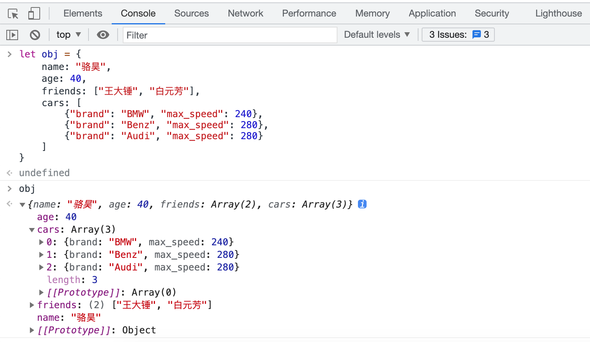

上面的`obj`就是JavaScript中的一个对象，我们可以通过`obj.name`或`obj["name"]`两种方式获取到`name`对应的值，如下图所示。可以注意到，`obj["name"]`这种获取数据的方式跟Python字典通过键获取值的索引操作是完全一致的，而Python中也通过名为`json`的模块提供了字典与JSON双向转换的支持。

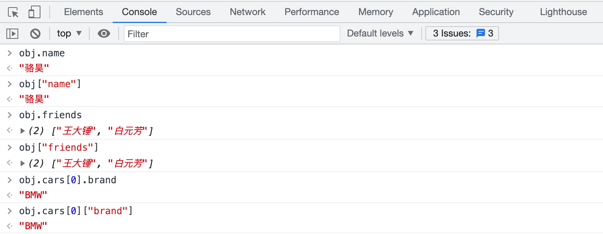

我们在JSON中使用的数据类型（JavaScript数据类型）和Python中的数据类型也是很容易找到对应关系的，大家可以看看下面的两张表。

表1：JavaScript数据类型（值）对应的Python数据类型（值）

| JSON         | Python       |
| ------------ | ------------ |
| `object`      |`dict`|
| `array`      |`list`|
| `string`     | `str`        |
| `number ` |`int` / `float`|
| `number` (real)   |`float`|
| `boolean` (`true` / `false`) | `bool` (`True` / `False`) |
| `null`       | `None`       |

表2：Python数据类型（值）对应的JavaScript数据类型（值）

| Python                      | JSON                         |
| --------------------------- | ---------------------------- |
| `dict`                      | `object`                     |
| `list` / `tuple`            | `array`                      |
| `str`                       | `string`                     |
| `int` / `float`             | `number`                     |
| `bool` （`True` / `False`） | `boolean` (`true` / `false`) |
| `None`                      | `null`                       |

### 读写JSON格式的数据

在Python中，如果要将字典处理成JSON格式（以字符串形式存在），可以使用`json`模块的`dumps`函数，代码如下所示。

```Python
import json

my_dict = {
    'name': '骆昊',
    'age': 40,
    'friends': ['王大锤', '白元芳'],
    'cars': [
        {'brand': 'BMW', 'max_speed': 240},
        {'brand': 'Audi', 'max_speed': 280},
        {'brand': 'Benz', 'max_speed': 280}
    ]
}
print(json.dumps(my_dict))
```

运行上面的代码，输出如下所示，可以注意到中文字符都是用Unicode编码显示的。

```JSON
{"name": "\u9a86\u660a", "age": 40, "friends": ["\u738b\u5927\u9524", "\u767d\u5143\u82b3"], "cars": [{"brand": "BMW", "max_speed": 240}, {"brand": "Audi", "max_speed": 280}, {"brand": "Benz", "max_speed": 280}]}
```

如果要将字典处理成JSON格式并写入文本文件，只需要将`dumps`函数换成`dump`函数并传入文件对象即可，代码如下所示。

```Python
import json

my_dict = {
    'name': '骆昊',
    'age': 40,
    'friends': ['王大锤', '白元芳'],
    'cars': [
        {'brand': 'BMW', 'max_speed': 240},
        {'brand': 'Audi', 'max_speed': 280},
        {'brand': 'Benz', 'max_speed': 280}
    ]
}
with open('data.json', 'w') as file:
    json.dump(my_dict, file)
```

执行上面的代码，会创建`data.json`文件，文件的内容跟上面代码的输出是一样的。

`json`模块有四个比较重要的函数，分别是：

- `dump` - 将Python对象按照JSON格式序列化到文件中
- `dumps` - 将Python对象处理成JSON格式的字符串
- `load` - 将文件中的JSON数据反序列化成对象
- `loads` - 将字符串的内容反序列化成Python对象

这里出现了两个概念，一个叫序列化，一个叫反序列化，[维基百科](https://zh.wikipedia.org/)上的解释是：“序列化（serialization）在计算机科学的数据处理中，是指将数据结构或对象状态转换为可以存储或传输的形式，这样在需要的时候能够恢复到原先的状态，而且通过序列化的数据重新获取字节时，可以利用这些字节来产生原始对象的副本（拷贝）。与这个过程相反的动作，即从一系列字节中提取数据结构的操作，就是反序列化（deserialization）”。

我们可以通过下面的代码，读取上面创建的`data.json`文件，将JSON格式的数据还原成Python中的字典。

```Python
import json

with open('data.json', 'r') as file:
    my_dict = json.load(file)
    print(type(my_dict))
    print(my_dict)
```

### 包管理工具pip的使用

Python标准库中的`json`模块在数据序列化和反序列化时性能并不是非常理想，为了解决这个问题，可以使用三方库`ujson`来替换`json`。所谓三方库，是指非公司内部开发和使用的，也不是来自于官方标准库的Python模块，这些模块通常由其他公司、组织或个人开发，所以被称为三方库。虽然Python语言的标准库虽然已经提供了诸多模块来方便我们的开发，但是对于一个强大的语言来说，它的生态圈一定也是非常繁荣的。

之前安装Python解释器时，默认情况下已经勾选了安装pip，大家可以在命令提示符或终端中通过`pip --version`来确定是否已经拥有了pip。pip是Python的包管理工具，通过pip可以查找、安装、卸载、更新Python的三方库或工具，macOS和Linux系统应该使用pip3。例如要安装替代`json`模块的`ujson`，可以使用下面的命令。

```Bash
pip install ujson
```

在默认情况下，pip会访问`https://pypi.org/simple/`来获得三方库相关的数据，但是国内访问这个网站的速度并不是十分理想，因此国内用户可以使用豆瓣网提供的镜像来替代这个默认的下载源，操作如下所示。

```Bash
pip install ujson
```

可以通过`pip search`命令根据名字查找需要的三方库，可以通过`pip list`命令来查看已经安装过的三方库。如果想更新某个三方库，可以使用`pip install -U`或`pip install --upgrade`；如果要删除某个三方库，可以使用`pip uninstall`命令。

搜索`ujson`三方库。

```Bash
pip search ujson

micropython-cpython-ujson (0.2)  - MicroPython module ujson ported to CPython
pycopy-cpython-ujson (0.2)       - Pycopy module ujson ported to CPython
ujson (3.0.0)                    - Ultra fast JSON encoder and decoder for Python
ujson-bedframe (1.33.0)          - Ultra fast JSON encoder and decoder for Python
ujson-segfault (2.1.57)          - Ultra fast JSON encoder and decoder for Python. Continuing 
                                   development.
ujson-ia (2.1.1)                 - Ultra fast JSON encoder and decoder for Python (Internet 
                                   Archive fork)
ujson-x (1.37)                   - Ultra fast JSON encoder and decoder for Python
ujson-x-legacy (1.35.1)          - Ultra fast JSON encoder and decoder for Python
drf_ujson (1.2)                  - Django Rest Framework UJSON Renderer
drf-ujson2 (1.6.1)               - Django Rest Framework UJSON Renderer
ujsonDB (0.1.0)                  - A lightweight and simple database using ujson.
fast-json (0.3.2)                - Combines best parts of json and ujson for fast serialization
decimal-monkeypatch (0.4.3)      - Python 2 performance patches: decimal to cdecimal, json to 
                                   ujson for psycopg2
```

查看已经安装的三方库。

```Bash
pip list

Package                       Version
----------------------------- ----------
aiohttp                       3.5.4
alipay                        0.7.4
altgraph                      0.16.1
amqp                          2.4.2
...							  ...
```

更新`ujson`三方库。

```Bash
pip install -U ujson
```

删除`ujson`三方库。

```Bash
pip uninstall -y ujson
```

> **提示**：如果要更新`pip`自身，对于macOS系统来说，可以使用命令`pip install -U pip`。在Windows系统上，可以将命令替换为`python -m pip install -U --user pip`。

### 使用网络API获取数据

如果想在我们自己的程序中显示天气、路况、航班等信息，这些信息我们自己没有能力提供，所以必须使用网络数据服务。目前绝大多数的网络数据服务（或称之为网络API）都是基于[HTTP](https://zh.wikipedia.org/wiki/%E8%B6%85%E6%96%87%E6%9C%AC%E4%BC%A0%E8%BE%93%E5%8D%8F%E8%AE%AE)或HTTPS提供JSON格式的数据，我们可以通过Python程序发送HTTP请求给指定的URL（统一资源定位符），这个URL就是所谓的网络API，如果请求成功，它会返回HTTP响应，而HTTP响应的消息体中就有我们需要的JSON格式的数据。关于HTTP的相关知识，可以看看阮一峰的[《HTTP协议入门》](http://www.ruanyifeng.com/blog/2016/08/http.html)一文。

国内有很多提供网络API接口的网站，例如[聚合数据](https://www.juhe.cn/)、[阿凡达数据](http://www.avatardata.cn/)等，这些网站上有免费的和付费的数据接口，国外的[{API}Search](http://apis.io/)网站也提供了类似的功能，有兴趣的可以自行研究。下面的例子演示了如何使用[`requests`](http://docs.python-requests.org/zh_CN/latest/)库（基于HTTP进行网络资源访问的三方库）访问网络API获取国内新闻并显示新闻标题和链接。在这个例子中，我们使用了名为[天行数据](https://www.tianapi.com/)的网站提供的国内新闻数据接口，其中的APIKey需要自己到网站上注册申请。在天行数据网站注册账号后会自动分配APIKey，但是要访问接口获取数据，需要绑定验证邮箱或手机，然后还要申请需要使用的接口，如下图所示。

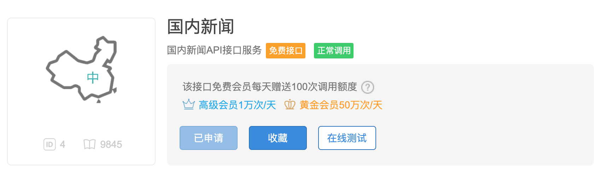

Python通过URL接入网络，我们推荐大家使用`requests`三方库，它简单且强大，但需要自行安装。

```Bash
pip install requests
```

获取国内新闻并显示新闻标题和链接。

```Python
import requests

resp = requests.get('http://api.tianapi.com/guonei/?key=APIKey&num=10')
if resp.status_code == 200:
    data_model = resp.json()
    for news in data_model['newslist']:
        print(news['title'])
        print(news['url'])
        print('-' * 60)
```

上面的代码通过`requests`模块的`get`函数向天行数据的国内新闻接口发起了一次请求，如果请求过程没有出现问题，`get`函数会返回一个`Response`对象，通过该对象的`status_code`属性表示HTTP响应状态码，如果不理解没关系，你只需要关注它的值，如果值等于`200`或者其他`2`字头的值，那么我们的请求是成功的。通过`Response`对象的`json()`方法可以将返回的JSON格式的数据直接处理成Python字典，非常方便。天行数据国内新闻接口返回的JSON格式的数据（部分）如下图所示。

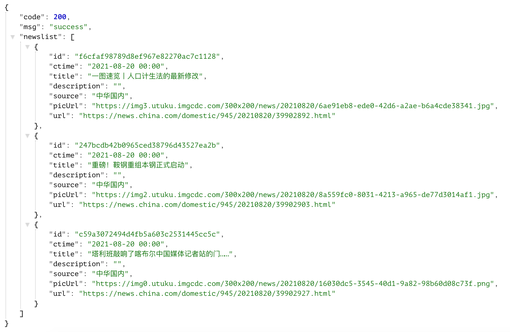

> **提示**：上面代码中的APIKey需要换成自己在天行数据网站申请的APIKey。天行数据网站上还有提供了很多非常有意思的API接口，例如：垃圾分类、周公解梦等，大家可以仿照上面的代码来调用这些接口。每个接口都有对应的接口文档，文档中有关于如何使用接口的详细说明。

###  简单的总结

Python中实现序列化和反序列化除了使用`json`模块之外，还可以使用`pickle`和`shelve`模块，但是这两个模块是使用特有的序列化协议来序列化数据，因此序列化后的数据只能被Python识别，关于这两个模块的相关知识，有兴趣的读者可以自己查找网络上的资料。处理JSON格式的数据很显然是程序员必须掌握的一项技能，因为不管是访问网络API接口还是提供网络API接口给他人使用，都需要具备处理JSON格式数据的相关知识。

## 第23课：用Python读写CSV文件

### CSV文件介绍

CSV（Comma Separated Values）全称逗号分隔值文件是一种简单、通用的文件格式，被广泛的应用于应用程序（数据库、电子表格等）数据的导入和导出以及异构系统之间的数据交换。因为CSV是纯文本文件，不管是什么操作系统和编程语言都是可以处理纯文本的，而且很多编程语言中都提供了对读写CSV文件的支持，因此CSV格式在数据处理和数据科学中被广泛应用。

CSV文件有以下特点：

1. 纯文本，使用某种字符集（如[ASCII](https://zh.wikipedia.org/wiki/ASCII)、[Unicode](https://zh.wikipedia.org/wiki/Unicode)、[GB2312](https://zh.wikipedia.org/wiki/GB2312)）等）；
2. 由一条条的记录组成（典型的是每行一条记录）；
3. 每条记录被分隔符（如逗号、分号、制表符等）分隔为字段（列）；
4. 每条记录都有同样的字段序列。

CSV文件可以使用文本编辑器或类似于Excel电子表格这类工具打开和编辑，当使用Excel这类电子表格打开CSV文件时，你甚至感觉不到CSV和Excel文件的区别。很多数据库系统都支持将数据导出到CSV文件中，当然也支持从CSV文件中读入数据保存到数据库中，这些内容并不是现在要讨论的重点。

### 将数据写入CSV文件

现有五个学生三门课程的考试成绩需要保存到一个CSV文件中，要达成这个目标，可以使用Python标准库中的`csv`模块，该模块的`writer`函数会返回一个`csvwriter`对象，通过该对象的`writerow`或`writerows`方法就可以将数据写入到CSV文件中，具体的代码如下所示。

```Python
import csv
import random

with open('scores.csv', 'w') as file:
    writer = csv.writer(file)
    writer.writerow(['姓名', '语文', '数学', '英语'])
    names = ['关羽', '张飞', '赵云', '马超', '黄忠']
    for name in names:
        scores = [random.randrange(50, 101) for _ in range(3)]
        scores.insert(0, name)
        writer.writerow(scores)
```

生成的CSV文件的内容。

```
姓名,语文,数学,英语
关羽,98,86,61
张飞,86,58,80
赵云,95,73,70
马超,83,97,55
黄忠,61,54,87
```

需要说明的是上面的`writer`函数，除了传入要写入数据的文件对象外，还可以`dialect`参数，它表示CSV文件的方言，默认值是`excel`。除此之外，还可以通过`delimiter`、`quotechar`、`quoting`参数来指定分隔符（默认是逗号）、包围值的字符（默认是双引号）以及包围的方式。其中，包围值的字符主要用于当字段中有特殊符号时，通过添加包围值的字符可以避免二义性。大家可以尝试将上面第5行代码修改为下面的代码，然后查看生成的CSV文件。

```Python
writer = csv.writer(file, delimiter='|', quoting=csv.QUOTE_ALL)
```

生成的CSV文件的内容。

```
"姓名"|"语文"|"数学"|"英语"
"关羽"|"88"|"64"|"65"
"张飞"|"76"|"93"|"79"
"赵云"|"78"|"55"|"76"
"马超"|"72"|"77"|"68"
"黄忠"|"70"|"72"|"51"
```

### 从CSV文件读取数据

如果要读取刚才创建的CSV文件，可以使用下面的代码，通过`csv`模块的`reader`函数可以创建出`csvreader`对象，该对象是一个迭代器，可以通过`next`函数或`for-in`循环读取到文件中的数据。

```Python
import csv

with open('scores.csv', 'r') as file:
    reader = csv.reader(file, delimiter='|')
    for data_list in reader:
        print(reader.line_num, end='\t')
        for elem in data_list:
            print(elem, end='\t')
        print()
```

> **注意**：上面的代码对`csvreader`对象做`for`循环时，每次会取出一个列表对象，该列表对象包含了一行中所有的字段。

###  简单的总结

将来如果大家使用Python做数据分析，很有可能会用到名为`pandas`的三方库，它是Python数据分析的神器之一。`pandas`中封装了名为`read_csv`和`to_csv`的函数用来读写CSV文件，其中`read_CSV`会将读取到的数据变成一个`DataFrame`对象，而`DataFrame`就是`pandas`库中最重要的类型，它封装了一系列用于数据处理的方法（清洗、转换、聚合等）；而`to_csv`会将`DataFrame`对象中的数据写入CSV文件，完成数据的持久化。`read_csv`函数和`to_csv`函数远远比原生的`csvreader`和`csvwriter`强大。
## 第24课：用Python读写Excel文件-1

### Excel简介

Excel是Microsoft（微软）为使用Windows和macOS操作系统开发的一款电子表格软件。Excel凭借其直观的界面、出色的计算功能和图表工具，再加上成功的市场营销，一直以来都是最为流行的个人计算机数据处理软件。当然，Excel也有很多竞品，例如Google Sheets、LibreOffice Calc、Numbers等，这些竞品基本上也能够兼容Excel，至少能够读写较新版本的Excel文件，当然这些不是我们讨论的重点。掌握用Python程序操作Excel文件，可以让日常办公自动化的工作更加轻松愉快，而且在很多商业项目中，导入导出Excel文件都是特别常见的功能。

Python操作Excel需要三方库的支持，如果要兼容Excel 2007以前的版本，也就是`xls`格式的Excel文件，可以使用三方库`xlrd`和`xlwt`，前者用于读Excel文件，后者用于写Excel文件。如果使用较新版本的Excel，即操作`xlsx`格式的Excel文件，可以使用`openpyxl`库，当然这个库不仅仅可以操作Excel，还可以操作其他基于Office Open XML的电子表格文件。

本章我们先讲解基于`xlwt`和`xlrd`操作Excel文件，大家可以先使用下面的命令安装这两个三方库以及配合使用的工具模块`xlutils`。

```Bash
pip install xlwt xlrd xlutils
```

### 读Excel文件

例如在当前文件夹下有一个名为“阿里巴巴2020年股票数据.xls”的Excel文件，如果想读取并显示该文件的内容，可以通过如下所示的代码来完成。

```Python
import xlrd

# 使用xlrd模块的open_workbook函数打开指定Excel文件并获得Book对象（工作簿）
wb = xlrd.open_workbook('阿里巴巴2020年股票数据.xls')
# 通过Book对象的sheet_names方法可以获取所有表单名称
sheetnames = wb.sheet_names()
print(sheetnames)
# 通过指定的表单名称获取Sheet对象（工作表）
sheet = wb.sheet_by_name(sheetnames[0])
# 通过Sheet对象的nrows和ncols属性获取表单的行数和列数
print(sheet.nrows, sheet.ncols)
for row in range(sheet.nrows):
    for col in range(sheet.ncols):
        # 通过Sheet对象的cell方法获取指定Cell对象（单元格）
        # 通过Cell对象的value属性获取单元格中的值
        value = sheet.cell(row, col).value
        # 对除首行外的其他行进行数据格式化处理
        if row > 0:
            # 第1列的xldate类型先转成元组再格式化为“年月日”的格式
            if col == 0:
                # xldate_as_tuple函数的第二个参数只有0和1两个取值
                # 其中0代表以1900-01-01为基准的日期，1代表以1904-01-01为基准的日期
                value = xlrd.xldate_as_tuple(value, 0)
                value = f'{value[0]}年{value[1]:>02d}月{value[2]:>02d}日'
            # 其他列的number类型处理成小数点后保留两位有效数字的浮点数
            else:
                value = f'{value:.2f}'
        print(value, end='\t')
    print()
# 获取最后一个单元格的数据类型
# 0 - 空值，1 - 字符串，2 - 数字，3 - 日期，4 - 布尔，5 - 错误
last_cell_type = sheet.cell_type(sheet.nrows - 1, sheet.ncols - 1)
print(last_cell_type)
# 获取第一行的值（列表）
print(sheet.row_values(0))
# 获取指定行指定列范围的数据（列表）
# 第一个参数代表行索引，第二个和第三个参数代表列的开始（含）和结束（不含）索引
print(sheet.row_slice(3, 0, 5))
```

> **提示**：上面代码中使用的Excel文件“阿里巴巴2020年股票数据.xls”可以通过后面的百度云盘地址进行获取。链接:https://pan.baidu.com/s/1rQujl5RQn9R7PadB2Z5g_g 提取码:e7b4。

相信通过上面的代码，大家已经了解到了如何读取一个Excel文件，如果想知道更多关于`xlrd`模块的知识，可以阅读它的[官方文档](https://xlrd.readthedocs.io/en/latest/)。

### 写Excel文件

写入Excel文件可以通过`xlwt` 模块的`Workbook`类创建工作簿对象，通过工作簿对象的`add_sheet`方法可以添加工作表，通过工作表对象的`write`方法可以向指定单元格中写入数据，最后通过工作簿对象的`save`方法将工作簿写入到指定的文件或内存中。下面的代码实现了将`5`个学生`3`门课程的考试成绩写入Excel文件的操作。

```Python
import random

import xlwt

student_names = ['关羽', '张飞', '赵云', '马超', '黄忠']
scores = [[random.randrange(50, 101) for _ in range(3)] for _ in range(5)]
# 创建工作簿对象（Workbook）
wb = xlwt.Workbook()
# 创建工作表对象（Worksheet）
sheet = wb.add_sheet('一年级二班')
# 添加表头数据
titles = ('姓名', '语文', '数学', '英语')
for index, title in enumerate(titles):
    sheet.write(0, index, title)
# 将学生姓名和考试成绩写入单元格
for row in range(len(scores)):
    sheet.write(row + 1, 0, student_names[row])
    for col in range(len(scores[row])):
        sheet.write(row + 1, col + 1, scores[row][col])
# 保存Excel工作簿
wb.save('考试成绩表.xls')
```

#### 调整单元格样式

在写Excel文件时，我们还可以为单元格设置样式，主要包括字体（Font）、对齐方式（Alignment）、边框（Border）和背景（Background）的设置，`xlwt`对这几项设置都封装了对应的类来支持。要设置单元格样式需要首先创建一个`XFStyle`对象，再通过该对象的属性对字体、对齐方式、边框等进行设定，例如在上面的例子中，如果希望将表头单元格的背景色修改为黄色，可以按照如下的方式进行操作。

```Python
header_style = xlwt.XFStyle()
pattern = xlwt.Pattern()
pattern.pattern = xlwt.Pattern.SOLID_PATTERN
# 0 - 黑色、1 - 白色、2 - 红色、3 - 绿色、4 - 蓝色、5 - 黄色、6 - 粉色、7 - 青色
pattern.pattern_fore_colour = 5
header_style.pattern = pattern
titles = ('姓名', '语文', '数学', '英语')
for index, title in enumerate(titles):
    sheet.write(0, index, title, header_style)
```

如果希望为表头设置指定的字体，可以使用`Font`类并添加如下所示的代码。

```Python
font = xlwt.Font()
# 字体名称
font.name = '华文楷体'
# 字体大小（20是基准单位，18表示18px）
font.height = 20 * 18
# 是否使用粗体
font.bold = True
# 是否使用斜体
font.italic = False
# 字体颜色
font.colour_index = 1
header_style.font = font
```

> **注意**：上面代码中指定的字体名（`font.name`）应当是本地系统有的字体，例如在我的电脑上有名为“华文楷体”的字体。

如果希望表头垂直居中对齐，可以使用下面的代码进行设置。

```Python
align = xlwt.Alignment()
# 垂直方向的对齐方式
align.vert = xlwt.Alignment.VERT_CENTER
# 水平方向的对齐方式
align.horz = xlwt.Alignment.HORZ_CENTER
header_style.alignment = align
```

如果希望给表头加上黄色的虚线边框，可以使用下面的代码来设置。

```Python
borders = xlwt.Borders()
props = (
    ('top', 'top_colour'), ('right', 'right_colour'),
    ('bottom', 'bottom_colour'), ('left', 'left_colour')
)
# 通过循环对四个方向的边框样式及颜色进行设定
for position, color in props:
    # 使用setattr内置函数动态给对象指定的属性赋值
    setattr(borders, position, xlwt.Borders.DASHED)
    setattr(borders, color, 5)
header_style.borders = borders
```

如果要调整单元格的宽度（列宽）和表头的高度（行高），可以按照下面的代码进行操作。

```Python
# 设置行高为40px
sheet.row(0).set_style(xlwt.easyxf(f'font:height {20 * 40}'))
titles = ('姓名', '语文', '数学', '英语')
for index, title in enumerate(titles):
    # 设置列宽为200px
    sheet.col(index).width = 20 * 200
    # 设置单元格的数据和样式
    sheet.write(0, index, title, header_style)
```

#### 公式计算

对于前面打开的“阿里巴巴2020年股票数据.xls”文件，如果要统计全年收盘价（Close字段）的平均值以及全年交易量（Volume字段）的总和，可以使用Excel的公式计算即可。我们可以先使用`xlrd`读取Excel文件夹，然后通过`xlutils`三方库提供的`copy`函数将读取到的Excel文件转成`Workbook`对象进行写操作，在调用`write`方法时，可以将一个`Formula`对象写入单元格。

实现公式计算的代码如下所示。

```Python
import xlrd
import xlwt
from xlutils.copy import copy

wb_for_read = xlrd.open_workbook('阿里巴巴2020年股票数据.xls')
sheet1 = wb_for_read.sheet_by_index(0)
nrows, ncols = sheet1.nrows, sheet1.ncols
wb_for_write = copy(wb_for_read)
sheet2 = wb_for_write.get_sheet(0)
sheet2.write(nrows, 4, xlwt.Formula(f'average(E2:E{nrows})'))
sheet2.write(nrows, 6, xlwt.Formula(f'sum(G2:G{nrows})'))
wb_for_write.save('阿里巴巴2020年股票数据汇总.xls')
```

> **说明**：上面的代码有一些小瑕疵，有兴趣的读者可以自行探索并思考如何解决。

###  简单的总结

掌握了Python程序操作Excel的方法，可以解决日常办公中很多繁琐的处理Excel电子表格工作，最常见就是将多个数据格式相同的Excel文件合并到一个文件以及从多个Excel文件或表单中提取指定的数据。当然，如果要对表格数据进行处理，使用Python数据分析神器之一的`pandas`库可能更为方便。
## 第24课：用Python读写Excel文件

### Excel简介

Excel是Microsoft（微软）为使用Windows和macOS操作系统开发的一款电子表格软件。Excel凭借其直观的界面、出色的计算功能和图表工具，再加上成功的市场营销，一直以来都是最为流行的个人计算机数据处理软件。当然，Excel也有很多竞品，例如Google Sheets、LibreOffice Calc、Numbers等，这些竞品基本上也能够兼容Excel，至少能够读写较新版本的Excel文件，当然这些不是我们讨论的重点。掌握用Python程序操作Excel文件，可以让日常办公自动化的工作更加轻松愉快，而且在很多商业项目中，导入导出Excel文件都是特别常见的功能。

Python操作Excel需要三方库的支持，如果要兼容Excel 2007以前的版本，也就是`xls`格式的Excel文件，可以使用三方库`xlrd`和`xlwt`，前者用于读Excel文件，后者用于写Excel文件。如果使用较新版本的Excel，即操作`xlsx`格式的Excel文件，也可以使用`openpyxl`库，当然这个库不仅仅可以操作Excel，还可以操作其他基于Office Open XML的电子表格文件。

下面我们以`xlwt`和`xlrd`为例讲解如何读写Excel文件，大家可以先使用下面的命令安装这两个三方库文件。

```Bash
pip install xlwt xlrd -i https://pypi.doubanio.com/simple
```

### 使用xlwt和xlrd

#### 读Excel文件

例如在当前文件夹下有一个名为“阿里巴巴2017年股票数据.xlsx”的Excel文件，如果想读取并显示该文件的内容，可以通过如下所示的代码来完成。

```Python
import xlrd

# 使用xlrd模块的open_workbook函数打开指定Excel文件并获得Book对象（工作簿）
wb = xlrd.open_workbook('阿里巴巴2017年股票数据.xlsx')
# 通过Book对象的sheet_names方法可以获取所有表单名称
sheetname = wb.sheet_names()[0]
# 通过指定的表单名称获取Sheet对象（工作表）
sheet = wb.sheet_by_name(sheetname)
# 通过Sheet对象的nrows和ncols属性获取表单的行数和列数
print(sheet.nrows, sheet.ncols)
for row in range(sheet.nrows):
    for col in range(sheet.ncols):
        # 通过Sheet对象的cell方法获取指定Cell对象（单元格）
        # 通过Cell对象的value属性获取单元格中的值
        value = sheet.cell(row, col).value
        # 对除首行外的其他行进行数据格式化处理
        if row > 0:
            # 第1列的xldate类型先转成元组再格式化为“年月日”的格式
            if col == 0:
                # xldate_as_tuple函数的第二个参数只有0和1两个取值
                # 其中0代表以1900-01-01为基准的日期，1代表以1904-01-01为基准的日期
                value = xlrd.xldate_as_tuple(value, 0)
                value = f'{value[0]}年{value[1]:>02d}月{value[2]:>02d}日'
            # 其他列的number类型处理成小数点后保留两位有效数字的浮点数
            else:
                value = f'{value:.2f}'
        print(value, end='\t')
    print()
# 获取最后一个单元格的数据类型
# 0 - 空值，1 - 字符串，2 - 数字，3 - 日期，4 - 布尔，5 - 错误
last_cell_type = sheet.cell_type(sheet.nrows - 1, sheet.ncols - 1)
print(last_cell_type)
# 获取第一行的值（列表）
print(sheet.row_values(0))
# 获取指定行指定列范围的数据（列表）
# 第一个参数代表行索引，第二个和第三个参数代表列的开始（含）和结束（不含）索引
print(sheet.row_slice(3, 0, 5))
```

相信通过上面的代码，大家已经了解到了如何读取一个Excel文件，如果想知道更多关于`xlrd`模块的知识，可以阅读它的[官方文档](https://xlrd.readthedocs.io/en/latest/)。

#### 写Excel文件

写入Excel文件可以通过`xlwt` 模块的`Workbook`类创建工作簿对象，通过工作簿对象的`add_sheet`方法可以添加工作表，通过工作表对象的`write`方法可以向指定单元格中写入数据，最后通过工作簿对象的`save`方法将工作簿写入到指定的文件或内存中。下面的代码实现了将5个学生3门课程的考试成绩写入Excel文件的操作。

```Python
import random

import xlwt

student_names = ['关羽', '张飞', '赵云', '马超', '黄忠']
scores = [[random.randint(40, 100) for _ in range(3)] for _ in range(5)]
# 创建工作簿对象（Workbook）
wb = xlwt.Workbook()
# 创建工作表对象（Worksheet）
sheet = wb.add_sheet('一年级二班')
# 添加表头数据
titles = ('姓名', '语文', '数学', '英语')
for index, title in enumerate(titles):
    sheet.write(0, index, title)
# 将学生姓名和考试成绩写入单元格
for row in range(len(scores)):
    sheet.write(row + 1, 0, student_names[row])
    for col in range(len(scores[row])):
        sheet.write(row + 1, col + 1, scores[row][col])
# 保存Excel工作簿
wb.save('考试成绩表.xlsx')
```

#### 调整单元格样式

在写Excel文件时，我们还可以为单元格设置样式，主要包括字体（Font）、对齐方式（Alignment）、边框（Border）和背景（Background）的设置，`xlwt`对这几项设置都封装了对应的类来支持。要设置单元格样式需要首先创建一个`XFStyle`对象，再通过该对象的属性对字体、对齐方式、边框等进行设定，例如在上面的例子中，如果希望将表头单元格的背景色修改为黄色，可以按照如下的方式进行操作。

```Python
header_style = xlwt.XFStyle()
pattern = xlwt.Pattern()
pattern.pattern = xlwt.Pattern.SOLID_PATTERN
# 0 - 黑色、1 - 白色、2 - 红色、3 - 绿色、4 - 蓝色、5 - 黄色、6 - 粉色、7 - 青色
pattern.pattern_fore_colour = 5
header_style.pattern = pattern
titles = ('姓名', '语文', '数学', '英语')
for index, title in enumerate(titles):
    sheet.write(0, index, title, header_style)
```

如果希望为表头设置指定的字体，可以使用`Font`类并添加如下所示的代码。

```Python
font = xlwt.Font()
# 字体名称
font.name = '华文楷体'
# 字体大小（20是基准单位，18表示18px）
font.height = 20 * 18
# 是否使用粗体
font.bold = True
# 是否使用斜体
font.italic = False
# 字体颜色
font.colour_index = 1
header_style.font = font
```

如果希望表头垂直居中对齐，可以使用下面的代码进行设置。

```Python
align = xlwt.Alignment()
# 垂直方向的对齐方式
align.vert = xlwt.Alignment.VERT_CENTER
# 水平方向的对齐方式
align.horz = xlwt.Alignment.HORZ_CENTER
header_style.alignment = align
```

如果希望给表头加上黄色的虚线边框，可以使用下面的代码来设置。

```Python
borders = xlwt.Borders()
props = (
    ('top', 'top_colour'), ('right', 'right_colour'),
    ('bottom', 'bottom_colour'), ('left', 'left_colour')
)
# 通过循环对四个方向的边框样式及颜色进行设定
for position, color in props:
    setattr(borders, position, xlwt.Borders.DASHED)
    setattr(borders, color, 5)
header_style.borders = borders
```

如果要调整单元格的宽度（列宽）和表头的高度（行高），可以按照下面的代码进行操作。

```Python
# 设置行高为40px
sheet.row(0).set_style(xlwt.easyxf(f'font:height {20 * 40}'))
titles = ('姓名', '语文', '数学', '英语')
for index, title in enumerate(titles):
    # 设置列宽为200px
    sheet.col(index).width = 20 * 200
    # 设置单元格的数据和样式
    sheet.write(0, index, title, header_style)
```

#### 公式计算

对于前面打开的“阿里巴巴2017年股票数据.xlsx”文件，如果要统计全年收盘价（Close字段）的平均值以及全年交易量（Volume字段）的总和，可以使用Excel的公式计算即可。我们可以先使用`xlrd`读取Excel文件夹，然后通过一个名为`xlutils`的三方库提供的`copy`函数将读取到的Excel文件转成`Workbook`对象进行写操作，在调用`write`方法时，可以将一个`Formula`对象写入单元格。

安装`xlutils`三方库。

```Bash
pip install xlutils -i https://pypi.doubanio.com/simple
```

实现公式计算的代码如下所示。

```Python
import xlrd
import xlwt
from xlutils.copy import copy

wb_for_read = xlrd.open_workbook('阿里巴巴2017年股票数据.xlsx')
sheet1 = wb_for_read.sheet_by_index(0)
nrows, ncols = sheet1.nrows, sheet1.ncols
wb_for_write = copy(wb_for_read)
sheet2 = wb_for_write.get_sheet(0)
sheet2.write(nrows, 4, xlwt.Formula(f'average(E2:E{nrows})'))
sheet2.write(nrows, 6, xlwt.Formula(f'sum(G2:G{nrows})'))
wb_for_write.save('阿里巴巴2017年股票数据-2.xlsx')
```

> **说明**：上面的代码有一些小瑕疵，有兴趣的读者可以自行探索如何解决。

###  简单的总结

其他操作Excel文件的三方库（如`openpyxl`）大家有兴趣可以自行了解。掌握了Python程序操作Excel的方法，可以解决日常办公中很多繁琐的处理Excel电子表格工作，最常见就是将多个数据格式相同的Excel文件合并到一个文件以及从多个Excel文件或表单中提取指定的数据。当然，如果要对表格数据进行处理，使用Python数据分析神器之一的`pandas`库可能更为方便，因为`pandas`库封装的函数以及`DataFrame`类可以完成大多数数据处理的任务。
## 第25课：用Python读写Excel文件-2

### Excel简介

Excel是Microsoft（微软）为使用Windows和macOS操作系统开发的一款电子表格软件。Excel凭借其直观的界面、出色的计算功能和图表工具，再加上成功的市场营销，一直以来都是最为流行的个人计算机数据处理软件。当然，Excel也有很多竞品，例如Google Sheets、LibreOffice Calc、Numbers等，这些竞品基本上也能够兼容Excel，至少能够读写较新版本的Excel文件，当然这些不是我们讨论的重点。掌握用Python程序操作Excel文件，可以让日常办公自动化的工作更加轻松愉快，而且在很多商业项目中，导入导出Excel文件都是特别常见的功能。

本章我们继续讲解基于另一个三方库`openpyxl`如何进行Excel文件操作，首先需要先安装它。

```Bash
pip install openpyxl
```

`openpyxl`的优点在于，当我们打开一个Excel文件后，既可以对它进行读操作，又可以对它进行写操作，而且在操作的便捷性上是优于`xlwt`和`xlrd`的。此外，如果要进行样式编辑和公式计算，使用`openpyxl`也远比上一个章节我们讲解的方式更为简单，而且`openpyxl`还支持数据透视和插入图表等操作，功能非常强大。有一点需要再次强调，`openpyxl`并不支持操作Office 2007以前版本的Excel文件。

### 读取Excel文件

例如在当前文件夹下有一个名为“阿里巴巴2020年股票数据.xlsx”的Excel文件，如果想读取并显示该文件的内容，可以通过如下所示的代码来完成。

```Python
import datetime

import openpyxl

# 加载一个工作簿 ---> Workbook
wb = openpyxl.load_workbook('阿里巴巴2020年股票数据.xlsx')
# 获取工作表的名字
print(wb.sheetnames)
# 获取工作表 ---> Worksheet
sheet = wb.worksheets[0]
# 获得单元格的范围
print(sheet.dimensions)
# 获得行数和列数
print(sheet.max_row, sheet.max_column)

# 获取指定单元格的值
print(sheet.cell(3, 3).value)
print(sheet['C3'].value)
print(sheet['G255'].value)

# 获取多个单元格（嵌套元组）
print(sheet['A2:C5'])

# 读取所有单元格的数据
for row_ch in range(2, sheet.max_row + 1):
    for col_ch in 'ABCDEFG':
        value = sheet[f'{col_ch}{row_ch}'].value
        if type(value) == datetime.datetime:
            print(value.strftime('%Y年%m月%d日'), end='\t')
        elif type(value) == int:
            print(f'{value:<10d}', end='\t')
        elif type(value) == float:
            print(f'{value:.4f}', end='\t')
        else:
            print(value, end='\t')
    print()
```

> **提示**：上面代码中使用的Excel文件“阿里巴巴2020年股票数据.xlsx”可以通过后面的百度云盘地址进行获取。链接:https://pan.baidu.com/s/1rQujl5RQn9R7PadB2Z5g_g 提取码:e7b4。

需要提醒大家一点，`openpyxl`获取指定的单元格有两种方式，一种是通过`cell`方法，需要注意，该方法的行索引和列索引都是从`1`开始的，这是为了照顾用惯了Excel的人的习惯；另一种是通过索引运算，通过指定单元格的坐标，例如`C3`、`G255`，也可以取得对应的单元格，再通过单元格对象的`value`属性，就可以获取到单元格的值。通过上面的代码，相信大家还注意到了，可以通过类似`sheet['A2:C5']`或`sheet['A2':'C5']`这样的切片操作获取多个单元格，该操作将返回嵌套的元组，相当于获取到了多行多列。

### 写Excel文件

下面我们使用`openpyxl`来进行写Excel操作。

```Python
import random

import openpyxl

# 第一步：创建工作簿（Workbook）
wb = openpyxl.Workbook()

# 第二步：添加工作表（Worksheet）
sheet = wb.active
sheet.title = '期末成绩'

titles = ('姓名', '语文', '数学', '英语')
for col_index, title in enumerate(titles):
    sheet.cell(1, col_index + 1, title)

names = ('关羽', '张飞', '赵云', '马超', '黄忠')
for row_index, name in enumerate(names):
    sheet.cell(row_index + 2, 1, name)
    for col_index in range(2, 5):
        sheet.cell(row_index + 2, col_index, random.randrange(50, 101))

# 第四步：保存工作簿
wb.save('考试成绩表.xlsx')
```

#### 调整样式和公式计算

在使用`openpyxl`操作Excel时，如果要调整单元格的样式，可以直接通过单元格对象（`Cell`对象）的属性进行操作。单元格对象的属性包括字体（`font`）、对齐（`alignment`）、边框（`border`）等，具体的可以参考`openpyxl`的[官方文档](https://openpyxl.readthedocs.io/en/stable/index.html)。在使用`openpyxl`时，如果需要做公式计算，可以完全按照Excel中的操作方式来进行，具体的代码如下所示。

```Python
import openpyxl
from openpyxl.styles import Font, Alignment, Border, Side

# 对齐方式
alignment = Alignment(horizontal='center', vertical='center')
# 边框线条
side = Side(color='ff7f50', style='mediumDashed')

wb = openpyxl.load_workbook('考试成绩表.xlsx')
sheet = wb.worksheets[0]

# 调整行高和列宽
sheet.row_dimensions[1].height = 30
sheet.column_dimensions['E'].width = 120

sheet['E1'] = '平均分'
# 设置字体
sheet.cell(1, 5).font = Font(size=18, bold=True, color='ff1493', name='华文楷体')
# 设置对齐方式
sheet.cell(1, 5).alignment = alignment
# 设置单元格边框
sheet.cell(1, 5).border = Border(left=side, top=side, right=side, bottom=side)
for i in range(2, 7):
    # 公式计算每个学生的平均分
    sheet[f'E{i}'] = f'=average(B{i}:D{i})'
    sheet.cell(i, 5).font = Font(size=12, color='4169e1', italic=True)
    sheet.cell(i, 5).alignment = alignment

wb.save('考试成绩表.xlsx')
```

### 生成统计图表

通过`openpyxl`库，可以直接向Excel中插入统计图表，具体的做法跟在Excel中插入图表大体一致。我们可以创建指定类型的图表对象，然后通过该对象的属性对图表进行设置。当然，最为重要的是为图表绑定数据，即横轴代表什么，纵轴代表什么，具体的数值是多少。最后，可以将图表对象添加到表单中，具体的代码如下所示。

```Python
from openpyxl import Workbook
from openpyxl.chart import BarChart, Reference

wb = Workbook(write_only=True)
sheet = wb.create_sheet()

rows = [
    ('类别', '销售A组', '销售B组'),
    ('手机', 40, 30),
    ('平板', 50, 60),
    ('笔记本', 80, 70),
    ('外围设备', 20, 10),
]

# 向表单中添加行
for row in rows:
    sheet.append(row)

# 创建图表对象
chart = BarChart()
chart.type = 'col'
chart.style = 10
# 设置图表的标题
chart.title = '销售统计图'
# 设置图表纵轴的标题
chart.y_axis.title = '销量'
# 设置图表横轴的标题
chart.x_axis.title = '商品类别'
# 设置数据的范围
data = Reference(sheet, min_col=2, min_row=1, max_row=5, max_col=3)
# 设置分类的范围
cats = Reference(sheet, min_col=1, min_row=2, max_row=5)
# 给图表添加数据
chart.add_data(data, titles_from_data=True)
# 给图表设置分类
chart.set_categories(cats)
chart.shape = 4
# 将图表添加到表单指定的单元格中
sheet.add_chart(chart, 'A10')

wb.save('demo.xlsx')
```

运行上面的代码，打开生成的Excel文件，效果如下图所示。

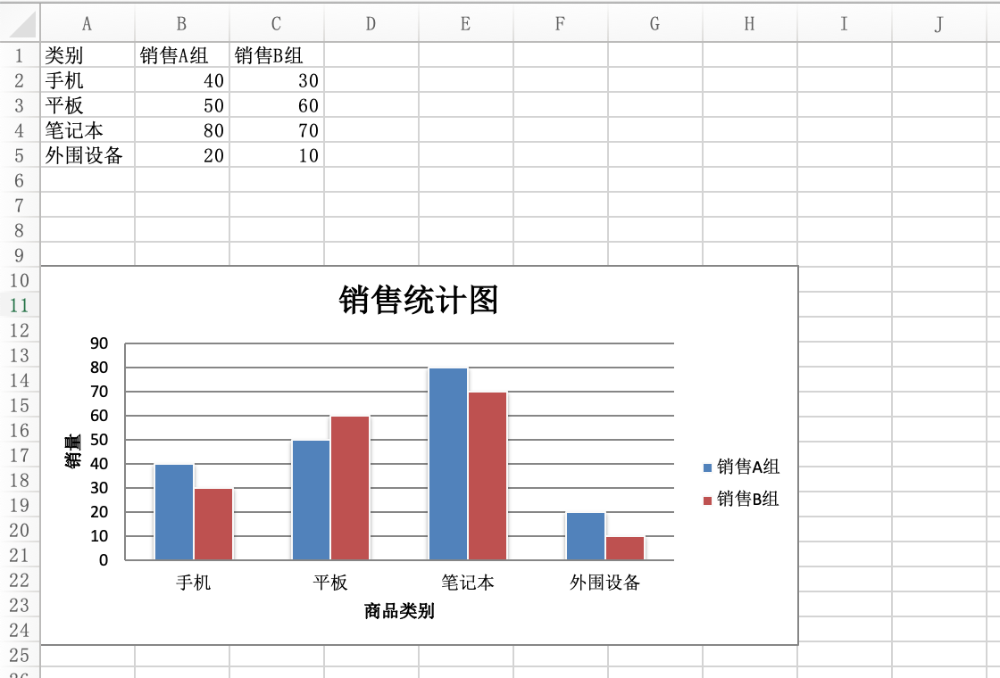

###  简单的总结

掌握了Python程序操作Excel的方法，可以解决日常办公中很多繁琐的处理Excel电子表格工作，最常见就是将多个数据格式相同的Excel文件合并到一个文件以及从多个Excel文件或表单中提取指定的数据。如果数据体量较大或者处理数据的方式比较复杂，我们还是推荐大家使用Python数据分析神器之一的`pandas`库。
## 第26课：用Python操作Word和PowerPoint

在日常工作中，有很多简单重复的劳动其实完全可以交给Python程序，比如根据样板文件（模板文件）批量的生成很多个Word文件或PowerPoint文件。Word是微软公司开发的文字处理程序，相信大家都不陌生，日常办公中很多正式的文档都是用Word进行撰写和编辑的，目前使用的Word文件后缀名一般为`.docx`。PowerPoint是微软公司开发的演示文稿程序，是微软的Office系列软件中的一员，被商业人士、教师、学生等群体广泛使用，通常也将其称之为“幻灯片”。在Python中，可以使用名为`python-docx` 的三方库来操作Word，可以使用名为`python-pptx`的三方库来生成PowerPoint。

### 操作Word文档

我们可以先通过下面的命令来安装`python-docx`三方库。

```bash
pip install python-docx
```

按照[官方文档](https://python-docx.readthedocs.io/en/latest/)的介绍，我们可以使用如下所示的代码来生成一个简单的Word文档。

```Python
from docx import Document
from docx.shared import Cm, Pt

from docx.document import Document as Doc

# 创建代表Word文档的Doc对象
document = Document()  # type: Doc
# 添加大标题
document.add_heading('快快乐乐学Python', 0)
# 添加段落
p = document.add_paragraph('Python是一门非常流行的编程语言，它')
run = p.add_run('简单')
run.bold = True
run.font.size = Pt(18)
p.add_run('而且')
run = p.add_run('优雅')
run.font.size = Pt(18)
run.underline = True
p.add_run('。')

# 添加一级标题
document.add_heading('Heading, level 1', level=1)
# 添加带样式的段落
document.add_paragraph('Intense quote', style='Intense Quote')
# 添加无序列表
document.add_paragraph(
    'first item in unordered list', style='List Bullet'
)
document.add_paragraph(
    'second item in ordered list', style='List Bullet'
)
# 添加有序列表
document.add_paragraph(
    'first item in ordered list', style='List Number'
)
document.add_paragraph(
    'second item in ordered list', style='List Number'
)

# 添加图片（注意路径和图片必须要存在）
document.add_picture('resources/guido.jpg', width=Cm(5.2))

# 添加分节符
document.add_section()

records = (
    ('骆昊', '男', '1995-5-5'),
    ('孙美丽', '女', '1992-2-2')
)
# 添加表格
table = document.add_table(rows=1, cols=3)
table.style = 'Dark List'
hdr_cells = table.rows[0].cells
hdr_cells[0].text = '姓名'
hdr_cells[1].text = '性别'
hdr_cells[2].text = '出生日期'
# 为表格添加行
for name, sex, birthday in records:
    row_cells = table.add_row().cells
    row_cells[0].text = name
    row_cells[1].text = sex
    row_cells[2].text = birthday

# 添加分页符
document.add_page_break()

# 保存文档
document.save('demo.docx')
```

> **提示**：上面代码第7行中的注释`# type: Doc`是为了在PyCharm中获得代码补全提示，因为如果不清楚对象具体的数据类型，PyCharm无法在后续代码中给出`Doc`对象的代码补全提示。

执行上面的代码，打开生成的Word文档，效果如下图所示。

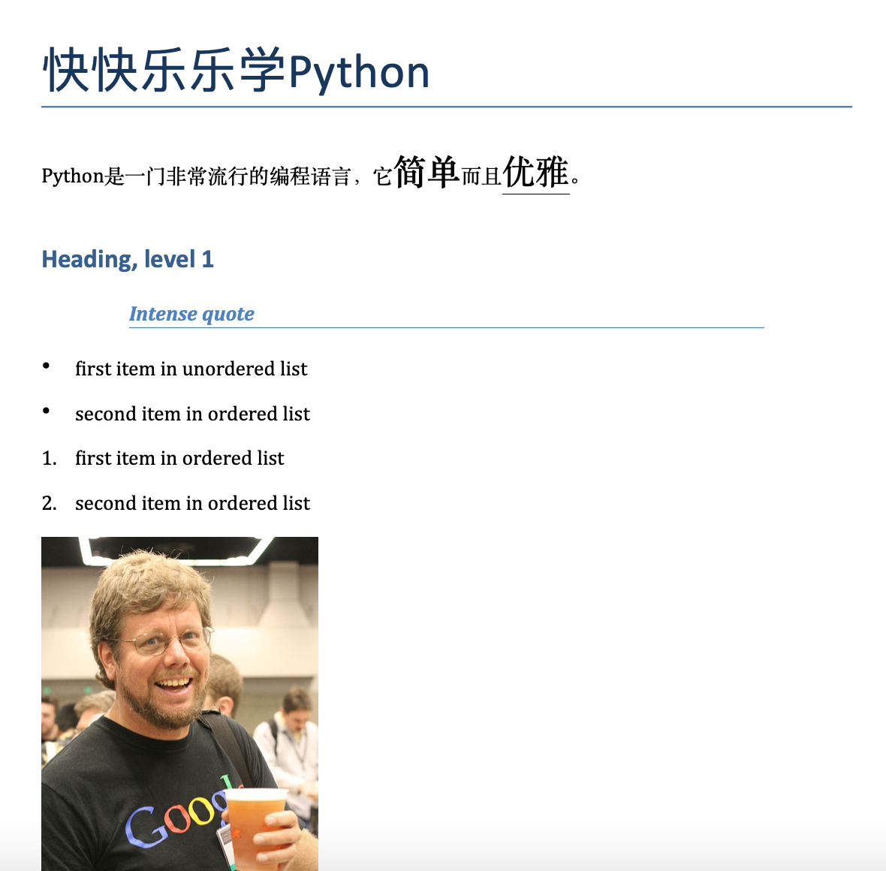&nbsp;&nbsp;

对于一个已经存在的Word文件，我们可以通过下面的代码去遍历它所有的段落并获取对应的内容。

```Python
from docx import Document
from docx.document import Document as Doc

doc = Document('resources/离职证明.docx')  # type: Doc
for no, p in enumerate(doc.paragraphs):
    print(no, p.text)
```

> **提示**：如果需要上面代码中的Word文件，可以通过下面的百度云盘地址进行获取。链接:https://pan.baidu.com/s/1rQujl5RQn9R7PadB2Z5g_g 提取码:e7b4。

读取到的内容如下所示。

```
0 
1 离 职 证 明
2 
3 兹证明 王大锤 ，身份证号码： 100200199512120001 ，于 2018 年 8 月 7 日至 2020 年 6 月 28 日在我单位  开发部 部门担任 Java开发工程师 职务，在职期间无不良表现。因 个人 原因，于 2020 年 6 月 28 日起终止解除劳动合同。现已结清财务相关费用，办理完解除劳动关系相关手续，双方不存在任何劳动争议。
4 
5 特此证明！
6 
7 
8 公司名称（盖章）:成都风车车科技有限公司
9    			2020 年 6 月 28 日
```

讲到这里，相信很多读者已经想到了，我们可以把上面的离职证明制作成一个模板文件，把姓名、身份证号、入职和离职日期等信息用占位符代替，这样通过对占位符的替换，就可以根据实际需要写入对应的信息，这样就可以批量的生成Word文档。

按照上面的思路，我们首先编辑一个离职证明的模板文件，如下图所示。

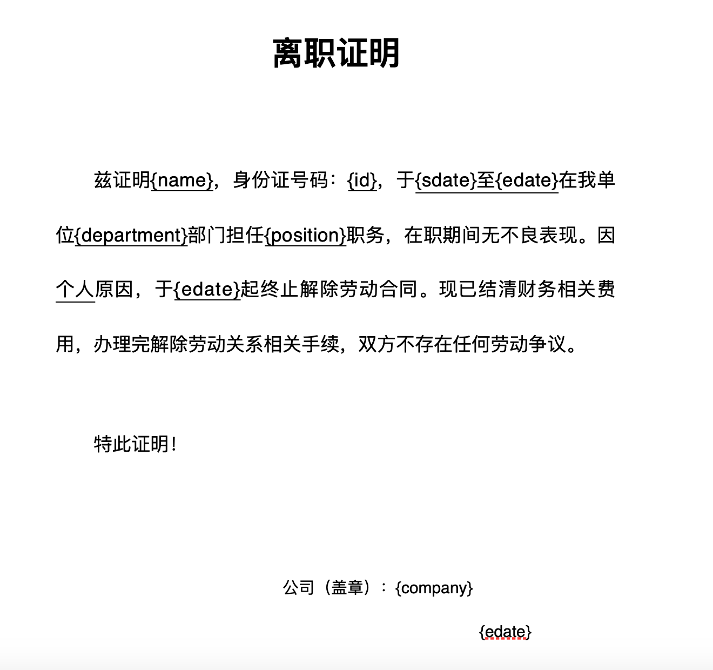

接下来我们读取该文件，将占位符替换为真实信息，就可以生成一个新的Word文档，如下所示。

```Python
from docx import Document
from docx.document import Document as Doc

# 将真实信息用字典的方式保存在列表中
employees = [
    {
        'name': '骆昊',
        'id': '100200198011280001',
        'sdate': '2008年3月1日',
        'edate': '2012年2月29日',
        'department': '产品研发',
        'position': '架构师',
        'company': '成都华为技术有限公司'
    },
    {
        'name': '王大锤',
        'id': '510210199012125566',
        'sdate': '2019年1月1日',
        'edate': '2021年4月30日',
        'department': '产品研发',
        'position': 'Python开发工程师',
        'company': '成都谷道科技有限公司'
    },
    {
        'name': '李元芳',
        'id': '2102101995103221599',
        'sdate': '2020年5月10日',
        'edate': '2021年3月5日',
        'department': '产品研发',
        'position': 'Java开发工程师',
        'company': '同城企业管理集团有限公司'
    },
]
# 对列表进行循环遍历，批量生成Word文档 
for emp_dict in employees:
    # 读取离职证明模板文件
    doc = Document('resources/离职证明模板.docx')  # type: Doc
    # 循环遍历所有段落寻找占位符
    for p in doc.paragraphs:
        if '{' not in p.text:
            continue
        # 不能直接修改段落内容，否则会丢失样式
        # 所以需要对段落中的元素进行遍历并进行查找替换
        for run in p.runs:
            if '{' not in run.text:
                continue
            # 将占位符换成实际内容
            start, end = run.text.find('{'), run.text.find('}')
            key, place_holder = run.text[start + 1:end], run.text[start:end + 1]
            run.text = run.text.replace(place_holder, emp_dict[key])
    # 每个人对应保存一个Word文档
    doc.save(f'{emp_dict["name"]}离职证明.docx')
```

执行上面的代码，会在当前路径下生成三个Word文档，如下图所示。


### 生成PowerPoint

首先我们需要安装名为`python-pptx`的三方库，命令如下所示。

```Bash
pip install python-pptx
```

用Python操作PowerPoint的内容，因为实际应用场景不算很多，我不打算在这里进行赘述，有兴趣的读者可以自行阅读`python-pptx`的[官方文档](https://python-pptx.readthedocs.io/en/latest/)，下面仅展示一段来自于官方文档的代码。

```Python
from pptx import Presentation

# 创建幻灯片对象
pres = Presentation()

# 选择母版添加一页
title_slide_layout = pres.slide_layouts[0]
slide = pres.slides.add_slide(title_slide_layout)
# 获取标题栏和副标题栏
title = slide.shapes.title
subtitle = slide.placeholders[1]
# 编辑标题和副标题
title.text = "Welcome to Python"
subtitle.text = "Life is short, I use Python"

# 选择母版添加一页
bullet_slide_layout = pres.slide_layouts[1]
slide = pres.slides.add_slide(bullet_slide_layout)
# 获取页面上所有形状
shapes = slide.shapes
# 获取标题和主体
title_shape = shapes.title
body_shape = shapes.placeholders[1]
# 编辑标题
title_shape.text = 'Introduction'
# 编辑主体内容
tf = body_shape.text_frame
tf.text = 'History of Python'
# 添加一个一级段落
p = tf.add_paragraph()
p.text = 'X\'max 1989'
p.level = 1
# 添加一个二级段落
p = tf.add_paragraph()
p.text = 'Guido began to write interpreter for Python.'
p.level = 2

# 保存幻灯片
pres.save('test.pptx')
```

运行上面的代码，生成的PowerPoint文件如下图所示。

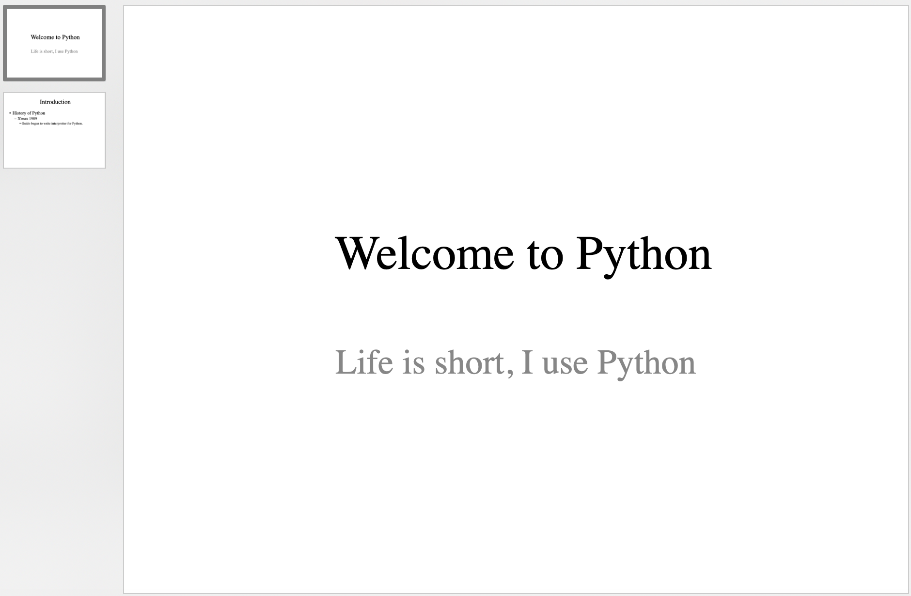

### 简单的总结

用Python程序解决办公自动化的问题真的非常酷，它可以将我们从繁琐乏味的劳动中解放出来。写这类代码就是去做一件一劳永逸的事情，写代码的过程即便不怎么愉快，使用这些代码的时候应该是非常开心的。
## 第27课：用Python操作PDF文件

PDF是Portable Document Format的缩写，这类文件通常使用`.pdf`作为其扩展名。在日常开发工作中，最容易遇到的就是从PDF中读取文本内容以及用已有的内容生成PDF文档这两个任务。

### 从PDF中提取文本

在Python中，可以使用名为`PyPDF2`的三方库来读取PDF文件，可以使用下面的命令来安装它。

```Bash
pip install PyPDF2
```

`PyPDF2`没有办法从PDF文档中提取图像、图表或其他媒体，但它可以提取文本，并将其返回为Python字符串。

```Python
import PyPDF2

reader = PyPDF2.PdfFileReader('test.pdf')
page = reader.getPage(0)
print(page.extractText())
```

> **提示**：上面代码中使用的PDF文件“test.pdf”以及下面的代码中需要用到的PDF文件，都可以通过后面的百度云盘地址进行获取。链接:https://pan.baidu.com/s/1rQujl5RQn9R7PadB2Z5g_g 提取码:e7b4。

当然，`PyPDF2`并不是什么样的PDF文档都能提取出文字来，这个问题就我所知并没有什么特别好的解决方法，尤其是在提取中文的时候。网上也有很多讲解从PDF中提取文字的文章，推荐大家自行阅读[《三大神器助力Python提取pdf文档信息》](https://cloud.tencent.com/developer/article/1395339)一文进行了解。

要从PDF文件中提取文本也可以直接使用三方的命令行工具，具体的做法如下所示。

```Bash
pip install pdfminer.six
pdf2text.py test.pdf
```

### 旋转和叠加页面

上面的代码中通过创建`PdfFileReader`对象的方式来读取PDF文档，该对象的`getPage`方法可以获得PDF文档的指定页并得到一个`PageObject`对象，通过`PageObject`对象的`rotateClockwise`和`rotateCounterClockwise`方法可以实现页面的顺时针和逆时针方向旋转，通过`PageObject`对象的`addBlankPage`方法可以添加一个新的空白页，代码如下所示。

```Python
import PyPDF2

from PyPDF2.pdf import PageObject

# 创建一个读PDF文件的Reader对象
reader = PyPDF2.PdfFileReader('resources/XGBoost.pdf')
# 创建一个写PDF文件的Writer对象
writer = PyPDF2.PdfFileWriter()
# 对PDF文件所有页进行循环遍历
for page_num in range(reader.numPages):
    # 获取指定页码的Page对象
    current_page = reader.getPage(page_num)  # type: PageObject
    if page_num % 2 == 0:
        # 奇数页顺时针旋转90度
        current_page.rotateClockwise(90)
    else:
        # 偶数页反时针旋转90度
        current_page.rotateCounterClockwise(90)
    writer.addPage(current_page)
# 最后添加一个空白页并旋转90度
page = writer.addBlankPage()  # type: PageObject
page.rotateClockwise(90)
# 通过Writer对象的write方法将PDF写入文件
with open('resources/XGBoost-modified.pdf', 'wb') as file:
    writer.write(file)
```

### 加密PDF文件

使用`PyPDF2`中的`PdfFileWrite`对象可以为PDF文档加密，如果需要给一系列的PDF文档设置统一的访问口令，使用Python程序来处理就会非常的方便。

```Python
import PyPDF2

reader = PyPDF2.PdfFileReader('resources/XGBoost.pdf')
writer = PyPDF2.PdfFileWriter()
for page_num in range(reader.numPages):
    writer.addPage(reader.getPage(page_num))
# 通过encrypt方法加密PDF文件，方法的参数就是设置的密码
writer.encrypt('foobared')
with open('resources/XGBoost-encrypted.pdf', 'wb') as file:
    writer.write(file)
```

### 批量添加水印

上面提到的`PageObject`对象还有一个名为`mergePage`的方法，可以两个PDF页面进行叠加，通过这个操作，我们很容易实现给PDF文件添加水印的功能。例如要给上面的“XGBoost.pdf”文件添加一个水印，我们可以先准备好一个提供水印页面的PDF文件，然后将包含水印的`PageObject`读取出来，然后再循环遍历“XGBoost.pdf”文件的每个页，获取到`PageObject`对象，然后通过`mergePage`方法实现水印页和原始页的合并，代码如下所示。

```Python
import PyPDF2

from PyPDF2.pdf import PageObject

reader1 = PyPDF2.PdfFileReader('resources/XGBoost.pdf')
reader2 = PyPDF2.PdfFileReader('resources/watermark.pdf')
writer = PyPDF2.PdfFileWriter()
# 获取水印页
watermark_page = reader2.getPage(0)
for page_num in range(reader1.numPages):
    current_page = reader1.getPage(page_num)  # type: PageObject
    current_page.mergePage(watermark_page)
    # 将原始页和水印页进行合并
    writer.addPage(current_page)
# 将PDF写入文件
with open('resources/XGBoost-watermarked.pdf', 'wb') as file:
    writer.write(file)
```

如果愿意，还可以让奇数页和偶数页使用不同的水印，大家可以自己思考下应该怎么做。

### 创建PDF文件

创建PDF文档需要三方库`reportlab`的支持，安装的方法如下所示。

```Bash
pip install reportlab
```

下面通过一个例子为大家展示`reportlab`的用法。

```Python
from reportlab.lib.pagesizes import A4
from reportlab.pdfbase import pdfmetrics
from reportlab.pdfbase.ttfonts import TTFont
from reportlab.pdfgen import canvas

pdf_canvas = canvas.Canvas('resources/demo.pdf', pagesize=A4)
width, height = A4

# 绘图
image = canvas.ImageReader('resources/guido.jpg')
pdf_canvas.drawImage(image, 20, height - 395, 250, 375)

# 显示当前页
pdf_canvas.showPage()

# 注册字体文件
pdfmetrics.registerFont(TTFont('Font1', 'resources/fonts/Vera.ttf'))
pdfmetrics.registerFont(TTFont('Font2', 'resources/fonts/青呱石头体.ttf'))

# 写字
pdf_canvas.setFont('Font2', 40)
pdf_canvas.setFillColorRGB(0.9, 0.5, 0.3, 1)
pdf_canvas.drawString(width // 2 - 120, height // 2, '你好，世界！')
pdf_canvas.setFont('Font1', 40)
pdf_canvas.setFillColorRGB(0, 1, 0, 0.5)
pdf_canvas.rotate(18)
pdf_canvas.drawString(250, 250, 'hello, world!')

# 保存
pdf_canvas.save()
```

上面的代码如果不太理解也没有关系，等真正需要用Python创建PDF文档的时候，再好好研读一下`reportlab`的[官方文档](https://www.reportlab.com/docs/reportlab-userguide.pdf)就可以了。

> **提示**：上面代码中用到的图片和字体，可以在后面的百度云盘链接中获取。链接:https://pan.baidu.com/s/1rQujl5RQn9R7PadB2Z5g_g 提取码:e7b4。

###  简单的总结

在学习完上面的内容之后，相信大家已经知道像合并多个PDF文件这样的工作应该如何用Python代码来处理了，赶紧自己动手试一试吧。
## 第28课：用Python处理图像

### 入门知识

1. 颜色。如果你有使用颜料画画的经历，那么一定知道混合红、黄、蓝三种颜料可以得到其他的颜色，事实上这三种颜色就是美术中的三原色，它们是不能再分解的基本颜色。在计算机中，我们可以将红、绿、蓝三种色光以不同的比例叠加来组合成其他的颜色，因此这三种颜色就是色光三原色。在计算机系统中，我们通常会将一个颜色表示为一个RGB值或RGBA值（其中的A表示Alpha通道，它决定了透过这个图像的像素，也就是透明度）。

   |    名称     |      RGB值      |     名称     |     RGB值     |
   | :---------: | :-------------: | :----------: | :-----------: |
   | White（白） | (255, 255, 255) |  Red（红）   |  (255, 0, 0)  |
   | Green（绿） |   (0, 255, 0)   |  Blue（蓝）  |  (0, 0, 255)  |
   | Gray（灰）  | (128, 128, 128) | Yellow（黄） | (255, 255, 0) |
   | Black（黑） |    (0, 0, 0)    | Purple（紫） | (128, 0, 128) |

2. 像素。对于一个由数字序列表示的图像来说，最小的单位就是图像上单一颜色的小方格，这些小方块都有一个明确的位置和被分配的色彩数值，而这些一小方格的颜色和位置决定了该图像最终呈现出来的样子，它们是不可分割的单位，我们通常称之为像素（pixel）。每一个图像都包含了一定量的像素，这些像素决定图像在屏幕上所呈现的大小，大家如果爱好拍照或者自拍，对像素这个词就不会陌生。

### 用Pillow处理图像

Pillow是由从著名的Python图像处理库PIL发展出来的一个分支，通过Pillow可以实现图像压缩和图像处理等各种操作。可以使用下面的命令来安装Pillow。

```Shell
pip install pillow
```

Pillow中最为重要的是`Image`类，可以通过`Image`模块的`open`函数来读取图像并获得`Image`类型的对象。

1. 读取和显示图像

   ```Python
   from PIL import Image
   
   # 读取图像获得Image对象
   image = Image.open('guido.jpg')
   # 通过Image对象的format属性获得图像的格式
   print(image.format) # JPEG
   # 通过Image对象的size属性获得图像的尺寸
   print(image.size)   # (500, 750)
   # 通过Image对象的mode属性获取图像的模式
   print(image.mode)   # RGB
   # 通过Image对象的show方法显示图像
   image.show()
   ```

   

2. 剪裁图像

   ```Python
   # 通过Image对象的crop方法指定剪裁区域剪裁图像
   image.crop((80, 20, 310, 360)).show()
   ```

   

3. 生成缩略图

   ```Python
   # 通过Image对象的thumbnail方法生成指定尺寸的缩略图
   image.thumbnail((128, 128))
   image.show()
   ```

   

4. 缩放和黏贴图像

   ```Python
   # 读取骆昊的照片获得Image对象
   luohao_image = Image.open('luohao.png')
   # 读取吉多的照片获得Image对象
   guido_image = Image.open('guido.jpg')
   # 从吉多的照片上剪裁出吉多的头
   guido_head = guido_image.crop((80, 20, 310, 360))
   width, height = guido_head.size
   # 使用Image对象的resize方法修改图像的尺寸
   # 使用Image对象的paste方法将吉多的头粘贴到骆昊的照片上
   luohao_image.paste(guido_head.resize((int(width / 1.5), int(height / 1.5))), (172, 40))
   luohao_image.show()
   ```

   

5. 旋转和翻转

   ```Python
   image = Image.open('guido.jpg')
   # 使用Image对象的rotate方法实现图像的旋转
   image.rotate(45).show()
   # 使用Image对象的transpose方法实现图像翻转
   # Image.FLIP_LEFT_RIGHT - 水平翻转
   # Image.FLIP_TOP_BOTTOM - 垂直翻转
   image.transpose(Image.FLIP_TOP_BOTTOM).show()
   ```

   

6. 操作像素

   ```Python
   for x in range(80, 310):
       for y in range(20, 360):
           # 通过Image对象的putpixel方法修改图像指定像素点
           image.putpixel((x, y), (128, 128, 128))
   image.show()
   ```

   

7. 滤镜效果

   ```Python
   from PIL import ImageFilter
   
   # 使用Image对象的filter方法对图像进行滤镜处理
   # ImageFilter模块包含了诸多预设的滤镜也可以自定义滤镜
   image.filter(ImageFilter.CONTOUR).show()
   ```

   

### 使用Pillow绘图

Pillow中有一个名为`ImageDraw`的模块，该模块的`Draw`函数会返回一个`ImageDraw`对象，通过`ImageDraw`对象的`arc`、`line`、`rectangle`、`ellipse`、`polygon`等方法，可以在图像上绘制出圆弧、线条、矩形、椭圆、多边形等形状，也可以通过该对象的`text`方法在图像上添加文字。

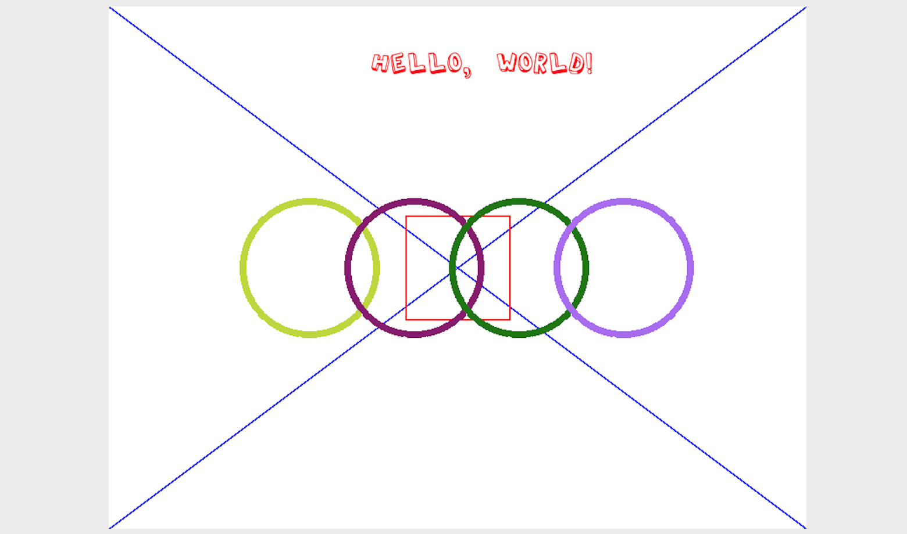

要绘制如上图所示的图像，完整的代码如下所示。

```Python
import random

from PIL import Image, ImageDraw, ImageFont


def random_color():
    """生成随机颜色"""
    red = random.randint(0, 255)
    green = random.randint(0, 255)
    blue = random.randint(0, 255)
    return red, green, blue


width, height = 800, 600
# 创建一个800*600的图像，背景色为白色
image = Image.new(mode='RGB', size=(width, height), color=(255, 255, 255))
# 创建一个ImageDraw对象
drawer = ImageDraw.Draw(image)
# 通过指定字体和大小获得ImageFont对象
font = ImageFont.truetype('Kongxin.ttf', 32)
# 通过ImageDraw对象的text方法绘制文字
drawer.text((300, 50), 'Hello, world!', fill=(255, 0, 0), font=font)
# 通过ImageDraw对象的line方法绘制两条对角直线
drawer.line((0, 0, width, height), fill=(0, 0, 255), width=2)
drawer.line((width, 0, 0, height), fill=(0, 0, 255), width=2)
xy = width // 2 - 60, height // 2 - 60, width // 2 + 60, height // 2 + 60
# 通过ImageDraw对象的rectangle方法绘制矩形
drawer.rectangle(xy, outline=(255, 0, 0), width=2)
# 通过ImageDraw对象的ellipse方法绘制椭圆
for i in range(4):
    left, top, right, bottom = 150 + i * 120, 220, 310 + i * 120, 380
    drawer.ellipse((left, top, right, bottom), outline=random_color(), width=8)
# 显示图像
image.show()
# 保存图像
image.save('result.png')
```

> **注意**：上面代码中使用的字体文件需要根据自己准备，可以选择自己喜欢的字体文件并放置在代码目录下。

###  简单的总结

使用Python语言做开发，除了可以用Pillow来处理图像外，还可以使用更为强大的OpenCV库来完成图形图像的处理，OpenCV（**Open** Source **C**omputer **V**ision Library）是一个跨平台的计算机视觉库，可以用来开发实时图像处理、计算机视觉和模式识别程序。在我们的日常工作中，有很多繁琐乏味的任务其实都可以通过Python程序来处理，编程的目的就是让计算机帮助我们解决问题，减少重复乏味的劳动。通过本章节的学习，相信大家已经感受到了使用Python程序绘图P图的乐趣，其实Python能做的事情还远不止这些，继续你的学习吧。
## 第29课：用Python发送邮件和短信

在前面的课程中，我们已经教会大家如何用Python程序自动的生成Excel、Word、PDF文档，接下来我们还可以更进一步，就是通过邮件将生成好的文档发送给指定的收件人，然后用短信告知对方我们发出了邮件。这些事情利用Python程序也可以轻松愉快的解决。

### 发送电子邮件

在即时通信软件如此发达的今天，电子邮件仍然是互联网上使用最为广泛的应用之一，公司向应聘者发出录用通知、网站向用户发送一个激活账号的链接、银行向客户推广它们的理财产品等几乎都是通过电子邮件来完成的，而这些任务应该都是由程序自动完成的。

我们可以用HTTP（超文本传输协议）来访问网站资源，HTTP是一个应用级协议，它建立在TCP（传输控制协议）之上，TCP为很多应用级协议提供了可靠的数据传输服务。如果要发送电子邮件，需要使用SMTP（简单邮件传输协议），它也是建立在TCP之上的应用级协议，规定了邮件的发送者如何跟邮件服务器进行通信的细节。Python通过名为`smtplib`的模块将这些操作简化成了`SMTP_SSL`对象，通过该对象的`login`和`send_mail`方法，就能够完成发送邮件的操作。

我们先尝试一下发送一封极为简单的邮件，该邮件不包含附件、图片以及其他超文本内容。发送邮件首先需要接入邮件服务器，我们可以自己架设邮件服务器，这件事情对新手并不友好，但是我们可以选择使用第三方提供的邮件服务。例如，我在<www.126.com>已经注册了账号，登录成功之后，就可以在设置中开启SMTP服务，这样就相当于获得了邮件服务器，具体的操作如下所示。


用手机扫码上面的二维码可以通过发送短信的方式来获取授权码，短信发送成功后，点击“我已发送”就可以获得授权码。授权码需要妥善保管，因为一旦泄露就会被其他人冒用你的身份来发送邮件。接下来，我们就可以编写发送邮件的代码了，如下所示。

```Python
import smtplib
from email.header import Header
from email.mime.multipart import MIMEMultipart
from email.mime.text import MIMEText

# 创建邮件主体对象
email = MIMEMultipart()
# 设置发件人、收件人和主题
email['From'] = 'xxxxxxxxx@126.com'
email['To'] = 'yyyyyy@qq.com;zzzzzz@1000phone.com'
email['Subject'] = Header('上半年工作情况汇报', 'utf-8')
# 添加邮件正文内容
content = """据德国媒体报道，当地时间9日，德国火车司机工会成员进行了投票，
定于当地时间10日起进行全国性罢工，货运交通方面的罢工已于当地时间10日19时开始。
此后，从11日凌晨2时到13日凌晨2时，德国全国范围内的客运和铁路基础设施将进行48小时的罢工。"""

# 创建SMTP_SSL对象（连接邮件服务器）
smtp_obj = smtplib.SMTP_SSL('smtp.126.com', 465)
# 通过用户名和授权码进行登录
smtp_obj.login('xxxxxxxxx@126.com', '邮件服务器的授权码')
# 发送邮件（发件人、收件人、邮件内容（字符串））
smtp_obj.sendmail(
    'xxxxxxxxx@126.com',
    ['yyyyyy@qq.com', 'zzzzzz@1000phone.com'],
    email.as_string()
)
```

如果要发送带有附件的邮件，只需要将附件的内容处理成BASE64编码，那么它就和普通的文本内容几乎没有什么区别。BASE64是一种基于64个可打印字符来表示二进制数据的表示方法，常用于某些需要表示、传输、存储二进制数据的场合，电子邮件就是其中之一。对这种编码方式不理解的同学，推荐阅读[《Base64笔记》](http://www.ruanyifeng.com/blog/2008/06/base64.html)一文。在之前的内容中，我们也提到过，Python标准库的`base64`模块提供了对BASE64编解码的支持。

下面的代码演示了如何发送带附件的邮件。

```Python
import smtplib
from email.header import Header
from email.mime.multipart import MIMEMultipart
from email.mime.text import MIMEText
from urllib.parse import quote

# 创建邮件主体对象
email = MIMEMultipart()
# 设置发件人、收件人和主题
email['From'] = 'xxxxxxxxx@126.com'
email['To'] = 'zzzzzzzz@1000phone.com'
email['Subject'] = Header('请查收离职证明文件', 'utf-8')
# 添加邮件正文内容（带HTML标签排版的内容）
content = """<p>亲爱的前同事：</p>
<p>你需要的离职证明在附件中，请查收！</p>
<br>
<p>祝，好！</p>
<hr>
<p>孙美丽 即日</p>"""
email.attach(MIMEText(content, 'html', 'utf-8'))
# 读取作为附件的文件
with open(f'resources/王大锤离职证明.docx', 'rb') as file:
    attachment = MIMEText(file.read(), 'base64', 'utf-8')
    # 指定内容类型
    attachment['content-type'] = 'application/octet-stream'
    # 将中文文件名处理成百分号编码
    filename = quote('王大锤离职证明.docx')
    # 指定如何处置内容
    attachment['content-disposition'] = f'attachment; filename="{filename}"'

# 创建SMTP_SSL对象（连接邮件服务器）
smtp_obj = smtplib.SMTP_SSL('smtp.126.com', 465)
# 通过用户名和授权码进行登录
smtp_obj.login('xxxxxxxxx@126.com', '邮件服务器的授权码')
# 发送邮件（发件人、收件人、邮件内容（字符串））
smtp_obj.sendmail(
    'xxxxxxxxx@126.com',
    'zzzzzzzz@1000phone.com',
    email.as_string()
)
```

为了方便大家用Python实现邮件发送，我将上面的代码封装成了函数，使用的时候大家只需要调整邮件服务器域名、端口、用户名和授权码就可以了。

```Python
import smtplib
from email.header import Header
from email.mime.multipart import MIMEMultipart
from email.mime.text import MIMEText
from urllib.parse import quote

# 邮件服务器域名（自行修改）
EMAIL_HOST = 'smtp.126.com'
# 邮件服务端口（通常是465）
EMAIL_PORT = 465
# 登录邮件服务器的账号（自行修改）
EMAIL_USER = 'xxxxxxxxx@126.com'
# 开通SMTP服务的授权码（自行修改）
EMAIL_AUTH = '邮件服务器的授权码'


def send_email(*, from_user, to_users, subject='', content='', filenames=[]):
    """发送邮件
    
    :param from_user: 发件人
    :param to_users: 收件人，多个收件人用英文分号进行分隔
    :param subject: 邮件的主题
    :param content: 邮件正文内容
    :param filenames: 附件要发送的文件路径
    """
    email = MIMEMultipart()
    email['From'] = from_user
    email['To'] = to_users
    email['Subject'] = subject

    message = MIMEText(content, 'plain', 'utf-8')
    email.attach(message)
    for filename in filenames:
        with open(filename, 'rb') as file:
            pos = filename.rfind('/')
            display_filename = filename[pos + 1:] if pos >= 0 else filename
            display_filename = quote(display_filename)
            attachment = MIMEText(file.read(), 'base64', 'utf-8')
            attachment['content-type'] = 'application/octet-stream'
            attachment['content-disposition'] = f'attachment; filename="{display_filename}"'
            email.attach(attachment)

    smtp = smtplib.SMTP_SSL(EMAIL_HOST, EMAIL_PORT)
    smtp.login(EMAIL_USER, EMAIL_AUTH)
    smtp.sendmail(from_user, to_users, email.as_string())
```

### 发送短信

发送短信也是项目中常见的功能，网站的注册码、验证码、营销信息基本上都是通过短信来发送给用户的。发送短信需要三方平台的支持，下面我们以[螺丝帽平台](https://luosimao.com/)为例，为大家介绍如何用Python程序发送短信。注册账号和购买短信服务的细节我们不在这里进行赘述，大家可以咨询平台的客服。

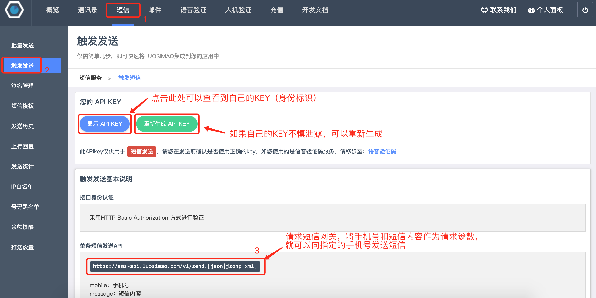

接下来，我们可以通过`requests`库向平台提供的短信网关发起一个HTTP请求，通过将接收短信的手机号和短信内容作为参数，就可以发送短信，代码如下所示。

```Python
import random

import requests


def send_message_by_luosimao(tel, message):
    """发送短信（调用螺丝帽短信网关）"""
    resp = requests.post(
        url='http://sms-api.luosimao.com/v1/send.json',
        auth=('api', 'key-注册成功后平台分配的KEY'),
        data={
            'mobile': tel,
            'message': message
        },
        timeout=10,
        verify=False
    )
    return resp.json()


def gen_mobile_code(length=6):
    """生成指定长度的手机验证码"""
    return ''.join(random.choices('0123456789', k=length))


def main():
    code = gen_mobile_code()
    message = f'您的短信验证码是{code}，打死也不能告诉别人哟！【Python小课】'
    print(send_message_by_luosimao('13500112233', message))


if __name__ == '__main__':
    main()
```

上面请求螺丝帽的短信网关`http://sms-api.luosimao.com/v1/send.json`会返回JSON格式的数据，如果返回`{'error': 0, 'msg': 'OK'}`就说明短信已经发送成功了，如果`error`的值不是`0`，可以通过查看官方的[开发文档](https://luosimao.com/docs/api/)了解到底哪个环节出了问题。螺丝帽平台常见的错误类型如下图所示。

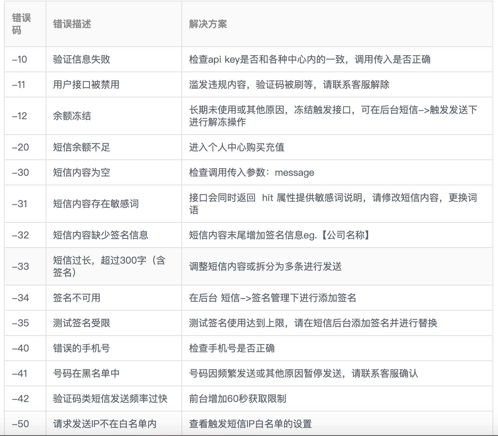

目前，大多数短信平台都会要求短信内容必须附上签名，下图是我在螺丝帽平台配置的短信签名“【Python小课】”。有些涉及到敏感内容的短信，还需要提前配置短信模板，有兴趣的读者可以自行研究。一般情况下，平台为了防范短信被盗用，还会要求设置“IP白名单”，不清楚如何配置的可以咨询平台客服。

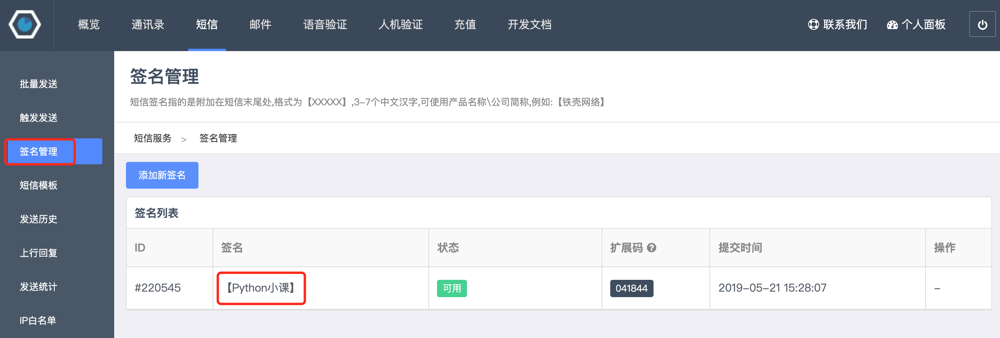

当然国内的短信平台很多，读者可以根据自己的需要进行选择（通常会考虑费用预算、短信达到率、使用的难易程度等指标），如果需要在商业项目中使用短信服务建议购买短信平台提供的套餐服务。

### 简单的总结

其实，发送邮件和发送短信一样，也可以通过调用三方服务来完成，在实际的商业项目中，建议自己架设邮件服务器或购买三方服务来发送邮件，这个才是比较靠谱的选择。
## 第30课：正则表达式的应用

### 正则表达式相关知识

在编写处理字符串的程时，经常会遇到在一段文本中查找符合某些规则的字符串的需求，正则表达式就是用于描述这些规则的工具，换句话说，我们可以使用正则表达式来定义字符串的匹配模式，即如何检查一个字符串是否有跟某种模式匹配的部分或者从一个字符串中将与模式匹配的部分提取出来或者替换掉。

举一个简单的例子，如果你在Windows操作系统中使用过文件查找并且在指定文件名时使用过通配符（`*`和`?`），那么正则表达式也是与之类似的用 来进行文本匹配的工具，只不过比起通配符正则表达式更强大，它能更精确地描述你的需求，当然你付出的代价是书写一个正则表达式比使用通配符要复杂得多，因为任何给你带来好处的东西都需要你付出对应的代价。

再举一个例子，我们从某个地方（可能是一个文本文件，也可能是网络上的一则新闻）获得了一个字符串，希望在字符串中找出手机号和座机号。当然我们可以设定手机号是11位的数字（注意并不是随机的11位数字，因为你没有见过“25012345678”这样的手机号），而座机号则是类似于“区号-号码”这样的模式，如果不使用正则表达式要完成这个任务就会比较麻烦。最初计算机是为了做数学运算而诞生的，处理的信息基本上都是数值，而今天我们在日常工作中处理的信息很多都是文本数据，我们希望计算机能够识别和处理符合某些模式的文本，正则表达式就显得非常重要了。今天几乎所有的编程语言都提供了对正则表达式操作的支持，Python通过标准库中的`re`模块来支持正则表达式操作。

关于正则表达式的相关知识，大家可以阅读一篇非常有名的博文叫[《正则表达式30分钟入门教程》](https://deerchao.net/tutorials/regex/regex.htm)，读完这篇文章后你就可以看懂下面的表格，这是我们对正则表达式中的一些基本符号进行的扼要总结。

| 符号           | 解释                             | 示例               | 说明                                                         |
| -------------- | -------------------------------- | ------------------ | ------------------------------------------------------------ |
| `.`            | 匹配任意字符                     | `b.t`              | 可以匹配bat / but / b#t / b1t等                              |
| `\w`           | 匹配字母/数字/下划线             | `b\wt`             | 可以匹配bat / b1t / b_t等<br>但不能匹配b#t                   |
| `\s`           | 匹配空白字符（包括\r、\n、\t等） | `love\syou`        | 可以匹配love you                                             |
| `\d`           | 匹配数字                         | `\d\d`             | 可以匹配01 / 23 / 99等                                       |
| `\b`           | 匹配单词的边界                   | `\bThe\b`          |                                                              |
| `^`            | 匹配字符串的开始                 | `^The`             | 可以匹配The开头的字符串                                      |
| `$`            | 匹配字符串的结束                 | `.exe$`            | 可以匹配.exe结尾的字符串                                     |
| `\W`           | 匹配非字母/数字/下划线           | `b\Wt`             | 可以匹配b#t / b@t等<br>但不能匹配but / b1t / b_t等           |
| `\S`           | 匹配非空白字符                   | `love\Syou`        | 可以匹配love#you等<br>但不能匹配love you                     |
| `\D`           | 匹配非数字                       | `\d\D`             | 可以匹配9a / 3# / 0F等                                       |
| `\B`           | 匹配非单词边界                   | `\Bio\B`           |                                                              |
| `[]`           | 匹配来自字符集的任意单一字符     | `[aeiou]`          | 可以匹配任一元音字母字符                                     |
| `[^]`          | 匹配不在字符集中的任意单一字符   | `[^aeiou]`         | 可以匹配任一非元音字母字符                                   |
| `*`            | 匹配0次或多次                    | `\w*`              |                                                              |
| `+`            | 匹配1次或多次                    | `\w+`              |                                                              |
| `?`            | 匹配0次或1次                     | `\w?`              |                                                              |
| `{N}`          | 匹配N次                          | `\w{3}`            |                                                              |
| `{M,}`         | 匹配至少M次                      | `\w{3,}`           |                                                              |
| `{M,N}`        | 匹配至少M次至多N次               | `\w{3,6}`          |                                                              |
| `|`            | 分支                             | `foo|bar`          | 可以匹配foo或者bar                                           |
| `(?#)`         | 注释                             |                    |                                                              |
| `(exp)`        | 匹配exp并捕获到自动命名的组中    |                    |                                                              |
| `(?<name>exp)` | 匹配exp并捕获到名为name的组中    |                    |                                                              |
| `(?:exp)`      | 匹配exp但是不捕获匹配的文本      |                    |                                                              |
| `(?=exp)`      | 匹配exp前面的位置                | `\b\w+(?=ing)`     | 可以匹配I'm dancing中的danc                                  |
| `(?<=exp)`     | 匹配exp后面的位置                | `(?<=\bdanc)\w+\b` | 可以匹配I love dancing and reading中的第一个ing              |
| `(?!exp)`      | 匹配后面不是exp的位置            |                    |                                                              |
| `(?<!exp)`     | 匹配前面不是exp的位置            |                    |                                                              |
| `*?`           | 重复任意次，但尽可能少重复       | `a.*b`<br>`a.*?b`  | 将正则表达式应用于aabab，前者会匹配整个字符串aabab，后者会匹配aab和ab两个字符串 |
| `+?`           | 重复1次或多次，但尽可能少重复    |                    |                                                              |
| `??`           | 重复0次或1次，但尽可能少重复     |                    |                                                              |
| `{M,N}?`       | 重复M到N次，但尽可能少重复       |                    |                                                              |
| `{M,}?`        | 重复M次以上，但尽可能少重复      |                    |                                                              |

> **说明：** 如果需要匹配的字符是正则表达式中的特殊字符，那么可以使用`\`进行转义处理，例如想匹配小数点可以写成`\.`就可以了，因为直接写`.`会匹配任意字符；同理，想匹配圆括号必须写成`\(`和`\)`，否则圆括号被视为正则表达式中的分组。

### Python对正则表达式的支持

Python提供了`re`模块来支持正则表达式相关操作，下面是`re`模块中的核心函数。

| 函数                                           | 说明                                                         |
| ---------------------------------------------- | ------------------------------------------------------------ |
| `compile(pattern, flags=0)`                    | 编译正则表达式返回正则表达式对象                             |
| `match(pattern, string, flags=0)`              | 用正则表达式匹配字符串 成功返回匹配对象 否则返回`None`       |
| `search(pattern, string, flags=0)`             | 搜索字符串中第一次出现正则表达式的模式 成功返回匹配对象 否则返回`None` |
| `split(pattern, string, maxsplit=0, flags=0)`  | 用正则表达式指定的模式分隔符拆分字符串 返回列表              |
| `sub(pattern, repl, string, count=0, flags=0)` | 用指定的字符串替换原字符串中与正则表达式匹配的模式 可以用`count`指定替换的次数 |
| `fullmatch(pattern, string, flags=0)`          | `match`函数的完全匹配（从字符串开头到结尾）版本              |
| `findall(pattern, string, flags=0)`            | 查找字符串所有与正则表达式匹配的模式 返回字符串的列表        |
| `finditer(pattern, string, flags=0)`           | 查找字符串所有与正则表达式匹配的模式 返回一个迭代器          |
| `purge()`                                      | 清除隐式编译的正则表达式的缓存                               |
| `re.I` / `re.IGNORECASE`                       | 忽略大小写匹配标记                                           |
| `re.M` / `re.MULTILINE`                        | 多行匹配标记                                                 |

> **说明：** 上面提到的`re`模块中的这些函数，实际开发中也可以用正则表达式对象（`Pattern`对象）的方法替代对这些函数的使用，如果一个正则表达式需要重复的使用，那么先通过`compile`函数编译正则表达式并创建出正则表达式对象无疑是更为明智的选择。

下面我们通过一系列的例子来告诉大家在Python中如何使用正则表达式。

#### 例子1：验证输入用户名和QQ号是否有效并给出对应的提示信息。

```Python
"""
要求：用户名必须由字母、数字或下划线构成且长度在6~20个字符之间，QQ号是5~12的数字且首位不能为0
"""
import re

username = input('请输入用户名: ')
qq = input('请输入QQ号: ')
# match函数的第一个参数是正则表达式字符串或正则表达式对象
# match函数的第二个参数是要跟正则表达式做匹配的字符串对象
m1 = re.match(r'^[0-9a-zA-Z_]{6,20}$', username)
if not m1:
    print('请输入有效的用户名.')
# fullmatch函数要求字符串和正则表达式完全匹配
# 所以正则表达式没有写起始符和结束符
m2 = re.fullmatch(r'[1-9]\d{4,11}', qq)
if not m2:
    print('请输入有效的QQ号.')
if m1 and m2:
    print('你输入的信息是有效的!')
```

> **提示：** 上面在书写正则表达式时使用了“原始字符串”的写法（在字符串前面加上了`r`），所谓“原始字符串”就是字符串中的每个字符都是它原始的意义，说得更直接一点就是字符串中没有所谓的转义字符啦。因为正则表达式中有很多元字符和需要进行转义的地方，如果不使用原始字符串就需要将反斜杠写作`\\`，例如表示数字的`\d`得书写成`\\d`，这样不仅写起来不方便，阅读的时候也会很吃力。

#### 例子2：从一段文字中提取出国内手机号码。

下面这张图是截止到2017年底，国内三家运营商推出的手机号段。


```Python
import re

# 创建正则表达式对象，使用了前瞻和回顾来保证手机号前后不应该再出现数字
pattern = re.compile(r'(?<=\D)1[34578]\d{9}(?=\D)')
sentence = '''重要的事情说8130123456789遍，我的手机号是13512346789这个靓号，
不是15600998765，也是110或119，王大锤的手机号才是15600998765。'''
# 方法一：查找所有匹配并保存到一个列表中
tels_list = re.findall(pattern, sentence)
for tel in tels_list:
    print(tel)
print('--------华丽的分隔线--------')

# 方法二：通过迭代器取出匹配对象并获得匹配的内容
for temp in pattern.finditer(sentence):
    print(temp.group())
print('--------华丽的分隔线--------')

# 方法三：通过search函数指定搜索位置找出所有匹配
m = pattern.search(sentence)
while m:
    print(m.group())
    m = pattern.search(sentence, m.end())
```

> **说明：** 上面匹配国内手机号的正则表达式并不够好，因为像14开头的号码只有145或147，而上面的正则表达式并没有考虑这种情况，要匹配国内手机号，更好的正则表达式的写法是：`(?<=\D)(1[38]\d{9}|14[57]\d{8}|15[0-35-9]\d{8}|17[678]\d{8})(?=\D)`，国内好像已经有19和16开头的手机号了，但是这个暂时不在我们考虑之列。

#### 例子3：替换字符串中的不良内容

```Python
import re

sentence = 'Oh, shit! 你是傻逼吗? Fuck you.'
purified = re.sub('fuck|shit|[傻煞沙][比笔逼叉缺吊碉雕]',
                  '*', sentence, flags=re.IGNORECASE)
print(purified)  # Oh, *! 你是*吗? * you.
```

> **说明：**` re`模块的正则表达式相关函数中都有一个`flags`参数，它代表了正则表达式的匹配标记，可以通过该标记来指定匹配时是否忽略大小写、是否进行多行匹配、是否显示调试信息等。如果需要为flags参数指定多个值，可以使用[按位或运算符](http://www.runoob.com/python/python-operators.html#ysf5)进行叠加，如`flags=re.I | re.M`。

#### 例子4：拆分长字符串

```Python
import re

poem = '窗前明月光，疑是地上霜。举头望明月，低头思故乡。'
sentences_list = re.split(r'[，。]', poem)
sentences_list = [sentence for sentence in sentences_list if sentence]
for sentence in sentences_list:
    print(sentence)
```

###  简单的总结

正则表达式在字符串的处理和匹配上真的非常强大，通过上面的例子相信大家已经感受到了正则表达式的魅力，当然写一个正则表达式对新手来说并不是那么容易，但是很多事情都是熟能生巧，大胆的去尝试就行了，有一个在线的[正则表达式测试工具](https://c.runoob.com/front-end/854)相信能够在一定程度上帮到大家。
