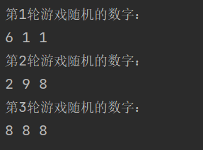
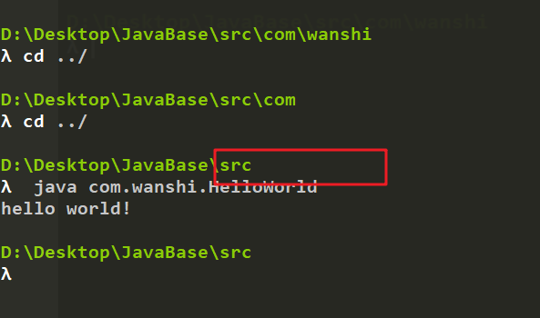
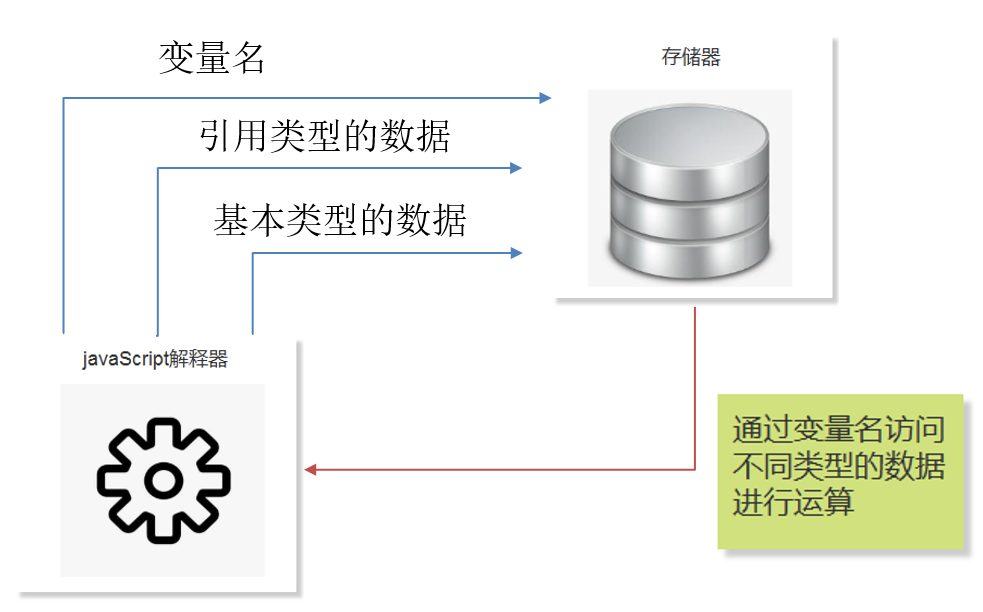
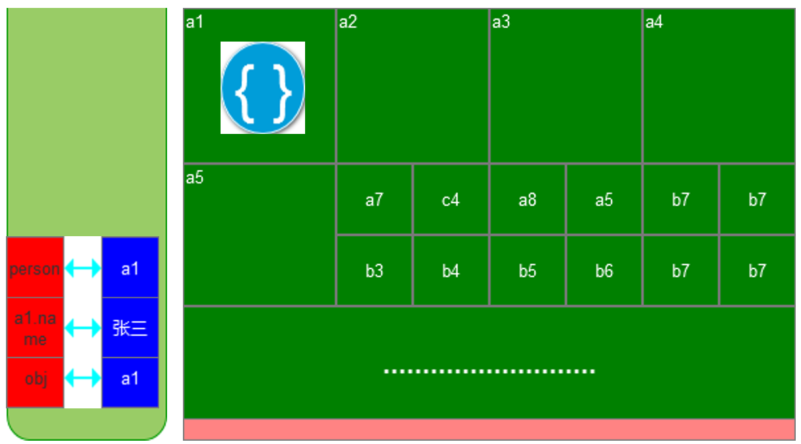

# 第一门课程：java语言基础

课程目标：

1. 学会搭建java开发环境，并理解java运行机制
2. 理解java语言的基本语法规则
3. 训练基本的程序编写思维和能力

# 1、第1单元-java基础

## java开发平台和专业术语

在学习java之前，我们对java中的一些相关概念应该有一定的了解。比如我们经常听人说`JAVA EE、JAVA SE、JAVA ME、JVM、JDK` 等等之类的，那么他们分别都是什么意思呢？接下来我们一一进行解答

首先 `JAVA EE、JAVA SE、JAVA ME` 表示把java语言运行于不同的环境（平台）中，因为这些不同的环境可以给java提供不同的特殊能力，也决定了把java置于不同的环境中的开发方向。

> 请注意，无论是在哪种环境中，所使用的java语法和规则都是一样的。只是不同的环境中提供了不同的接口。

### java开发平台介绍

`JAVA SE`全称为`java standard edition`是java的平台标准版，主要编写桌面应用程序。

`JAVA EE`全称为`java enterprise edition`是java的平台企业版，用于构建企业级应用。所谓企业级应用是指那些为商业组织、大型企业而创建的应用系统，例如：电信的“计费系统”、银行的“网银系统”、企业中的“客户关系管理系统”等等。该类程序一般运行于服务器。

`JAVA ME`全称为`java micro edition`是java的平台微型版，不过 随着Android智能平台的迅速普及，`java me`已经走向淘汰

### java专业术语

那么接下来我们在谈谈`jdk jre jvm`等等相关概念。

`jdk`全称为`java development kit`,翻译成中文就是**java开发工具包**，即我们使用java进行开发的时候需要的各种工具。例如：编译java源码的工具，运行java程序的工具，检查java代码是否有误的工具，打包java源码的工具，开发的时候需要的基本类库等等。

`jre`全称为`java runtime enviroment`,翻译成中文就是**java运行时环境**，保证java程序运行的时候所需要的所有必要的条件，其实`jre`包含在`jdk`中。

`jvm`全称为`java virtual machine`,翻译成中文就是**java虚拟机**,让java程序可以在计算机中运行，其实`jvm`包含在`jre`中

## java开发环境

我们对`java`的环境和一些专业术语有了一定的了解之后，你肯定向小试牛刀一番。尝试去运行一端java程序，哪怕是最简单的程序（打印hello world）也好。

那么如上所讲，我们想要运行java程序，除了要写出该程序的源代码之外，我们还需要配置java环境，以便于我们能够运行我们的程序。那么在配置java环境的过程中，上述提到的专业术语也都会出现，如果大家对刚才提到过的专业术语还不是足够清晰的话，可以在配置java环境的时候再去思考理解一番。相信你会有不同的收获。

### 下载

点击[jdk下载](https://www.oracle.com/java/technologies/javase/javase7-archive-downloads.html)进入下载页面。选择合适的版本开始进行下载，成功后安装包如下：


### 安装

双击该安装包进行安装（注意：安装路径不能有中文、特殊字符）

选择合适的安装目录


继续安装`jre`


### 验证

最后我们验证一下是否安装成功，要进行验证的话，大家要先了解一个小的知识点。那就是当我们把`jdk`安装好之后，此时我们的计算机上就拥有了很多java相关的命令（命令可以再命令行中运行）。比如`java`命令可以运行java字节码文件，再比如`javac`命令可以编译java源码。当然还有很多其他的命令，在以后的学习中我们会逐渐的掌握。

所以，所谓的验证其实就是看相关的java命令是否可以执行成功。那么没有计算机基础的同学这里可能会有一个疑问就是，**什么是命令行**？那么在这里我给的建议就是，先不要深究什么是命令行，什么是命令，它们有什么用等等这一类问题，相信我，如果你没有计算机基础的话，还不断的在深究这个问题，势必会深陷泥潭。那么正确的做法就是，学会如何打开命令行，并执行命令即可。在以后的学习中，命令行会使用的很频繁，你也会慢慢的成为高手，到时候你自然明白命令行的意义了。

#### 打开命令行

**那么如何打开命令行呢？**

以`windows`系统为例，我们按下  `win + r`键，会出现与如下界面，并输入cmd，按回车。


然后出现如下界面（是的，这个黑乎乎的东西就是命令行也叫cmd)


> 命令行的用法也非常简单，就是输入命令并按回车执行命令即可。当然，前提是你掌握了足够过的命令

好了，我们现在言归正传，开始验证下我们的`jdk`是否安装成功。前边提到过，此时我们应该有两个命令`java`和`javac`命令是可以使用的。那么我们在命令行中输入`javac.exe`,看看有什么效果。

不出意外的话，我们会看到如下的界面


这是什么原因呢？是不是我们没有配置成功？明明刚才安装的时候也没报错啊！先不要慌，我来给大家解释一下！并不是我们配置环境出问题了，这里有一个关于环境变量的问题。同样没有计算机基础的朋友们，大家也不要急着深究，跟着步骤学会如何配置环境变量即可。**相信我，后边你会慢慢的掌握这些计算机基础知识！**

#### 配置环境变量

接下来我们配置一下java的环境变量。

打开高级系统设置 -> 环境变量->Path  然后点击新建，添加我们安装的`jdk`和`jre`的目录路径（注意两个目录都是到bin目录结束），你猜猜为什么要到bin目录结束，感兴趣的朋友可以打开目录去看看。


这个时候，我们再次在命令行中输入`javac.exe`命令（注意，配置完环境变量之后，要把命令行重新启动一下）

如果出现如下界面，恭喜你，环境变量配置成功，接下来可以愉快的编写java程序了。


## 第一个java程序

相信各位朋友们已经迫不及待的要尝试编写一段java程序了运行它了。那么，现在我们就开始编写一段java程序。

1. 首先创建一个记事本,应该默认的文件名称为`新建文本文档.txt`，我们将其改名为`HelloWorld.java`。**（注意：java文件的名称首字母要大写，且保持驼峰命名的风格，什么是驼峰命名？问问老师或者百度百度）**

   

2. 以记事本的方式打开该java文件，并编写如下代码：

   ```java
   public class HelloWorld {
     public static void main(String[] args){
       System.out.println("hello world!");
     }
   }
   ```

   这样一段简单的程序就写好了，该程序的作用就是在命令行中打印 `hello world!`。我知道此时的你肯定不太明白都写了个啥。但是聪明的你应该能够知道，如果我想要在命令行打印 `世界，你好`的话，应该去修改哪里。这样就够了，我们在这里就看看程序正确运行。那么要完全掌握这段代码，需要后边去学java的语法以及相关语言规则。然后，才可以随心所欲的编写各种程序。接下来，还没结束我们需要看到这段程序的执行效果，还编译该文件，并运行编译后得到的字节码文件进行。

3. 编译-所谓编译就是把java源代码转换成计算机可以识别的字节码文件（二进制的）

   使用 `javac 源代码文件路径` 即可进行编译

   ```cmd
   javac HelloWorld.java
   ```

   > 上述命令毫无疑问也是在命令行中执行的，但是要注意一点就是打开命令行所在的工作目录和应该和该java源代码文件在所在目录相同。有的朋友又要问了，这句话有点长，看的有点晕。那就对了，去问问你的老师，他会给你解释的很清楚的。搞技术就是要不停的提出问题，解决问题，才能进步。

   此时，在和java源代码的同级目录下，你应该看到了一个被编译好的字节码文件`HelloWorld.class`,这是一个二进制文件，是给计算机读懂它，并执行的。有朋友很好奇说我能不能打开它看看，我给的建议是，好奇的话可以看看，但是你看不懂，因为它是给计算机读的嘛。

4. 执行字节码文件

   使用 `java 字节码文件路径（不含后缀）`，在命令行输入下边的命令

   ```cmd
   java HellWorld
   ```

   运行效果如下：

   

   > 这里的命令已经换成java了，且本次操作的是字节码文件，而且注意命令行的工作目录和字节码文件所在目录。

## main方法、变量、数据类型、注释

我们已经成功的运行了一段java程序了，即使它很简单，但是我们依然是了不起的。因为我们不仅掌握了如何配置jdk环境，而且还掌握了运行一段java程序的方法。

我相信朋友们，现在已经迫不及待的想要掌握java语法的一些规则了，这样我们可以写出更多的程序。很好，那么这一节，我们学习以下java语法的一些基本概念**main方法 变量 数据类型**

### main方法

在看一下我们之前写过的代码

```java
 public class HelloWorld {
  public static void main(String[] args){
    System.out.println("hello world!");
  }
}
```

我们来解释以下这段代码，不过在解释之前要提醒一些诸位，解释的过程中会涉及要一些新的术语。诸位肯定是不会明白的，不过呢也没关系，默默的记下来就行了，后边你都会掌握的。

首先第一行代码 `public`表示公开,`class`表示要创建一个类，`HelloWorld`是类名，公开类的类名要和文件名相同。然后紧接着出现的 `{}`内部的代码为该类的代码。类内部的代码是由一个个的方法和属性组成的，`main`就属于类内部的一个方法，我们紧接着看到第2行写的`public static void`是对`main`方法的修饰表示该方法是公开的，静态的，且没有返回值（记着就行），而方法的书写格式大家看到了 `修饰符 方法名(){}`,其中`{}`内部的代码属于该方法的代码。

> 不同的方法名表示了不同的方法，我们可以给一个类中添加多个方法

这个`main`方法比较特殊，任何一个类里边都可以有一个`main`方法。且方法名必须叫`main`，且该方法会在类被加载的时候执行（方法执行的意思就是该方法内部的代码会运行）。换句话说也就是写在`main`方法中的代码，只要该文件被加载执行了，那么`main`方法中的代码也会被加载执行。

这段代码中，`main`方法内部的代码含义很明确了就是在命令行中打印 `hello world!`

### 变量

#### 变量的含义

终于终于我们要讲变量了，变量可以说是一门编程语言最最基础的东西了。但是呢，对于初学者来说，正确的理解变量的含义是非常重要的。

从字面意思看，所谓变量就是可以变化的量，这个名字给了我们两层含义：

1. 可变化
2. 量

可变化还比较好理解，那么量怎么理解呢？按照汉语的含义来看，如果我们把量作为动词来看的话就是测量的意思，但是这里很显然不能当作动词来理解，应该当作名词理解。我相信作为名词来看的话，很多中国人也不见得理解它的意思，因为这是古人常用的一种方式，现代的我们用了一个新的词语替代了它叫`容器`。对，你看的没错，量就是所谓容器的意思。你试试把`变量`叫做`变容器`，是不是好理解一点，但是，叫`变容器`实在是太难听了。


现在这两层意思我们都可以理解了，那可以变化的容器是不是也感觉怪怪的。确实怪怪的，难道是要把我的杯子容器给我变成一个盆吗？当然不是，容器是用来装东西的，可变化指的是容器中的内容会发生变化。所以，我们可以这样理解变量：它是一个可以存储内容的容器，且容器种的内容会发生变化。

刚才通过字面的意思我们研究了变量，但是诸位道友，千万不要跑题，我们这个变量是从编程语言的角度去学习的，那么编程语言编写的程序是要运行在计算机上的。所以，请允许我用计算机的术语去描述一下变量。在计算机环境下，创建变量其本质上是申请了一块内存（这个内存可以被认为是一个容器，只不过内存这种容器是用来装数据的），而内存中存储的数据是可以发生变化的。

#### 创建变量

上述内容旨在帮大家去理解变量，那么接下来我们要看看如何实际的进行操作，也就是通过编程代码去控制变量的申请以及如何改变变量中存储的数据。而且大家还要思考一个问题，容器肯定是有大小的我们一般通过体积来描述容器可存放的内容的多少，那么内存这种容器不能用体积来衡量它需要用计算机单位（KB，MB）等单位。什么？你不知道总共有哪些内存单位以及内存单位如何换算？好吧，教你一招，问问你的老师，直到他给你讲明白为止。所以，我们通过编写代码不仅能控制是否申请内存，还能控制申请到的内存的大小，以及给申请的内存中放入什么 样的数据。

创建变量的伪代码如下：

```java
type name = value;
```

解释一下上述代码，`type`表示数据类型，`name`表示该变量的名称,名字要自己起，`value`表示对应内存中的数据。

又有新的概念了，数据类型，是的这也是我们要学习的一个基础概念，下一小节会详细讲解。这里我们这样理解数据类型：数据类型决定了本次通过创建变量所申请的内存应该存放什么类型的数据，以及该内存的大小。

> 创建一个变量表示在申请了一块匹配的内存，该内存根据变量的数据类型决定了内存的大小，以及该内存中存放什么样的数据。

如下示例：

创建一个存放整数的变量

```java
int num = 12;
```

`int`表示整形，也就是说变量`num`代表的内存中只能放整数这种数据，该内存最多可存`4B`的整数数据。此时内存中存的数据是数字12，占用内存空间为`1B`。

创建一个存放字符的变量

```java
char str = 'a';
```

`char`表示字符，也就是说变量`str`代表的内存中只能存放字符这种数据，该内存最多可存`2B`的字符数据。此时内存中的数据是字符`a`,占用内存空间为`1B`。

> 不同的数据类型对应的就会限制其内存的最大值，这个数据不需要刻意的去记，可以查查表。而且，大家应该也发现了，我们给变量所代表的内存中存储的数据不一定会沾满该内存，但是一定不能超过该内存。

想要输出变量中的内容，可以使用我们前边学过的 `System.out.println()`,此时小括号中放入变量名就可以了。

```java
int num = 12;
System.out.println(num); 
```

此时打印的结果是 12

#### 变量名的命名规范

这里要说名一下关于变量命名的规范(也就是更加合理的给变量起一个名字)，请遵守以下命名规则：（当然，你不遵守的程序也不一定会报错，但是一定会有人说你写的代码很垃圾）

1. 变量名应该由字母、数字、下划线、$符号组成，且数字不能开头。
2. 见名知意，起的变量名一定要有含义，比如英文单词。如果单词比较长的化，可以使用驼峰命名法。（什么是驼峰命名？老规矩-问老师去）
3. 变量名不能是java中的关键字，比如：`public class void`等

### 注释

要知道阅读代码是很常见的，所以，保证代码的易读性就十分重要了！这不是开玩笑，一段糟糕的代码很容易把人逼疯，甚至闹出事端。优秀的代码通常非常易读，也非常容易理解。要写出优秀的代码通常需要优秀的编程功底。不过呢，除此之外，在代码中添加注释也是保证代码易于阅读的重要手段。

所谓注释，就是在代码旁边添加说明，用于对代码进行解释。有的人读书喜欢做批注，这个批注的总用就类似于注释。要知道，注释不是给计算机读的，是给人阅读的，所以在执行代码的时候，注释部分会自动的被忽略掉。

那么应该如何添加注释呢？在java中有两种方式

1. 使用 `//`可以写单行注释

   ```java
   System.out.println("hello world!"); // 打印字符串 hello world
   ```

2. 使用`/**/`添加多行注释

   ```java
   /*
   	这是一个类，类的名字是HelloWorld
   	main方法会在HelloWorld类加载的时候执行
   	最后的效果是打印了 hello world
   */
   public class HelloWorld{
     public static void main(String[] args){
       System.out.println("hello world!");
     }
   }
   ```

   > 注释可以添加在代码的任意位置，反正在编译执行的时候，会被忽略！一定要养成写注释的习惯，不仅让别人容易看懂自己写的代码，也为让自己看懂。

### 数据类型

前边我们提到过数据类型，再来回忆一下，数据类型的作用是：在申请内存的时候，定义了该内存的大小以及存入给内存中的数据形式。

声明变量的时候就是申请内存的过程，所以在声明变量的时候，会用到数据类型，回忆一下声明变量的语法：

```java
type name = value;
```

`type`表示的是数据类型，那么java中有多少种数据类型呢？

> 这里还要提一下`value`，我们给它起了个好听的名字叫**直接量**。

#### 数据类型的分类

java种的数据类型分为两大类：

1. 基本数据类型（数值、布尔、字符，本小节会系统讲解）
2. 引用数据类型（数组，对象，接口，类等 这些内容还比较陌生，后边会讲解）

**根据下表去认识所有的基本类型**

| 数据类型 | 分类        | 占用内存大小 | 示例               | 说明                                |
| -------- | ----------- | ------------ | ------------------ | :---------------------------------- |
| byte     | 数值-整型   | 1字节（B）   | `byte a = 1`       | 表示的数字范围是 -128~127           |
| short    | 数值-整型   | 2字节（B）   | `short b = 2`      | 表示的数字范围大概到3万多           |
| int      | 数值-整型   | 4字节（B）   | `shot c = 3`       | 表示的数字范围大概有20多亿          |
| long     | 数值-整型   | 8字节（B）   | `long d = 4`       | 数字范围很大，具体没算过            |
| float    | 数值-浮点型 | 4字节（B）   | `float e = 1.2f`   | 直接量需要加f或F才能表示是float类型 |
| double   | 数值-浮点型 | 8字节（B）   | `double f = 3.14`  | 小数默认类型都是double类型          |
| char     | 字符        | 2字节（B）   | `char g = 'a'`     | 表示字符的直接量需要加单引号        |
| boolean  | 布尔        | 1字节（B）   | `boolean h = true` | 布尔类型的值只有两个 true 和 false  |

> 小节：通过`=`给变量赋值，则相当于给内存中写入数据，如果要把对应内存中的数据清掉，则应该赋值为`null` ,   示例如下：
>
> ```java
> int count = 0   // 申请了一段int类型的内存，该内存的大小是4B，放入了1B的数据-数字0
> count = 1 //内存种的数据被修改成了数字 1
> count = null // 内存中的数据被清除了
> ```
>
> 自行尝试，创建不同类型的变量，并赋值对应的直接量。也可以试试，如果直接量类型和变量类型不匹配，或者范围不匹配会报什么错误。

#### 数据类型的转换

这一节我们来学习一下数据类型的转换，首先呢，我们需要弄明白数据类型转换到底转换的是什么？数据类型修饰两个东西，一个是对应内存的大小，另一个是内存中所存储的数据的形式。所以说，数据类型的转换本质上是把一个内存中的内容放入另一个内存中。这就要考虑到内存大小是否合适，另一个就是两个内存中的数据形式是否一致的问题了。

比如：`int a;`  `short b;` `char c;`这三个变量代表了三块内存，内存a和内存b仅仅是大小不一样，但是其中存储的数据形式还是一样的，仅仅是整数。但是和内存c就有些不太一样了，不仅内存不一样，而且存储的数据形式也不同。所以，这样互相移动数据就会有问题了，具体什么问题，我们来看看！

#### 数据形式相同的转换

比如把内存b中的数据放入内存a中，这样是没有任何顾虑的，因为形式一样且内存a还比内存b大，所以b里边放的数据是完全可以放到a中的。代码如下：

```java
int a = 23; 
short b = 10;
char c = 'h';
a = b; // b中的数据放入a中，会覆盖掉a中原来的数据
System.out.println(a); // a中数据的结果是 10
```

我们换一下，把a中的数据放入b中，这样是有风险的，因为a中的数据有可能是超过b的，所以如果你一意孤行非要这么做的化，那么会给你报一个错误，看看示例代码：

```java
int a = 23;
short b = 10;
char c = 'h';
b = a; 
System.out.print(b); 
```

这样在编译阶段，程序就会给我们报错了，报错信息如下：


但是，有的同学又说了，我看a中的数字是23也才占了1B的大小，short最多能放2B，这没有问题呀！确实是这样的，但是程序考虑的情况比较极端，程序会考虑最坏的情况，而且在做存储的时候也不会检测到底存了多少数据！不过呢，要是开发者自己能确保自己的数据大小，非要转换的话也是可以的。可以在要取出数据的变量前添加(目标类型)的方式，去忽略编译器的警告例如： `b=(short)a`这就表示我知道你需要把a中的数据放入short类型内存中，所以你不会让a中的数据类型超过限制。修改代码如下：

```java
int a = 23;
short b = 10;
char c = 'h';
b = (short)a; // 我能保证a中存储的数据大小不会超过2B的 
System.out.print(b);// 23
```

但是人嘛，总会粗心！假设你的a放的数据确实超过了限制，那会怎么样呢？我们换个byte类型，因为该类型范围小，比较方便，些如下代码：

```java
int a = 300; // 数字300是超过了btye类型大小的
byte b = 1; 
b = (byte)a; // 强行把a中的数据放入b中，猜猜结果是什么？
System.out.println(b); // 44
  
```

大家打印之后会发现结果是44，很疑惑不应该是127吗，哈哈！并不是的，因为java中内存不足的时候需要截取一部分的时候是很粗暴的，不会进行任何计算，这里可以简单的科普一下，无论任何数据转换的时候都要先转换成二进制，数字300转换为二进制是 `100101100`,大家可以数一数这一共有9位，byte类型最大内存是1B也就是8位，所以需要舍弃最左边的一位那就变成了`00101100`而这样的二进制转换为十进制就是 44.

当然这种转换就没什么意义了，只会让你的程序出现逻辑上的错误，这个例子主要就是告诉你如果要强制进行转换的话，那就必须要保证数据的正确，防止数据丢失。

什么？你不懂二进制是什么？问老师吧，老师会给你满意的答复的。

#### 数据形式不同的转换

我们的基本数据类型应该是`整数，浮点数，布尔，字符`这几种。整数和整数之间的转换没什么规则可言，只用考虑大小即可。但是内存中数据形式不同的话，那就得考虑它们有什么样的规则了。当然，默认情况下是不运行它们自动进行转换的。比如：

```java
byte a = 12; // byte类型变量a占用内存空间为1B
char b = 'a'; // char类型变量b占用内存空间为2B
b = a; // 把a中数据放入b中

```

运行结果，报错如下：


即使 char类型要比byte类型大，也会出问题。那试试强制转换呢？

```java
byte a = 12; // byte类型变量a占用内存空间为1B
char b = 'a'; // char类型变量b占用内存空间为2B
b = (char)a; // 把a中数据强制放入b中
System.out.println(b);
```

这次倒是不会报错了，但是最终的结果却有点看不懂了！截图如下：


这里就是掌握不同形式的数据之间转换规则的重要性了。

1. 整数和字符

   不同形式的数据要进行转化的时候，那就需要先转换成同一种形式。那么整数和字符有可以转换成哪一种相同形式的数据呢？答案是二进制！整数都是十进制的，我们可以轻松的转换成二进制的表示形式。字符是采用的unicode编码的，每个字符背后都有一个对应的二进制数字（具体什么是unicode编码，这个查一查，或者问问老师）。那么只要通过二进制数据进行关联就能进行转换了。

   ```java
   char s = 'a'; // 字符a的unicode编码是二进制 1100001
   // 1100001转换为十进制的结果是  97
   int n = (int)s; // 所以n的值就是 97
   System.out.println(n);//97
   ```

   有的朋友好奇了，你怎么知道 字符`a`的二进制编码是  `1100001`的，你又怎么知道 `1100001`转成十进制是97的。

   刚才不是说了吗java中内置的转换规则就是这样的啊，你发现使用`(int)'a'`直接就转换成了97，我只是在中间解释了一下而已。所以，你只用关心十进制怎么转换成二进制的。这个嘛，用数学计算就可以得出来。数学不好？行吧，其实java里边也有方法可以快速的进行进制的转换。示例如下：

   ```java
   Integer.toBinaryString(97); // 1100001  十进制转换成二进制的方法
   System.out.println(0b1100001);// 97  直接在二进制数字前边添加0b就可以了
   ```

   再看一个例子

   ```java
   int n = 120; // 数字120 对应的二进制是  1111000
   // 1111000 unicode编码对应的字符是 x
   char s = (char)n; // x  
   ```

   > 也就是说字符和整数进行转换的时候，中间会涉及到二进制和unicode编码。当然些东西都是计算机的尝试和基础，不会的同学要问老师。同时，还要注意内存的大小，有可能数值转换成字符的时候出现乱码。

2. 整数和浮点数

   整数和浮点形的转换就比较简单了，因为它们还都属于数值的范畴。他们之间的转换规则也仅仅是否保留小数点后边的数。

   如果整形转换为浮点数的时候，就添加小数点，小数位记为0；

   ```java
   float a = (float)3; // a => 3.0
   double b = (double)3; // b => 3.0
   ```

   如果浮点住转换为整数的时候，就粗暴的去掉小数位即可；

   ```java
   int a = (int)3.14; // a => 3
   int b = (int)5.7f; // b => 5
   ```

   如果浮点数要转换为字符，那么就是先把浮点数转换为整数，在按照整数的规则转换为字符

   ```java
   char c = (char)97.8f; // c => 'a'
   ```

> 剩下的布尔值是不能和其他类型进行相互转换的，所以，如果强行转换的话，会报错的。大家可以试一试。当然本身这种转换也没有任何的意义。

这里有必要在提一点： 就是大家发现字符又个特点，就是每次都是一个符号，比如：`char a = '你好'`这样是要报错的。因为这不符合字符的规则。但是，编程中表示一些信息的话就不能使用字符了，应该使用字符串。但是字符串呢就不是基本数据类型了，而是引用数据类型。要这样写：

```java
String str = "嗨，欢迎大家一起学习java。"; 
// 字符串的类型符号是  String  且其对应的直接量需要用双引号。
```

## 课后练习

1. 请描述一下，变量是什么？
2. 请分别解释`jdk jre jvm`分别是什么？
3. 请说明一下`JAVA EE JAVA SE JAVA ME`分别是说明以及有说明区别？
4. 在java代码中创建变量的本质是什么？
5. 数据类型有什么作用？
6. java中都有哪些数据类型，并分别说明各种数据类型的特点？
7. 写出强制转换数据类型的语法。
8. 谈一谈你对java种数据类型转换的理解。
9. 请阐述一下java源代码被编译执行的过程和步骤。
10. 请完整的编写一段java程序，该程序要求打印出`i love java`,并自己编译该文件并运行。

# 2、第2单元-运算符

第一单元我们学习了`变量、直接量`等相关概念，我相信你也发现了，虽然理解了变量和直接量。但是，有啥用呢？确实是，你要是只会变量和直接量，那还真的是没啥用！就像你学习英语，你只会英文字母，你还是没法很好的使用英语。你还需要会组词，组句才可以。那么java是一样的，它需要把变量和直接量组合在一起进行运算。那么如何组合它们呢，这就要用到运算符了。

java支持的运算符种类很多，但是记住一点，每一种运算符都有自己的运算规则和运算优先级。学习运算符就是去学习该运算符的运算规则。

在`java`中运算符分为以下几个大的种类：`算数运算符`   `比较运算符`   `自增减运算符`  `赋值运算符`   `逻辑运算符`   `三目运算符`  `位运算符`。我们一一进行讲解。

## 算数运算符

算数运算符主要是用来进行数学运算的，所以跟数学中的四则运算符是一样的，功能也一样，就是所谓的`加(+)减(-)乘(*)除(/)`。当算数运算符主要是操作数据类型的数据的。

```java
int a = 10;
int b = 3;
System.out.println(a / b); // 3
```

要是说数学中的四则运算规则，我相信大家都明白如何使用。不过在程序中还是有一些其他的限制，**通过算数运算符运算的结果的数据类型应该与参与运算的数据类型保持一致。数据类型不同的数据需要先转换成相同的类型才能进行运算。当然如两种类型无法进行转换的话则会报错。**

```java
int a = 10;
boolean f = true;
System.out.println(a + f); // 会报错
```


上述报错的意思是`运算符+对int类型和boolean类型的运算不可行`

再比如：

```java
int a = 10;
float b = 1.3f;
System.out.println(a + b); // 11.3
```

上述代码在执行的时候，先把`int`类型的数字`10`转换成了浮点类型`10.0`然后和`1.3`相加的结果也是`float`类型的。

除了我们刚才所述的`+ - * /`这四则运算之外，还有一种算数运算叫取余`%`,这个可能在数学上没有这个符号，但是在`java`程序中存在，`10 % 3` 表示的是 `10`除以`3`之后，余多少。结果是`1`

当然，它也遵守我们前边所说的算数运算的相关规则。

在这里我们还要简单的提一种引用数据类型，前边提到过引用数据类型的种类比较多，而且相关的知识点也很重要。这里呢，我们也不打算系统深入的讲解，而是安排在后边的课程中。因为在引用数据类型中有一种类型特别常用，所以，我们简单提及。这种引用数据类型就是`字符串`。如下：

```java
String str = "abc"; // 该类型使用的类型符号是 String 且这种数据类型的值需要添加双引号，双引号内的符号可以使任意多个。
```

字符串类型是可以和数字类型相互转换的，分别使用 `String.valueOf(数字)`    和    `Integer.parseInt/Float.parseFloat/Double.parseDoublue/Long.parseLong/Byte.parseByte/Short.parseShort(字符串)`来进行。

例如：

```java
public class Test {
    public static void main(String[] args) {
        byte b = 1;
        short s = 2;
        int n = 3;
        long l = 100;
        float f = 1.3f;
        double d = 3.14;
        // 数字转字符串类型
        System.out.println(String.valueOf(b)); // "1"
        System.out.println(String.valueOf(s)); // "2"
        System.out.println(String.valueOf(n)); // "3"
        System.out.println(String.valueOf(l)); // "100"
        System.out.println(String.valueOf(f)); // "1.3"
        System.out.println(String.valueOf(d)); // "3.14"

    }
}
```

字符串转换成数字的示例如下：

```java
public class Test {
    public static void main(String[] args) {
        String str = "120";
        // 字符串转换为数字
        System.out.println(Byte.parseByte(str)); // 120
        System.out.println(Short.parseShort(str)); // 120
        System.out.println(Integer.parseInt(str)); // 120
        System.out.println(Long.parseLong(str)); // 120
        System.out.println(Float.parseFloat(str)); // 120.0f
        System.out.println(Double.parseDouble(str)); // 120.0

    }
}
```

字符串转数字的时候要注意，字符串中的字符应该都是数字符号，不然会报错。另外一个就是 注意不同数字类型的内存问题。可以换成`String str = "300";`在尝试一下转换，并查看结果。

在使用`+`进行运行的时候，如果元素的两侧只要有一个值是字符串类型的，那么另一侧也会被默认转换成字符串类型，并进行拼接。例如：

```java
public class Test {
    public static void main(String[] args) {
        String str = "123";
        int a = 10;
        System.out.println(str + a); // 12310
        System.out.println(a + str); // 10123

    }
}
```

## 比较运算符

我们在这里学习的比较运算符大部分情况下还是和数学中的运算符是一样的，就像`> < >= <= == !=`。其中，`< <=  > >=`这写是用来比较大小的，那么有大小之分的一定是数值才可以。所以，比较两个值得大小的时候一定要关注其数据类型。像布尔这种值就不能参与大小的比较了，因为它本身不是数值，同时也不可能转换成数值。而`byte short int long float double`这些本身是数值的可以直接参与比较。还有字符类型的也是可以的，不过会默认转换成对应的数字（前边提到过字符转换为数值的规则）。那么上一节咱们学习了字符串，字符串是否可以参与大小的比较呢？答案是不可以，因为字符串是不可以转换为数值的。即使前边提到过有些字符串可以通过一些类似于`Integer.parseInt`之类的方法可以转化为数值，那也不可以参与大小的比较。

```java
int a = 10;
int b = 90;
System.out.println(a > b); // false
```

上述内种种涉及到很多的比较，这里就不再一一举例子了，大家自行尝试。

除了刚才说的四个用于比较大小的元素符之外，还有两个运算符`==  !=` 这两个运算符是用来描述两个值相等和不相等的。那么两个值相等和不相等这种比较就不需要非得是数值才行，所有的基本类型数据都可以参与。引用类型也可以使用，但是引用类型使用的含义就不提一样了，这个我们后边会深入讲解。

> 当然无论是用于比较大小或者比较相等的，在`java`中都会尝试着把参与运算的值转换的具有可比性后才进行计算。如果试着无法进行转换的话，那么只能报错了。另一个值得注意的就是，比较运算符的运算结果一定是布尔值。因为我们只需要知道通过比较运算符描述的结果是成立或者不成立的，所以这里使用布尔值来表示最合适不过。

```java
System.out.println('a' == true); // true
System.out.println(true == true); // true
```

上述代码结果为什么是`true`,相信不需要过多的解释，大家一定是可以理解的。

那么有的同学可以要问了，就字符串来说，它是引用数据类型，但是有时候我也想知道两个字符串是否一样，那该怎么办呢？这是一个好问题，刚才提到过比较运算符只是对基本类型的数据起作用。而字符串是引用数据类型，如何比较呢，这个呢，大家先暂时记住下边的语法，并学会使用。因为要讲明白为什么这么用，还要涉及到面向对象中很多概念，那就是后边的内容了。

```java
String str = "abc";
String str1 = "bbc";
String str2 = "abc";
System.out.println(str.equals(str1)); // false str和str1表示的字符串内容不一致
System.out.println(str.equals(str2)); // true  str和str2表示的字符串内容一致
System.out.println(str == str2); // true 虽然也相等，但是毕竟比较的是两个引用数据类型，背后有其他含义
```


## 自增减运算符

自增减运算只需要一个操作数参与运算，且应该是数值类型。例如：

```java
int a = 10;
System.out.println(a++); // 10
System.out.println(a); // 11
System.out.println(a--); // 11
System.out.println(a); // 10
```

上述代码中就使用到了自增和自减的运算符，它们的语法就是在变量后边加`++` 和 `--`。表示的含义是给该变量表示的数值加1或者减1。说到这里大家应该对上述代码应该有一定的了解了， 但是又不能完全想明白是怎么回事，因为还有`System.out.println(a++);`这样的代码，这是想干啥呢？

要完全清楚的解释上述代码，那就需要引入一个新的概念叫做`表达式`。什么是表达式呢？就是由变量、直接量、运算符中的一种或多种组成的可以表达一定逻辑的短语称为表达式。比如变量`a`就是一个最简单的表达式，同时这个表达式表示的逻辑也很简单，就是申请了一块大小为`4B`的内存，且该内存中存入的数据类型应为`int`类型。那么`int a = 10;`这是表达式吗，它不是，因为`int`不是变量，不是直接量也不是运算符。但是，如果是`a = 10;`那它就是表达式了。

表达式一方面可以表达逻辑，另一方面我们必须知道每一个逻辑的最终结果，也就是说表达式一定是有值的。好了，那么我们解释到这里就知道`a++`也是一个表达式了，该表达式的值和`a`的值一致。但是经过`a++`的计算之后，`a`的值发生了变化。

自增自减除了上述的使用方式外还有另一种，语法是把`++`和`--`放在变量的前边。表示的含义是给该变量表示的数值加1或者减1。？？？？这不是跟刚才一样了吗？是的，确实是一样的，但是呢有区别！`++a`是不是也是一个表达式了呢？那么它的值是`a`计算后的结果。

```java
int a = 10;
System.out.println(++a); // 11
System.out.println(a); // 11
System.out.println(--a); // 10
System.out.println(a); // 10
```

再看一个例子：

```java
char a = 'a';
System.out.println(a++); // 'a'
System.out.println(a); // 'b'
```

思考思考，上述的代码（注意，我们上一节讲过，如果当前参与元素符运算的操作数的数据类型不合适，那么会尝试将该类型转换为可以参与运算的数据类型）

## 逻辑运算符

逻辑运算符总共有三个，分别是 `或（||）    与（&&）    非（!）`,请注意在键盘上正确的找准这三个符号对应的按键并可以正确的输入。我们使用这三个符号来表示逻辑，其中`|`和`&` 需要两个操作数，`!`仅需要一个操作数。它们操作的数据类型都是布尔类型，返回的结果也是布尔类型。

看下边的例子：

```java
// ! 用于取反
System.out.println(!true); // false
System.out.println(!false); // true
System.out.println(!(23 > 24)); // true   注意这种有比较运算符的表达式的结果也是布尔值。

// || 用于表示两个操作数只要有一个是true那么结果就是true，如果两个操作数的值都为false那么结果就为false
System.out.println(true || false); // true
System.out.println(false || false); // false
System.out.println(true || true); // true
System.out.println(23 > 24 || 20 > 19); // true   注意这种有比较运算符的表达式的结果也是布尔值。

// && 用于表示两个操作数只要有一个是false那么结果就是false，如果两个操作数的值都为true，那么结果就为true

System.out.println(true && true); // true
System.out.println(true && false); // false
System.out.println(false && false); // false
System.out.println(23 > 24 && 20 > 19); // false   注意这种有比较运算符的表达式的结果也是布尔值。

```

> 注意，任何返回值为布尔值的表达式也都是可以使用逻辑运算符来进行操作的，`()`也可以认为是一种运算符，跟数学中的`()`一样，也是来提升某个表达式优先级的。比如 `(3 + 8) * 2`,会先计算`3+8`的结果为`11`，然后再和`2`进行乘积运算，得到的结果为`22`。 还有上述代码示例中`!(23 > 24)`的表达式中，先计算出了`23 > 24`的结果为`false`，然后再对布尔值`false`进行了`!`的运算结果就为`true`了。

## 三目运算符

三目运算符与的语法格式为： `返回为值为布尔类型的表达式 ? 值1 : 值2`  如果表达式返回的是`true`，则最终结果为值1，否则为值2。看起来很简单吧，看看下边的例子：

```java
int age = 12; // 表示小明的年龄
String result = age <= 18 ? "不满18岁，请离开" : "已满18岁，请进入";
System.out.println(result); // 不满18岁，请离开

```

三目运算符一般在两种情况做选择的时候特别有用！

## 赋值运算符

赋值运算符顾名思义，就是用来给变量赋值的元素符，这个运算符我们已经见过很多次了就是`=`,在数学中这个符合一般表示`=`的意思，比如`2+3=5`。但是在`java`程序中，`=`表示的是赋值，语法格式为`变量 = 表达式;` 先计算右边表达式的值，然后把计算得到的值赋值给左边的变量。请注意，一定要跟数学中的`=`区分开。

除了`=`之外，`java`还提供了`+=  -=  *=  /=  %=`这些赋值运算符。表示啥意思呢？我们写段代码来看下。

```java
int a = 10;
a += 20; // 表示变量a的值与20做加法运算，得到的结果在赋值给变量a; 想当于   a = a + 20;
System.out.println(a); // 30
```

我相信上述代码就是对这些新增的赋值运算符最好的解释，其他的几个就不再一一说明了，自行理解并验证。另外一个需要注意的就是一般算术运算符的运算结果默认是`int`类型的，所以在计算的过程中注意观察类型转换。

## 位运算符

位运算符主要是用于二进制数据的逻辑运算，在二进制中数据只有`0`和`1`。我们常用的数字进制是十进制，即逢10进1。二进制就是逢2进1，在`java`的程序中常用的进制还有`八进制` 和 `十六进制`。在说位运算符之前，我们先说一说这些不同的进制如何表示，以及它们之间的转换。

```java
int a = 0x12a; // 0x开头的表示16进制，因为16进制是逢16进1，因此使用abcdef来表示大于9的数字  a表示10 b表示1... f表示15
int b = 067; // 0开头的表示8进制，因为8进制是逢8进1，所以数字中最大的为7，就像十进制中做大的数字为9
int c = 96; // 正常写的数字是10进制的
int d = 0b1101; // 0b开头的表示二进制，因为是逢2进1，因此最大的数字是1，所以二进制中也只有0和1
```

上述不同进制的数字，我们使用`System.out.println()`打印的话，都会默认转换成十进制的数字输出，可自行尝试。那么我们希望任意进制的数字互相转换的话该怎么办呢？使用下边的语法进行转换。

```java
Integer.toString(要转换的数字, 目标进制); // 要转换的数字根据写法可以知道是属于什么进制的，然后这种方式会转换成我们希望的进制，但是注意，返回的结果是一个字符串来表示的数字。
```

示例：

```java
Integer.toString(0x12a, 10); // 298  16进制转10进制
Integer.toString(067, 2); // 110111   8进制转2进制
```

科普完进制相关的内容后，我们来说一说位运算符。位运算符有两个分别是`按位或(|)` 和 `按位与(&)`，它们的操作数有两个，且操作数的类型为数字，比如`7 | 8`，数字是什么进制的都可以。

我们看两个例子

```java
System.out.println(7 | 8); // 15
System.out.println(7 & 8); // 0
```

那么是如何计算的呢，先说第一个。要计算`7|8`，需要先把7转换为二进制`Integer.toString(7, 2);`结果为`111`。再把`8`转换为二进制`Integer.toString(8, 2);`结果为`1000`。 返现`111`和`1000`的位数不一致，那么需要先给`111`前边补`0`，结果为`0111`。然后进行`|`的运算，如下：

```
0 1 1 1
| | | |
1 0 0 0

1 1 1 1
```

那么得到的结果为 `1111`，然后把该二进制数字转换为十进制,`Integer.toString(0b1111, 10);`结果为`15`。

这里要提一下，`|`和`&`是针对二进制中的`0`和`1`进行操作的。固定的运算为

```
1 | 1 => 1
1 | 0 => 1
0 | 0 => 0
1 & 1 => 1
1 & 0 => 0
0 & 0 => 0
```

那么针对`7 & 8`的运算为:

```
0 1 1 1
& & & &
1 0 0 0

0 0 0 0
```

那么二进制的`0000`转换为十进制就是`0`

> 后续对位运算符的使用不会很频繁，但是还是需要掌握的。

## 输入和输出

在`java`程序中，我们经常的需要输入一些内容，这个我们使用`System.out.println(要输入的内容)`,这种方式我们已经使用了很多次了。那么如何向程序中输入内容呢。看下方示例：

```java
import java.util.Scanner; // 引入一个可以输入的模块

public class Test {
    public static void main(String[] args) {
        Scanner sc = new Scanner(System.in); // 实例化输入器，这段代码执行后，就可以在控制台中输入内容，并按回车后才会继续向下执行代码。
        String content = sc.nextLine(); // 获取输入的内容,如果明确输入的是数字的话，可以改为 int content = sc.nextInt()
        System.out.println(content); // 是你输入的内容
    }
}
```

可输入上述代码，看看是否如注释中描述的一样。当然，上述代码中还涉及到了很多新的知识，比如`import java.util.Scanner`,`new Scanner`等等，这些我们后边都会安排一一讲解，目前大家会用即可。

## 运算符优先级

如果一个表达式比较复杂的话，那么该表达式中可能会有多个运算符号，那么该如何到底先运算哪一步呢？这个是很关键的，因为不同的运算顺序会导致运算结果不一致。

我们是应该从左到右依次运行吗？一般情况下是的，但是不同的运算符具有不同的优先级，优先级高的运算符会先进行运算。优先级相同的话，那么就靠谁更靠左，就选计算谁。

下方有一张`java`中的运算符优先级的表格，供大家参考。


这个优先级一时半会儿可能还记不住，不过不要紧！经常用的时候，看一看，事件长了一定会记住的。还有一点，就是这张表中包含了`java`语言中所有的运算符，有些我们还么有接触到，也不用担心，随着我们不断深入的学习，都会一点点学到的。

而结合性指的是运算符在计算的过程中是先处理左侧的操作数还是右侧的操作数，比如`+`的结合性是从左到右，那么`3 + 4`,就会先处理左侧的`3`再处理右侧的`4`。

# 3、第3单元-流程控制

我们说`java`是一门编程语言，一门语言就应该有最基本的单元，然后由基本单元去构成复杂的内容，才能让语言发挥作用。举个例子吧，英语是这样的 `字母 => 单词 => 短语 => 语句 => 文章`，大概就是这样子把！那`java`语言是怎样的呢？`变量、直接量 、运算符、关键字 => 表达式 => 语句 => 程序`。

我们已经掌握了`变量、直接量、运算符、表达式、关键字`等等内容了，那么接下来就该学习语句了。在`java`中的语句是表示现实世界中的逻辑的，其实应该这么说所有的逻辑编程语言的语句都是差不多的。如果以后有幸你接触到了别的编程语言，比如`python  javaScript go trust`等等。你会发现它们的语句和`java`可能除了语法不同，其他都是差不多的。

`java`中的语句有三种结构，分别是`顺序语句`、`分支语句`、`循环语句`。其中，`顺序语句`我们已经接触过了，它的执行顺序是从上到下，从左到右。我们前边写的代码，都是按照这种顺序执行的。那么除此之外呢，还有`分支语句`和`循环语句`。本章节我们主要学习`分支语句`也叫做流程控制。

流程控制意思就是说，我们从起点走向终点的过程中会有经历了很多的分叉路口，在每个分岔路口我们只能选择其中的一条路线，如何选择决定了最终的结果也不一致。


分支语句有这么几种，分别是`单路分支`、`双路分支`、`多路分支`。

## 单路分支

单路分支的语法格式如下：

```java
if(返回值为布尔类型的表达式){
    语句块
}
```

上述语句中，`if`是一个关键字，如果遇到`if`的话，那么表示这是一个分支语句结构。紧接着在`()`中的表达式计算结果如果是`true`,那么就这行`{}`中的语句块。如果表达式的返回值是`false`，那么就不会执行`{}`中的语句块。

示例如下：

```java
import java.util.Scanner; // 引入一个可以输入的模块

public class Test {
    public static void main(String[] args) {
        System.out.println("请输入你本次考试的分数:");
        Scanner sc = new Scanner(System.in); // 创建一个输入器
        int score = sc.nextInt(); // 获取输入的分数
        // 如果分数大于等于60就打印"通过"
        if (score >= 60) {
            System.out.println("通过");
        }
        sc.close(); // 关闭输入器
    }
}
```

上述代码的执行效果为：


输入的分数不同，意味着你得到的结果是不同的。

## 双路分支

显然，上述的应用不够完善，如果分数低于60分的时候，我们最好应该提示一个"不通过"。那么，这样的话就要用到双路分支了。双路分支的语法如下：

```java
if(返回值为布尔类型的表达式){
    语句块1
}else{
    语句块2
}
```

这里出现了两个关键字，分别是`if`和`else`。`()`中的表达式返回值为`true`的话，那么就执行`语句块1`，`语句块2`不执行。`()`中的表达式返回值为`false`的话，那么就执行`语句块2`，`语句块1`不执行。

我们修改一下刚才的程序：

```java
import java.util.Scanner; // 引入一个可以输入的模块

public class Test {
    public static void main(String[] args) {
        System.out.println("请输入你本次考试的分数:");
        Scanner sc = new Scanner(System.in); // 创建一个输入器
        int score = sc.nextInt(); // 获取输入的分数
        // 如果分数大于等于60就打印"通过"
        if (score >= 60) {
            System.out.println("通过");
        } else {
            System.out.println("不通过");
        }
        sc.close(); // 关闭输入器
    }
}
```

自己执行一下这段程序，看看效果如何！

## 多路分支

如果我们希望本次根据分数提示的内容更加丰富，也就是说不是仅仅有"通过"和"不通过"两种情况。而是，90分及以上的我们认为是优秀，80分以及80分到90分之间的我们认为是良好，70分以及70分到80分之间的我们认为是中等，60分以及60分到70分之间的，我们认为是及格，其余情况我们都认为是不及格。

这样的话，就需要用到多分支结构了。多分支结构的语法如下：

```java
if(返回值为布尔类型的表达式1){
    语句块1
}else if(返回值为布尔类型的表达式2){
    语句块2
}else if(返回值为布尔类型的表达式3){
    语句块3
}
...
else{
    语句块n
}
```

这里边多了`else if`关键字，可以添加更多的分支，而且我们可以根据实际情况灵活的控制应该需要多少条分支。其执行顺序为从上到下，先判断表达式1，如果为`true`则执行语句块1并结束本次多路分支，如果为`false`，则去判断表达式2的返回值，如果表达式2的值是`true`则执行语句块2,并结束本次多路分支，如果为`false`........。这样一次类推，如果所有的表达式都为`false`，则执行语句块n。

再次修改程序：

```java
import java.util.Scanner; // 引入一个可以输入的模块

public class Test {
    public static void main(String[] args) {
        System.out.println("请输入你本次考试的分数:");
        Scanner sc = new Scanner(System.in); // 创建一个输入器
        int score = sc.nextInt(); // 获取输入的分数
        if (score >= 90) {
            System.out.println("优秀");
        } else if (score >= 80) {
            System.out.println("良好");
        } else if (score >= 70) {
            System.out.println("中等");
        } else if (score >= 60) {
            System.out.println("及格");
        } else {
            System.out.println("不及格");
        }
        sc.close(); // 关闭输入器
    }
}
```

自己执行一下，并验证结果。

多路分支除了`if else if else`的语句结构，还有一种`switch case`语句，也可以实现多路分支语句结构。它的语法如下：

```java
switch(返回值为任何类型的表达式){
    case 值1: 语句块1; break;
    case 值2: 语句块2; break;
    .....
    default: 语句块n; break;
}
```

在这里`switch`和`case`都是关键字，而且`()`中的表达式的返回值可以使任意类型，该语句执行的时候，会计算出表达式的值，然后和`case`后边的值1进行比较，如果一样的话，那么执行语句块1并结束本次错分支语句。如果不一样那么接着和值1进行比较，如果一样则执行语句块2，如果不一样........。如果没有一个值是一样的，那么最终会执行 `default`后边的语句块n。

把刚才根据成绩输出不同等级的程序修改位使用`switch...case`语法实现的话，你会发现好像没法写。因为这种语法并不适合这个场景，那么什么样的场景适合`switch...case`语法呢。比如说，我么希望输入阿拉伯数字`0 1 2 3 4 5 6 7 8 9`，然后返回它们对应的汉语写法为`零 壹 贰 叁 肆 伍 陆 柒 捌 玖`这种需求的话就适合使用`switch...case`的写法了。

```java
import java.util.Scanner; // 引入一个可以输入的模块

public class Test {
    public static void main(String[] args) {
        System.out.println("请输入阿拉伯数字:");
        Scanner sc = new Scanner(System.in); // 创建一个输入器
        int num = sc.nextInt(); // 获取输入的数字
        switch (num) {
            case 0:
                System.out.println('零');
                break;
            case 1:
                System.out.println('壹');
                break;
            case 2:
                System.out.println('贰');
                break;
            case 3:
                System.out.println('叁');
                break;
            case 4:
                System.out.println('肆');
                break;
            case 5:
                System.out.println('伍');
                break;
            case 6:
                System.out.println('陆');
                break;
            case 7:
                System.out.println('柒');
                break;
            case 8:
                System.out.println('捌');
                break;
            case 9:
                System.out.println('玖');
                break;
            default:
                System.out.println("您输入的并非是0-9的阿拉伯数字");
        }
        sc.close(); // 关闭输入器
    }
}
```

## 练习题

提示用户输入一个表示年份的整数，判断这一年是否是闰年。

如何判断 一个年份是否是闰年：

1. 如果这个年份能够被4 整除，且不能被100 整除，则这一年是闰年。

例 如，1996 年是闰年，而相应的，1993 年就不是闰年。 

2. 如果这个年份能够被100 整除，则这个数必须要能被400 整除，才是闰 年。

例如，2000 年是闰年，1900 年不是闰年。


# 4、第4单元-循环结构

第三类语句结构呢就是循环了，相对来说这种结构稍微负责一些，也需要我们花费更多的时间去思考。那么使用循环能干什么呢？或者说什么情况下我们需要使用循环？

我们看这样一个例子，比如我想要在控制台打印输出`0-9`的数字，应该怎么写呢？可能大家会想到，下边的写法。

```java
System.out.println(0);
System.out.println(1);
System.out.println(2);
....
System.out.println(9);
```

写9遍，这样肯定是能出现结果的，但是很麻烦是不是？除此之外呢，还有一个原因就是当次数不确定的时候且需要重复的做一些事情的话怎么写？

基于此问题，我们引入了循环的语法结构。所以，要注意一定是在重复的做每件事情的时候才可以使用循环。如果，事情不是重复的，那就用不成循环了。循环的语句呢有这么几个特点需要掌握以下，分别是：初始值，终止条件，步长。

初始值和终止条件呢分别可以理解为一个循环的开始和结束，一个循环不能无休止的进行下去，那样的话就成死循环了。而步长决定了，循环从起到到终点行进的速度。仅仅这些理论性的表述，应该是比较抽象的，我们来看看实际的例子。针对上述打印`0-9`的例子，我们可以这么写：

```java
int n = 0; // 初始值
while(n < 10){ // 终止条件
    System.out.println(n);
    n = n + 1; // 步长
}
```

运行上述代码，你会发现我们最终出现的结果是一样的。但是，代码是不是少了很多呢？具体的我们来解释以下上边的代码，这里出现了一个新的关键字叫`while`表示正在开启式一个循环，然后`()`中接受的是一个返回值为布尔类型的表达式，如果返回结果为`true`，那么就会执行`{}`中的代码（这一步是不是和if有点像）。`{}`中的代码执行结束后会继续进行`()`中条件的判断，如果是`true`就继续刚才的动作。直到有一次表达式的返回值是`false`的时候，那么就中断整个循环。

按照刚才解释的思路，再看看这段代码的运行逻辑，感受一下循环结构

## `while`循环

`while`循环语法是循环中比较重要的一种，前边已经简单见识过`while`语法了。现在，我们就来详细的说一下`while`语法的细节。

```java
while(返回值为布尔值的表达式){
    代码块 // 代码块执行结束后，会继续去判断 ()中的表达式
}
```

上边的语法阐述出`while`语法的机制，但是我们发现了这个语法机制里边没有体现出`初始值和步长`。`初始值和步长`需要我们根据这个机制自己进行添加，只要保证`()`中的条件会在运行的过程中有可能变为`false`即可。一般这种`while`风格的语法用于循环次数不确定的场景，当然次数确定的话也可以使用。

### 取出指定的随机数

现在教大家一句代码

````java
int num = (int) Math.ceil(Math.random() * 10); // 该行代码需要导入 java.lang.Math  可以写为： import 
````

上述代码的意思是，用变量`num`来存储一个`1-10`之间的整数，包括数字`1`和`10`。那么，现在提出这样一个需求：请输入一个大于等于1并且小于等于10的整数，然后随机得到该数字，最后输出随机的次数。

请用代码实现上述所说需求，参考代码如下：

```java
System.out.println("请输入一个1到10的整数:");
Scanner sc = new Scanner(System.in); // 创建一个输入器
int num = sc.nextInt(); // 获取输入的数字
int n = 0; // 记录随机的次数
int randomNum = (int) Math.ceil(Math.random() * 10); // 随机一次得到一个数字
n = n + 1; // 随机次数加1
while (randomNum != num) { // 如果随机的数字不等于我们输入的数字，那就再来一次
    randomNum = (int) Math.ceil(Math.random() * 10); // 随机一次得到一个数字，并更新randomNum变量的值
    n = n + 1; // 随机次数再次加1
}
// 当随机出来的数字和输入的数字一样，那么循环会中断。
System.out.println("本次随机了" + n + "次");// 输出随机次数
sc.close(); // 关闭输入器
```

执行一下，看看效果！想一想循环的三个条件，其实可以是很灵活的。不过呢，我们的这段程序有 一个致命的缺点，就是可能会死循环。哪里呢？一般死循环都是终止条件，永远达不到造成的。我们的终止条件是`randomNum != num`，其中变量`randomNum`的值一定是1到10的整数，但是变量`num`的值不一定，它可能会超出这个范围，如果是这样的话，那么我们的循环终止条件，就有永远不会成立，就变成了一个死循环了。可以在程序运行的时候，输入一个超出1到10范围的整数，尝试一下！

因此，我们可以把代码修改一下，在哪里修改呢？就是我们对我们输入的数字范围需要进行限制，如果超出了，我们应该终止程序运行，并打印出警告信息。修改代码如下：

```java
public static void main(String[] args) {
    System.out.println("请输入一个1到10的整数:");
    Scanner sc = new Scanner(System.in); // 创建一个输入器
    int num = sc.nextInt(); // 获取输入的数字
    // 判断输入的数字是否在 1到10之间
    if (num < 1 || num > 10) {
        System.out.println("num的值超出范围，程序终止");
        sc.close();
        return; // 终止程序的运行
    }
    int n = 0; // 记录随机的次数
    int randomNum = (int) Math.ceil(Math.random() * 10); // 随机一次得到一个数字
    n = n + 1; // 随机次数加1
    while (randomNum != num) { // 如果随机的数字不等于我们输入的数字，那就再来一次
        randomNum = (int) Math.ceil(Math.random() * 10); // 随机一次得到一个数字，并更新randomNum变量的值
        n = n + 1; // 随机次数再次加1
    }
    // 当随机出来的数字和输入的数字一样，那么循环会中断。
    System.out.println("本次随机了" + n + "次");// 输出随机次数
    sc.close(); // 关闭输入器
}
```

### 循环输入 

再练习一个应用场景，曾经有个`你猜价格，我买单`的节目。就是拿出一件商品，让人猜它的价格，猜一次价格会被告知猜测价格是大于大于真实价格还是小于真实价格，直到猜对为止。那么，大家想这里边是不是有循环的存在呢？我们在程序中采用输入的方式表示猜测价格，那么也就意味着，我们要不停的输入价格，直到输入正确为止。

这个循环的终止条件时什么呢？应该是猜测的价格是否等于真实价格，每次改变的是谁呢？是猜测的价格。那么我们的程序应该像下边这样。

```java
String shop = "格力空调"; // 设置一个商品名称
double price = 2799.00; // 设置该商品的价格
System.out.println("请输入您猜测的价格:"); // 提示输入价格
Scanner sc = new Scanner(System.in); // 创建输入器
double gussPrice = sc.nextDouble(); // 获取猜测的价格
while(gussPrice != price){ // 如果没猜对
    // 告知是猜的大了还是小了
    System.out.println(gussPrice > price ? "您猜的多了" : "您猜的少了");
    System.out.println("请再次输入价格：");
    sc = new Scanner(System.in); // 创建新的输入器
    gussPrice = sc.nextDouble(); // 获取新猜测的价格
}
// 如果循环中断，则表示猜猜测的价格已经和实际价格是相等的了。
System.out.println("恭喜您，猜对了"+shop+"的价格");
sc.close();
```

运行结果如下：


### 思考

那么再次思考一下下边的语句是什么意思？

```java
while(true){
    // 执行代码
}
```

## `do...while`循环

这种循环语法也是用于实现循环功能的，只是语法层面和`while`语法稍有不同，但是循环的相关特性还是一样的。

我们来看看`do...while`的语法是什么样的？

```java
do{
    // 代码块
}while(结果为布尔值的表达式)
```

上述循环语法需要先执行一次代码块，然后再进行条件判断，也就是说无论条件是怎样的，一定要先执行一次代码块的。然后判断条件执行的结果为`true`的话就继续去执行代码块，直到某次判断的结果为`false`的话，那么才会中断执行。

简单的编写一下打印 1-10的整数

```java
int n = 1;
do{
    System.out.println(n);
    n = n + 1;
}while(n <= 10)
System.out.println(n); // 猜猜这里打印的n的结果是多少？
```

我们在讲解`while`语法的时候做的一些练习，可以自行使用`do...while`的语法再写一遍。

## `for`循环

`for`循环一般用于处理确定循环次数的情况，它有特定的语法。如下：

```java
for(初始值;终止条件;步长){
	// 代码块
}
```

通过`for`循环的语法，我们可以看出来，其语法的设置是很贴合循环的三要素的。在`for`关键字后边的`()`中，放置了两个`;`号，隔出了三个位置，依次放置了`初始值`，`终止条件`,`步长`

那么它的执行循序是先执行`初始值`, 然后判断`终止条件`(终止条件为一个返回值为布尔值的表达式)，如果终止条件返回的布尔值是`true`，那么执行代码块，然后执行`步长`，注意`步长`执行结束后有可能会改变终止条件的返回值，`步长`执行结束后，会继续去执行`终止条件`，如果返回值是`true`那么就会继续执行代码块，直到终止条件返回的值为`false`，那么才会跳出`for`循环。

打印`1-10`整数的代码：

```java
for(int i = 1; i <= 10; i += 1){
    System.out.println(i);
}
```

当然，这三种循环语法在很多情况下都是可以互换使用的，最终效果都是一样，各有各的好处。我们应该根据实际情况去选择具体使用哪一种？

在`while`章节中的练习，可以尝试着使用`for`循环去实现一遍。

## `break`和`continue`关键字

在循环语句中，还有两个关键字有特殊的用法，分别是`breack`和`continue`。`break`的作用是强制跳出循环，跟终止条件的效果一样。

而`continue`的作用是让循环中的某一次终止（一个循环会执行多次重复的代码），但是会继续执行后续的重复代码。我们写两个例子来感受一下。（无论使用哪种循环语法，这两个关键字都是可以使用的）。

仅仅打印1-10中的偶数，可以理解为每次循环的时候碰到奇数我们就跳过去，这里使用`continue`

```java
for(int i = 1; i <= 10; i += 1){
    if(i % 2 != 0){ // 表示本次循环的数字是奇数
        continue; // 本次循环跳过，意味着下边的代码就不执行了
    }
    System.out.println(i);
}
```

随机输出1-10的整数字5次，每次的数字都打印出来，如果某次随机的数字大于等于8，那么就跳出循环，不再随机输出。

```java
int n = 1;
while(n <= 5){ // 最多循环5次
    int num = (int)Math.ceil(Math.random() * 10); // 随机输出一个整数
    if(num > 8){ // 如果本次随机出的数字是大于8
        break; // 跳出循环
    }
    System.out.println(num);

}
```

上述代码，输出的最多是5个数字，当然数字的个数也可能小于5个。

## 逻辑图

循环表示的更多的是一种逻辑，我么其实可以画成图来帮助我们理解其中相关的逻辑，表示逻辑的图叫做流程图，大家要学会流程图的方法。在以后，我们会接触到各种图，比如`流程图，时序图，甘特图`等等。这个推荐一篇文章，`https://juejin.cn/post/6923717340127297549`,改文章中描述了一些常见图的画法，可以参考学习。（记得点赞）

我们以`打印1-10的偶数`这段程序为例，来使用流程图表示一下。

```flow
start=>start: 开始
end=>end: 结束
initOperation=>operation: 输入int n = 1
endCondition=>condition: n <= 10
con1=>condition: n是奇数吗？
operation1=>operation: n += 1
operation2=>operation: System.out.print(n)


start->initOperation->endCondition(yes)->con1(yes)->operation1(left)->endCondition
con1(no)->operation2->operation1
endCondition(no)->end
```

大家也可以尝试着，画一下其他程序逻辑的流程图。

## 作业

1. 计算1-100之间数字的和

2. 计算1-10之间的累积并打印出来（1*2*3*....10）

3. 打印所有三位数的水仙花数（所谓的水仙花数是指，一个数字的个位、十位、百位的立方和等于这个数本身）
4. 使用for循环打印1 -20之间的整数，遇到5的倍数时，提示此数是5的倍数，遇到3的倍数时，提示此数是3的倍数，如果是5和3的倍数，提示此数是5和3的倍数
5. 实现一个猜数字游戏：设置一个隐藏数字，然后猜测该数字，每次猜测完之后，会告知猜大了还是猜小了，直到猜对为止。

# 5、第5单元-循环练习

循环相关内容已经讲完了，对于初学者来说还需要一些练习。通过大量的练习，才能更加灵活的使用循环。那么在实际的程序中，应用循环是非常普遍的。

本章节我们就通过循环的练习，来掌握相关的技巧。

## 嵌套循环

在很多实际场景中，并非是单一的循环，而是循环套着循环。如果是循环嵌套了的话，那么循环的总次数就是多次循环次数乘积。

举个简单的例子来说明一下循环嵌套：我们进行三轮游戏，每轮游戏都随机抽出三个数字，并分别打印出每轮游戏的三个数字！

总共需要随机9次，第一层循环，我们循环的是游戏次数，在进行每次游戏的时候，我们需要循环随机三次数字，然后进入第二轮游戏，在第二轮游戏也随机出三个数字。那么具体参考代码如下：

```java
for(int i = 0; i < 3; i += 1){
    System.out.println("第"+(i+1)+"轮游戏随机的数字：");
    for(int j = 0; j < 3; j += 1){
        int num = (int)Math.ceil(Math.random() * 10); // 随机出一个数字
        System.out.print(num + " "); // 打印出每个随机数字，并给数字后边加上间隔
    }
    System.out.println(""); // 换行
}
```

运行效果如下：



我们画一下这段程序的流程图

```flow
start=>start: 开始
end=>end: 结束
operation1=>operation: int i = 0
condition1=>condition: i < 3?
operation2=>operation: 输出 "第"+(i+1)+"轮游戏随机的数字："
operation3=>operation: int j = 0
condition2=>condition: j < 3?
operation4=>operation: 输出换行符号
operation5=>operation: i += 1
operation6=>operation: 打印随机数字
operation7=>operation: j += 1


start(right)->operation1->condition1(no, right)->end
condition1(yes, right)->operation2->operation3->condition2(no)->operation4(right)->operation5(right)->condition1
condition2(yes)->operation6(bottom)->operation7(left)->condition2
```

接下来，我们做一些练习！！！！

## 打印5行5列的矩形

我们要打印的图形如下图所示


我们可以发现这个图形是由符号`*`组成的，总共有5行，每行有5个，所以总共需要打印`5*5=25`次，这刚好是一个两层循环。第一层循环中的每一次开始第二层循环，在第二层循环去打印星星。第二层循环结束的时候，表示第一层循环中的每次结束了，这个时候再打印换行符号，然后第一层循环中的一次就完成了，然后进入第一层循环的下一次循环。

我们画出本段程序逻辑的流程图

```flow
start=>start: 开始
end=>end: 结束
op1=>operation: int i = 1
cd1=>condition: i < 5?
op2=>operation: int j = 1
cd2=>condition: j < 5?
op3=>operation: 打印一个星星
op4=>operation: 打印换行符
op5=>operation: j += 1
op6=>operation: i += 1

start->op1->cd1(yes, right)->op2->cd2(yes)->op3->op5(left)->cd2
cd1(no)->end
cd2(no)->op4(right)->op6(right)->cd1
```

根据流程图，我们可以轻松的写出对应的代码如下：

```java
for(int i = 0; i < 5; i += 1){
    for(int j = 0; j < 5; j += 1){
        System.out.print("* ");
    }
    System.out.println("");
}
```


## 打印三角形

接着我们练习一个用`*`组成的三角形，如下图：


我们可以看到这是一个直接三角形，高有5颗`*`，另一条直角边也长5颗`*`。再细看一下这是不是刚才的矩形的一半呢，也就是说我们还需要输入5行，但是每一行不用到输入5颗`*`了。而是每行输入的`*`的数量就是行数，比如第一行是1颗`*`，第二行是2颗`*`........

那么我们只需要控制第二层循环的次数即可，先看看流程图

```flow
start=>start: 开始
end=>end: 结束
op1=>operation: int i = 1
cd1=>condition: i < 5?
op2=>operation: int j = 1
cd2=>condition: j < i + 1?
op3=>operation: 打印一个星星
op4=>operation: 打印换行符
op5=>operation: j += 1
op6=>operation: i += 1

start->op1->cd1(yes, right)->op2->cd2(yes)->op3->op5(left)->cd2
cd1(no)->end
cd2(no)->op4(right)->op6(right)->cd1
```

我们发现两个流程图基本上来说是差不多的，只是把第二层循环的额终止条件换了一下，换成了`j < i+1`，因为`i+1`刚好表示的是行数。

那么最终代码按如下：

```java
 for(int i = 0; i < 5; i += 1){
     for(int j = 0; j < i + 1; j += 1){
         System.out.print("* ");
     }
     System.out.println("");
 }
```

## 打印各种类型的图形


请分别答应上图中的图形，其实它们的思路都是有一样的，无非就是更换一下第二层循环的终止条件而已，不过有的图形可能需要我们去输入一些空格进行占位。

这里的图形就不在一一讲解，请自行画出流程图，并写出对应的代码。

## 作业

1. 有红白黑3种球若干个,其中红白球25个，白黑球共31个，红黑球共28个,求这三种球各有多少个?

2. 鸡翁一值钱五，鸡母一值钱三，鸡雏三值钱一。百钱买百鸡，问鸡翁、鸡母、鸡雏各几何?

3. 反向输出一个正整数，不确定是几位数，例如：123反向输出为321
4. 打印一个九九乘法口诀表

# 6、第6单元-数组

本单元我们就要学习到数组了，数组是数据结构中的一种，非常常见。数组是另外一种数据类型，属于引用类型，数组可以让我们在内存中存储更多的数据。

在这里，我们要先复习一下前边说过的数据类型。主要分为两种，基本类型和引用类型。基本类型包含了数值类型（`byte short int long float double`），布尔类型（`true`和`false`），字符串类型（`char`）。那么数组呢就是引用类型的一组。

数组的定义：一段用来存储同一种数据类型的，有序且连续的内存空间。这句话概括了数组的三个特点：相同数据类型，连续，有序。

是否还记得我们之前讲过创建一个变量，就想当于申请了一个块内存，内存就相当于容器。根据不同的数据类型，申请的这段内存是有大小和类型限制的。而创建一个数组也是申请多块内存，且这多块内存是连续的排列在一起，有顺序编号，且它们能存储的数据类型是一样的。

## 创建数组

对数据有一定了解之后，我们接下来学习一下从代码层面来创建数组。刚才说了数组代表的是多段内存，且这多个内存的类型是一致的，因此我们创建数组的时候需要体现出这两个特点：类型和内存数量。

创建数组的语法如下：

```java
type[] ArrayName = new type[length];
```

解释一下上述的语法格式：`type`表示存储存储与数组中元素的类型，`[]`表示这是一个数组，`ArrayName`是一个变量名，`new`是关键字暂时理解为固定写法。`length`表示数组的长度（数组申请的内存块数量）。

现在，我们创建一个长度为5的`int`类型的数组

```java
int[] nums = new int[5];
System.out.println(nums); 
```

`nums`就表示我们创建的数组，打印结果如下：

 

好像和我们预想中的内容有一些差别，是吧？这里我们要知道，打印的是该数组对应的实际内存地址的编号即可。

但是，我们想看数组中的元素，该怎么办？这个我们在下一小节中再讲。刚才创建的数组中并没有存储任何内容，那么如果我们想要创建数组的时候给数组中写入数据，那该怎么办呢？这就要学习另外一种创建数组的方法了。

```java
type[] arrayName = {数据1,数据2,数据3....}
```

`=`左边跟刚才第一种方式是一样的，`=`右边是一种字面量的写法，也就是直接把数据写入，这里使用的是`{}`，如下示例：

```java
int[] nums = {8,4,6}
```

上述数组`nums`的长度是3，其中的数据分别是数字 `8   4   6`

## 数组相关知识

对于数组的基本形式呢，我们现在应该都是心中有数的！不过呢，关于数组这种类型的数据，它有一些基本的概念，我们应该清楚。比如，元素，下标（索引），长度等。


上图相对形象的表示了数组这种数据类型，数组中有一段连续的存储空间，我们给每个存储空间中存入的数据称为该数组的元素。比如，上图中是一个`int`类型的数组，那么数组中的元素就是 `23 90 9 25 16`这些。

数组的每一段存储空间是有序的，所以我们使用索引（也叫下标）来标识每一段存储空间。下标有个规则，就是从0开始计第一个存储空间的。说白了，就是给数组的多个连续的存储空间编个号。

数组呢是通过一个变量名来引用的，比如`int arr = {23, 90, 9, 25, 16}`。那么，我们可以通过`数组名[索引]`的方式去访问数组中每一段存储空间中的内容。不仅仅可以访问，还可以修改。使用`数组名[索引] = 值`方式即可修改数组存储空间中的内容。

数组中存储空间的数量被称为数组的长度，通过`数组名.length`即可获取到。又因为这些存储空间的编号（索引）是从0开始的，所以数组中的最后一段存储空间的编号为数组的长度减1，即要方位数组的第一个元素为`数组名[0]`,而要访问数组的最后一个元素`数组[数组.length - 1]`。

理解了上述知识点，那我们通过下边的代码来进行一些关于数组的练习。

```java
int[] arr = new int[100]; // 创建一个长度为100的int类型数组
// 给数组中填入 1-100的数字
// 肯定是需要100次重复的操作，所以需要用到循环，每一次都给数组的中放入一个int数字
for(int i = 0; i < 100; i += 1){
    arr[i] = i + 1;
}
System.out.println(arr.length); // 数组的长度为100
System.out.println(arr[0]); // 第一个位置的元素为数字1
System.out.println(arr[arr.length - 1]); // 数组中最后一个元素为数字100
System.out.println(arr[49]); // 数组中索引位置49的元素为数字50
```

上述是动态给数组中添加元素的一个练习，当然，如果对数组掌握的更加熟练的话，我们还是可以做很多事情的。

## 遍历数组中的元素

在以后的编程中，我们会有很多情况是需要去遍历数组中的元素的。那么什么是遍历数组呢？所谓遍历数组，就是当依次访问数组中的元素进行操作。

那么毫无疑问需要用到循环语句，为了能够遍历数组中的元素，我们可以用`for`循环或者`while`循环，当然最好使用`for`循环，因为我们在遍历数组的时候，需要循环的次数是确定的，使用`for`循环更加方便，当然`while`也是可以用的，只要设置好退出条件即可。（这里仅给出`for`的方式，`while`的方式自行编写尝试）

如下，给定一个数组，通过遍历打印出数组中的每个元素。

```java
int[] nums = {4,6,2,7,1,9,3,8}; // 初始化一个数组
int len = nums.length; // 在变量len中保存数组的长度
// 遍历数组
for(int i = 0; i < len; i += 1){
    System.out.println(nums[i]);
}
```

> 思考一下：加入数组中的某个位置没有放入内容的话，那么打印的结果是什么呢？自行尝试。

再做一个小练习，创建一个 `[10,20,30,40,50]`的数组，并把数组中的元素为30的下标打印出来。思路是什么呢？就是遍历数组，访问到 每一个元素，看其数字是否为30，是的话就打印出该元素对应的索引，并停止遍历。

```java
 int[] nums = {10,20,30,40,50}; // 初始化一个数组
int len = nums.length; // 在变量len中保存数组的长度
// 遍历数组
for(int i = 0; i < len; i += 1){
    if(nums[i] == 30){ // 判断数组中的每个元素是否等于30,
        // 如果等于30，那就打印对应的索引，并停止遍历
        System.out.println(i);
        break;
    }
}
```

## 多维数组

前边我们学的数组是一维的数组，其实数组还可以是多维的，什么是多维数组呢？就是数组中的元素还是数组。

例如：二维数组就是以为数组元素的值为以为数组

```java
{
    {1,2,3},
    {4,5,6}
}
```

三维数组就像下边这样的：

```java
{
    {
        {1,2,3},
        {4,5,6}
    }
}
```

我们通过代码来实际的创建一下二维数组，并对二维数组进行操作。

```java
int[][] nums = {
    {1,2,3},
    {4,5,6}
};
// 遍历数组中的每个元素
for(int i = 0; i < nums.length; i += 1){
    System.out.println("这是第"+(i+1)+"个数组中的元素");
    for(int j = 0; j < nums[i].length; j += 1){
        System.out.print(nums[i][j] + " ");
    }
    System.out.println("");
}
```

上述代码，我们是使用的是`字面量`的方式创建了二维数组。那么，如果我们动态的给二维数组添加元素呢？

```java
int[][] nums = new int[2][3]; // 初始一个2行3列的空数组
// 动态的给数组中添加元素
for(int i = 0; i < nums.length; i += 1){
    for(int j = 0; j < nums.length; j += 1){
        nums[i][j] = i + j;
    }
}
// 遍历数组中的每个元素
for(int i = 0; i < nums.length; i += 1){
    System.out.println("这是第"+(i+1)+"个数组中的元素");
    for(int j = 0; j < nums[i].length; j += 1){
        System.out.print(nums[i][j] + " ");
    }
    System.out.println("");
}
```

## 作业

根据用户输入的班级人数来确定数组的长度，再输入每个学生的考试成绩并保存到一维数组中，然后，根据该数组的所有成绩计算出本班的最高分、总分以及平均分，最后打印出来。

# 7、第7单元-数组的应用

掌握了数组的基本用法之后，接下来我们来学习一下数组这种数据类型的实际应用。在我们编写程序去处理问题的时候，有很多情况仅仅靠基本数据类型是很难解决的。比如，我们需要对一组数字进行排序，或者需要从一组数字中查找到我们所需要的数字，或者像表示一下今年热播的电影等等。首先要解决这一类的问题，都需要我们首先 能够把相关内容表示出来，那么这个时候用到数据就再方便不过了。

## 数组中的查找（二分查找）

从数组中查找到符合条件的元素，这个是再正常不过的一种需求了。那么我们从数组中查找符合条件的元素，基本思路就是遍历数组中的每一个元素，然后和目标元素进行比较即可。

在学习数组的基础知识的时候，我们也做过对应的练习，这里我们就不再过多的举例解释了。这里呢？给大家介绍一种更加高效的查找方法，叫做二分查找法。它相比于传统的查找方法来说，更加高效。具体思路怎么样呢？

1. 要求数组中的数字是有序放置的
2. 每次访问数组最中间的元素（长度为奇数则访问中间的元素，长度为偶数则访问中间较大的那个）
3. 访问的中间数和目标数字进行比较，如果小于目标数字，则说明目标数字在右边的数列中，如果目标数字，则说明目标数字在左侧的数列中
4. 重复步骤2和步骤3，直到找到该数字为止。

上述步骤描述的方法为`二分查找法`，非常高效，传统的查找方法最坏的情况下需要查找的次数为`n`次（n表示数组的长度），而使用`二分查找法`那查找的次数为`log2n`（数学不好？不知道？记住它比n次要小的多就行了）。不过呢，并不是所有的情况都可以使用二分查找法，想要用该方法必须满足几个条件

- 数组中的元素是排序排好的
- 数组中的元素可以比较大小

看下`二分查找的代码实现`:

```java
int[] arr = {10,20,30,40,50,60,70,80,90}; // 初始化一个int类型的数组
int target = 80; // 设置一个要查找的目标
int end = arr.length - 1; // 要查找序列的末尾元素索引
int start = 0; // 要查找序列的开始元素索引
int middle = (int)((end - start) / 2) + start;
int choose = arr[middle]; // 每次访问的元素,长度为奇数取中间的数，长度为偶数取中间较大的数
while(choose != target){ // 只要每次访问的数字和目标值不同，就继续执行
    if(choose > target){ // 访问的中间数如果大于目标数
        // 应该舍弃掉右边部分,应该从 start 到 middle-1这段序列中查找,开始索引不变，结束索引变为middle-1
        end = middle - 1;
        if(start > end){
            System.out.println("没找到");
            break;
        }
        middle = (int)((end - start) / 2) + start; // 更新中间值的索引
        choose = arr[middle]; //更新中间值
    }
    if(choose < target) { // 访问的中间数如果小于目标数
        // 应该舍弃掉左边部分，应该从middle + 1 到 end这段查找，结束索引不变，开始索引变为middle + 1
        start = middle + 1;
        if(start > end){
            System.out.println("没找到");
            break;
        }
        middle = (int)((end - start) / 2) + start; // 更新中间值的索引
        choose = arr[middle]; // 更新中间值
    }
};
System.out.println(middle);
```

请根据代码中的注释多多练习，理清思路！

流程图如下：

```flow
start=>start: 开始
end=>end: 结束
int arr=>operation: int arr = {10-90}
int target=>operation: int target=80,设置查找目标
int end=>operation: end=arr.length-1,设置查找的终点
int start=>operation: start=0,设置查找的起点
int middle=>operation: middle = 取中间值的索引
int choose=>operation: int choose=取中间位置的数字
while=>condition: choose == target?
if choose>target=>condition: choose>target?
update end=>operation: end=middle-1
update start=>operation: start=middle+1
startMoreEnd=>condition: start>end?
break1=>operation: 已经超出范围，break
start->int arr->int target->int end->int start->int middle->int choose->while(yes)->end
while(no)->if choose>target(yes)->update end->startMoreEnd(yes)->break1
startMoreEnd(no)->int middle
if choose>target(no)->update start->startMoreEnd

```


## 数组的排序

如果我们想要给一组数列排序的话，那么将会用到数组去存储这样一组数列。然后通过遍历数组对数组中的元素进行位置的替换，可实现排序的功能。

关于排序其实有很多的算法，这里我们只介绍一种算法-冒泡排序。冒泡排序的思路如下：

1. 从开头（或者结尾）找两个相邻的元素，比较一下大小，把比较小的往前放。
2. 然后把比较小的和第三个比较，同样较小的放在开始的位置。
3. 接着跟第4个，第5个比较，较小的都放在开始的位置，这样一轮比较结束后，数组开头的位置肯定是最小的。
4. 一轮结束后，用数组的第二个和第三个比较，较小的依然放在前边，这样第二个位置放的就是第二小的元素了。
5. 以此类推，下去就完成了从小到大的排序。

代码实现如下：

```java
int[] nums = {5,8,3,7,2,6,4,1,9,0}; // 初始化一个数组，0-9位置随机
// 按照冒泡的思路进行排序
for(int i = 0; i < nums.length; i += 1){
    for(int j = i + 1; j < nums.length; j += 1){
        if(nums[j] < nums[i]){
            int mid = nums[i];
            nums[i] = nums[j];
            nums[j] = mid;
        }
    }
}
//遍历数组查看数组中的元素
for(int i = 0; i < nums.length; i += 1){
    System.out.println(nums[i]);
}
```

流程图如下：

```flow
start=>start: 开始
end=>end: 结束
int nums=>operation: int nums={},随机的数组
int i=>operation: int i=0
con1=>condition: i<nums.length?
int j=>operation: int j=i+1;
con2=>condition: j<nums.length?
con3=>condition: nums[j]<nums[i]?
change=>operation: 交换i和j位置的数字
addj=>operation: j+=1
addi=>operation: i+=1

start->int nums->int i->con1(no)->end
con1(yes, right)->int j->con2(no)->addi->con1
con2(yes)->con3(yes)->change->addj(left)->con2
con3(no)->addj

```


## 作业

1. 给定一个数组，判断数组中所有元素是否全部小于0

2. 统计数组中重复元素出现的次数

3. 定义一个方法，获取某个数组中的最小值

# 8、第8单元-面向对象编程基础

前边，我们花了7个单元的时间对`Java`的基础进行了讲解和学习。对于`java`中的变量、数据类型、直接量、运算符、表达式、语句结构、数组这些东西大家一定要清楚。因为这些内容，永远是你以后学习高级课程的基础。

本单元我们正式开始进行面向对象的学习，面向对象是一种编程思想。更通俗的说，你可以认为面向对象是一种编程技巧。面向对象这种编程思想要早于`java`语言的诞生，这种编程思想被大家广泛接受和喜爱，而且基于面向对象思想编写的程序可维护性和可扩展性更高，让代码复用更加高效，大大的提高了编程的效率。  所以，在`Java`语言发明的时候，整个`Java`语言就是基于面向对象的思想去构建的。

 **下边我们先讲解关于面向对象的一些基本的概念**

这一小节，我们学些关于面向对象的这几个概念。分别是`类   对象   构造方法   成员变量   成员方法    静态变量   静态方法  `

## 类和对象

`类`在`Java`的代码层面是通过`class`关键字来创建的，语法为：

```java
访问控制修饰符,暂时都写public   class  className {
    // 类内部的成员
}
```

访问控制修饰符我们将来要学习四个分别是`public private protected default`,暂时我们先用`public`即可。`class`是一个关键字，`className`是该类的名称，需要我们自己起一个名字，这个名字的**首字母要大写**，且该类的名称要和所在的`java`源文件的文件名称是一样的。

```java
// HelloWorl.java
public class HelloWorl{}
```

那么类表达了什么东西呢？我们可以把`Java`类看成是`Java`对象的模板，也就是说根据这个模板是可以创造出很多对象的，那么这些对象都属于同一个类。看下图，相对来说更加好理解。


一个`Dog`类描述了，属于这一类的对象都应该具有的特征，然后根据该类我们可以造出一个个独立的小狗（个体），但是虽然每个个体之间有差异，但是它们具有相似的特征。

接下来，我们说对象，对象时通过类得来的，我们这种通过类创建对象的过程称为`实例化`。一个类可以实例化无数次，意味着通过一个类可以实例化出无数个对象。而对象呢，又是类的一个具体的表现。比如给一个小孩介绍大象是什么样子的，通过语言或者文字描述了大象这个物种的各种特征，这就属于类了，直接拉一头大象过来，这头真实的大象具有刚才语言描述的所有特征而且非常具体。

我们从代码层面看一下，通过类示例化一个对象应该怎么去写，先根据上图创建一个`Dog`类。

```java
public class Dog{
    // 在类中声明的变量被叫做成员变量,下边会详细讲解
    public String breed; // 狗狗的品种
    public int size; // 狗狗的大小
    public String color; // 狗狗的颜色
    public int age; // 狗狗的年龄
    // 在类中创建的方法被叫做成员方法，下边会详细讲解
    public void eat(){}
    public void run(){}
    public void sleep(){}
}
```

针对上述的类，我们想要实例化的话，应该使用`new`操作符，代码如下：

```java
Dog d = new Dog(); // 变量d表示的就是一个Dog类的对象
```

实例化类的时候，需要注意几个细节，引用该对象的类型必须使用该类做标识，通过`new`操作和和`()`来实例化该类，得到的对象可以访问在类中声明的成员变量和成员属性。

```java
System.out.println(d.breed); // 查看该狗狗的品种
System.out.println(d.age); // 查看该狗狗的年龄
d.eat(); // 调用eat方法
d.sleep(); // 调用sleep方法
```

关于实例化的代码以及实例化之后通过对象去访问类的成员变量的代码，一般可以放在类的 `main`方法中，`main`是一个比较特殊的存在，它在类加载的时候就会执行。完整代码如下：

```java
public class Dog {
    public String breed;
    public int size;
    public String color;
    public int age;


    public void eat(){}
    public void run(){}
    public void sleep(){}
    
    public static void main(String[] args){
        // 实例化出来两个对象
        Dog d = new Dog();
        Dog d1 = new Dog();
        System.out.println(d.breed);
        System.out.println(d.age);
        d.eat();
        d.sleep();
    }
}
```

## 方法的相关知识

前前后后，其实我们提到了一个新的概念，叫做`方法`,也可以叫做`函数`。关于方法的基础知识，我们 要学习一下。

### 方法的创建

创建方法的语法是：

````java
访问权限修饰符 方法返回值类型 方法名(){  
	代码块
	return 声明该方法时要求类型的值
}
````

比如，我们经常写的`main`就是一个方法，`public static void mian(String[] args){}`。 其中，`void`表示该方法无返回值。`static`是静态的意思，后边会再讲。

```java
public class Test{
    public int printNum(){ // 在Test类中创建一个printNum的方法，该方法的返回值是int类型的
        return 23;
    }
}
```

### 方法的调用

上边写的语法是创建方法，那么方法被创建后，将来是可以调用的，调用的时候，写法如下：

```java
方法名();
```

调用方法很简单，只用给方法名添加`()`就可以了，创建方法的时候，方法内部的代码块是不执行的，等方法调用的时候，其内部的代码块才执行。当然，如果我们要通过方法名去调用方法的时候，至少得能够访问到该方法名，比如上述通过对象可以访问内部的方法。

### 方法的返回值

如果方法有返回值的话，使用接受该方法的返回值的`type name = 方法名();`。而`main`方法并非由我们调用的，而是在类加载后，内部自行调用的。

`return`关键字用于给方法外部返回数据，除此之外它还有一个中断后续代码执行的作用。也就是说置于`return`之后的代码是不会执行的，因此也是没有意义的。

```java
public class Test{
    public int printNum(){ // 在Test类中创建一个printNum的方法，该方法的返回值是int类型的
        return 23;
    }
    public static void main(String[] args){
        Test t = new Test();
        int n = t.printNum();
        System.out.println(n); // 23
    }
}
```

### 方法的作用域

我们看到了每个方法都有一个`{}`，这个`{}`意味着该方法有自己单独的作用域。什么是作用域呢？`域`表示地方区域的意思，在这里指的就是`{}`的内部，那么`作用域`表示的就是**声明的变量在这个区域才起作用的意思**。我们发现类也有`{}`,还有`if while for`等一些语句也都有`{}`，那么意味着它们都有自己的独立的作用域。在它们的内部声明的变量只能在它们的内部才可以使用，出了这个作用域就不能使用了。我们也把这种创建在独立作用域中的变量叫做局部变量，局部变量只在其创建时所在的作用域内有效。

```java
public class Test{
    String name = "test"; //这是成员变量它的作用域范围是该类的内部，后边会详细讲解成员变量，现在只是说它的作用域范围。
    public int printNum(){
        int n = 23; // n为局部变量只能在printNum方法内部使用
        System.out.println(name); // 这个name是成员变量name，因为此处也在name的作用域范围中。
        return n;
    }
}
```

### 方法的参数

每个方法在创建的时候，都有一个`()`,这个是用来接收外部参数的，被称之为形参。而方法在调用的时候，也有个`()`这个是用来从外部向方法内部传递参数的，被称之为实参。

实参和形参可以有多个，用`,`隔开，且形参和实参是一一对应的。例如：

```java
public class Test{
    public int add(int a, int b){ // add方法最终返回int类型的数据，且接收两个int类型的参数，这两个数据的变量名被记作a和b
        int c = a + b;
        return c;
    }
}
```

这样的话，我们的方法就不那么死板了，就很灵活了，根据外部传递不同的参数值，来实现更多的功能。比如add方法就是一个计算两个数字之后的方法。

在该方法调用的时候，才可以传递实参。

```java
public class Test{
    public int add(int a, int b){ // add方法最终返回int类型的数据，且接收两个int类型的参数，这两个数据的变量名被记作a和b
        int c = a + b;
        return c;
    }
    public static void main(String[] args){
        Test t = new Test();
        int res = t.add(3,7); // 计算了数字3和数字7的和，并把结果保存在变量res中
        System.out.println(res); // 10
    }
}
```

上述代码中，调用的时候传递的`3`和`7`都是实参。实参和形参是通过位置一一对象的，就想当于把实参的值赋值给了形参中的变量了。

**注意：形参相当于是局部变量了，因此只能在该方法内部使用**

### 方法的重载

大家思考一个问题，在一个类中如果创建了多个方法，那么如何保证方法的唯一性呢？大家想当然的就认为是方法的名字，每个方法不是有名字呢嘛。其实不然，决定了方法唯一性的有两个因素，一个是`方法名`另一个就是方法的`形参`。

而方法的形参又体现在`参数的个数，参数的类型，参数的顺序`几个方面，那么如果方法名相同，但是方法的形参不同，那么这就被称为方法的重载，其意义在于有些相似的功能不需要记太多的方法名。或者可以理解为方法实现某一功能的多个版本。

```java
public class Test{
    public int add(int a, int b){ // add方法最终返回int类型的数据，且接收两个int类型的参数，这两个数据的变量名被记作a和b
        int c = a + b;
        return c;
    }
    public int add(inta, int b, int c){
        int d = a + b + c;
        return d;
    }
}
```

上述就是一个简单的例子，也就是说`add`方法可以求两个数字的和，也可以求三个数字的和。那么将来我们调用的时候，解释器可以根据不同的参数从而决定调用哪个方法。

## 构造方法

在一个`Java`类实例化为一个`Java`对象的时候，会有一个方法执执行，这个方法被叫做构造方法。也就是说类的每一次实例化，其对应的构造方法就会执行一次。

构造方法比较特殊，首先它不是有我们主动调用的，而是在实例化的时候有系统调用的。再一个它的创建规则稍有不同，它应该是和我们的类名同名的，使用`public`修饰符，不需要返回执行类型。

```java
public class Test{
    public Test(){ // 这是Test类的构造方法
        System.out.println("我是构造方法，我在每次实例化的时候都会执行");
    }
}
```

有的同学可能发现了，我们前边写的很多类也没有构造方法啊，不也照样实例化了吗？这个呢，需要这样去理解，每个类在创建的时候，默认会有一个构造函数，只是其中没有写任何东西，当我们不去定义构造方法的时候，它也执行，只是没什么效果而已，当我们按照要求去设定一个构造方法之后，每次实例化就会执行我们所写的构造函数了。

再一个构造函数是可以接受参数的，如何给构造函数传参数呢？记得实例化的时候有个`()`吗，那里就是给构造函数传参数的。

修改一下我们前边写过的`Dog`类

```java
public class Dog{
    public String breed;
    public int age;
    public Dog(String breed, int age){ // 构造函数在没实例化的时候要接收狗狗品种和年龄
        this.breed = breed; // 记录本次狗狗的品种
        this.age = age;  // 记录本次狗狗的年龄
        // 这里出现了this，后边会详细讲解
    }
    public void getBreed(){
        System.out.println(breed);
    }
    public void getAge(){
        System.out.println(age);
    }
    public static void main(String[] args){
        Dog d1 = new Dog("哈士奇", 2);
        Dog d2 = new Dog('萨摩耶', 1);
        System.out.println(d1.getBreed() + "今年" + d1.getAge() + "岁了！"); // 哈士奇今年2岁了
        System.out.println(d2.getBreed() + "今年" + d2.getAge() + "岁了！"); // 萨摩耶今年1岁了
    }
}
```

## 成员变量和成员方法

我们直接在类中编写的变量和方法被称为成员变量和成员方法，前边呢已经讲过很多次了，书写形式大家应该都清楚，这里强调一下，成员变量和成员方法是需要通过类实例化出来的对象去访问的，无论是在类的内部或者是在类的外部。

在类的外部还好说，我们可以实例化一个对象，然后借助`.`操作符去访问其成员方法和成员变量。那么在类的内部怎么访问呢？我们可以使用关键字`this`，`this`表示的是上下文环境，说的通俗点就是`this`表示了当前正在实例的对象。

只有在成员方法和构造方法中才可以访问到`this`，这以为着在成员方法内还可以访问其他的成员变量和成员方法。`main`方法并不属于成员方法，所以它的内部是访问不到`this`关键字的。

**还要记住一点，就是成员方法在实例化之后才可以被调用。**

```java
public class Test{
    public int num = 10;
    public int add(int a, int b){
        return a + b;
    }
    public int count(int m){
        int n = this.add(this.num, m);
        return n;
    }
}
```

当然，这个`this`一般是可以省略的，但是一定要清楚成员的变量和方式是通过对象去访问的，在构造方法和成员方法中`this`就表示正在构建的对象。

> 还有一点需要提一下，成员变量和成员方法虽然都是写在类里边的，但是在每次实例化的时候，会把成员变量单独拷贝一份仅供该实例的对象访问和修改。而成员方法则不会，所以说同一个类的两个不同的实例化对象它们访问的成员变量并不是同一份数据，互相不影响，但是它们访问的成员方法是同一个。
>
> ```java
> public class Person{
>    public String name;
>    public int age;
>    public Person(String name, int age){
>        this.name = name;
>        thia.age = age;
>    }
>    public String getName(){
>        return this.name;
>    }
>    public int getAge(){
>        return this.age;
>    }
>    public static void main(String[] args){
>        // 对于p1来说，在内存中创建了String p1.name 和 int p1.age两个变量
>        Person p1 = new Person("小红", 23);
>        // 对于p2来说，在内存中创建了String p2.name 和 int p2.age两个变量 
>        Person p2 = new Person("小明", 24);
>        // 而getName和getAge两个方法也是存于内存中的，只分别创建了一份，但是该类实例化的对象都可以访问。
>    }
> }
> ```
>
> 

## 静态变量和静态方法

在类中还存在着静态方法和静态变量，创建它们的方式是添加`static`关键字就可以了，`main`方法其实就属于静态方法。

```java
public class Test{
    public static String name = "test"; // 这是一个静态变量
    public static void printName(){ // 这是一个静态方法
        System.out.println(name); 
    }
}
```

在创建上多了`static`关键字，在访问上不再是通过对象去访问了，而是通过类本身去访问的。比如，我们想访问静态变量`name`，应该是`Test.name`(类名.静态变量名)

同样的在类的内部都可以访问静态变量和方法，且类名可以省略。那么想一下，这样的话在成员方法里边也是可以方位静态的变量和方法的，但是静态的方法里边却不能访问成员变量和成员方法。因为静态方法内部无法访问`this`关键字。

## 类内部的代码块

总结一下，类的内部可以配置`成员变量  成员方法  静态变量  静态方法  构造方法 `。我们要对类中的这几项特别清楚，并掌握它们的细节。

除了上述说的几项之外，在类的内部还可以写代码块，分为静态代码块和构造代码块。其中，静态代码块是在类加载后，仅执行一次。而构造代码块是在类每次实例化的时候都执行一次。

```java
public class Test{
    { // 构造代码块
        System.out.println("我是构造代码块");
    }
    static { // 静态代码块
        System.out.println("我是静态代码块");
    }
}
```

## 小结

下边我们通过脑图的方式，来整理一下我们所讲解的面向对象相关的知识


# 9、第9单元-包管理和引用类型

本单元，我们主要讲解两块内容，一块是包管理另一块就是引用数据类型。类是用于组织代码的方式，而包则是用于组织和管理java源文件的方式。而引用数据类型中又涉及到了栈和堆的存储，这个属于理解层面，对于我们后续编程非常重要。

这里要说明一下，把包管理和引用类型放在同一单元讲解并非是它们之间有什么关联，而是这两个块内容相对内容都不多，且都重在理解。

## java包（package）

我们前边已经学过类相关的知识了，我们知道一个`Java`源文件就是一个类。为了更好的组织和管理这些类，提供了`Java`包的机制，用于区别类名的命名空间。

`Java`的包机制从文件系统的角度来说的话，就是把`Java`源文件放入指定的目录中，通过目录的层级结构去管理`Java`源文件。比如：

```
com
	wanshi
		HelloWorld.java
```

### 创建包

上述目录结构的意思是`HelloWorld.java`被放在了`wanshi`这个目录中，而`wanshi`目录又在`com`目录下。那这样就形成包了吗？还没有，我们还需要在`Java`的源文件中指定改包具体的命名空间。

在`HelloWorld.java`文件中的开头可以写如下语句：

```java
package com.wanshi // 这句话的意思表示该类属于的前缀为com.wanshi  也说名它存于com目录下的wanshi目录中，那么将来我们使用该类的时候，它的完整的名字就是  com.wanshi.HelloWrold了
```

通过`package pkg1[．pkg2[．pkg3…]]`这样的语法可以确定`Java`类所属的包，将来解析该类的时候，就会根据对应的目录结构去解析。

当然，我想把改包的名字叫做`wanshi.HelloWorld`可以吗？也可以

```java
package wanshi // 不过呢，我们 一般习惯于有两层包的命名
```

所以，需要创建包的时候，大家记住两点：

1. 在源文件头部添加包的声明`package 包名`
2. 在文件系统内，把源文件放入跟包名匹配的目录中

### 解析包

不要忘记我们之前学过的`Java`源文件写好之后，是如何编译执行的。那么加入了包的命名之后，我们应该如何编译执行呢？这里还是要用到两个命令`javac` 和 `java`，`javac`用于编译，`java`用于解析执行。

`javac`的使用倒是没什么改变，直接通过`javac java源文件名称`即可。我们针对`com.wanshi.HelloWorld`这个包来举例。

`HelloWorld.java`内代码如下：

```java
package com.wanshi;
public class HelloWorld{
    public static void main(String[] args){
        System.out.println("hello world!");
    }
}
```

执行`javac`命令

```cmd
javac HelloWorld.java
```

生成`HelloWorld.class`文件


注意，使用`javac`的时候我们需要定位到对应的`java`源文件。而且我们生成的类文件必须存放于符合包指定的目录中。

接下来，使用`java`命令来解析执行。`java`命令解析执行的时候，会先根据包中指定的地址去查找类文件，所以我们应该向下边这样使用

```cmd
java com.wanshi.HelloWorld
```



同时要注意我们执行该命令的位置。

### 导入包

为了能够使用某一个包的成员，我们需要在 Java 程序中明确导入该包。使用 "import" 语句可完成此功能。

在 java 源文件中 import 语句应位于 package 语句之后，所有类的定义之前，可以没有，也可以有多条，其语法格式为：

```java
import package1[.package2…].(classname|*);
```

如果在一个包中，一个类想要使用本包中的另一个类，那么该包名可以省略。

`Boss.java`文件代码：

```java
package com.wanshi;
 
public class Boss{
   public Boss(){
       System.out.println("实例化Boss类");
   }
}
```

那么我们在`com.wanshi.HelloWorld`里就可以使用该类,`HelloWorld.java`文件代码：

```java
package com.wanshi;
import com.wanshi.HelloWorld; // 因为是同一个包，这句可以省略，如果不在同一个包，那么就不可以省略了，而且也注意这个应该放在 package语句和类代码的中间
public class HelloWorld {
    public static void main(String[] args){
        Boss b = new Boss();
        System.out.println("hello world!");
    }
}
```

再思考下，之前我们是不是使用过类似于 `import java.util.Scanner;` 还有`import java.lang.Math`这样的语句，那么说明了应该是有个`java`的目录,在其目录下还有`util`目录和`lang`目录，然后在目录下分别有`Scanner.java`文件和`Math.java`文件。那么它们在哪里呢？

别着急，我们先在`HelloWorld.java`中加入上述两句，编译一下看看。

```java
package com.wanshi;
import java.util.Scanner;
import java.lang.Math;
public class HelloWorld {
    public static void main(String[] args){
        System.out.println("请输入您的年龄");
        Scanner sc = new Scanner(System.in);
        int age = sc.nextInt();
        int num = (int)Math.ceil(Math.random() * 10);
        System.out.println("随机出来的数字是：" +num);
        Boss b = new Boss();
        System.out.println("hello world!");
    }
}
```

开始编译

```javac
javac com\wanshi\HelloWorld.java -encoding utf-8
```

其中`-encoding=utf-8`用于指定源文件的字符编码格式。执行结果如下：

 

`Boss`类和`HelloWorld`类都好说，那`Scanner`和`Math`在哪里呢？它们在我们`jdk`的安装目录中，打开`jdk`的安装目录，是可以找到的，这里不再详述，感兴趣的同学可以去折腾一下。

### `jar`包

我们发现我们编译后的`class`文件，因为本身包的命名空间会把生成的`class`文件放入到指定的目录中，但是目录不太便于发送。因此还提供了一种机制叫做`jar`格式的包，使用`jdk`提供的`jar`命令就可以生成。

目前，我们经过编译在`out`目录下生成了`com/wanshi/HelloWorld.class`和`com/wanshi/Boss.class`两个文件。现在我们把这个包`com.wanshi`打包成`jar`包。

```cmd
jar -cvf comWanshi.jar com
```


可以把它理解为包的`jar`版本，那么稍微总结一下：在文件系统层面，`java`的包有两种存在形式：

1. 目录形式 `com/wanshi/HelloWorld.class`
2. `jar`文件的形式`xxx.jar`

### 测试

接下来，我们根据我们所学的内容，来完成一个任务，该任务描述如下：

```
请创建一个包，该包内有两个类，分别实现加法和减法计算，包的名字定义为net.util.Add 和 net.util.Dis。com.wanshi.Main的程序中使用这两个计算。
```

首先在`net/util/Add.java`中编写代码如下：

```java
package net.util;

public class Add {
    public int add(int a, int b){
        return a + b;
    }
}

```

在`net/util/Dis.java`中编写代码如下：

```java
package net.util;

public class Dis {
    public int dis(int a, int b){
        return a - b;
    }
}
```

在`com/wanshi/Main.java`中编写代码如下

```java
package com.wanshi;
import com.util.Add;
import com.util.Dis;
public class Main {
    public static void main(String[] args){
        Add o = new Add();
        Dis d = new Dis();
        int a = o.add(1,2);
        int b = d.dis(5,3);
        System.out.println("加法运算的结果为：" + a);
        System.out.println("减法运算的结果为：" + b);
    }
}
```

我们先把`net.util`的包编译出来，在`src`目录下执行

```cmd
javac net/util/* -encoding utf-8 -d out
```


然后我们把`out`目录下的包打成`jar`格式的，如下命令

```cmd
jar -cvf netutil.jar net
```


现在，我们把存放`java`源文件的`net`目录整个删掉。然后，现在是`com/wanshi/Main.java`存在，还有`out`目录下有之前编译的`net.util`的包，还我们打的`netutil.jar`包。

现在我们编译一下`com.wanshi.Main.java`

```cmd
javac com\wanshi\Main.java -encoding utf-8
```

不出意外是会有如下图的报错。


因为找不到`net.util`的包了，那么怎么办呢？因为我们之前删掉了写好的 `net.util`的源文件，本来根据包的路径规则是可以编译的。

不过呢，我们已经把源文件编译并打成了`jar`包，也就是说我们只要提供了正确的`net.util`的`class`文件，或者`jar`文件都可以正常编译运行。

这样设计的目的，就是如果我们需要使用别人写的包，一般不会给我们提供源文件，提供`jar`包是最省事的。下边看一下如何加载`jar`包。

刚才在编译的时候需要`net.util`,那么我们只要在编译的时候提供这个`jar`包就可以了。使用`--class-path`  或者`-classpath` 或者`-cp`命令都可以。我们的`netutil.jar`包在`out`目录下，我么输入下边的命令：

```cmd
javac com\wanshi\Main.java -encoding utf-8 -cp out\netutil.jar
```

测试编译成功，接下来我们去执行`com.wanshi.Main`，你会发现依然报错：

```cmd
java com.wanshi.Main
```

报错信息如下;


我们知道我们的`Main`里边是需要`net.util`的内容的，因此我们在执行的时候应该指定`net.util`所在的位置,这里还是使用`-cp`的选项。

```cmd
java -cp out/netutil.jar;./ com.wanshi.Main
```

注意`-cp`要先写，因为执行前就要先加载`net.util`包，而且我们设置的路径是两个，使用`;`隔开。因为如果我们指定了`-cp`的话，那么默认的就不会在当前目录下去查找我们的包了，因此要加上当前目录。

关于包的知识，我们一定要熟悉。虽然，以后我们使用`IDE`工具的辅助，这些编译执行仅仅点一下就可以了，但是了解其中的机制，对于我们解决排查问题很有帮助。

### 系统包

基于包的机制，`Java SE`为我们提供了一些系统包，包含了开发的时候一些常用的类。这些系统包一般位于`JDK`的安装目录中，在编译和执行`Java`程序时，不需要我们指定路径，因为这些系统包已经默认的加载了。

一些常见的包如下：


## 引用数据类型

前边我们学习过数据类型可以分成两大类，分别是基本类型和引用数据类型。基本类型我们都比较清楚了，那么引用类型呢我们还没有讲解。不过呢，已经有接触过一些引用类型的数据了。

比如，我们学习过的数组，类，对象等等这些都是引用类型。以后呢，还会接触到接口，枚举等等一些其他的数据它们也都属于引用类型，也遵守引用类型数据的一些特性和规则。本节内容，我们主要学习引用类型的相关规则和特性。

要讲明白引用类型的数据，那么与之相关的一些基础概念还需要做一个讲解。比如，栈堆等等概念，程序运行原理等。

### 程序运行原理

使用`Java`编写的程序，在运行的时候解释器会把我们编写的变量名、定义的不同类型的数据进行存储（存于内存中）。

在进行运算的时候，会根据存储的变量名来取出对应的数据（基本类型和引用类型），进行运算。

所以说，程序运行的基本原理可以理解为存储和运算，这种机制其实呢也是源于生活的。我们举个例子看一下：


当我们需要处理一些数据的时候，会先把数据整理在一个地方（纸张、电子笔记等），并且梳理整齐，这也就是现实生活中的数据存储。而且，我们的每一项数据都有一个标识，这个表示用于我们提取数据，也就相当于程序中的变量了。

那么我们把上述内容移到程序中，就如下图一样：


上图中的语言是`javaScript`语言，和`java`差不多，我们只需要把`var`换成我们的`int`就可以了。然后由对应的语言解释器去解释执行，那么其中就会有一个环节是存储到内存。

### 栈内存和堆内存

所以，还有个存储器是专门来存储数据的。看下图：



目前，我们可以把程序中需要存储的内容看成三类：变量名、基本类型数据、引用类型数据，那么在存储器中又是如何存储这些内容的呢，那我们就有必要去了解存储器内部的一细节了。

存储器内部可以分为两种存储结构，分别是栈结构和对堆结构。


栈结构相对比较简单，会把变量名和基本类型的数据一一对应的存起来。


堆结构就像划分出了很多的小盒子，每个盒子有自己都有的编号


那么在堆中的引用类型数据应该怎么存储呢？因为引用类型数据也有变量名，因此需要栈对结合在一起进行存储。如下代码：

```java
public class Dog{
    public String name;
    public int age;
    public Dog(name,age){
        this.name = name;
        this.age = age;
    }
}
Dog obj = new Dog('旺财', 2); 

int[] arr = {}
```

代码中`obj`引用了一个`Dog`类型的对象，是引用类型的数据，`arr`引用了一个`int`类型的数组，也是引用类型的数据。那么它们存储的相关图示如下：


引用类型的数据还可能比较复杂，我们再看一段代码，然后尝试画出它们的栈对存储图。

```java
public class Plain{
    public String name;
    public Plain(String name){
        this.name = name;
    }
}
```


```java
public class Person{
    public String name;
    public int age;
    public String[] loves;
    public Plain friends;
    public Person(String name, int age, String[] loves, Plain friends){
        this.name = name;
        this.age = age;
        this.loves = loves;
        this.friends = friends;
    }
    public static void main(String[] args){
        Plain f = new Plain("李四");
        Person person = new Person("张三", 23,{"basketball", "football"}, f) // 请把person引用的数据画于栈堆中
    }
}
```

对应存储的堆栈图如下：


### 赋值操作

如果我们进行赋值操作的话，那么再看看基本类型和引用类型在栈堆中会如何变化。如下代码是基本类型的赋值：

```java
String firstName = “lili”; // 这里是字符串的直接量写法，可以暂时理解成基本类型的。因为字符串类型在使用的时候会被包装成引用类型，后边我们会接续讲解
String lastName = firstName;
```

上述代码的`firstName`和`lastName`的值都是`lili`，看看它们在栈内存是怎样的。


可以看到，数据被完全拷贝了一份。那么，再看看引用类型的数据如果发生了赋值操作呢？

```java
public class O{
    public String name;
    public O(String name){
        this.name = name;
    }
    public static void main(String[] args){
        O obj = new O("张三");
        O person = obj;
    }
}
```

上述引用类型的赋值，栈堆存储的图如下



这也就意味着，`a1`这段内存，我们是通过`person`和`obj`两个变量名去引用的。所以通过这两个变量名操作的引用类型的数据，其实是同一个。

# 10、第10单元-常用API（1）

通过前边9个单元的学习，我们已经能够掌握`Java`的的语言规则了。本单元要开始系统的学习`Java`给我们提供的一些常用`API`了，`API`决定了语言的可以是的功能，同时`API`是基于语言的规则去制定的。

那么`API`是什么呢？`API`的全称是：`application programming interface` 应用程序编程结构，是一些预先定义的方法，目的是提供应用程序与开发人员基于某软件或硬件得以访问一组功能，而又无需访问源码，或理解内部工作机制的细节。比如`System.out.println()`就是一个最基本的`API`,用于使我们可以在命令行中输入内容。而我们有不需要知道具体在命令行中输出内容，都需要三门技术，仅仅调用该方法就可以了。

 接下来，我们就系统的学习一些基本的`API`，以便于我们可以做更多的事情。

> java中采用包的方式去组织java源文件，而一个java源文件又是一个类。所以，我们学习相关API的时候，就需要从包的划分方式去了解它。

## `Java`中常用的包

`java.lang`包，属于`java`的核心包，该包中的所有类会被自动导入，比如:`String,System`类等等。因此，当我们想要使用`java.lang`中的类的时候，不需要使用`import`进行导入。

`java.util`包，属于`java`的工具包，该包中提供了大量的工具类和集合类，如: `Scanner,Random`等，这些是需要我们手动引入的。不过呢，这些包在`jdk`安装的时候，就已经被安装了，不需要收到安装，使用`import`导入即可

```java
import java.util.*; // 导入java.util包中所有的类
```

`java.io`包，提供了和数据流相关的功能（后边会讲解）

`java.net`包，提供了和网络相关的功能（后边会及讲解）

`java.sql`包，提供了操作数据看的功能（后边会讲解）

可以看到，要做`java`编程，要对这些包中的`api`有所了解，不过也不用担心，我们不能一下子记住，但是可以借助`java编程手册`，多写多练自然就能记住了。

## `Object`类

`Object`位于`java.lang`包中，它是所有类的根类（**学到继承的时候会详细讲解**），这里我们介绍一些基于`Object`类的常用方法。

以下方法为`Object`类的成员方法，意味着我们需要通过实例化出`Object`类型的对象后才可以访问和使用。

1. `Object obj1.equals(Object obj2) => boolean` ,表示判断`Object`类型的对应`obj1`和`Object`类型的对象`obj2`的内存地址（见引用类型数据一节）是否相同。返回值的类型是`boolean`类型

```java
String str1 = new String("hello"); // 字符串对象str1 
String str2 = new String("hello"); // 字符串对象str2
str1.equals(str2); // true
// 字符串属于引用类型的数据，那么String类也是Object类的子类。所以字符串对象也可以使用equals方法。
```

2. `Object obj.getClass() => Class`,可以通过对象返回实例该对象的类，注意返回的数据类型属于`class`类型。

```java
String str1 = new String("hello");
Class c = str1.getClass(); 
System.out.println(c); // class java.lang.String
```

3. `Object obj.hashCode() => int`获取该对象的哈希码值（内存地址编号）。返回的类型为`int`类型

```java
String str1 = new String("hello");
int code = str1.hashCode();
System.out.println(code);
```

4. `Object obj.toString() => String` 返回该对象的字符串表示形式。返回的数据类型为字符串。当然，不同的对象返回的字符串格式也不相同。

```java
Object obj = new Object();
String s = obj.toString();
System.out.println(s); // java.lang.Object@e580929
```

## 包装类

什么是包装类呢？所谓包装类，就是把基本数据类型包装成类的形式。因为针对`java`中的8大基本数据类型来说，它们是没有方法的。为了使用方便，提供了包装类的方式，也就是将基本类型的数据包装成类的形式。

比如`int`类型就可以采用`java.lang.Integer`类进行包装，`double`类型就可以采用`java.lang.Double`类进行包装。包装之后，就可以使用包装类中提供的方法了。

```java
int a = 2;
Integer ai = new Integer(a); // 使用Integer类把整型的数字2进行包装，ai就是一个Integer类型的对象了。
```

下边的表格中列出了基本类型所对应的包装类:

| 基本类型  | 包装类型              |
| --------- | --------------------- |
| `byte`    | `java.lang.Byte`      |
| `short`   | `java.lang.Short`     |
| `int`     | `java.lang.Integer`   |
| `long`    | `java.lang.Long`      |
| `float`   | `java.lang.Float`     |
| `double`  | `java.lang.Double`    |
| `char`    | `java.lang.Character` |
| `boolean` | `java.lang.Boolean`   |

我们把基本类型包装成引用类型，被称为**装箱**。`包装类型 变量名 = new 包装类(对应的基本类型数据)`。而从引用类型中获取基本类型的数据被称为**拆箱**。`基本类型 变量名 = 包装类型对象.方法()`   。在使用方法的时候，需要进行装箱，而在计算的时候需要拆箱，而频繁的拆箱装箱比较麻烦，所以在`JDK1.5`版本开始支持自从的拆箱和装箱。

看下边的代码不需要使用的`new 包装类型`或者通过包装类型对象的方法去获取基本类型数据，就可以自动的实现拆箱和装箱了。

```java
int a = 23;
Integer ai = a; // 自动的装箱
int b = ai; // 自动拆箱
```

> 这里要提一下`String`这种类型，它就是引用类型的，它不存在装箱和拆箱这种说法。可以理解为它有一种字面量写法
>
> ```java
> String str1 = new String("hello");
> String str2 = "hello";  // 字面量写法
> // 两种写法的效果是一致的
> ```

## `Integer`类的方法

`java.lang.Integer`类主要有以下几个方法可用：

1. 构造方法,将`整数/字符`类型包装成整数对象，又称"装箱"，字符类型会被转换成它的`unicode`编码。

```java
   Integer s = new Integer('a');
   System.out.ptinln(s); // 97
```

2. `Integer.valueOf(char / int / byte / short / long)`,将`整数\字符`类型转换成整数对象，和`Integer`的构造方法功能一样!注意，这是个静态方法，因此是通过类来访问的。

```java
   Integer s = Integer.valueOf('a');
   System.out.println(s); // 97
```

3. `Integer n.intValue()` 返回该整数对象的整数数值，就是我们所说的“拆箱”。

```java
   Integer s = Integer.valueOf('a');
   int c = s.intValue(); 
   System.out.println(c); // 97
```

4. `Integer.parseInt(String的数字字符串)`，将参数为字符串类型的数据（由数字字符组成）转换为整数。

```java
   int s = Integer.parseInt("1123");
   System.out.println(s); // 1123
```

> 除了刚才说的`Integer`类，其他的包装类也有类似的方法，不再一一举例说明！请根据`java`开发手册自行尝试。

## `java.math`包

`java.math`包主要提供了两个类，分别是`BigDecimal`和`BigInteger`类。其中，`BigDecimal`类是用来解决小数运算进度不足的问题的。

比如我们有浮点数进行数学运算的时候，会出问题，代码如下：

```java
double a = 0.1;
double b = 0.2;
double c = a + b;
System.out.println(c); // 0.30000000000000004
```

要解决上述问题，我们可以先使用`BigDecimal`类把需要运算的的数据进行包装。如下：

```java
BigDecimal a = new BigDecimal("0.1"); // 注意接受到的是一个字符串类型的数据
BigDecimal b = new BigDecimal("0.2");
BigDecimal c = a.add(b); // 此时a和b都是对象，BigDecimal类上有add方法，可以用来进行加法运算。
System.out.println(c.doubleValue()); // 0.3
```

相信大家已经掌握了`BigDecimal`类的用法了，那么该类除了可以计算加法之外，还有如下的其他方法可以计算乘法减法乘法等。

`add()` 加法

`subtract()` 减法

`multiply()` 乘法

`divide()` 除法

不再一一示例了，可自行尝试用法。

`BigInteger`类用来解决整型的数值内存空间有限的问题，使用了该类，那么就是理论上内存有多少，`BigInteger`就能占多少内存。

```java
BigInteger s = new BigInteger("678767898789");
System.out.println(s); // 678767898789  是数值类型的
```

## `String`类和`StringBuilder`类

`Java`中有专门对字符串进行处理的类，就是`java.lang.String`。`Java`中对字符串中的每个字符采用`unicode`的方式编码，这种编码格式使得任何一个字符占据的内存空间为2个字节。

接下来，我们看看`String`类都提供了哪些常用的方法：

1. `boolean contains(String str)`这是一个成员方法，其作用是判断当前实例的字符串中是否包含了参数中的字符串，返回布尔类型的值。

   如下所示：

   ```java
   String s = new String("abc");
   boolean isCon = s.contains("bc");
   System.out.println(isCon); // true
   ```

2. `char charAt(int index)`,这是一个成员方法，接受一个索引，其数据类型为`int`类型，返回该位置的字符。

   ```java
   String s = "abcedfg";
   char c = s.charAt(1);
   System.out.println(c); // b
   ```

3. `int length()`成员方法，用于返回该字符串的长度（也就是字符的个数）

   ```java
   String s = "你好";
   int len = s.length();
   System.out.println(len); // 2
   ```

4. `boolean endsWith(String str)`成员方法，判断当前字符串是否以`str`结尾。

   ```java
   String s = "hello world";
   boolean b = s.endsWith("ld"); 
   System.out.println(b); // true
   ```

5. `boolean startsWith(String str)`成员方法，判断当前字符串是否以`str`开头。

   ```java
   String s = "hello world";
   boolean b = s.startsWith("hel");
   System.out.println(b); // true
   ```

6. `String toLowerCase()`成员方法，把字符串中的所有字符都转换为小写，并返回一个新的字符串。

   ```java
   String s= "HelloWorld";
   String b = s.toLowerCase();
   System.out.println(b); // helloworld
   ```

7. `String toUpperCase()`成员方法，把字符串中的所有字符都转换为大写，并返回一个新的字符串。

   ```java
   String s = "HelloWorld";
   String b = s.toUpperCase();
   System.out.println(b); // HELLOWORLD
   ```

8. `String trim()`成员方法，忽略字符串前后两侧的空白字符，并返回一个新的字符串。

   ```java
   String s = " Hello World ";
   String b = s.trim();
   System.out.println(b); // "Hello World"
   ```

9. `int indexOf(char c / String str)`成员方法，用于返回参数指定的字符或者字符串在该字符串中第一次出现的索引，如果没有找到则返回-1。

   ```java
   String s = "helloworld";
   int index = s.indexOf('l');
   System.out.println(index); // 2
   ```

10. `int lastIndexOf(char c / String str)`成员方法，用于返回参数指定的字符或者字符串在该字符串中最后一次出现的索引，如果没有则返回-1。

    ```java
    String s = "helloworld";
    int index = s.lastIndexOf('l');
    System.out.println(index); // 8
    ```

11. `String subsring(int start)`成员方法，获取从参数指定位置开始的字符串，返回一个新的`String`类型的对象。

    ```java
    String str = "abcdef123";
    String newStr = str.substring(3);
    System.out.println(newStr); // def123
    ```

12. `String substring(int start, int end)`成员方法，获取从`start`位置到`end`位置的字符串，但是不包括`end`位置的字符串

    ```java
    String str = "abcdef123";
    String newStr = str.substring(3, 7);
    System.out.println(newStr); // def1
    ```

`String`类的字符串属于不可变序列，所以`String`类表示的字符串是不可变的，通过`String`类的成员方法对字符串的修改都不改变字符串自身，而是返回一个新的字符串。

接下来，我们看看`StringBuilder`类，该类也是来表示字符串的，用于描述可变字符序列。该类也属于`java.lang`包，完整写法是`java.lang.StringBuilder`。

我们需要掌握的`StringBuilder`类相关的成员方法如下：

1. `int length()`,成员方法，获取字符串长度（字符的个数），和`String`类的`length`方法一样，不再示例了。

2. `StringBuilder insert(int offset, String str)`, 成员方法，在`offset`位置插入字符串`str`，注意该方法会改变原字符串。

   ```java
   StringBuilder str = new StringBuilder("abc");
   StringBuilder ss = str.insert(1, "ddd"); 
   System.out.println(str); // adddbc
   System.out.println(ss); // adddbc
   System.out.println(str.equals(ss)); // true
   ```

3. `StringBuilder append(String str)`成员方法，在源字符串后面附加`str`字符串，同样该方法会改变原来的字符串。

   ```java
   StringBuilder str = new StringBuilder("abc");
   StringBuilder ss = str.append("ddd");
   System.out.println(str); // abcddd
   System.out.println(ss); // abcddd
   System.out.println(str.equals(ss));// true
   ```

4. `StringBuilder delete(int sart, int end)`成员方法，删除从`start`到`end`结束的字符串，不包含`end`位置的字符，该方法同样会改变原字符串。

   ```java
   StringBuilder str = new StringBuilder("abcdefg");
   StringBuilder ss = str.delete(1,4);
   System.out.println(ss); // aefg
   System.out.println(str); // aefg
   System.out.println(str.equals(ss));// true
   ```

5. `StringBuilder replace(int start, int end, String str)`成员方法，把源字符串中的`start`位置到`end`位置的字符串替换成字符串`str`。不包括`end`位置的字符，该方法改变原字符串。

   ```java
   StringBuilder str = new StringBuilder("abcdefg");
   StringBuilder ss = str.replace(1,4,"999");
   System.out.println(ss); // a999efg
   System.out.println(str); // a999efg
   System.out.println(str.equals(ss)); // true
   ```

6. `StringBuilder reverse()` 成员方法，将原字符串反转。

   ```java
   StringBuilder str = new StringBuilder("abcdefg");
   StringBuilder ss = str.reverse();
   System.out.println(ss); // gfedcba
   System.out.println(str); // gfedcba
   System.out.println(str.equals(ss)); // true
   ```

## 作业

1. 已知有一个字符串”helloworld”，将每个字符保存到数组中，作为数组元素存在
2. String类中的equals方法与Object类中的equals方法的不同点
3. 有一个三位数，个位、十位、百位的立方和等于这个数本身，请问这个数是多少？（要求使用java字符串相关的方法实现）

# 11、第11单元-常用API（2）

本单元继续来学习常用的`API`，学习的内容有`java.util.Date`  `java.text.SimpleDateFormat`  `java.util.Calendar`。注意一下，这里有`java.util`包中的类了，就需要使用`import`引入了。
## `java.util.Date`

这个类给我们提供了日期的操作，掌握该类中一些常用的方法。

1. 构造方法，不传参数的时候获取当前的日期对象（精确到毫秒）

   ```java
   Date d = new Date();
   System.out.println(d); // Wed Nov 03 21:33:10 CST 2021
   ```

2. 构造方法，传参的方式`Date(String time)`,这种方式需要我们传递一个表示日期的字符串，返回对应的日期实例对象

   ```java
   Date d = new Date("2021/12/21 ");
   System.out.println(d); // Wed Nov 03 21:33:10 CST 2021
   ```

3. `long getTime()`成员方法，用于获取该日期距离`1970年1月1日0时0分0秒`的毫秒数。

   ```java
   Date d = new Date("2021/12/21 15:38:20");
   long time = d.getTime();
   System.out.println(time); // 1640072300000
   ```

4. `void setTime(long s)`成员方法，用把距离`1970年1月1日0时0分0秒`的毫秒数设置为时间

   ```java
   Date d = new Date();
   d.setTime(1640072300000L);
   System.out.println(d); // Tue Dec 21 15:38:20 CST 2021
   ```

## `java.text.SimpleDateFormat`

   我们看到了`Date`展示的时间方式，看起来很别扭，那是西方人的习惯，不符合国人看时间的习惯。没关系，我们可以使用`SimpleDateFormat`来进行格式化，使时间变成我们希望展示的样子。

该类的有参构造函数`SimpleDateFormat(String pattern)`,其中`pattern`是用来描述时间格式的，具体的`pattern`个规则如下：

```
Y  年份
M  月份
d  天数（就是我们平时说的多少号了）
H  小时
m  分钟
s  秒数
可以使用这些符号组合成任意的格式，比如： YYYY年MM月dd日   YY年MM月dd日 HH时mm分
```

这样我们只是生成了一个该时间格式的`SimpleDateFormat`实例对象，如果要修改时间最终的显示结果，还需要借助该类的成员方法`format`,该方法的签名为`String format(Date d)`。接受一个日期对象，返回指定格式的时间字符串。

```java
Date d = new Date();
SimpleDateFormat sf = new SimpleDateFormat("YYYY年MM月dd日 HH时mm分ss秒");
String time = sf.format(d);
System.out.println(time); // 2021年11月03日 22时44分24秒
```

该类还有一个成员方法`parse`，用于反向把时间字符串转换成日期对象。该方法的签名是`Date parse(String s)`

```java
SimpleDateFormat sf = new SimpleDateFormat("YYYY年MM月dd日 HH时mm分ss秒");
Date d = null;
try { // try{}catch(){} 语法是用于放置代码出错的一种处理方式，先简单了解即可，后续会深入讲解
    d = sf.parse("2021年11月03日 22时44分24秒");
} catch (ParseException e) { // 这里用到了`ParseException` 属于java.text.ParseException
    e.printStackTrace();
}
System.out.println(d); // Sun Dec 27 22:44:24 CST 2020
```

## `java.util.Calendar`

这个类被称为日历类，用于获取日历中的日期信息，该类比较特殊是抽象类（后边会讲）。所以，该类是使用它的静态方法`getInstance`来实例化的。

```java
Calendar cal = Calendar.getInstance(); // 获得一个日历对象
```

该日历对象中有很多字段，这些字段指示我们可以操作日历对对象中的哪些部分。下边是一张表格，列出了每个字段的含义。

| 字段值       | 含义                      |
| ------------ | ------------------------- |
| YEAR         | 年                        |
| MONTH        | 月（从0开始）             |
| DAY_OF_MONTH | 月中的天数（几号）        |
| HOUR         | 时（12小时制）            |
| HOUR_OF_DAY  | 时（24小时制）            |
| MINUTE       | 分                        |
| SECOND       | 秒                        |
| DAY_OF_WEEK  | 周中的天（周几，周日为1） |

**上述字段值都是日历类的静态属性**

该类的成员方法`int get(int field)`用于获取指定字段的值，示例如下：

```java
Calendar cal = Calendar.getInstance();
int year = cal.get(Calendar.YEAR);
System.out.println(year); // 2021年
int month = cal.get(Calendar.MONTH);
System.out.println(month); // 10  +1后为正确的月份 11月
int day = cal.get(Calendar.DAY_OF_MONTH);
System.out.println(day); // 3号
int hour = cal.get(Calendar.HOUR);
System.out.println(hour); // 晚上11时
int hour24 = cal.get(Calendar.HOUR_OF_DAY);
System.out.println(hour24); // 23时
int minute = cal.get(Calendar.MINUTE);
System.out.println(minute); // 15分钟
int second = cal.get(Calendar.SECOND);
System.out.println(second); // 29秒钟
int week = cal.get(Calendar.DAY_OF_WEEK);
System.out.println(week); //4  因为1代表周日  所以今天是周三
```

该类的成员方法`void set(int field, int value)`，可以修改指定字段的值

```java
Calendar cal = Calendar.getInstance();
cal.set(Calendar.YEAR, 2020); // 修改当前年份为 2020年
int year = cal.get(Calendar.YEAR);
System.out.println(year); // 2020年
```

该类的成员方法`void add(int field, int amount)`，表示给定日历中字段值的增量。

```java
Calendar cal = Calendar.getInstance();
cal.add(Calendar.YEAR, 3); // 给当前时间加3年
int year = cal.get(Calendar.YEAR);
System.out.println(year); // 2024年
```

该类的成员方法`Date getTime()` 可以返回一个表示此`Calendar`值的`Date`对象

```java
Calendar cal = Calendar.getInstance();
Date d = cal.getTime();
System.out.println(d); // Wed Nov 03 23:24:28 CST 2021
```

## 作业

1. 使用SimpleDateFormat类, 把2019-03-04 转换 为 2019年03月04日。

2. 请使用日期相关API，计算一个人已经出生了多少天？ （可以让用户提供自己的出生日期）

# 12、第12单元-`Collection`集合

本单元的内容是集合,这也是`Java`提供的一个非常有用的类。所谓集合就是把多个对象集中在一起，怎么表示这一堆的对象呢？----用集合。

集合的本质上呢也是一段内存空间，不够呢集合所占据的内存空间是不固定的，是可以动态调整的。

## 集合的分类

在`Java`中集合分为两大类`Collection`集合和`Map`集合，`Collection`集合下边有`List`集合和`Set`集合，`Map`集合下有`HashMap`集合和`TreeMap`。在下边还要更多的分类，见下图。

.png)

大家不要害怕啊，这么多类暂时只做了解即可，我们仅仅用一些常用的，下边会把常用的进行讲解。

`Collection`集合中的基本元素是`Value`,而`Map`集合中的基本元素是`key=>Value`。在实际开发中，很少用到`Collection`和`Map`,因为它们是接口（后边会专门学习这个概念），通常用的是该接口的实现类。

## `Collection`的常用方法

`Collection`的成员方法如下：(因为不直接使用`Collection`，那么我们用一个常用的类`ArrayList`来示例吧)

1. `boolean isEmpty()` - 用于判断当前集合是否为空。

   ```java
   // 刚创建的ArrayList集合为空
   // 注意因为集合中有元素，所以我们需要使用<> 来指定集合中元素的类型
   ArrayList<Integer> arrList = new ArrayList<Integer>();
   System.out.println(arrList.isEmpty()); // true
   ```

2. `int size()` - 用于返回当前集合中元素的个数。

   ```java
   ArrayList<Integer> arrList = new ArrayList<Integer>();
   System.out.println(arrList.size()); // 0
   ```

3. `boolean add(E e)` – 向集合中添加元素。

   ```java
   ArrayList<Integer> arrList = new ArrayList<Integer>();
   arrList.add(23);
   System.out.println(arrList.size()); // 1
   ```

4. `boolean addAll(Collection c)` -将一个集合中的元素添加到另一个集合中。

   ```java
   ArrayList<Integer> arrList = new ArrayList<Integer>();
   arrList.add(23);
   ArrayList<Integer> arrList2 = new ArrayList<Integer>();
   arrList2.add(78);
   arrList2.add(90);
   arrList.addAll(arrList2);
   System.out.println(arrList.size()); // 3
   ```

5. `boolean remove(Object o)` – 从集合中删除一个对象。

   ```java
   ArrayList<Integer> arrList = new ArrayList<Integer>();
   arrList.add(23);
   arrList.remove(new Integer(23));
   System.out.println(arrList.size()); // 0
   ```

6. `boolean removeAll(Collection c)` –将集合中存在的另一个集合删除。

   ```java
   ArrayList<Integer> arrList = new ArrayList<Integer>();
   arrList.add(23);
   ArrayList<Integer> arrList2 = new ArrayList<Integer>();
   arrList2.add(23);
   arrList2.add(90);
   arrList2.removeAll(arrList);
   System.out.println(arrList2.size()); // 1
   ```

7. `void clear()` - 用于清空当前集合。

   ```java
   ArrayList<Integer> arrList = new ArrayList<Integer>();
   arrList.add(23);
   arrList.clear();
   System.out.println(arrList.size()); // 0
   ```

8. `boolean contains(Object o)` – 判断集合中是否包含某个元素。

   ```java
   ArrayList<Integer> arrList = new ArrayList<Integer>();
   arrList.add(23);
   System.out.println(arrList.contains(new Integer(23))); // true
   ```

9. `boolean containsAll(Collection c)` –判断集合中是否包含另外一个集合。

   ```java
   ArrayList<Integer> arrList = new ArrayList<Integer>();
   arrList.add(23);
   ArrayList<Integer> arrList2 = new ArrayList<Integer>();
   arrList2.add(23);
   arrList2.add(90);
   System.out.println(arrList2.containsAll(arrList)); // true
   ```

   上述的方法是数据`Collection`，那么也就以为值它下边所有的类实例的对象都可以使用上述方法。

## `ArrayList`

`java.util.ArrayList`是我们很常用的一个集合类，它内部的元素会按照序号从0开始顺序排列。它的父类是`List`，在`List`上还有一些使用的方法。

`void add(int index, Object ele)`:在index位置插入ele元素

`Object get(int index)`:获取指定index位置的元素

`int indexOf(Object obj)`:返回obj在集合中首次出现的位置

`int lastIndexOf(Object obj)`:返回obj在当前集合中末次出现的位置

`Object remove(int index)`:移除指定index位置的元素，并返回此元素 

`Object set(int index, Object ele)`:设置指定index位置的元素为ele

上述方法就不在一一的举例了，大家根据方法的签名去理解，并自行尝试。这里呢，交给大家一个技巧，就是学会看方法的签名。

方法的签名一般包含：方法名、方法返回值、方法参数、方法功能

比如： `void add(int index, object ele)` 这个方法的含义就是接受两个参数，第一个是一个索引，第二个是一个对象，没有返回值。在结构该方法的功能，我们就可以使用该方法了。

## `HashSet`

`java.util.HashSet`属于`Set`类，`Set`类并没有提供额外的方法。这种集合的特点是，没有顺序，没有索引，元素不能重复。

```java
HashSet<Integer> h = new HashSet<Integer>();
h.add(3);
h.add(4);
h.add(3);
System.out.println(h.size()); // 2
```

## `Collection`集合的遍历

这里呢推荐两种遍历方式分别是 迭代器方式和使用增强版的for循环。

### 迭代器

所谓迭代器就是通过重复性的移动指针来获取指针所指向的元素

 

可以调用集合的`Iterator iterator()`方法，该方法返回一个`Iterator`类型的对象，其具有`boolean hasNext()`方法，该方法用于判断游标是否移动到最后一位了，而`Iterator`类型对象的`Object next()`方法返回集合中的元素。

```java
ArrayList<String> list = new ArrayList<String>();
list.add("abc");
list.add("bbc");
list.add("ccc");
Iterator<String> it = list.iterator();
while(it.hasNext()){
    System.out.println(it.next());
}
```

## 增强版的for循环

这是一种新的语法，具体的用法如下：

 

```java
ArrayList<String> list = new ArrayList<String>();
list.add("abc");
list.add("bbc");
list.add("ccc");
for(String str : list){
    System.out.println(str);
}
```

# 13、第13单元-`Map`集合

`java.util.Map`用于存放键值对（key=>value)形式的集合，其中键不允许重复，一个键只能对应一个值。其中，最常用的集合是`HashMap`。一个`Map`对象的`key`不能重复。

 

## `Map`类的`API`接口

`Map`上的成员方法如下：

**增删改：**

`Object put(Object key,Object value)`：将指定key-value添加 (或修改)当前map集合

`void putAll(Map m)`:将m中的所有key-value对存放到当前map中

`Object remove(Object key)`：移除指定key的key-value对，并返回value 

`void clear()`：清空当前map中的所有数据

**查询操作：**

`boolean isEmpty()` - 用于判断当前集合是否为空。

`int size()` - 用于获取当前集合中的键值对个数。

`Object get(Object key)`：获取指定key对应的value 

`boolean containsKey(Object key)`：是否包含指定的key 

`boolean containsValue(Object value)`：是否包含指定的value

**元视图操作的方法： **

`Set keySet()`：返回所有key构成的Set集合

`Collection values()`：返回所有value构成的Collection集合

`Set entrySet()`：返回所有key-value（键值对）构成的Set集合/视图

`K getKey()` - 用于获取当前元素中的key值。

`V getValue()` - 用于获取当前元素中的value值。

**讲师对这些方法自行举例讲解，本教材不再做代码演示，下边仅写一个基本的例子**

```java
HashMap<String, Object> person = new HashMap<String, Object>();
person.put("name", "admin");
person.put("age", 12);
person.put("sex", true);

System.out.println(person.get("sex"));
```


## 作业

1. 总结遍历集合的4种方式

2. 使用`Map`的练习

使用HashMap统计相同字符串出现次数，例如：

String line = “169，589, 798，723 , 589 , 169 , 169 , 723”

统计结果格式为：{723 = 2, 798 = 1, 169 = 3, 589 = 2}

 # 14、第14单元-`Scanner`类

关于`java.util.Scanner`类，我们在前边已经接触过了！这里，我们做一个深入的讲解，我们可以通过 `Scanner` 类来获取用户的输入。

## `Scanner`相关`API`

下面是`Scanner`对象的基本语法：‘

```java
Scanner s = new Scanner(System.in);
```

上述代码会使命令行切换为输入状态，在输入内容之后，会进入下一步程序。那么如何获取输入的内容，是我们所关心的了。

关于`Scanner`类，获取输入内容，有以下成员方法可用。

1. `String next()` 获取输入的一段内容，通过空格来区分每段内容，可使程序暂停等待输入
2. `String nextLine()`获取输入的一行内容，通过换行来区分没行内容，可使程序暂停等待输入
3. `int nextInt()` 获取输入的数字，使用这个方法就要求输入的必须是数字了，其实还有`nextDouble  nextLong`等等，就不再赘述了。 可使程序暂停等待输入
4. `boolean hasNext()` 判断是否还有输入的内容可读，此方法调用可以使程序暂停等待输入
5. `void close()` 关闭输入

以下是一些代码示例：

```java
import java.util.Scanner; 
 
public class ScannerDemo {
    public static void main(String[] args) {
        Scanner scan = new Scanner(System.in);
        // 从键盘接收数据
 
        // next方式接收字符串
        System.out.println("next方式接收：");
        // 判断是否还有输入
        if (scan.hasNext()) {
            String str1 = scan.next();
            System.out.println("输入的数据为：" + str1);
        }
        scan.close();
    }
}
```

输出结果为：

```
$ javac ScannerDemo.java
$ java ScannerDemo
next方式接收：
runoob com
输入的数据为：runoob
```

```java
import java.util.Scanner;
 
public class ScannerDemo {
    public static void main(String[] args) {
        Scanner scan = new Scanner(System.in);
        // 从键盘接收数据
 
        // nextLine方式接收字符串
        System.out.println("nextLine方式接收：");
        // 判断是否还有输入
        if (scan.hasNextLine()) {
            String str2 = scan.nextLine();
            System.out.println("输入的数据为：" + str2);
        }
        scan.close();
    }
}
```

```
$ javac ScannerDemo.java
$ java ScannerDemo
nextLine方式接收：
runoob com
输入的数据为：runoob com
```

## `next()` 与 `nextLine()` 区别

关于这两个方法的区别，我们总结了以下几点

**next():**

- 1、一定要读取到有效字符后才可以结束输入。
- 2、对输入有效字符之前遇到的空白，next() 方法会自动将其去掉。
- 3、只有输入有效字符后才将其后面输入的空白作为分隔符或者结束符。
- next() 不能得到带有空格的字符串。

**nextLine()：**

- 1、以Enter为结束符,也就是说 nextLine()方法返回的是输入回车之前的所有字符。
- 2、可以获得空白。

如果要输入 int 或 float 类型的数据，在 Scanner 类中也有支持，但是在输入之前最好先使用 hasNextXxx() 方法进行验证，再使用 nextXxx() 来读取：

```java
import java.util.Scanner;
 
public class ScannerDemo {
    public static void main(String[] args) {
        Scanner scan = new Scanner(System.in);
        // 从键盘接收数据
        int i = 0;
        float f = 0.0f;
        System.out.print("输入整数：");
        if (scan.hasNextInt()) {
            // 判断输入的是否是整数
            i = scan.nextInt();
            // 接收整数
            System.out.println("整数数据：" + i);
        } else {
            // 输入错误的信息
            System.out.println("输入的不是整数！");
        }
        System.out.print("输入小数：");
        if (scan.hasNextFloat()) {
            // 判断输入的是否是小数
            f = scan.nextFloat();
            // 接收小数
            System.out.println("小数数据：" + f);
        } else {
            // 输入错误的信息
            System.out.println("输入的不是小数！");
        }
        scan.close();
    }
}
```

执行以上程序输出结果为：

```java
$ javac ScannerDemo.java
$ java ScannerDemo
输入整数：12
整数数据：12
输入小数：1.2
小数数据：1.2
```

以下实例我们可以输入多个数字，并求其总和与平均数，每输入一个数字用回车确认，通过输入非数字来结束输入并输出执行结果：

```java
import java.util.Scanner;
 
class RunoobTest {
    public static void main(String[] args) {
        System.out.println("请输入数字：");
        Scanner scan = new Scanner(System.in);
 
        double sum = 0;
        int m = 0;
 
        while (scan.hasNextDouble()) {
            double x = scan.nextDouble();
            m = m + 1;
            sum = sum + x;
        }
 
        System.out.println(m + "个数的和为" + sum);
        System.out.println(m + "个数的平均值是" + (sum / m));
        scan.close();
    }
}
```

执行以上程序输出结果为（输入非数字来结束输入）：

```
$ javac ScannerDemo.java
$ java ScannerDemo
请输入数字：
12
23
15
21.4
end
4个数的和为71.4
4个数的平均值是17.85
```

# 15、第15单元-学生信息管理系统

本单元，我们做一个系统的练习，会用到前边我们所学过的知识。完成一个基于命令行的`学生信息管理系统`

## 功能介绍

下边我们会把该系统的功能进行一个完整的讲解，大家 要根据该系统的需求完成对应的`Java`代码。

程序开始运行：

 

接下来可以输入每个功能前的序号并按回车可进入对应功能，比如0,可以再次查看菜单

 

 

我们在输入1，看一下查看学生的功能

 

因为没添加过学生，所以显示`还未添加学生`

 

我们输入2，添加一名学生，会先让我们输入学生的学号

 

假设先输入1001的学号，接着会让我们输入学生的姓名

 

输入admin,然后一次会让我们输入年龄和地址

 

此时添加完成，我们可以再次查看所有学生，你会发现我们添加的学生显示出来了。

 

在试着添加一次（如果输入的学号有重复会有提示的）


接着添加`1002 李四 18 上海`的学生信息，并查看

 

再试试修改的功能，修改的话，需要我们提供被修改的学生的学号

 

 如果输入的序号不存在的话，会被提示要求重新输入

 

输入学号正确之后，会被要求输入要修改的项目

 

接下来，再说说删除功能，删除的话需要提供要被删除的学号，如果不存在在提示要求继续输入

 

输入正确后，会删掉该名学生信息

 

最后，看看退出功能

 

## 源码

这里不再对该系统的设计开发进行讲解（讲师根据自己的思路实现上述功能），这里仅给出参考代码：

`com.wanshi.Student`的代码

```java
package com.wanshi;

public class Student {
    public int studentid;
    public String studentName;
    public int age;
    public String address;
    public Student(int studentid, String studentName, int age, String address){
        this.studentid = studentid;
        this.studentName = studentName;
        this.age = age;
        this.address = address;
    }
    public void setStudentName(String newStudentName){ // 修改姓名
        this.studentName = newStudentName;
    }
    public void setAge(int newAge){
        this.age = newAge;
    }
    public void setAddress(String newAddress){
        this.address = newAddress;
    }
}

```

`com.wanshi.StudentManger`的代码

```java
package com.wanshi;
import java.util.Scanner;
import java.util.ArrayList;
public class StudentManger {
    public Scanner sc = new Scanner(System.in);
    public int option;
    public String[] navs = {"0 查看菜单","1 查看所有学生", "2 添加学生", "3 删除学生","4 修改学生","5 退出"};
    public ArrayList<Student> studentList = new ArrayList<Student>();
    public static void main(String [] args){
        StudentManger sm = new StudentManger();
        sm.showNav();
        sm.choose();
    }
    public void showNav(){ // 展示菜单
        System.out.println("-------欢迎来到学生管理系统，请选择：-------");
        for(String nav : navs){
            System.out.println(nav);
        }
    }
    public boolean isStudentRepeat(int sid){ // 判断是否有学号重复的方法
        boolean isRepeat = false;
        for(Student stu : studentList){
            if(stu.studentid == sid){
                isRepeat = true;
                break;
            }
        }
        return isRepeat;
    }
    public void choose(){ // 输入选项
        System.out.print("请输入选项前的数字：");
        option = sc.nextInt();
        resloveOption(); // 解析选择的选项
    }
    public void resloveOption(){ // 解析选项
        if(option == 0){
            showNav();
        }else if(option == 1){ // 查看所有学生
            showStudents();
        }else if(option == 2){ // 添加学生
            addStudent();
        }else if(option == 3){ // 删除学生
            delStudent();
        }else if(option == 4){ // 修改学生
            editStudent();
        }else if(option == 5){ // 退出
            sc.close();
            return;
        }
        choose(); // 继续提示选择选项
    }
    public void showStudents(){ // 展示所有学生
        if(studentList.size() == 0){
            System.out.println("还未添加学生");
            return;
        }
        System.out.print("学号 ");
        System.out.print("姓名 ");
        System.out.print("年龄 ");
        System.out.print("地址 ");
        System.out.print("\n");
        for(Student stu : studentList){
            System.out.print(stu.studentid + " ");
            System.out.print(stu.studentName + " ");
            System.out.print(stu.age + " ");
            System.out.print(stu.address + " ");
            System.out.print("\n");
        }
    }
    public void addStudent(){ // 添加学生
        int sid;
        boolean isRepeat = false;
        do{
            if(isRepeat){
                System.out.println("学号重复了，需要重新输入！！");
            }
            System.out.print("请输入学生的学号：");
            sid = sc.nextInt();
            isRepeat = isStudentRepeat(sid);
        } while(isRepeat); //已经存在则再次输入
        System.out.print("请输入学生的姓名：");
        String name = sc.next();
        System.out.print("请输入学生的年龄：");
        int age = sc.nextInt();
        System.out.print("请输入学生的地址：");
        String address = sc.next();
        Student s = new Student(sid, name, age, address);
        studentList.add(s);
        System.out.println("学生添加成功");
    }
    public void delStudent(){
        System.out.println("请输入要删除的学生的学号");
        boolean isRepeat = true;
        int sid;
        do{
            if(!isRepeat){
                System.out.println("学号不存在，请重新输入！！！");
            }
            System.out.print("请输入学生的学号：");
            sid = sc.nextInt();
            isRepeat = isStudentRepeat(sid);
        }while(!isRepeat);
        Student s = null;
        for(Student stu : studentList){
            if(stu.studentid == sid){
                s = stu;
                break;
            }
        }
        studentList.remove(s);
        System.out.println("删除成功！！！");
    }
    public void editStudent(){
        System.out.println("请输入要修改的学生的学号");
        boolean isRepeat = true;
        int sid;
        do{
            if(!isRepeat){
                System.out.println("学号不存在，请重新输入！！！");
            }
            System.out.print("请输入学生的学号：");
            sid = sc.nextInt();
            isRepeat = isStudentRepeat(sid);
        }while(!isRepeat);
        Student s = null;
        for(Student stu : studentList){
            if(stu.studentid == sid){
                s = stu;
                break;
            }
        }
        System.out.print("请输入要修改的选项（姓名，年龄，地址）：");
        String item = sc.next();
        if(item.equals("姓名")){
            System.out.print("请输入新的姓名：");
            String name = sc.next();
            s.setStudentName(name);
        }else if(item.equals("年龄")){
            System.out.print("请输入新的年龄：");
            int age = sc.nextInt();
            s.setAge(age);
        }else if(item.equals("地址")){
            System.out.print("地址");
            String address = sc.next();
            s.setAddress(address);
        }
        System.out.println("修改成功！！！");
    }
}

```

