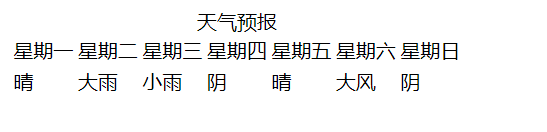
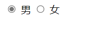
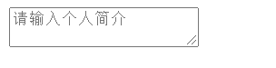
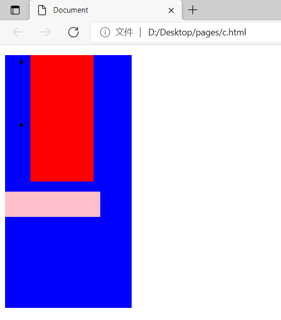
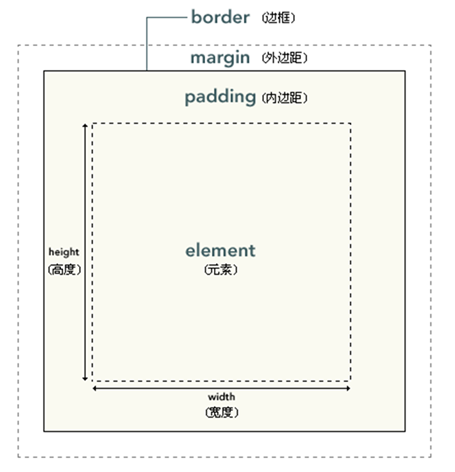
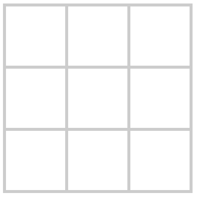
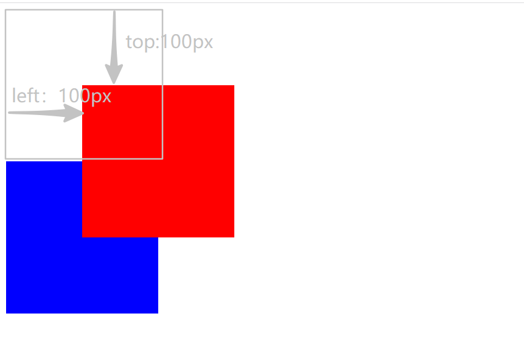

# 第1门课程：结构样式

课程目标：

1. 掌握网页相关的基础知识
2. 掌握网页制作方法
3. 掌握html和css语言的使用
4. 能够按设计图要求写出目标网页

# 1. 第1单元-网页基础

随着互联网的发展，信息传递变的越来越便捷，信息呈现的内容也越来越丰富。如何理解呢？比如我们打电话来交流信息只能通过语言表达，这样的信息表现方式有限。信息时代，我们需要更加丰富的信息表示手法。那么网页就是一个很好的选择。网页里边，我们可以放置文字，图片，表格，音频，视频，动画等。还可以设置调整格式让我们的网页更加漂亮，内容组织更加合理，利于信息的传递。同时网页还可以交互，比如，针对一篇文章进行评论。比如，搜索自己想要的内容。比如点击跳转到另外的页面，查看新内容等。

除了上述所说的好处之外，网页还有一个有点，便于传输。我们可以通过网址，很方便的查看对应的网页。比如：[访问百度](https://www.baidu.com).访问结果如下：


只要我们的终端接上网络，输入正确的网址就可呈现对应的内容。

## 工具准备

要制作网页，我们首先需要安装一些必要的工具

1. chrome-浏览器
2. vscode-代码编辑器

其中，`vscode`用于编写网页的源代码，当然这里的源代码指的就是编写网页所需要的语言 `html`语言和`css`语言。当然，我们还要学习`html`和`css`语言相关的规则，才能编写。

而`chrome`-浏览器在是用于解析执行我们所编写的网页源代码，最后呈现出网页的界面和效果。浏览器是我们日常办公娱乐不可缺少的一款软件，相信大家都会安装，这里不再强调如何安装。（如果不懂，就让老师帮你安装，并掌握安装方法）

`vscode`是一款代码编辑器，体积小巧，功能强大。可以去[vscode官网](https://code.visualstudio.com/)进行下载，（当然也可以找老师要安装包，或者帮你安装）。安装过程不在赘述，安装玩成长之后界面如下。


当然，该编辑器的功能还是比较多的，不过目前我们只需要掌握两个区域分别是左侧的文件管理区，和右侧的代码编辑区。在左侧可以管理我们的网页文件（新建，删除，重命名，打开等），在右侧可以编辑该文件的内容。

安装好编辑器，自己尝试一下吧！

> 在编写网页的时候，我们最好创建一个文件夹，然后把该文件夹拖入到`vscode`编辑器中，这样可以方便我们管理我们的网页文件。

## 第一个网页

我们在浏览器中看到的网页其本质上是一个后缀为`.html`的文件，这类型文件也被我们称之为网页文件。也就是说网页文件在编辑器中打开，我们可以对该文件进行编辑。在浏览器中打开，我们就可以查看该网页所呈现的页面效果。

所以，网页文件中的代码如何写，决定了我们看到的网页长什么样子。相信朋友们，已经迫不及待的想要编写点代码来看看呈现的网页效果了。那么接下来我们就来写点内容，看看最终呈现的网页吧。

创建一个文件夹，我这里将该文件夹命名为`网页`,并拖入编辑器中，然后在左侧点击新建文件按钮。如下图：


将该文件命名为 `index.html`这个`index`名称也不是必须的，只是习惯而已，理论上，你可以命任何名称。


此时右侧会展示该网页文件的打开状态，可以开始编写代码了。


每个网页都有一个统一的基础结构，这部分代码我们需要记住并理解其含义。代码如下：

```html
<!DOCTYPE html>
<html lang="en">

<head>
    <meta charset="UTF-8" />
    <title>Document</title>
</head>

<body>

</body>

</html>
```

是不是有点蒙？看不太懂？不要担心，我们接下来就一句一句解释它们的意思

第1行的`<!DOCTYPE html>` 这句代码的意思是声明该文件是一个网页文件的意思

第2行的`<html lang="en">`其实完整的写法应该是`<html lang="en"></html>`,快观察一下，有什么特点吗？ 是的，这是一个双标签对称结构， 这个咱们后续会详细讲解，这里你知道这个结构是个对称的结构就可以了`<标签名></标签名>`,要保证开始的标签名和结束的标签名相同，这样的话，它们就能组成一对。`html`表示网页，页面中需要展示的内容都要写在开始标签和结束标签的中间。**`lang="en"`这部分是标签的属性**，有额外的意义，这里表示使用的是英文。属性也很重要，后边会细讲。所以，第2行和第13行的会组成一对标签。

第4行的`<head>`和第7行的`</head>`是一对标签，表示的是页面的头部，第9行的`<body> `和第11行的`</body>`是一对，表示的是页面的内容。也就是说`head`标签表示头部，放于`head`标签中的内容用于对页面做一些设置，并不会显示在页面中。而`body`标签中的内容是展示在页面中的。那么我么接下来还能看到在`head`标签中出现了`meta`标签和`title`标签，而且同学们应该能发现。其中的`meta`跟我们刚才说的标签形式不一样，它是单标签形式的。这也是一种标签结构，后边也会系统的讲解（大家不要疑惑）。而且，我们发现`meta`标签上有`charset="utf-8"`属性，该属性的意思是整个文档的编码格式是`utf-8`的。（utf-8是什么鬼，先不要着急理解，这又牵扯到很多新的知识，现在就先记住就行了）

接下来，还有一个`title`标签，`title`标签表示的是标题的意思。意味着这个标签控制的是该页面的标题，有的朋友会问页面标题在哪里?看下边的图！！


所以说，假如我希望页面中显示的标题是`我的第一个网页`,那么我可以修改`title`标签中的内容为`<title>我的第一个网页</title>`。那么最终结果如下：


**试着自己去写写这个结构，检测一下自己是否记住了**

**快速生成网页基本结构的快捷方式**

大家想想，以后我们每写一个网页的话，都要去写这样的一个结构。将来我们要写成千上万的网页，每一次都写一遍这样的结构，固然也很简单，但是写多了，肯定也很麻烦！这个时候大家就要感谢我们的`vscode`编辑器了，它有一个快捷方式，可以快速的生成网页的基本结构，具体操作如下：

1. 新建一个`html`页面，然后输入`!`(注意一定是英文的)

   

2. 按下回车，就可以快速生成基本的页面结构了

   

## 关于网页

刚才我们已经基本的了解了网页制作的基本流程，但是有同学肯定有疑问了，我好像现在还不能制作出我平常看到的那些网页，甚至我不知道接下来该怎么办了？有此疑问，是很正常的。要能够专业的制作网页，我们还需要学习对应的编程语言。制作网页的编程语言有三门，分别是`html`、`css`、`javascript`。这一小节，我们就来谈谈为什么网页制作需要有三门语言。

网页里边承载了什么样的内容呢？这个，我们前边提过！有文字、图片、音频、视频、动画等等，同时这些内容会以各种方式组织在一起，并且拥有好看的排列格式和效果。而且在网页中我们还可以有很多操作，比如点击按钮显示隐藏的内容，跳转到新的页面，输入文字等等这一部分在我们看起来是动态的内容。那么在网页制作的时候，我们其实是把刚才所说的这些内容归纳成了三部分 `结构，样式，行为`。结构部分那就用`html`语言去实现，样式部分呢就用`css`去实现，行为部分就用`javascript`去实现。

说道这里，我相信很多同学还是不太理解所谓的结构样式行为到底是啥？我举个例子把，制作网页呢就像盖一座大厦一样，盖楼的时候，我们要先打地基，建承重墙，做房梁。这些是房屋的结构，当然，只做这些的话，我们只是得到一个毛培房。然后我们希望我们的楼房更加好看，我们就需要装修，装修完之后，房子就好看多了，这就想当于是网页中使用`css`添加了样式。最后房间中住人产生了各种活动，就对应着网页中的行为，也就是交互部分。

相信大家参照着楼房的例子去理解网页制作的三门语言，应该是可以想的明白的。但是，要特别深入的理解还需要一定网页制作经验。所以，这一小节我们只需要掌握制作网页的三门语言分别承担三门样的任务就可以了。


# 2. 第2单元-html（1）

本章我们就正式开始学习`html`语言了！首先，要告诉大家一件事，在众多的开发语言中`html`绝对算是最简单的一门语言了，没有之一。理论上来说，我们花费上几个小时的时间，就可以掌握了。但是，为了让大家掌握的更加牢固并做好充分的练习，我们学习`html`语言的时间会相对较长。

`html`的全程是`Hyper text markup language`,翻译成中文就是`超文本标记语言`。严格的说`html`不能算是编程语言，而应该算是标记语言，它足够简单也足够强大。它通过标签的方式来搭建一个网页的基本结构。`html`都是标签的形式（这个在前边我们接触过了),这一节我们先掌握`html`标签都有哪些通用规则？然后，再去学习都有哪些标签以及各个标签的特性。

## 标签的通用规则

关于`html`标签大家掌握以下通用的规则即可：

1. `html`标签总共分为两种：单标签和双标签。书写形式如下：

   **双标签**

   

   **单标签**

   

   

   这里要提一下，红色部分的标签名决定了标签的作用，比如`<title>hello html</title>`的标签名就是`title`，它的作用是设置页面的标题。后边我们还要学习其他种类的标签。

   标签上的属性的作用是对这个标签进一步说明，这个我们在后边会具体看到。

2. 标签可嵌套，嵌套的子标签相对于父标签在书写的时候要有缩进，这样易于阅读。

   ```html
   <head>
       <title>hello html</title>
   </head>
   ```

   上述标签，可以看成是`head`标签是`title`标签的父标签，`title`是`head`的子标签

3. 放置于`<body></body>`内的标签在页面中都会呈现出一个可以控制宽高的矩形（需要通过css控制），标签的内容会出现在矩形的内部（请注意单标签无法设置标签内容）

   代码如下：

   ```html
   <!DOCTYPE html>
   <html lang="en">
   <head>
       <meta charset="UTF-8">
       <meta http-equiv="X-UA-Compatible" content="IE=edge">
       <meta name="viewport" content="width=device-width, initial-scale=1.0">
       <title>hello html</title>
   </head>
   <body>
       <div>中国是一个伟大的国家</div>
   </body>
   </html>
   ```

   此时我们在浏览器中运行这段代码，会看到如下界面：（其中`div`是一种标签，表示区块）

   

   我们说好的矩形呢？其实矩形是存在的，只是因为这个矩形是透明的，所以我们只能看到这个矩形内的文字，但是看不到矩形的全貌。我么可以通过开发者模式（后边会系统讲解如何使用开发者模式）去查看该标签。

   

4. 不同的标签名决定了标签的实际功能，不同功能的标签拥有不同种类的属性，这些属性会加强标签的功能和特性（当然每个标签都可以设置自定义属性，但是在页面上不会呈现任何效果。自定义属性用于后期使用JavaScript编写交互）。每个标签所具有的通用的属性有 id（用于给标签设置一个唯一的标识） 、 class（用于给一组标签设置唯一的标识,可以设置多个）、title(用于鼠标移上的时候，显示额外信息），style（设置标签样式，在css部分再深入学习）

   ```html
   <!DOCTYPE html>
   <html lang="en">
   <head>
       <meta charset="UTF-8">
       <meta http-equiv="X-UA-Compatible" content="IE=edge">
       <meta name="viewport" content="width=device-width, initial-scale=1.0">
       <title>hello html</title>
   </head>
   <body>
       <h1>美丽的中国</h1>
       <div class="box" id="all">中国是一个伟大的国家</div>
       <div class="box search"></div>
   </body>
   </html>
   ```

   上述代码中，`h1`标签表示标题，`div`标签表示一个区块，比如我们说类名为`box`的标签有两个，id名为`all`的标签有一个，其标签内容为`中国是一个伟大的国家`。

5. 标签按照在网页上的表现形式分为三个种类：块元素、行内元素、行内块元素 。 （元素即标签）

   	1. 块元素的：独占一行，宽度默认撑满它所在的父盒子，高度默认为内容撑开的高度，多个块元素竖直排列  
   	2. 行内元素： 宽度和高度默认都是内容撑出来的大小（如果没有设置内容的话，宽高默认就都为0），且无法设置宽高
   	3. 行内块元素：宽度和高度默认都是内容撑出来的大小（如果没有设置内容的话，宽高默认就都为0），可以设置宽高

   `div h1`都属于块元素，所以它表现出来的效果如下：

   ```html
   <!DOCTYPE html>
   <html lang="en">
   <head>
       <meta charset="UTF-8">
       <meta http-equiv="X-UA-Compatible" content="IE=edge">
       <meta name="viewport" content="width=device-width, initial-scale=1.0">
       <title>hello html</title>
   </head>
   <body>
       <h1>美丽的中国</h1>
       <div class="box" id="all">中国是一个伟大的国家</div>
       <div class="box">哈哈哈</div>
   </body>
   </html>
   ```

   界面效果

   

   通过调试界面查看

   

   在比如`span`标签是含内元素，我们来看看效果

   ```html
   <!DOCTYPE html>
   <html lang="en">
   <head>
       <meta charset="UTF-8">
       <meta http-equiv="X-UA-Compatible" content="IE=edge">
       <meta name="viewport" content="width=device-width, initial-scale=1.0">
       <title>hello html</title>
   </head>
   <body>
       <h1>美丽的中国</h1>
       <div class="box" id="all">中国是一个伟大的国家</div>
       <div class="box">哈哈哈</div>
       <span>我是行内元素</span>
   </body>
   </html>
   ```

   调试界面如下

   

**关于行内块的元素效果我们就不演示了，后边在我们还会详细的在去讲解标签类型的问题，因为标签类型对于我们的排版和布局非常重要**

> 小结：通过对标签通用规则的了解，我们接下来去学些一些新标签的时候，需要掌握每一个标签的以下几点：
>
> 1. 标签名
> 2. 双标签还是单标签
> 3. 标签的用途
> 4. 标签具有的属性有哪些，以及每个属性的作用
> 5. 标签的类型（块？行内？行内块？）

## 标题、段落和功能性标签

### 标题标签

如果我们想要在页面中显示标题，那么我们可以使用标题标签。`html`中内置了6级用于表示标题的标签分别是`h1 h2 h3 h4 h5 h6`,他们都属于块级元素。在页面中会以标题的形式呈现。

```html
<!DOCTYPE html>
<html lang="en">
<head>
    <meta charset="UTF-8">
    <meta http-equiv="X-UA-Compatible" content="IE=edge">
    <meta name="viewport" content="width=device-width, initial-scale=1.0">
    <title>hello html</title>
</head>
<body>
    <h1>一级标题</h1>
    <h2>二级标题</h2>
    <h3>三级标题</h3>
    <h4>四级标题</h4>
    <h5>五级标题</h5>
    <h6>六级标题</h6>
</body>
</html>
```

页面效果如下：


### 段落标签

如果想要在页面中出现大段的文字，这个时候你需要段落标签。那么`html`中使用`p`标签来表示段落，`<p>段落内容</p>`。这也是一个双标签，且是块级元素。

### 功能标签

还有一些功能性质的标签，可以让我们的文字呈现不同的效果。

`<span></span>`一个没有特殊功能的标签，一般用来包裹文字，是行内元素

`<i></i>`设置文字格式为斜体，是行内元素

`<em></em>`设置文字格式为斜体，是行内元素

`<b></b>`设置文字格式加粗，是行内元素

`<strong></strong>`设置文字格式加粗，是行内元素

`<br />`表示换行

`<hr />`换行且加一条横线

`<div></div>`表示一个单独的区域，是块元素

`<code></code>`用于包裹要展示在页面的代码，是行内元素

`<pre></pre>` 放在`pre`标签中的内容会保留文字原来的格式，是块元素

可编写如下代码，查看效果

```html
<!DOCTYPE html><html lang="en"><head>    <meta charset="UTF-8">    <meta http-equiv="X-UA-Compatible" content="IE=edge">    <meta name="viewport" content="width=device-width, initial-scale=1.0">    <title>hello html</title></head><body>    <span>我是span，我没有特殊功能</span>    <hr />    <i>我是斜体的</i>    <br />    <em>我也是斜体的</em>    <br />    <b>我是加粗的</b>    <br />    <strong>我也是加粗的</strong>    <br />    <div>我是一个单独的区域</div>    <hr />    <code>我可以放代码</code>    <hr />    <pre>            静夜思        窗前明月光，        疑是地上霜，        举头望明月，        低头思故乡。    </pre></body></html>
```

最后效果如下：


### 超链接

如果你有上网经验的话，你应该见过在网页中的有些文字是高亮的，我们知道点击之后，会跳转到对应的页面。这就被称之为超链接，效果如下：


上图中标出的一些文字都被做成了超链接，点击之后会跳转到对应的页面。

那么超链接是怎么做的呢？这里需要学习一个新的标签叫做 `a`标签，这是一个双标签写法为`<a href="新页面的地址">要显示的文本内容</a>`。该标签的作用是当点击改标签内的文字的话，会跳转到`href`地址中指定的页面。演示超链接的用法，我们需要创建两个`html`文件，所以，我们先创建一个目录`pages`,在该目录下创建`a.html`和`b.html`。


`a.html`中的内容

```html
<!DOCTYPE html><html lang="en"><head>    <meta charset="UTF-8">    <meta http-equiv="X-UA-Compatible" content="IE=edge">    <meta name="viewport" content="width=device-width, initial-scale=1.0">    <title>页面a</title></head><body>    <a href="b.html">去b页面</a></body></html>
```

上述代码中，在页面中的展示效果如下：


此时鼠标点击该`去b页面`的文字，在浏览器中会展示`b页面`的内容。

我们可以在`b.html`中添加如下代码：

```html
<!DOCTYPE html><html lang="en"><head>    <meta charset="UTF-8">    <meta http-equiv="X-UA-Compatible" content="IE=edge">    <meta name="viewport" content="width=device-width, initial-scale=1.0">    <title>页面b</title></head><body>    <a href="a.html">去a页面</a></body></html>
```

上述代码显示的效果如下：


此时，我们的两个页面就可以通过点击文字超链接进行相互跳转了。

**关于href地址的写法**

在`href`的属性值我们应该写目标页面与当前页面的相对文件路径，这是什么意思呢？首先，当前页面指的是我们要书写`a`标签的页面，目标页面是我们点击超链接后要跳转到的页面。这两个页面本质上是两个`html`文件，是文件在资源管理器中就有路径，那么所谓相对路径就是从一个文件到另一个文件的路径是怎样的，我们都知道从一个文件到另外一个文件，我们需要根据实际存储位置出文件夹，进文件夹，如何去描述这种关系呢，我们使用路径的方式进行描述，记住两个三个要点就可以了。1、进入当前文件夹用`./`这个符号。2、跳出文件夹用`../`这个符号。3、多个文件夹之间用`/`隔开

上边的描述过于文字化，我们来一个实际的例子看看，比如有一个目录结构如下：

```
│  a.html│  b.html│  ├─assets│      c.html│      └─com    └─ws            d.html
```

那么我从`c.html`跳转到`d.html`的相对路径应该为`../com/ws/d.html`

`d.html`跳转到`c.html`的相对路径为`../../assets/c.html`

`a.html`跳转到`d.html`的相对路径为`./com/ws/d.html`

**target属性**

关于`a`还有一个特定的属性是`target`,该属性的值可以设置为`_blank`，那么此时点击超链接的效果为打开一个新的选项卡。

```html
<a href="相对路径" target="_blank">新页面</a>
```

可以自己尝试一下

### 小结

| 标签名   | 作用                                      | 单/双 | 元素类型 | 写法                                    | 特定属性             |
| -------- | ----------------------------------------- | ----- | -------- | --------------------------------------- | -------------------- |
| `span`   | 无特殊功能，用于包裹文字                  | 双    | 行内元素 | `<span></span>`                         | 无                   |
| `i`      | 设置文字斜体                              | 双    | 行内元素 | `<i></i>`                               | 无                   |
| `em`     | 设置文字斜体                              | 双    | 行内元素 | `<em></em>`                             | 无                   |
| `b`      | 设置文字格式加粗                          | 双    | 行内元素 | `<b></b>`                               | 无                   |
| `strong` | 设置文字格式加粗                          | 双    | 行内元素 | `<strong></strong>`                     | 无                   |
| `br`     | 换行                                      | 单    | 行内元素 | `<br />`                                | 无                   |
| `hr`     | 换行且加一条横线                          | 单    | 行内元素 | `<hr />`                                | 无                   |
| `div`    | 表示一个单独区域                          | 双    | 块元素   | `<div></div>`                           | 无                   |
| `code`   | 用于包裹要展示在页面的代码                | 双    | 行内元素 | `<code></code>`                         | 无                   |
| `pre`    | 放在`pre`标签中的内容会保留文字原来的格式 | 双    | 块元素   | `<pre></pre>`                           | 无                   |
| `a`      | 设置超链接                                | 双    | 行内元素 | `<a href="相对路径" target="">内容</a>` | href属性、target属性 |


### 作业

**完成“公共课-案例库\1.约翰·冯·诺依曼简介”所示案例**


# 3. 第3单元-html（2）

前边我们讲的标签主要说用于文章段落，不过页面中除了文章段落之外，列表页很常见。比如下图：


这是新浪网首页的一部分，这就是列表，如果用我们前边的标签也能凑出这样的效果。不过呢，`html`的标签中设计了专门用来表示列表的标签。所以，这里提一点，我们尽量让每个标签用在自己合适的地方。比如你要表示标题，就用标题标签，要表示段落就用`p`标签。

`html`中把列表分为了三种分别是**无序列表、有序列表、自定义列表**

## 无序列表

无序列表使用的是一组嵌套标签，`ul`和`li`。他们都是块级标签。如果我想要表示如下的效果

- 早上要开早会
- 白天要学习
- 晚上要跑步

那么可以使用如下代码实现：

```html
<ul>    <li>早上要开早会</li>    <li>白天要学习</li>    <li>晚上要跑步</li></ul>
```

也就是在一个`ul`标签内套着多个`li`标签，以此来形成一个列表。可能你也发现了在列表中的每一项前边都会有一个小圆点。这是列表的典型标志，如果我们想要把前边的小圆点替换到的话，我么可以给`ul`标签添加`type`属性，其值为`disc`   `square`   `circle`。其中，`disc`是默认值表现的标志就是小圆点，`square`表示的标志是小方块，而`circle`表示为空心的小圆点

```html
<ul type="disc">    .....</ul><ul type="square">    .....</ul><ul type="circle">    .....</ul>
```

可自行在页面中查看效果。

> 如果我们希望列表中的单项内容是可以点击跳转的，那么我们需要在`li`标签中嵌套上`a`标签即可。

**无序列表还可以嵌套无序列表**，有如下效果，大家思考一下该如何编写结构。

- 早上要做的事情
  - 参加早会
  - 吃早饭
  - 晨读
- 中午要做的事情
  - 认真听讲
  - 参加考试
- 晚上要做的事情
  - 完成作业
  - 复习白天的知识点
  - 睡觉

上述结构是一个两层嵌套的结构，如果我们掌握了两层嵌套的结构，那么以此类推三层四层的也都是一样的原理。

## 有序列表

所谓有序列表跟无序列表差不多，只是有序号的标识，那么有序列表使用的标签是`ol`和`li`,我们编写如下结构来看看效果：

```html
<ol>    <li>吃饭</li>    <li>睡觉</li>    <li>学习</li></ol>
```

有序列表和无序列表的唯一区别就是，列表中每个项目前边的符号不一样。有序列表每个项目前边的符号能体现出顺序，上边的列表在页面中表现的形式为

1. 吃饭
2. 睡觉
3. 学习

不过呢，我们是可以控制列表项目前边的序号的，默认是以数字开头的。我们可以换成以字母开头的，使用`type`属性。写法为：

```html
<ol type="a">    <li>吃饭</li></ol>
```

可自行查看效果。


`type`属性的所有值如下：

| type属性的取值 | 该取值的作用                                    |
| -------------- | ----------------------------------------------- |
| type="1"       | 表示列表项序号用数字表示（1 2 3）               |
| type="a"       | 表示列表项序号用小写字母表示（ a b c）          |
| type="A"       | 表示列表项序号用大写字母表示（ A B C）          |
| type="i"       | 表示列表项序号用小写罗马数字表示（ i ii iii …） |
| type="I"       | 表示列表项序号用大写罗马数字表示（ I II III …） |

有序列表除了有`type`属性之外，还有一个`start`属性,`start`属性用来表示列表从第几项开始。该属性的取值为数字，标记列表项序号从第几个开始，例如：

```html
<ol type="a" start="2">    <li>吃饭</li>    <li>睡觉</li></ol>
```

上述代码在页面中展示的效果为：

```html
b. 吃饭c. 睡觉
```

> 当然有序列表也有自己的嵌套，跟无序列表的嵌套方式是一样的。既然我们学习了有序列表，那么我们应该知道有序列表页可以和无序列表混合在一起进行嵌套。

## 自定义列表

在自定义列表中，我们主要使用的三个标签是`dl`  `dt`  `dd`  。自定义列表一般用来表示列表的项目中形式并不是特别单一，而是形式比较多样的列表。比如下边的列表：


要编写上述结构，我们就要用到自定义列表，代码如下：

```html
<!DOCTYPE html><html lang="en"><head>    <meta charset="UTF-8">    <meta http-equiv="X-UA-Compatible" content="IE=edge">    <meta name="viewport" content="width=device-width, initial-scale=1.0">    <title>Document</title></head><body>        <dl>        <dt>中国</dt>        <dd>一个历史悠久的国家</dd>    </dl>    <dl>        <dt>美国</dt>        <dd>一个科技发达的国家</dd>    </dl>    <dl>        <dt>俄国</dt>        <dd>一个非常寒冷的国家</dd>    </dl></body></html>
```

当然根据实际情况，在`dt`和`dd`中也可以添加其他的标签，记住，只要你的列表单项的内容结构比较复杂都可以选择自定义列表这样的标签。

## 图像标签

我们平常浏览的页面中出现图片是非常普遍的，那么如何在网页中展示图片呢？这就要使用到我们的 `img`标签了，`img`标签是一个行内块标签。它具有一个非常重要的属性`src`,该属性的值为图片相对于该页面的相对路径(我们讲过相对路径了)。其作用是制定要展示的图片。比如：

```html

```

此时打开页面，会展示出该图片。（展示的大小核图片本身的大小有关系)

当然，我么也可以控制该图片展示的大小，通过`width` 和 `height`这两个属性来控制其大小。很显然，`width`用来控制要展示的图片的宽度，`height`用来控制要展示的图片的高度。

```html

```

上述代码表示，该图片展示在页面中的宽度为200，高度为100。可以对比下如果我们没有设置`width`和`height`时，展示的图片的大小。如果没设置的话，那么我们展示的是图片的默认大小。

> 关于图片我们还不得不提一点就是每张图片都已一个固定的宽高比例，如果我们贸然的设置了一张图片的宽度和高度但是呢没有保持该图片本身的比例，那么我们的图片最后呈现的样子是会变形的。那么每次要设置图片的大小的时候，都要去计算图片的宽高比例确实是比较麻烦的事情。好在呢，图片有一个特性就是其会默认的保持其宽高比例不变，除非遭到人为的破坏。也就是说我们可以只设置它的宽度或者高度。那么它的另一个维度的大小会根据比例自动变化。实际编写代码的时候呢，我们推荐这样做。因为变形的图片实在是太丑了。

图像还有一个属性是`alt`,该属性的作用是在图片以为一些原因（比如，路径写错了）没能展示出来的时候，会展示`alt`中所设置的文字。

```html

```

上述图片路径故意写错了，那么我们会看到如下的效果


> 页面中经常会出现一些图文列表，图文列表能让页面更加丰富，图文列表也属于自定义列表中的一项。一般图像标签会放在`dt`中。

```html
 <dl>        <dt>                    </dt>        <dd>一个历史悠久的国家</dd>    </dl>    <dl>        <dt>                    </dt>        <dd>一个科技发达的国家</dd>    </dl>    <dl>        <dt>                    </dt>        <dd>一个非常寒冷的国家</dd>    </dl>
```

上述代码是一个图片列表的结构，可以自行展示查看效果（图片自备）

## 注释

注释的作用是让人更加易于去阅读我们写的代码，计算机是不会理会注释的。`html`中注释的写法是`<!-- 注释内容 -->`，在注释中，我们可以对我们的代码进行说明和标记，这样别人或者我们自己去看我们写过的代码的话就会非常的便捷。

比如：

```html
<!DOCTYPE html><html lang="en"><head>    <meta charset="UTF-8">    <meta http-equiv="X-UA-Compatible" content="IE=edge">    <meta name="viewport" content="width=device-width, initial-scale=1.0">    <title>Document</title></head><body>    <!-- 这是一个标题 -->    <h1>我的第一个网页</h1>    <!-- 以下是一个自定义列表 -->    <dl>        <dt>中国</dt>        <dd>一个历史悠久的国家</dd>    </dl>    <dl>        <dt>美国</dt>        <dd>一个科技发达的国家</dd>    </dl>    <dl>        <dt>俄国</dt>        <dd>一个非常寒冷的国家</dd>    </dl></body></html>
```

> 多写注释，珍爱生命！

## 作业

完成下图所示列表的结构


完成下图所示图文的结果（实际样式不用管，写出结构即可）


# 4.第4单元-html（3）

## 表格标签

目前，已经掌握了在页面中可以制作出标题，段落，列表，图片，超链接等。不过呢，面对以现在互联网的发展以及网页的丰富程度，这些还远远不够。这一节，我们要基础一种新的展示元素就是表格。表格的功能和好处自不必多说，使用也非常广泛。那么，接下来我们就来学习如何在网页中展示出表格吧。

要是制作表格，我们需要先掌握以下几种标签

`<table></table>`块元素，用来定义一个表格

`<caption></caption>`定义表格的标题

`<tr></tr>`定义表格中的行

`<td></td>`定义行中的单元格

`<th></th>`定义表格中表头的单元格

接下来我们，我们通过实际操作，来看看表格如何展示。比如，我们需要创建一个`2行7列`的表格，来表示天气预报。那么代码如下

```html
<!--定义一个表格--><table>     <!--这是表格的标题-->    <caption>天气预报</caption>    <!--这是表格的第一行-->    <tr>    	<td>星期一</td>        <td>星期二</td>        <td>星期三</td>        <td>星期四</td>        <td>星期五</td>        <td>星期六</td>        <td>星期日</td>    </tr>    <!--这是表格的第二行-->    <tr>    	<td>晴</td>        <td>大雨</td>        <td>小雨</td>        <td>阴</td>        <td>晴</td>        <td>大风</td>        <td>阴</td>    </tr></table>
```

页面 展示的效果如下：



相信大家应该已经可以掌握它的结构了，比如我们想要写出`自定义行和列`的也都可以遵从这种方式去写。

不过呢，这个表格看起来还不太像表格，为什么呢？因为它没有边框。是的，那么怎么加边框呢？这个时候就要学习`table`标签的相关的`html`属性了。

## 表格属性

`border`该属性用于控制表格中的单元格是否有边框，其值为数字，表示边框的宽度。我们在刚才的表格中给`<table></table>`添加`border`属性，看看效果。

```html
<table border="1"> <!-- 表示所有单元格的宽度为1 -->	<caption>天气预报</caption>    <!-- ....... --></table>
```

此时效果如下：


同学们应该发现了，边框是双层的，因为是给每个`td`都加了边框，然后给整个表格除过标题的部分外又整体加了一层边框。所以出现了这样的效果。而且，这些边框之间还有一些间隔。

其实这些间隔也是可以控制的，通过`cellspacing`属性，该属性的作用是设置边框之间的间隔的，值是一个数字，比如我们取消边框之间的间隔，可以设置该值为0.

```html
<table border="1" cellspacing="0"> <!-- 表示所有单元格的宽度为1, 设置表格边框之间的间隔为0 -->	<caption>天气预报</caption>    <!-- ....... --></table>
```

此时效果如下：


可能大家也发现了，这个表格是通过内容撑出来的大小。那么其实我们可以控制表格的大小的，`table`具有`width`和`height`属性。但是注意，这个`width`和`height`控制的是`table`的总高度。 

我们来设置一个`500 X 300`的表格

```html
<table border="1" cellspacing="0" width="500" height="300">	<caption>天气预报</caption>    <!-- ....... --></table>
```

效果如下


我们还可以控制表格在页面的对齐方式，可以设置`align`属性。其值为`center  left  right`。可以分别设置查看效果。

比如，设置居中`center`

```html
<table border="1" cellspacing="0" width="500" height="300" align="center">	<caption>天气预报</caption>    <!-- ....... --></table>
```


使用`bgcolor`可以修改整个表格的背景色，比如：

```html
<table border="1" cellspacing="0" width="500" height="300" align="center" bgcolor="red">	<caption>天气预报</caption>    <!-- ....... --></table>
```

上述代码设置表格的背景色为红色。


## 单元格属性

表格的一些属性放在单元格中也是同样适用的，比如`bgcolor`、`align` 、`width` 、`height` 可自行尝试一下相关效果。

我们现在再创建一个表格，用来表示3名学生的相关信息（姓名，年龄，性别，家庭住址）。那么，我们需要`4行4列`的表格。该表格如果不需要标题的话，咱么可以不添加`caption`标签。

代码如下：

```html
<table border="1">        <tr>            <th>姓名</th>            <th>年龄</th>            <th>性别</th>            <th>家庭住址</th>        </tr>        <tr>            <td>张三</td>            <td>12</td>            <td>男</td>            <td>北京</td>        </tr>        <tr>            <td>李四</td>            <td>15</td>            <td>男</td>            <td>北京</td>        </tr>        <tr>            <td>王五</td>            <td>14</td>            <td>女</td>            <td>上海</td>        </tr>    </table>
```

显示界面如下：


除此之外，单元格有两个特殊的属性分别是`colspan`和`rowspan`,这两个属性的作用是用于合并单元格的。`colspan`是列合并也就是横向合并，`rowspan`是行合并也就是纵向合并。

具体如何使用呢，比如上边表格中，张三和李四的家庭住址是一样的，那么我们可以把他们的家庭住址的两个单元格合并在一起，是纵向合并，也就是行合并，使用`rowspan`属性。

可以修改代码如下：

```html
<table border="1">        <tr>            <th>姓名</th>            <th>年龄</th>            <th>性别</th>            <th>家庭住址</th>        </tr>        <tr>            <td>张三</td>            <td>12</td>            <td>男</td>            <td rowspan="2">北京</td> <!--这个单元格想当于纵向占了两个单元格-->        </tr>        <tr>            <td>李四</td>            <td>15</td>            <td>男</td>            <!--<td>北京</td> 合并之后这个单元格相当于不存在了，所以需要删掉-->        </tr>        <tr>            <td>王五</td>            <td>14</td>            <td>女</td>            <td>上海</td>        </tr>    </table>
```

渲染效果如下：


我们再想改表格的右侧添加一列，该列为缴费，同时在表格的最下方加一行为缴费总计添加代码如下：

```html
<table border="1">        <tr>            <th>姓名</th>            <th>年龄</th>            <th>性别</th>            <th>家庭住址</th>            <th>缴费</th>        </tr>        <tr>            <td>张三</td>            <td>12</td>            <td>男</td>            <td rowspan="2">北京</td> <!--这个单元格想当于纵向占了两个单元格-->            <td>15000</td>        </tr>        <tr>            <td>李四</td>            <td>15</td>            <td>男</td>            <!--<td>北京</td> 合并之后这个单元格相当于不存在了，所以需要删掉-->            <td>25000</td>        </tr>        <tr>            <td>王五</td>            <td>14</td>            <td>女</td>            <td>上海</td>            <td>35000</td>        </tr>        <tr>            <td>总计</td>            <td></td>            <td></td>            <td></td>            <td></td>        </tr>    </table>
```

效果如下：


我们需要把总计后边的四个单元格都合并成一个，需要使用`colspan`属性，修改代码如下

```html
<table border="1">        <tr>            <th>姓名</th>            <th>年龄</th>            <th>性别</th>            <th>家庭住址</th>            <th>缴费</th>        </tr>        <tr>            <td>张三</td>            <td>12</td>            <td>男</td>            <td rowspan="2">北京</td> <!--这个单元格想当于纵向占了两个单元格-->            <td>15000</td>        </tr>        <tr>            <td>李四</td>            <td>15</td>            <td>男</td>            <!--<td>北京</td> 合并之后这个单元格相当于不存在了，所以需要删掉-->            <td>25000</td>        </tr>        <tr>            <td>王五</td>            <td>14</td>            <td>女</td>            <td>上海</td>            <td>35000</td>        </tr>        <tr>            <td>总计</td>            <td colspan="4"></td>            <!-- <td></td>            <td></td>            <td></td> -->        </tr>    </table>
```

最终效果：


> 我可以使用`colspan`和`rowspan`进行单元格的列合并和行合并，那么思考一下，如果我们想要列和行同时合并该如何去做呢？

## 单线表格

上述我们写的表格其实都是双线条的，那么考虑下我们如何写出一个单线表格呢？

思路如下：

1. 把线框和线框之间的间隔作为最终的表格，所以设置`cellspace="1"`。
2. 原来的线框不在需要了，所以设置`border="0"`
3. 把`table`的北京色设置为黑色`bgcolor="black"`，这样线框与线框之间的间隔也变成了黑色
4. 把所有单元格的背景色都变成白色，可以在`tr`标签上设置`bgcolor="white"`

修改代码如下:

```html
<table border="0" cellspace="1" bgcolor="black">        <tr bgcolor="white">            <th>姓名</th>            <th>年龄</th>            <th>性别</th>            <th>家庭住址</th>            <th>缴费</th>        </tr>        <tr bgcolor="white">            <td>张三</td>            <td>12</td>            <td>男</td>            <td rowspan="2">北京</td> <!--这个单元格想当于纵向占了两个单元格-->            <td>15000</td>        </tr>        <tr bgcolor="white">            <td>李四</td>            <td>15</td>            <td>男</td>            <!--<td>北京</td> 合并之后这个单元格相当于不存在了，所以需要删掉-->            <td>25000</td>        </tr>        <tr bgcolor="white">            <td>王五</td>            <td>14</td>            <td>女</td>            <td>上海</td>            <td>35000</td>        </tr>        <tr bgcolor="white">            <td>总计</td>            <td colspan="4"></td>            <!-- <td></td>            <td></td>            <td></td> -->        </tr>    </table>
```

最终效果如下：


## 小结

| 标签名  | 作用                               | 单/双 | 元素类型   | 写法              | 特定属性                                     |
| ------- | ---------------------------------- | ----- | ---------- | ----------------- | -------------------------------------------- |
| `ul`    | 包裹无序列表                       | 双    | 块元素     | `<ul></ul>`       | type                                         |
| `ol`    | 包裹有序列表                       | 双    | 块元素     | `<ol></ol>`       | type  start                                  |
| `li`    | 包裹无序列表或者有序列表中的单个项 | 双    | 块元素     | `<li></li>`       | 无                                           |
| `dl`    | 包裹自定义列表                     | 双    | 块元素     | `<dl></dl>`       | 无                                           |
| `dt`    | 包裹自定义列表中的图像部分         | 双    | 块元素     | `<dt></dt>`       | 无                                           |
| `dd`    | 包裹自定义列表中的文字部分         | 双    | 块元素     | `<dd></dd>`       | 无                                           |
| `img`   | 页面中呈现图像                     | 单    | 行内块元素 | ``         | src alt width height                         |
| `table` | 包裹表格                           | 双    | 块元素     | `<table></table>` | border width height cellspace aligin bgcolor |
| `tr`    | 表格中的行                         | 双    | 块元素     | `<tr></tr>`       | bgcolor width height align                   |
| `th`    | 表示表头的单元格                   | 双    | 块元素     | `<th></th>`       | bgcolor width height align rowspan colspan   |
| `td`    | 表示单元格                         | 双    | 块元素     | `<td></td>`       | bgcolor width height align rowspan colspan   |

## 作业

完成下图所示表格


# 5.第5单元-html（4）

在网页中还会出现一种结构叫做表单，比如我们注册，登录。或者浏览别人的帖子进行回复的时候，都需要做一定的内容输入或者下拉选择等操作，这就是页面交互了。所以说，表单相关的标签算是比较高级的标签，它们不仅仅有展示功能，还会设计到一定的交互。

如果我们要在页面中创建一个表单，我们需要先创建一个标签`form`,该标签表示包裹一份表单。这是一个双标签，也是块元素。它有一个属性叫做 `action`,该属性的作用是把表单中输入的内容传递到服务端（关于服务端是后边的内容，目前我们仅仅知道是这么回事即可），目前我们只要给该属性的值写成`###`就行了。例如：`action="###"`

创建一个表单

```html
<form action="###"> <!--这是一个表单-->    <!-- 这里边可以放一些表单元素 --></form>
```

我们进这样写的话，在页面中还看不到任何的内容，接下来我们要学习一些表单元素。

## `input`框

这里要学的新标签是`input`,这是一个单标签，属于行内块元素。它有一个特别重要的属性是`type`该属性有很多值，不同的值决定了最终的表示形式以及功能。它的值有  `text  password  radio  checkbox button submit  reset file`等等。我们一一进行介绍

### 文本框

用于在页面中输入一些信息，比如用户名等。写法`<input type="text" />` 最终效果如下：


我们可以在该框中输入内容（自己在页面中尝试一下）

还有一个属性是`placeholder`,该属性的作用是给输入框添加提示信息

```html
<input type="text" placeholder="请输入用户名" />
```


还有一个`name`属性，其值为任意字符串即可。该属性主要作用是用于给服务端提交数据的时候当做输入数据的键。目前来说，没有实际的用处，不过最好加上。

```html
<input type="text" placeholder="请输入用户名" name="username" />
```

文本框还有一个`value`属性，用于给文本框设置默认的显示内容。

```html
<input type="text" placeholder="请输入用户名" name="username" value="admin" />
```


> value和placeholder可不一样，placeholder用于提示，value设置的内容相当于输入的内容

### 密码框

密码框用户输入密码和文本框差不多，只是密码框输入的内容我们一般看不到，其他属性和文本框一样。例如：

```html
<input type="password" placeholder="请输入密码" name="pwd" />
```


然后，在密码框中输入`123456`,效果如下：


### 单选框

单选框一般在页面中用于做一个唯一选择，比如需要我们输入信息的时候选择性别。单选框的属性值是`radio`,因为要选择一般要多个项。当然它的也具有文本框的属性，但是它最终显示的效果是不一样的。比如选择性别，我们可以这么写：

```html
<input type="radio" /> 男      <input type="radio" /> 女
```

显示效果如下：


上图中的两个小圆点是可以点击选中的，不过呢，我们应该是只能选择一个的，但是目前的情况是我们两个都可以选。


这样是不符合实际情况的，那么如何解决这个问题呢？我们只需要给两个`input`添加`name`属性，且让它们的属性值一样即可。

```html
<input name="sex" type="radio" /> 男      <input name="sex" type="radio" /> 女
```

再试一试，此时每次只能选中一个了。



因为显示的不同，所以像`placeholder`就没什么用了。`value`呢，其实还是有用的。不过呢也是在提交数据至服务端的时候会用到。这里知道就行。

### 复选框

在页面上同时也可能出现要选择多想的情况，比如要统计你热爱的运动有哪些？`篮球   足球   排球  乒乓球  羽毛球`。这种情况是需要选择多项的，那就需要用复选框了，可以设置`type`属性的值为`checkbox`来设置复选框。例如：

```html
<input type="checkbox" />篮球  <input type="checkbox" />足球  <input type="checkbox" />排球  <input type="checkbox" />乒乓球  <input type="checkbox" />羽毛球
```


此时，点击就可以选中或者取消不同的选项了。

复选框也应该添加相同的`name`,虽然目前来看没什么作用，但是将来做服务端交互的时候是必须的。可以改写如下：

```html
<input name="play" type="checkbox" />篮球  <input  name="play" type="checkbox" />足球  <input  name="play" type="checkbox" />排球  <input  name="play" type="checkbox" />乒乓球  <input  name="play" type="checkbox" />羽毛球
```

复选框同样也支持`value`属性，跟单选框一样，目前看不到什么变化，但是将来与服务端交互的时候非常有用。

同时，复选框还支持`checked`属性，该属性不需要设置属性值，其作用就是让复选框默认选中。比如，我默认希望选中`篮球`he `羽毛球`

```html
 <input name="play" checked type="checkbox" />篮球  <input  name="play" type="checkbox" />足球  <input  name="play" type="checkbox" />排球  <input  name="play" type="checkbox" />乒乓球  <input  name="play" checked type="checkbox" />羽毛球
```

效果如下


### 按钮

这里我们学习三种按钮，分别是普通按钮和提交按钮，采用的属性分别为`type="button"`和`type="submit"`。代码如下：

```html
<input type="button" value="普通按钮" /> <input type="submit" value="提交按钮" /><input type="reset" value="重置按钮" />
```

效果如下：


视觉效果上来看，没什么区别。但是，当我们点击的时候会有区别。点击普通按钮没什么反应，但是点击提交按钮会把当前表单中的数据提交到服务器（后边学习服务端的课程会讲解），可以试着点击一下，提交按钮在浏览器第地址栏后边会多`###`。或者我们在表单中放入更多的标签，再观察观察看地址栏在点击提交按钮后会发生什么变化。重置按钮的作用就是把表单中其他表单元素输入的内容清除掉，可以在表单中添加其他的表单元素，自行尝试


还有它们的`value`属性决定了按钮上显示的文本，当然也可以不加。不加的话，自己试一试默认的文本是什么？


### 文件上传

在平常使用网页的时候，经常会碰到要上传文件的操作，所以，我们还要学习一个文件上传的元素。`<input type="file" />`可以用来上传文件。

```html
<input type="file" />
```

呈现效果如下：


点击`选择文件`按钮之后，会进入选择本地文件的界面。


选择要上传的文件后


这个只是文件上传标签的交互过程，具体的功能还需要配合服务端的应用完成。不过呢，目前我们掌握到这里即可。

## `select`下拉框

下拉选择也是很常见的一种交互，比如让你选择你所在的城市，我们这里需要使用 `select`配合`option`来实现选择框。

```html
<select>
    <option>北京</option>
    <option>上海</option>
</select>
```

显示效果如下：


这个下拉框是可以选择的，可自行操作一下。`select`和`option`标签也具有`name`和`value`属性，当然目前也没什么效果。将来服务端交互的时候是必须的。

​	`option`还具有一个`selected`属性，这也是一个不需要值得属性，用于默认选择下拉项。

```html
<select>
    <option>北京</option>
    <option selected>上海</option>
</select>
```


这样默认选中的项就是上海了。

## 文本域

页面中如果输入的文字比较多的情况，比如评论区需要输入一大段的评论，需要输入个人的简介。这些情况就需要文本域了。文本域使用的`textarea`标签，这是一个双标签，属于行内块元素。

```html
<textarea placeholder="请输入个人简介"></textarea>
```



这个文本有域是可以拖动的，用鼠标去拖拽右下角试一试。

文本域是没有`value`属性的，但是它也具有`name`属性。除此之外，它还具有一些特有的属性：

`cols="30"`表示一行显示30个字

`rows="20"`表示最多只能显示20行

`maxlength`规定文本域的最大字符数

上述属性可自行尝试。

> 表单元素是相对来说比较复杂的元素，因为它们带有一定的交互。而且，通过介绍大家应该也发现了，这些表单有一些通用属性`name  value  placeholder  type`等等。当然根据元素在页面展示的实际情况，有些属性是无用的。比如对于单选框和复选框来说`placeholder`是无用的。这里再说两个属性，分别是`readonly`和`disabled`分别是控制表单元素只读和不可用的，这两个都是没有属性值得属性。
>
> ```html
> <input type="text" value="admin" readonly /> <!-- 该文本框是只读的 -->
> <input type="button" value="确定" disabled /> <!-- 该按钮不可点击 -->
> ```
>
> 自行尝试查看效果。

## `lable`标签

表单中有`label`标签用来给，表单元素设置提示信息的。比如


我们需要在文本框的前边给出该项的说明，这个呢我们一般使用`label`标签

```html
<label>姓名：</label>
<input placeholder="请输入你的姓名" type="text" name="firstname" />
```

使用`label`还能让表单元素快速聚焦，一般来说，我们点击表单元素就会聚焦。如果我们希望点击对应的文件（比如点击姓名）也能聚焦，那么可以使用`label`来关联，有两种写法：

1. 包裹的形式

   ```html
   <label>
   	姓名：
       <input placeholder="请输入你的姓名" type="text" name="firstname" />
   </label>
   ```

2. 属性关联

   ```html
   <label for="firstname">姓名：</label>
   <input id="firstname" placeholder="请输入你的姓名" type="text" name="firstname" />
   <!--让label标签的for属性和input标签的id属性的值相同也可产生关联-->
   ```

   请自行尝试。

## 小结

| 标签名                            | 作用       | 单/双 | 元素类型 | 写法                                       | 特定属性                                                |
| --------------------------------- | ---------- | ----- | -------- | ------------------------------------------ | ------------------------------------------------------- |
| `input` `text`                    | 文本框     | 单    | 行内块   | `<input type="text" />`                    | type name value placeholder disabled reaonly            |
| `input` `password`                | 密码框     | 单    | 行内块   | `<input type="password" />`                | type name value placeholder disabled reaonly            |
| `input` `radio`                   | 单选框     | 单    | 行内块   | `<input type="radio" />`                   | type name value  disabled checked                       |
| `input` `checkbox`                | 复选框     | 单    | 行内块   | `<input type="checkbox" />`                | type name value disabled checked                        |
| `input` `button` `submit` `reset` | 按钮       | 单    | 行内块   | `<input type="button | reset | submit" />` | type name value disabled                                |
| `input` `file`                    | 文件上传   | 单    | 行内块   | `<input type="file" />`                    | type name disabled                                      |
| `select`                          | 包裹下拉框 | 双    | 行内块   | `<select></select>`                        | name value disabled                                     |
| `option`                          | 下拉项     | 双    | 行内块   | `<option></option>`                        | name value disabled selected                            |
| `textarea`                        | 文本域     | 双    | 行内块   | `<textarea></textarea>`                    | name disabled placeholder cols rows maxlength  readonly |
| `label`                           | 文本域     | 双    | 行内     | `<label></label>`                          | for                                                     |


## 作业

1. 完成下方所展示的表单

   

2. 完成下方的表单（颜色等不考虑）

   

# 6.第6单元-初识`css`

从这一节开始，我们要学习`css`样式了，这里我们要回顾一下之前学习的知识。页面由三部分组成分别是结构（`html`）、样式（`css`）、行为（`javaScript`）。对于`html`我们已经掌握了，使用`html`我们可以构建出页面所需要的基本结构，但是不得不承认仅仅有结构的话还是很丑的。就像楼房盖完之后只是个毛培，总觉得不想个家，需要装修一下。那么如何装修网页呢？就需要我们使用去编写`css`。

`css`全称是`Cascading Style Sheets`汉译为`层叠样式表`，它也不属于编程语言，而是属于样式语言。相对来说语法非常简单，但是需要我们记忆一些相关的`css`属性，就类似于我们学习`html`的时候，需要去记住标签和属性一样。

那么使用`css`能做什么？刚才已经说过了，可以美化页面。那么说的跟具体一些，就是页面中我们使用`html`搭建的结构不是很好看，怎么才能变得更加好看呢？调节以下位置、间距，颜色、方位等，就会变得好看了。那么如何调节，就需要通过`css`来调节了。

## `css`语法

我们先掌握`css`的语法，刚才说过了，`css`语法很简单，内容也很少。比较难的可能就在于需要去记忆比较多的`css`属性了。那么`css`语法如下图：


看到这张图，初学者肯定是懵的。因为图中涉及到了以下新的概念，比如什么是选择器？什么是声明？什么是属性？这个属性和`html`中的属性是一个意思吗？属性值有代表了什么？等等。

先不要着急，我们一点点解释。

**选择器**的作用是去选中我们页面中所写的一个或者一堆标签，比如`h1`就是一个选择器表示页面中所有的`h1`标签，在比如`.box`表示页面中所有类名为`box`的标签等等。当然关于选择器的种类还有很多，一会儿我们专门挑一节去说。现在，我们先掌握选择器是什么就可以了。

```css
h1{}
```

上述就是`css`的一段语法，表示我们现在要给页面中所有的`h1`标签去设置样式了，具体设置什么样的样式，那就是在`{}`中要写的内容了。我们根据上图中的语法图示，可以看到，`{}`中的语法是由一对一对的声明构成的，声明的形式为`属性:属性值`，每对声明由`;`隔开。每个声明代表要设置的一个样式内容，比如我要设置元素的宽度为200像素，可以写成`width: 200px`,其中`width`是属性，`200px`是对应的值。这里的属性和`html`中的属性是两回事。那么有人问了，还有别的属性吗？当然有，这就是前边说的，学习`css`需要去记住`css`相关属性。当然，我们在接下来的学习中，也会去一一讲解`css`的属性的。

如上说讲，我要把所有的`h1`标签的宽度设置为200px，具体css代码如下：

```css
h1{width: 200px;}
```

是不是很简单？那么疑问又来了，我怎么看到这个效果呢？因为之前说过，页面中矩形是透明的，设置了200px也看不到啊！没事，我再告诉你几个属性，设置背景色为红色`background-color: red;`设置高度为200px  `height: 200px;`那么我们修改一下：

```css
h1{width: 200px; height: 200px; background-color: red;}
```


好了，现在如果你的页面中有`h1`标签，那么它一定会呈现为一个红色的正方形。

喂喂喂，同学你怎么不写？效果出不来吗？不是，我不知道写在哪里呀？

哦，对对对！说`css`语法说的太入神，忘记告诉大家`css`的代码写在哪里了，而且根据我们刚才的描述`css`代码还得跟我们写的`html`标签关联在一起呢！这是个很重要的事情。来来来，接下来我们就讲讲如何在`html`页面中去关联`css`样式。


## 页面引入`css`样式

总的说呢，我们有三种方式使我们的页面引入`css`样式。

1. 内部样式

   这种引入方式很简单，就是在本页面的`<head></head>`标签中加入`<style></style>`标签，然后在`<style></style>`标签的内部写`css`代码，这些`css`代码就会和本页面的标签关联了。

   ```html
   <!DOCTYPE html>
   <html lang="en">
   <head>
       <meta charset="UTF-8">
       <title>Document</title>
       <!-- style标签可以放在这里 -->
       <style>
           h1{
               width: 200px; height: 200px; background-color: red;
           }
       </style>
   </head>
   <body>
       <h1></h1>
   </body>
   </html>
   ```

   页面呈现的效果

   

2. 外部样式

   这种方式，需要我们单独创建一个文件，改文件的后缀名为`.css`。然后在该文件内部编写`css`代码，然后通过`link`标签引入后缀为`.css`的文件。如何引入呢？`link`标签有一个`href`属性，给该属性的值设置为`.css`文件相对于本页面的相对路径即可。

   创建`index.css`，内容如下：

   ```css
   h1{width: 200px; height: 200px; background-color: red;}
   ```

   然后再创建`index.html`,放置`index.html`和`index.css`在同一目录下，`index.html`内容如下：

   ```html
   <!DOCTYPE html>
   <html lang="en">
   <head>
       <meta charset="UTF-8">
       <title>Document</title>
       <link rel="stylesheet" href="index.css">
   </head>
   <body>
       <h1></h1>
   </body>
   </html>
   ```

   此时，打开页面，你会发现同样会得到一个红色的矩形。

3. 行内样式

   所谓行内样式，就是直接在标签上设置`css`样式。如何设置呢？每个标签都可以添加`style`属性，是的没错这个`style`属性是我们前边说过的`html`属性，`style`属性的属性值设置`css`代码即可。具体怎么写呢？看下边的代码：

   ```html
   <!DOCTYPE html>
   <html lang="en">
   <head>
       <meta charset="UTF-8">
       <title>Document</title>
   </head>
   <body>
       <h1 style="width: 200px; height: 200px; background-color: red;"></h1>
   </body>
   </html>
   ```

   这样 可以了吗？是的！这样可以了！你看看是不是得到了一个红色的矩形。但是好像`style`的属性值不是完整的`css`代码，这个确实是。我么来解释以下为什么要这样写。`css`语法部分前边的选择器的作用是筛选我们要设置样式的元素的，现在这种行内样式，我们是直接写在标签的`style`属性上的，那么就说明我们设置的样式内容是给这个标签设置的，自然不需要选择器部分了。那么也就是说，行内样式，一次只能给一个标签设置样式？是这样的吗？是的，没错！这也是行内样式的弊端。

   当然，这三种方式各有各的好处，在以后的开发中，我们会根据实际情况混用这三种方式的。

## css注释

在`css`中也可以添加注释`css`中添加注释的方式是`/* 注释内容 */`，`css`中注释的意识和`html`中注释的意义一样都不是给计算机看的，而是给人看的。

例如：

```css
/* 给所有的h1设置为200x200的红色正方形 */
h1{width: 200px; height: 200px; background-color: red;}
```

## css选择器

`css`样式和引入方式都讲完了，已经可以在页面中展示`css`的效果了。但是，貌似我还是不能写出漂亮的页面呀！你当然不能！因为，我们还没有系统的去学习`css`属性呢！不要着急，我们这节先来系统的讲解一下`css`选择器。

我们知道`css`选择器是用来筛选标签的，或者换句话说就是去筛选符合听见的标签的！然后给筛选到的标签设置`css`样式。我们在设置`css`样式的时候，最有效率的方式肯定是成批成批的设置样式。所以，在提供的众多`css`选择器中我们可以根据灵活的筛选符合条件的标签去设置样式。

`css`选择器分为两大类：基本选择器，复合选择器

### 基本选择器

基本选择器中于三类：

1. 标签选择器
2. 类选择器
3. id选择器

标签选择器就是以标签的名称作为选择器的，比如要给所有的 `span`标签设置样式`span{}`,给所有的`div`标签设置样式`div{}`

类选择器就是以类名（标签的class名）作为选择器的，类名作为选择器的时候要加上`.`,比如给所有类名（class名）为`box`的标签设置样式`.box{}`

id选择器就是以`id`名作为选择器的，id名作为选择器的时候要加上`#`,比如给id名为`app`的标签设置样式`#app{}`

> 这里要提一下，标签名和类名选择器一般能选择多个标签，但是id选择器只能选择一个标签，这是因为页面中的id名是唯一的，每个标签都只能设置唯一的标签名。

如下的`css`代码

```css
.box{width: 100px; height: 100px; background-color: red;}
#app{width: 200px; height: 400px; background-color: blue;}
p{
 	width: 150px; height: 40px; background-color: pink;   
}
```

`html`的代码

```html
<div id="app">
    <ul>
        <li class="box"></li>
        <li class="box"></li>
    </ul>
    <p></p>
</div>
```

此时渲染视图如下：



蓝色是id名为`app`的`div`,两个类名为  `box` 的 `li`是红色的矩形且堆叠在一起，粉色的矩形是`p`标签

> 除了刚才说的三个基本选择器之外，还有一个选择器叫做通配符用`*`表示，啥意思呢？就是`*`代表所有的标签，如果我们这样写`*{background-color: yellow;}`那么就表示所有的标签的背景色被设置为黄色。不过这种方式，一般在开发的时候是不允许使用的。慎用！否则可能被人骂！

### 复合选择器

复合选择器就是在基本选择器的基础之上再包含了标签之间的关系从而构成的选择器，为我们选择标签提供了更加丰富的条件。主要包含：后代选择器、子代选择器、群组选择器（并集选择器）、交集选择器、兄弟选择器

#### 后代选择器

多个基本选择器之间用空格隔开，表示后代关系的选择器。比如`div p`这样的选择器表示的是必须是`div`标签内部的`p`标签才会被选中，否则是不会被选中的。

代码示例：

```html
<div class="father">
    <p>我是第一代子级</p>
    <div>
        <p>我是第二代子级</p>
    </div>
</div>
```

`css`代码

```css
.father p{
    width: 200px;
    height: 50px;
    background-color: yellow;
}
```

代码效果如下：


只要是类名为`father`下的`p`标签都会被选中。

#### 子代选择器

多个基本选择器之间用`>`隔开，表示第一代子级，再往后的后代就不能选中了。比如`div>p`这个表示必须是`div`标签中的子标签且标签名为`p`才可以被选中

`html`代码

```html
<div class="father">
    <p>我是第一代子级</p>
    <div>
        <p>我是第二代子级</p>
    </div>
</div>
```

`css`代码

```css
.father p{
    width: 200px;
    height: 50px;
    background-color: yellow;
}
```

效果如下：


只有类名为`father`下的第一代`p`标签被选中了。

#### 群组选择器（并集选择器）

多个基本选择器用`,`隔开，表示这些选择器筛选的标签一起被选中。比如`div,p`这样的选择器表示所有的标签名为`div`和标签名为`p`的标签都被选中了。

`html`代码

```html
<h1>我是标题</h1>
<p>我是段落1</p>
<div class="father">
    <span>我是第一代子级</span>
    <div>
        <span>我是第二代子级</span>
    </div>
</div>
```

`css`代码

```css
h1,p,.father>span{
    border: 1px solid red;
    color: red;
    width: 200px;
}
```

效果如下：


上述代码中`border: 1px solid red`表示设置红色的实现边框，`color:red;`表示设置字体颜色为红色。上边的选择器我们可以理解为是标签名为`h1`的标签、标签名为`p`的标签以及类名为`father`下的标签名为`span`的第一代元素同时被选中。有点绕口，但是我相信大家根据实际的展示效果应该可以看明白。

#### 交集选择器

多个选择器之间没有任何符合，直接连在一起组成的选择器。但是这里有一个细节，就是因为多个选择器之间没有任何连接符号，所以大家要考虑我们写的代码被解析的时候是否能够识别我们写的选择器。比如`div.box`这是一个交集选择器，很容易识别`div`表示所有标签名为`div`的标签，`.box`表示所有类名为`box`的标签。两部分的交集就是所有类名即为`box`的同时标签名又为`div`的标签，这样选择的范围缩小了但是更加精准了，就下边的示意图一样。


没错，交集选择器筛选的就是多个选择器相交的部分。不过呢，如果我这样写`divp`,我的意思是想表示标签名为`div`又为`p`的标签，首先呢这肯定是不存在的。再一个呀，大家想想，程序执行的时候是不是会解析为标签名为`divp`的标签，同样也是不存在的。所以，这样写是没有意义的，这一点大家要注意。

#### 兄弟选择器

多个选择器之间用`+`隔开，表示同级的弟弟标签。怎么理解呢？比如：`div+p`如何满足这样的选择器呢，首先`div`和`p`应该是同级的。然后`p`应该在`div`的后边，比如下边的结构

```html
<div>
    <div></div>
    <p></p> <!-- 这个标签会被 div+p的选择器选中 -->
</div>
```

我们看一个实际的例子

`html`代码

```html
<ul>
    <li>无序列表1</li>
    <li>无序列表2</li>
    <li>无序列表3</li>
</ul>
<ol>
    <li>有序列表1</li>
    <li>有序列表2</li>
    <li>有序列表3</li>
</ol>
```

`css`代码

```css
li+li{color: red;}
```

效果如下：


### css选择器的权重

已经介绍了很多种选择器了，那么思考一个问题，会不会出现两个选择器选中了同一个标签但是设置了相同的样式属性，但是属性值却不同呢？此时，该算谁的？举个例子

`html`代码

```html
<div class="box"></div>
```

`css`代码

```css
.box{background-color: blue;}
div{width: 200px; height: 200px; background-color: red;}
```

这个标签的背景色应该是红色还是蓝色呢？最终的结果是蓝色！为什么呢？这就设计到`css`选择器权重的问题了，也就是说当出现样式冲突的时候到底听谁的？

我们规定是三个基本选择器的权重系数如下：

标签选择器：1

类选择器：10

id选择器：100

选择器系数越大，那么该选择器选中的标签设置的`css`样式的优先级就越高。所以，这也就解释了上述代码中的背景色为什么是蓝色的了。

那么还有复合选择器呢，因为复合选择器是由多个基本选择器构成的，所以复合选择器的权重就是多个基本选择器的权重系数相加就可以了。不过呢，需要提一下，群组选择器的权重不可以这么算。为什么呢？这里边存在了一个逻辑上的问题，大家可以好好思考一下，这里就不再赘述了。

还有要注意一点，还是上述的问题-`两个选择器选中了同一个标签但是设置了相同的样式属性，但是属性值却不同呢？`这个问题中，如果这两个选择器发现权重是一样的，那又听谁的呢？

比如：

`html`代码

```html
<div class="box app"></div>
```

`css`代码

```css
.box{
    width: 200px; height: 200px; background-color: red;
}
.app{
    background-color: blue;
}
```

`app`和`box`类名的权重是一样的，那最终结果是？ 是蓝色！为什么呢？记住一条规则，当权重一样的话，就看谁是后加载的，后加载的会覆盖先加载的。这样就是后加载的样式最终生效了，当然只是在权重一致的情况下，权重不一致的话，就看谁的权重大了，跟加载顺序无关。

那么三种加载`css`方式会影响选择器的权重吗？内部和外部的方式不会，它们还是看谁先加载谁后加在的，但是行内样式是没有选择器的，大家记住行内样式的权重是最大的。不过选择器的权重怎么叠加都不会大过行内样式的。那还有比行内样式权重更大的吗？还真有！

使用`!important`可以让某条`css`属性具有最大优先级,注意这种方式不是作用在选择器上的，而是直接作用在`css`属性上的。看个例子就明白了

`html`代码

```html
<div class="box" style="width:200px; height: 200px; backgorund-color: red;"></div>
```

上述代码应该是一个200x200的红色正方形了吧，但是加上如下的`css`代码就不是了

`css`代码，写在内部或者外部都可以

```css
.box{
    background-color: blue !important;
}
```

此时，正方形变成蓝色的了。

注意一下书写细节：`!important`这是一个整体是写在属性值得后边`;`前边的，和属性值之间用空格隔开。

> `!important`这种方式慎用，因为你这样写的话，以为这别人很难去覆盖你的样式，再一个，你可能会被别人嘲笑的。


# 7.第7单元-css属性介绍

我们终于学到`css`的属性了，前边讲过`css`属性的学习才能让你知道该如何去使一个页面更加好看。尤其是当你对`css`属性掌握熟练之后，你也就掌握了设计和修改页面样式的密码，页面中所有的布局和样式在你的脑海里最终转化为一个个`css`属性的巧妙组合。

当然，`css`属性很重要！前边我们学习的`css`语法以及选择器相关的知识也非常重要，是我们写好样式的基础。`css`属性是需要去记忆的，而且还要掌握每一个属性的具体有用法。不过呢，也不用担心！`css`属性常用的也就40多个，我们一一讲解再加上不断的练习。熟练掌握并使用`css`不是什么难事。


在`css`语法部分我们知道表示标签的样式，我们靠的是声明，一个声明由属性和属性值组成，就像这样`属性: 属性值;`。不过，我们现在已经习惯把声明称作`css`属性了。在这里，大家能明白声明和`css`属性所指的含义一样即可。在学习`css`属性之前，我们先了解一下关于`css`属性值得一些通用规则还概念。这样对我们后续学习`css`属性有很大帮助，也利用我们学习上的归纳总结。

## `css`的三大特性

`css`属性还具有三大特性分别为：层叠性，继承性，优先级。

**层叠性**，就是指当一个标签设置了多个重复的样式，最终会进行覆盖，最终只有一个生效。（与优先级和加载顺序有关，前边我们看过相关的例子）

**继承性**，这个特性是部分`css`属性拥有的，指的是当一个标签设置了拥有继承性质的样式后，该标签的后代标签也同样会拥有该样式，比如字体颜色。而向宽、高、背景色这些`css`属性是没有继承性的。

**优先级**，这个在`选择器优先级`一节中讲过，优先级高的样式会生效。

## `css`属性值

`css`属性值大体上可以分为3类：

1. 英文单词，这一类属性值没什么好强调的，就是要求记住对应的取值就可以了。比如我们知道元素类型有三种(块、行内、行内块)，那么在`css`属性中可以通过给`display`取值来改变标签的元素类型，取值为`block`就是块的意思，这样的取值就是一些英文单词，我们做好记忆就可以了。
2. 数值，还有些属性表示的含义和数值相关而且一般这些数值是要带单位的，我们常用的单位是`px`即像素的意思，这是图形学中表示长度的单位（不需要太深究）。比如：`width: 200px;`。当然，还有其他的单位就后边再讲解了。数值除了使用具体的数值加单位之外还有一种方式是使用百分比，用百分比的话就不需要单位了，百分比所计算的基础是父元素的相关属性值。比如我们设置`div{width: 50%;}`含义是给`div`设置宽度为其父元素宽度的`50%`。
3. 颜色，如果该属性表示的样式和颜色是相关的话，如何设置？这个要注意，颜色搭配对我们页面的展现至关重要。在`css`中设置颜色也是非常普遍的，比如背景色、边框颜色，字体颜色等等。那么关于颜色的写法有三种形式
   1. 使用英文单词，比如`red yellow blue`等，这种方式比较简单，但是表现了不强，因为很多颜色你用单词可能写不出来。
   2. 使用16进制表示颜色，这个呢，大家不需要了解16进制后边是如何工作的，以及如何转换的记住它的形式即可，比如白色是`#fff`，黑色是`#000`，灰色是`#ccc`等等，后边我们使用量取颜色的工具会直接给我们转换成这种表示方式。如果说有的同学对这种16进制的颜色表示方式实在感兴趣的话，课下找老师，让老师给你讲一讲。
   3. 使用3基色表示，这个呢，也是一样记住写法即可`rgb(0,0,0)表示黑色`那三个数字是可以调节的，你切换为不同的数字，最终显示的颜色也不一样。这个数字最大到255，最小是0。同样使用取色工具的话，可以得到相关的值。而且这个`rgb`的颜色表示法和16进制的表示法是可以相互转换的。这种方式还有一种写法是`rgba(0,0,0,0)`的4个数字表示的是透明度取值范围在`0-1`之间。0代表完全透明，1代表不透明。


## 字体样式和文本样式

我们对于字体设置的样式有这么几种：字体、文字大小、字体颜色、字体加粗、字体倾斜、行高。而对于文本的话，我们一般设置的样式有：首行缩进、文本对齐方式、文本装饰线、词间距、字间距。

### `font-family`

我们使用`font-family`来设置字体，一般常见的有微软雅黑，宋体等，这些所说的都是汉语字体，还有英文字体比如`arial`等。注意如果设置的是中文字体的话需要添加`""`号，如果是英文字体则不需要。可以一次设置多个字体，用`,`隔开，位置越靠前优先级越高，就会生效，而且具体是否生效还要取决于当前电脑是否具有该字体文件。如果没有的话，就按照设置的顺序依次向后检索。

如何知道当前电脑拥有什么样的字体格式呢？

首先打开`控制面板`，并点击`外观和个性化`


然后，选择`字体选项`


此时，应该出现如下界面


这里边的字体都是你的电脑上已经安装的字体，是可以生效的，如果没有的话就不会生效。

设置所有的页面中所有的字体格式为`微软雅黑`，如果不存在设置为`arial`

```css
*{font-family: "微软雅黑",arial;}
```

**该属性具有继承性**

### `font-size`

使用`font-size`来设置字体的大小，属性值为一个数值，单位为`px`。一般网页中默认的字体大小是`14px`,可以根据实际情况进行调整。不过这里要注意的是，网页的文字最小能设置为`10px`，如果你把这个数值再向下调整，字体的大小也不会发生变化了。还有一点要注意，我们设置的字体大小的数值一般都为偶数。

```css
html,body{
    font-size: 16px;
}
```

上述代码意思为设置页面的文字大小为`16px`。

**该属性具有继承性**

### `color`

设置标签内字体的颜色，颜色的取值，可以用我们前边提到过的颜色取值方式。

```css
html,body{color: red;} /*设置文字为红色*/
html,body{color: #ccc;} /*设置文字为灰色*/
html,body{color: rgb(0,0,0)} /*设置文字为黑色*/
```

**该属性具有继承性**

### `font-weight`

设置文字是否为加粗，这个时候我们应该能想到我们学过的文字加粗标签`<b></b>`和`<strong></strong>`。这里有必要提一下，`css`设置的样式优先级要远远高于标签本身自带的样式。

`font-weight`的值有两种模式，一种是设置英文单词。`normal`表示不加粗   `bold`表示加粗   `bolder`表示更粗的。另外一种模式是设置数字，不需要单位。数字取值为 `100-900`,一般我们都设置为100的倍数。大约在`500`  `600`的时候会变粗。

```css
html,body{
    font-weight: bloder;
}
div{
    font-weight: 800;
}
```

**该属性具有继承性**

### `font-style`

`font-style`设置文字倾斜，取值有：`normal`不倾斜、`italic`倾斜。

```css
html,body{
    font-style: 'italic';
}
```


**该属性具有继承性**

### `line-height`

`line-height`用于设置文字的行高，其值为带`px`单位的数值。什么是文字的行高呢，行高这个概念用文字描述起来太麻烦了。我们来看个示意图。


上述图片中用一行文字`中华人民共和国`，这行文字的行高指的是**最上边的蓝线到最下边的红线**之间的距离。如果设置`.box{line-height: 100px;}`那么上图中的**最上边的蓝线到最下边的红线**的距离就是`100px`。而且紧挨着文字上边的蓝线到最上方蓝线的距离和紧挨着文字下边的红线到最下方红线的距离永远是相等的。行高决定了文字在纵行的占位，行高设置的比较大的时候，文字在纵向上的占位是要大于文字大小的，所以很多人对行高的理解并不正确。看如下代码：

`html`代码

```html
<div class="box">
    中华人民共和国
</div>
```

`css`代码

```css
.box{
    width: 200px; background-color: red; line-height: 100px;
}
```

我们设置`.box`的宽度为`200px`但是没有设置高度，还记得之前说的`div`是块元素，高度默认为0，会由内容撑出来高度来。我们文字在纵向整体的占位是`100px`,所以撑出来的盒子（后边我们就称页面中展示的元素为盒子）的高度为100px。


我们可以看到文字在垂直方向上是居中的，所以，`line-height`的使用还有一种技巧就是可以控制文字垂直居中，只要设置文字行高和盒子的高度一直即可。

思考一下，如果盒子的高度分别大于或者小于文字的行高的话，那么文字在盒子重视偏上呢还是偏下？

行高设置的值还可以不加单位，这样表示的就是字体大小的倍数，比如设置行高为字体大小的1.2倍。

```css
.box{line-height: 1.2;}
```


**该属性具有继承性**

### `font`快捷写法
 设置字体其实还有一种快捷方式，可以快速设置文字的倾斜、加粗、字体大小、行高、字体，语法格式为：

 ```css
 选择器{font: font-style的值 font-weight的值 font-size的值/行高的值 font-family的值;}
 ```

 注意观察语法细节，设置页面的文字为 不倾斜但是加粗 16px 1.2倍行高  微软雅黑字体

 ```css
 html,body{
     font: normal bolder 16px/1.2 "微软雅黑";
 }
 ```

### `text-indent`

`text-indent`用于设置段落的首行缩进，一般我们写文章每个段落开头的时候，喜欢在开头空两个文字的位置，那么`text-ident`就可以设置开头预留的位置大小，其值为带`px`单位的数值。

```html
<p>娱乐圈的感情复杂成谜，赵丽颖冯绍峰突然宣布结婚，孩子生下后没多久，又突然宣布离婚，而杨颖和黄晓明从如胶似漆，现在也发展成了形同陌路，实在让网友有些看不清了，最近一段时间，关于黄晓明和杨颖离婚的绯闻闹得沸沸扬扬，让人不知是真是假，这到底是怎么回事呢？</p>
```


```css
p{text-ident: 28px; width: 400px;}
```


**该属性具有继承性**

### `text-align`

`text-align`用于设置文字在盒子中的水平对齐方式，主要有三种方式（其实有四种，第四种是两端对齐，这里不关注）：`left`左对齐  `center`居中   `right`右对齐

```html
<div class="box1">中华人民共和国</div>
<div class="box2">中华人民共和国</div>
<div class="box3">中华人民共和国</div>
```

```css
.box1,.box2,.box3{
    width: 200px;
    line-height: 50px;
}
.box1{
    background-color: red;
    text-align: left;
}
.box2{
    background-color: blue;
    text-align: center;
}
.box3{
    background-color: #ccc;
    text-align: right;
}
```

效果如下：


**该属性具有继承性**

### `text-decoration`

`text-decoration`用于给文本设置装饰线，也就是说在文字的下方、上方或者中间设置一条线。它的取值有`undeline`下划线  `line-through`删除线   `overline`上划线   `none`取消装饰线

```html
 <div>
     <p class="text1">中华人民共和国</p>
     <p class="text2">中华人民共和国</p>
     <p class="text3">中华人民共和国</p>
     <p class="text4">中华人民共和国</p>
</div>
```

```css
.text1{
    text-decoration: underline; /*下划线*/
}
.text2{
    text-decoration: line-through; /*穿过文字中间的线*/
}
.text3{
    text-decoration: overline; /*上划线*/
}
.text4{
    text-decoration: none; /*取消装饰线*/
}
```

效果如下：


**该属性具有继承性**

### `word-spacing`和`letter-spacing`

`word-spacing`用来设置单词之间的间距，这个属性仅仅针对应为生效，以英文中的一个单词为最小单位，来调整词与词之间的间距，其值为带`px`单位的数值。

`letter-spacing`用来设置单个字符与单个字符之间的间距，对英文和汉语都生效（英文中人为一个字母为单个字符，汉语中人为一个汉字为单个字符），其值为带`px`单位的数值。

```html
<p class="word">what is your name?</p>
<p class="word">你叫什么名字？</p>
<p class="letter">what is your name?</p>
<p class="letter">你叫什么名字？</p>
```

```css
.word{
    word-spacing: 20px;
}
.letter{
    letter-spacing: 20px;
}
```

效果如下


**这两个属性都不具有继承性**

### 小结

我们列一个表格对这些属性加以说明和总结:

| 属性名            | 作用                                 | 示例                                 | 备注       |
| ----------------- | ------------------------------------ | ------------------------------------ | ---------- |
| `font-family`     | 设置一种字体，比如微软雅黑、宋体等等 | `font-family:"微软雅黑",arial;`      | 具有继承性 |
| `font-size`       | 设置字体大小                         | `font-size: 12px;`                   | 具有继承性 |
| `color`           | 设置字体的颜色                       | `color: #ccc;`                       | 具有继承性 |
| `font-weight`     | 设置文字是否加粗                     | `font-weight: bloder;`               | 具有继承性 |
| `font-style`      | 设置文字是否倾斜                     | `font-style: italic;`                | 具有继承性 |
| `line-height`     | 设置行高                             | `line-height: 1.2;`                  | 具有继承性 |
| `text-ident`      | 设置首行缩进                         | `text-ident: 28px;`                  | 具有继承性 |
| `text-align`      | 设置文本水平对齐方式                 | `text-algin: center;`                | 具有继承性 |
| `text-decoration` | 设置文本装饰线                       | `text-decoration: underline;`        | 具有继承性 |
| `word-spacing`    | 设置英文单词的间距                   | `word-spacing: 10px;`                | 无继承性   |
| `letter-spacing`  | 设置单个字符的间距                   | `letter-spacing: 10px;`              | 无继承性   |
| `font`            | 文字样式的快捷设置方法               | `font: italic blod 14px/1.2 "隶书";` | 具有继承性 |

# 8.第8单元-背景色和透明度

上一章节学习的样式主要是针对文字和文本的，本章节我们学习有关盒子的相关样式。盒子这个概念我们在前边的相关章节也提到过，因为每个标签在页面中会呈现一个矩形，形似盒子。所以，后边我们都会采用盒子这个称呼。而本章节学习的`css`属性也是针对盒子来说的。

一个盒子的背景色默认是透明的，也就是没有颜色。所以，我们在视觉上是看不到这个盒子的。如果想要看到这个盒子的话，可以给该盒子添加背景色。当然有背景色的盒子，也可以让我们的页面更加丰富多彩，更加好看。前边大家应该也看到过，使用`background-color`来设置颜色。其实呢，这是一种最简单的设置背景色的方式，关于`background`属性有更加复杂的用法，比如还可以用来设置背景图片。

`background`是一个复合属性，意思是用来设置背景。在其分支下有`background-color`    `background-image`     `background-repeat`   `background-position`   分别表示不同的意思。

## `background-color`

用于设置盒子的背景颜色，取值为颜色的三种表示方式（英文单词，16进制，rgb）。比如：

```css
.box{width: 200px; height: 200px; background-color: #ccc;}
```

上述代码用于设置类名为`box`的盒子为`200x200`的灰色正方形。

**该属性没有继承性**

## `background-image`

用于给盒子中设置一张背景图片，这个就要求我们准备一张图片了。比如在同一个目录下有 `index.html`   `index.css`   `1.jpg`三个文件。其中。`1.jpg`是一张图片文件，`.jpg`是常见的图片文件后缀名，除此之外，还有`.png` `.gif`等图片文件格式。

设置背景图的语法格式为

```css
.box{background-image: url(图片的相对文件路径);}
```

`index.html`文件的内容为：

```html
<div class="box"></div>
```

`index.css`文件的内容为;

```css
.box{width: 500px; height: 400px; background-image: url(1.jpg);}
```

呈现效果如下：


是不是跟预想的有点不太一样，隐隐感觉哪里不太对？是的，接下来就解释解释这个原因。我们的盒子是 `500x400`的，但是这个图片的大小并不是，目测要比我们盒子小。所以，在这里我们要知道背景图的特性，就是如果背景图小于盒子，默认会在盒子中平铺。如果背景图大于盒子，在仅展示图片的 一部分。那么这种方式对于我们实际制作业面来说，肯定是不好的。那么如何控制，这就要学习另一个属性`background-repeat`了

**该属性不具备继承性**

## `background-repeat`

用于设置背景图是否平铺，取值为`no-repeat`或者为`repeat`,当然默认是`repeat`。`no-repeat`表示不平铺，`repeat`表示平铺。我们在刚才的`css`代码中添加`background-repeat: no-repeat;`同时在添加`background-color: red;`再看看效果。


当然，这个时候，我们的图片是不能占满整个盒子的。这个背景图默认是在盒子的左上角的，那么有同学问了，能不能让这个背景图动动地儿。当然是可以的，那就要用到 `background-position`了。

还有一点要注意，就是当图片大于盒子的话，图片的一部分会超出盒子，超出部分是看不到的。


`background-repeat`还支持另外两个值`repeat-x`(沿水平方向平铺)  和 `repeat-y` (沿竖直方向平铺)

**该属性不具备继承性**
## `background-position`
用于设置背景图在盒子中的位置，参考坐标为盒子的左上角。比如，我让上述背景图向右移动`20px`也向下移动`10px`。那么可以添加`background-position: 20px 10px;` 该属性可以设置两个值，第一个值用于设置水平的移动，第二个值用于设置竖直方向的移动。

看看添加了背景定位后的效果：


可以发现，图片位置发生了变化，那么如果设置为负值，会是什么效果呢？自行尝试一下！

背景定位还可以分开写

```css
.box{
    background-position-x: 20px;  /* 单独设置水平方向的位置 */
    background-position-y: 10px; /* 单独设置竖直方向的位置 */
}
```

除了可以取带`px`的数字之外，还可以取出关键字`left   top   bottom  right   center`。这几个关键字的含义可以自行尝试。例如：

```css
background-position: center top; /* 水平方向居中，竖直方向挨着盒子的上边沿 */
```


```css
background-position: left center; /* 水平方向靠左边，竖直方向居中 */
```


**该属性不具备继承性**

## `background`的复合写法

所谓复合写法，就是把刚才提到的背景图片，平铺，定位一次性进行设置，我们可以使用`background`属性。语法格式如下：

```css
background: url(图片相对路径) no-repeat 20px 10px; /* 设置背景图不平铺，水平向右移动20px 竖直向下移动20px */
```


当然`background`的复合写法和分开写法可以同时使用，那么最终以哪个样式为准。不要忘记`css`的层叠性，根据优先级进行计算。

## 透明度

使用`opacity`来给盒子设置透明度，其值为0到1的小数。1表示完全不透明，0表示完全透明是看不见的。

```html
<div class="box">中国是一个历史悠久的国家</div>
```

```css
.box{
    width: 200px; height: 200px; background-color: red; opacity: 0.3; 
}
```

效果如下：


可以看到，`opacity`可以使盒子内所有的内容都变成透明状态，包括其子元素。但这并不能说明该属性具有继承性质，`opacity`是不具有继承性的。而且，如果设置`opacity: 0;`这个元素就彻底看不见了，但是它依然是存在的。

还有 一种设置透明度的方法是使用`rgba(0,0,0,0)`的方式，把该值设置到`background`上。`background-color: rgba(0,0,0,0.5);`这个意思是设置的背景为黑色，透明度为`0.5`。`rbga`的方式需要设置4个值，前三个值表示的是颜色，第四个值表示的是透明度，取值范围依然是`0 - 1`的小数，1表示完全不透明，  0表示完全透明。

```css
.box{
    width: 200px; height: 200px; background:rgba(0,0,0,0.8); color: red;
}
```

效果如下：


可以发现，这个仅仅是背景色变透明了，对盒子内的其他内容没有任何影响。

## 雪碧图

雪碧图英文名称为 `sprite`,又被称为精灵图。其实这个东西也没那么神秘，说白了，就是利于`background-position`进行图片定位从而显示我们所需要的图形罢了。比如，我们得到了如下的一张图片


上图是一张图片，由向上，向下，向左，向右的箭头图表组成，且箭头的颜色不同。那么如果我们想要在页面中仅仅展示一个任意方向的箭头，那么使用这张图片完全可以实现。首先得知道这张图片中，一个箭头的大小是`9x19`。那么我们准备有一个 `9x19`的盒子。

`html`文件

```html
<div class="point"></div>
```

`css`文件

```css
.point{
    width: 9px; height: 19px; 
}
```

然后添加上图为背景图

```css
.point{
    width: 9px; height: 19px; background-image: url(zhishijiantou.png);
}
```

此时，看到如下所示的图片


其实这里显示的是整个图片的左上角，如果我们想要显示纯黑色向左的箭头，那么需要调整一下位置

```css
.point{
    width: 9px; height: 19px; background-image: url(zhishijiantou.png); background-position: -27px -27px;
}
```

此时效果如下：


好了， 相信大家已经掌握了精灵图的用法了，试试在页面中调节出其他箭头吧！

**使用雪碧图有什么优缺点吗？（以下是一些比较官方的说法，而且目前大家的知识储备也不足以理解下边的某些说法，不过可以先看看，以后总会用的上的！）**

**优点**

1. 减少网页的http请求次数，并防止切换图片出现的闪白，提高页面的加载速度

2. 减少图片的字节数，并解决了图片命名上的困扰，只需对一张集合的图片上命名就可以了，不需要分别对每一个小元素进行命名

3. 更换风格方便，只需要在一张或少张图片上修改图片的颜色或样式，整个网页的风格就可以改变

**缺点**

1.  在宽屏，高分辨率的屏幕下的自适应页面，雪碧图如果不够宽，容易出现背景断裂

2. 在开发的时候，需要通过photoshop或其他工具测量计算每一个背景单元的精确位置

3. 在维护的时候比较麻烦，如果页面背景有少许改动，一般就要修改整张合并的图片


# 9. 第9单元-开发者工具的使用和辅助属性

本单元我们要学习两方面的内容，一个是开发者工具的使用，另一个就是`css`中的一些辅助属性。开发者工具的作用可以帮我们快速调试我们写的界面，并迅速找出错误，可谓是编写界面时的好帮手！而`css`的辅助属性呢，虽然被称作辅助属性，但是却想当重要，对我们如何布局页面，编写样式起到了关键性的作用。

## 开发者工具

浏览器给我们提供了开发者工具，用于调试页面，这个开发者工具是给开发者使用的，一般用户用不到！如何进入开发者模式呢？有两种方式：

1. 打开我们要调试的页面按 `F12`即可进入

2. 打开我们要调试的页面点击鼠标右键，然后选择`检查`

   

   打开的调试界面如下：

   

   在开发者工具界面内，我们看到有一排菜单

   

   其中的每一个菜单都有自己的提示功能，目前来说我们只需要学习`Elements`选项即可，其他的调试功能在以后的课程中会讲到。`Elements`意为元素，也就是我们所说的标签，然后在标签上附着了样式。所以说，该项就是调试`html`标签和`css`样式的。现在我们切换到`Elements`界面，如下：

   

   当鼠标移动到标签上的时候，视图界面对应的结构会高亮，让我们非常容易的知道该接口对应的视图。

   

   

   左侧界面显示的是我们页面中加载的`html`标签，这是标签是可以点击的，点击后右侧会显示出该`html`标签所具有的样式，而且也会显示出该`html`标签是通过什么样的选择器获得的该样式！

   


在开发者界面的左上角有个按钮可以从视图快速定位对应的标签。（具体使用细节，描述起来太麻烦，就不描述了，让老师教你！或者自己摸索一下也可以明白如何使用）


当然了，开发者工具关于界面的调试不止这些功能。剩下的细节功能，我们也不再一一赘述，上述说的功能在目前的情况下也已经够用，后续随着我们不断的学习新的技术，会同步的解锁更多关于开发者工具的使用。当然，也可以自行研究发现更多用法。

## `display`属性

`display`属性设置的是标签的元素类型（之前讲过元素类型为三种，块元素，行内元素，行内块元素），也就是说每个标签拥有自身默认的元素类型，但是并不是一成不变的，是可以通过`display`属性进行改变的。

`display: block;`设置标签为块级元素

`display: inline;`设置标签为行内元素

`display: inline-block;`设置标签为行内块元素

之前分别讲过这三种元素类型之间的特点了，但是呢关于行内块元素我们并没有做相关演示，我们仅仅知道，行内块是结合了行内元素和块元素的特点。可以设置宽高，且是横向排列的。其实呢，关于行内块元素还有更多的一些细节。接下来我们一一进行盘点。

### 行内块元素之间的间隔问题

连个行内块元素放在一起的时候，它们之间是有间隔的。看个例子：

`html`文件

```html
<div class="app">
    <div class="box"></div>
    <div class="box"></div>
</div>
```

`css`文件

```css
.app{
    width: 800px;
    height: 600px;
    background-color: blue;
}
.box{
    width: 200px; height: 200px; background-color: red; display: inline-block;
}
```

效果如下：


这个间隔是怎么来的呢，是因为 两个`<div class="box"></div>`之间有回车才造成的，如果去掉这两个行内块标签之间的回车，让它们紧挨在一起，那么就没有间隙了，调整一下`html`文件的内容

```html
<div class="app">
    <div class="box"></div><div class="box"></div>
</div>
```

此时效果如下：


### 行内块元素的排列问题

行内块元素是横着排列的，而且还可以设置宽高，这个特性很好，这个特性很好。刚好可以和块元素形成互补，块元素也可以设置宽高，但是因为独占一行的特性，永远是竖着排列的，而我们页面中的元素无非就是横着排或者竖线着排。

行内块在水平方向的排列方式跟文字是一样的，也就是说我们可以通过`text-align`去设置该元素在父级的排列方式（靠左，靠右，居中）

```css
.app{
	text-align: center;
}
```

给行内块父元素添加上述代码（注意是加给行内块的父元素，如果给行内块添加的话，表示的是行内块内部文字的排列方式），看看效果：


那么竖直方向呢？**注意一下，这里使用line-height可是不行的**。要讨论竖直方向的话，那么我们就要引入基线的概念了。什么是基线呢？还记得小时候小作业用的四线格吗？


回忆一下自己美好的童年，应该不陌生吧！后边，在四线格里边怎么写英文单词就不用说了吧！文字在四线格中占的第三条线就是文字的基线位置，就像下图这样！


一个元素的基线如何确定，得要看该元素内有什么样的内容？

1. 如果元素内是文字的话，那么根据文字得到的一条基线就是该行内块盒子的基线
2. 如果元素内还是行内块元素的话，那么元素内的最后一个子元素的基线为该元素的基线
3. 如果元素内是空的，那么该元素的底布为该元素的基线
4. 如果元素添加了`overflow: hidden;`（一会儿就会讲解这个属性），属性，那么该元素的基线始终是元素的底部。

行内块水平排列的时候，始终会保持各个元素的基线在同一条线上。我们看个例子：

`html`文件

```html
<div class="app">
     <div class="box one">one</div><div class="box two"></div><div class="box three">three</div>
</div>
```

`css`文件

```css
.app{
    width: 800px;
    height: 600px;
    background-color: blue;
    text-align: center;
}
.box{
    width: 200px; height: 200px; background-color: red; display: inline-block;

}
```

猜猜效果是什么呢？


看到上边的`品`字形的视图，是不是有点不太理解？我们根据刚才所讲的基线来分析一下，`.one`中有文字，所以基线是`one`的底边，`.two`中没有文字，所以它的基线是元素的底边，`.three`中有文字所以，它的基线是`three`的底边。那么这三条基线位于同一条线上的时候，就出现上述的视图效果了。(我们把三条基线置于同一条线，那么这个线被称为主线，下图中黄色的那条线就是主线)


假如我们给第一个元素添加了`overflow:hidden;`属性，那么它的基线就会变成该元素的底边，示例如下：

```css
.one{
    overflow: hidden;
}
```

效果如下：


我们发现，这个主线的位置是由多个行内块元素的基线一起来确定的！前边呢，我们根据元素的特性去确定了基线的默认位置，那么是否可以手动的去控制元素的基线位置呢？当然可以！这就要使用到`vertical-align`属性了。

## `vertical-align`

前边提到过，`vertical-align`可以控制行内块元素的基线，它是设置给排列在一行的单个行内块元素的。那么它的取值有如下几个：

1. `baseline` 这也是默认的取值，元素的基线根据元素自身特性去确定。

2. `middle` 被设置的行内块元素的基线位于该元素竖直方向的中心,给`.one`添加如下属性

   ```css
   .one{
       vertical-align: middle;
   }
   ```

   效果如下：

   

所以，根据上述所说的特性，我们可以根据很轻松的社会一个或者一排行内块元素在水平位置和垂直位置上居中。如下例子：

`html`文件

```html
<div class="app">
    <div class="box">one</div>
    <div class="last"></div>
</div>
```

`css`文件

```css
.app{
    width: 800px;
    height: 600px;
    background-color: blue;
    text-align: center;
}
.box{
    width: 200px; height: 200px; background-color: red; vertical-align: middle;
    display: inline-block;
}
.last{
    width: 0px; height:100%; display: inline-block; vertical-align: middle;
}
```

效果如下：


参悟参悟是什么原因？

## `list-style`

这个属性是针对列表的，我们知道列表前边会默认有符号，但是很多时候我们并不希望有符号。因此，可以使用 `list-style`属性去控制列表前的符号，当然这个属性的值比较多，不仅能取消列表的符号，还能修改位不同的样式。不过呢，我们大多时候都没有这种需求，所以，这里我们仅仅知道取值为`list-style: none;`会取消掉列表前的符号即可。

```html
<ul>
    <li>1</li>
    <li>2</li>
    <li>3</li>
</ul>
```

```css
li {list-style: none;}
```


如果感兴趣可以查阅下资料，看看该属性的值（不过没太大用处）

## `overflow`

`overflow`属性用于设置当一个元素中的内容超出了元素之后，应该如何显示！`overflow`有以下这几个值。分别是：

`hidden`    超出部分隐藏

 `visibility`   超出部分显示

 `auto`   当有超出的时候自动出现滚动条，没有超出则不出现滚动条

`scroll`  无论内容是否超出都出现滚动条

示例如下：


`overflow`的默认值为`visibility`，除了上述所有的功能之外，`overflower`还可以对水平和竖直方向分别进行设置。

`overflow-x`仅对水平方向进行设置

`overflow-y`仅对竖直方向进行设置

它们设置的值同`overflow`的值一致。

## 伪类

这类的伪类并非`css`属性，而是选择器中的一种。伪类可以使页面由一定的交互能力，之前就提到过页面交互主要靠`javaScript`。事实上也是这样的，基本上`javaScript`能实现所有的交互，这里的伪类提供的交互比较简单。

给选择器添加`:hover`,意为鼠标移上。比如，`.box:hover`  这个选择器表示的意思是鼠标移到类名叫`box`的元素上。`.box:hover{background-color: red;}` 这行`css`的意思就是当鼠标移动到类名为`box`的元素上的时候，该选择器生效，对应的元素的背景色变成红色。可自行尝试。

在标签中有一种标签比较特殊，就是超链接，也就是我们学过的`a`标签。因为`a`标签具有访问特性，因此它具有四种伪类特性。` :link  :visited  :hover   :active  `

```css
a:link {color: red; text-decoration: none;} /*a链接在普通状态下*/
a:visited {color: yellow; text-decoration: none;} /*a链接被访问过*/
a:hover {color: green; text-decoration: underline;}/*鼠标移动到a链接上*/
a:active {color: blue; text-decoration: underline;}/*a链接被点击，在鼠标按下那一刻，其他标签也具备该伪类*/
```

# 10.第10单元-盒模型

本单元我们进入盒子模型的学习，那么还记得盒子这个概念吗？我们前边提过，页面中的标签呈现为一个矩形。四四方方的，所以我们称之为盒子。关于盒子其实不仅仅有宽和高，关于盒子在页面中如何占位，是有一套标准的模型的，被称之为盒模型。

一个盒子由内到外分别为 `内容（content)`   `内边距（padding）`  `边框（border)`   `外边距（margin）`，如下图所示



如果我们控制了`内边距（padding）`，那么盒子中的内容和盒子的边之间就会出现间距，而控制`外边距（margin）`则盒子和盒子之间就会出现间距。通过这些间距的控制，可以增加布局的美观性。

那么针对盒模型中涉及到的概念，其实是有一套`css`属性来控制的。

## padding

内边距设置的是盒子内容到盒子边框的距离，总共是四个方向的，那么关于`padding`的取值也有四种写法。分别是一值法、二值法、三值法四值法。

一值法示例：

```css
.box{padding: 20px;} /*设置元素的内边距四个方向都是20px*/
```

二值法示例：

```css
.box{padding: 10px 15px;} /*设置元素上下的内边距为10px，元素的左右的内边距为15px*/
```

三值法示例：

```css
.box{padding: 10px 20px 5px;} /*设置元素上内边距为10px，元素左右的内边距为20px，元素的下内边距为5px*/
```

四值法示例：

```css
.box{padding: 10px 20px 15px 5px;} /* 设置元素的 上、右、下、左的内边距分别为 10px 20px 15px 5px */
```

当然内边距还可以单独进行设置：

`padding-left`设置左内边距

`padding-right`设置右内边距

`padding-top`设置上内边距

`padding-bottom`设置下内边距


`html`文件

```html
<div class="box">盒子的内容</div>
```

`css`文件

```css
.box{
    width: 200px; height: 200px; padding: 100px; background-color: red;
}
```

效果如下：


可以看到，添加了内边距之后，盒子中内容和盒子的边形成了间距，而且我们会发现盒子的整体占的区域变大了。那是因为我们设置的`width`和`height`只是表示盒子中`content`部分的宽度和高度，所以添加了`padding`之后，整个盒子看起来变大了。而且，我们也可以推测出背景色在`padding`部分也是可以生效的。

> 需要注意的是，给行内元素设置`padding`在竖直方向上不占位，可以自行尝试，看看效果。

## `border`

内边距再往外一层就是边框了，我么使用`border`来这只边框。边框也同样 有四个方向，且每个方向需要设置三个值。而且这三个值又可以单独的进行设置。算一算这样一来，关于边框的设置方法是不是就相当多了。不过呢，也不要担心，掌握了技巧之后，这些设置方法你就能全部掌握了。

需要设置给边框的三个值分别是：`宽度  颜色   边框样式`

```css
.box{
    width: 200px; height: 200px; padding: 20px; background-color: red; border: 10px solid #ccc; /*设置边框的宽度为10px 颜色为灰色 且是实线边框，而且是设置给四个边框了*/
}
```


我们还可以单独设置某一侧的边框：

`border-left` 左侧边框

`border-right`右侧边框

`border-top`上侧边框

`border-bottom`下侧边框

它们的取值都和`border`的取值是一样的，如果设置值为 `none` 或者  `0`的话，那么边框就会消失。


```css
.box{
    width: 200px; height: 200px; padding: 20px; background-color: red; border: 10px solid #ccc; /*设置边框的宽度为10px 颜色为灰色 且是实线边框，而且是设置给四个边框了*/
    border-top: 0; /*取消上侧边框*/
    border-left: none; /*取消左侧边框*/
}
```


刚才说到边框有三个值，这三个值也是可以单独设置的：

`border-color`设置四个方向的边框的颜色

`border-style`设置四个方向的边框的线条风格  `solid`是实线   `dashed`是虚线

`border-width`设置四个方向的边框的宽度

`border-left-color` 设置左侧边框的颜色  。。。。。 后续的就不再说了，相信大家会明白如何设置了。


我们把上述的 `css`代码再改一下：

```css
.box{
    width: 200px; height: 200px; padding: 20px; background-color: red; border: 10px solid #ccc; /*设置边框的宽度为10px 颜色为灰色 且是实线边框，而且是设置给四个边框了*/
    border-top: 0; /*取消上侧边框*/
    border-left: none; /*取消左侧边框*/
    border-bottom-color: green; /* 把下侧边框设置为绿色 */
}
```


看看右下角，是不是发现了一些不一样的东西。那我们把盒子的`content`部分在变成`50x50`，然后边框的宽度变成100.

```css
.box{
    width: 50px; height: 50px; padding: 20px; background-color: red; border: 10px solid #ccc; /*设置边框的宽度为10px 颜色为灰色 且是实线边框，而且是设置给四个边框了*/
    border-top: 0; /*取消上侧边框*/
    border-left: none; /*取消左侧边框*/
    border-bottom-color: green; /* 把下侧边框设置为绿色 */
    border-width: 100px;
}
```


是不是看到了不得了的东西，仔细看，这还是我们刚才的盒子，只是改变了不同的盒模型就得到了这样的结果。如果我们把`content`部分变成透明，问起去掉，那就得到了两个梯形。再隐藏另一个梯形，就得到了一个梯形。

```html
<div class="box"></div>
```


```css
.box{
    width: 50px; height: 50px; padding: 20px; background-color: transparent; border: 10px solid #ccc; /*设置边框的宽度为10px 颜色为灰色 且是实线边框，而且是设置给四个边框了*/
    border-top: 0; /*取消上侧边框*/
    border-left: none; /*取消左侧边框*/
    border-bottom-color: transparent; /* 把下侧边框颜色设置为透明 */
    border-width: 100px;
    
}
```


如果我们继续把`content`和`padding`部分变成0的话，那么我们就会得到一个三角形。

```css
.box{
    width: 0px; height: 0px; padding: 0px; background-color: transparent; border: 10px solid #ccc; /*设置边框的宽度为10px 颜色为灰色 且是实线边框，而且是设置给四个边框了*/
    border-top: 0; /*取消上侧边框*/
    border-left: none; /*取消左侧边框*/
    border-bottom-color: transparent; /* 把下侧边框颜色设置为透明 */
    border-width: 100px;
    
}
```


开动自己的脑筋，其实可以做出更多的图形来。


## `margin`

通过`margin`可以控制盒子和盒子之间的间距，这对于美化布局也非常关键。`margin`同样也有四种设置值得方法。与`pading`类似。

一值法示例：

```css
.box{margin: 20px;} /*设置元素的外边距四个方向都是20px*/
```

二值法示例：

```css
.box{margin: 10px 15px;} /*设置元素上下的外边距为10px，元素的左右的外边距为15px*/
```

三值法示例：

```css
.box{margin: 10px 20px 5px;} /*设置元素上外边距为10px，元素左右的外边距为20px，元素的下外边距为5px*/
```

四值法示例：

```css
.box{margin: 10px 20px 15px 5px;} /* 设置元素的 上、右、下、左的外边距分别为 10px 20px 15px 5px */
```

当然，外边距也支持分开单独设置。

`margin-top` 设置上侧的外边距

`margin-right` 设置右侧的外边距

`margin-bottom` 设置下侧的外边距

`margin-left` 设置左侧的外边距

> **给行内元素设置margin ，垂直方向上不占位**

关于外边距的设置会有两个问题：`垂直方向上margin合并的问题`  和  `子父元素margin重叠的问题`

```html
 <div class="box"></div>
 <div class="box"></div>
```

```css
.box{
   width: 200px;
   height: 200px;
   margin: 200px;
   background-color: red;
    
}
```


```html
<div class="father">
      <div class="son"></div>
  </div>
```

```css
.father{
    width: 200px; height: 200px; background-color: red; margin-top: 20px; 
}
.son{
    width: 100px; height: 100px; background-color: blue; margin-top: 30px;
}
```


蓝色盒子和红色盒子之间理论上应该有`30px`的间距，但是实际上是重合的，这个如何解决呢？给父元素添加`overflow:hidden;`即可。

```css
.father{
    width: 200px; height: 200px; background-color: red; margin-top: 20px; overflow: hidden;
}
.son{
    width: 100px; height: 100px; background-color: blue; margin-top: 30px;
}
```

效果如下：


> `margin`针对块元素还有一种使用方法，就是让块元素在水平位置上居中，采用的是二值法。`.box{margin: 0 auto;}`这种设置的意思就是，设置类名为`box`的元素在水平位置上左右两侧的外边距保持一致，在竖直位置上下两侧的间距为0px（当然这个值是可以改动的）。所以，`auto`代表的意思大家也自然一目了然了。不过，还要提一下，就是`auto`这种设置方式，在竖直方向是没用的。因此，脑洞大开，想要设置盒子竖直居中的话，就失望了，那么如何竖直居中呢？这是布局中的高级技巧，后边的内容会涉及到。

## 使用开发者工具查看盒模型

在开发者工具中，对于盒子模型有更加形象的展示，非常好用。


有时候不清楚自己布局中出现了什么问题，可以通过查看盒模型来帮助我们解决问题。


## 使用pxcook工具

其实我们在写页面的时候，是有一个页面的设计图的，那么我们在写页面的时候需要从设计图中量取相关信息，比如颜色、字体、间距、大小等等，这样我们才可以写出好看的页面来。设计图一般应该是`.psd`格式的文件，不过有时候也会用`.jpg`格式的。使用说明工具去测量图片中的样式信息呢，这里我们使用`pxcook`。（在工作中，基本上设计师会给帮我们标注好相关的信息，不需要我们测量）

`pxcook`的官方网址是 `https://www.fancynode.com.cn/pxcook`

点击`立即下载按钮`开始下载


得到`pxcook`的安装包


双击进行安装，根据提示完成最终的安装。然后打开`pxcook`，初次运行界面如下


有个示例项目，可以先删掉它


创建一个属于自己的项目


输入自己的项目名称，名字自定，然后类型选择`web`。


点击添加按钮，打开一张设计图


打开后界面如下：


具体使用方法，就不再详细介绍，自己尝试一下使用标注工具，研究研究如何使用。

# 11.第11单元-浮动

之前学习的多有的`css`属性所实现的布局，也就是主要利用了三种元素类型来实现的布局，我们称之为标准流布局。除此之外，我们还有一种布局方式为浮动布局。标签浮动之后，盒模型的特征依然存在，但是标签的元素类型的特征就不存在了。也就是说无论盒子本身是块元素，行内块元素，或者是行内元素，只要我们把该盒子设置为浮动的话，那么该盒子之前属于元素类型的特点都不存在了。取而代之的是浮动盒子的特征。

## 浮动盒子的特征

我们使用`float:left;`设置盒子向左浮动，`float: right;`来在设置盒子向右浮动。浮动盒子的特征是：

1. 可以设置宽高
2. 盒子是横向排列的，`float: left;`从左向右排，`flaot: right;`从右向左排
3. 浮动盒子在标准流布局中是不占位的

第1和第2条特性很好理解，但是第3条不是特别好理解，我们来看个例子。

```html
<div class="box"></div>
<div class="box fl"></div>
<div class="box"></div>
```

```css
.box{
    width: 200px; height: 200px;
    background-color: red;
}
.fl{
    float: left;
    background-color: blue;
    width: 100px; height: 100px;
}
```

效果如下：


蓝色的盒子是浮动的，它被放在了两个不浮动的盒子中间，但是它并没有在两个红色盒子中间占据自己的位置，而是浮在了第二个盒子上。这也就是浮动的盒子，在标准流的布局下不占位的解释。

另外，如果在一个标准流盒子中放入一个浮动盒子，因为浮动盒子在标准流中不占位，所以标准流盒子并不会被浮动的盒子撑开。

```html
 <div class="box">
     <div class="fl"></div>
</div>
```

```css
.box{
           
    background-color: red;
    border: 2px solid green;
}
.fl{
    width: 200px; height: 200px; background-color: blue; float: left;
}
```

效果如下：


可见红色盒子并没有被撑开。

## 清除浮动的影响

在我们了解了浮动盒子的特征之后，我们发现其第3条特性对我们布局并不是很友好。我们认为第3条特性-在标准布局中不占位，对我们来说是一种影响。而且，我们可能需要大量的横向排列的盒子，那么浮动是一种非常好的选择。这个时候，会经常出现在一个标准流的盒子中放置了浮动的盒子。比如下边的结构


第一种清除浮动影响的方式是自己给父元素设置高度，或者宽度，当然这种方式并不好，一个是太麻烦，另一个就是很多时候我们并不知道子元素的高度是多少，父元素的高度就是需要子元素撑出来的。

第二中呢就是给父元素添加`overflow:hidden;`即可，为什么呢？ 这设计到了`BFC`,这又是一个新的概念了，这里不讲，所以，我们记住这种方式即可。

```html
<div class="box">
    <div class="fl"></div>
    <div class="fr"></div>
</div>
```

```css
.box{
           
    background-color: red;
    width: 500px;
    overflow: hidden;
    border: 2px solid green;
}
.fl{
    width: 200px; height: 200px; background-color: blue; float: left; margin-left: 20px;
}
.fr{
    width: 200px; height: 200px; background-color: #ccc; float: right;
    margin-right: 20px;
}
```

第三种方式，就是使用`clear:both;`了。`clear:both;`的含义是清除浮动的影响，这里有很多人容易犯错，甚至目前仍有大量的从业人员根本不明白`clear:both;`如何正确的使用。为什么呢？因为它们总认为`clear:both;`既然是清除浮动的影响，那么应该加给浮动元素，这就大错特错了。前边我们提到过，浮动元素的第三条特性我们认为是一种影响，怎么说呢，因为浮动元素在标准流布局中不占位，所以是谁收到了影响？是标准流元素，所以要清除浮动的元素对标准流元素造成的影响，那么`clear:both;`应该加给标准流元素，这样标准流元素和浮动元素放在一起，就不会有不占位的影响了，而且这清除的仅仅是同级元素的影响。

我们看个例子：

```html
<div class="box fl"></div>
<div class="box fl"></div>
<div class="box"></div>
```

```css
 .box{
     width: 200px; height: 300px; background-color: red;
     border: 5px solid #ccc;
}

.fl{
    float: left;
    height: 200px;
    width: 200px;
    background-color: blue;
}
```

效果如下：


红色的是标准流元素，蓝色的是浮动的元素，蓝色的不占位，所以红色的就挤到最左边去了，而蓝色的会浮在红色的上边。然后，我们只要给红色元素添加上`clear: both;`那么就不会被浮动的元素影响了。

```html
<div class="box fl"></div>
<div class="box fl"></div>
<div class="box" style="clear: both;"></div>
```


这个时候，蓝色的盒子开始占位了，红色的盒子不会挤占蓝色盒子的位置，而且红色盒子是块元素，有独占一行的特性，所以会排在另外一行。

接下来我们就用`clear:both;`解决一下我们最开始说的高度塌陷的问题。

```html
<div class="box">
    <div class="fl"></div>
    <div class="fr"></div>
     <div class="last"></div> <!--在子元素中添加一个元素，不设置浮动，保持标准流布局-->
</div>
```

```css
.box{
           
    background-color: red;
    width: 500px;
    border: 2px solid green;
}
.fl{
    width: 200px; height: 200px; background-color: blue; float: left; margin-left: 20px;
}
.fr{
    width: 200px; height: 200px; background-color: #ccc; float: right;
    margin-right: 20px;
}
.last{
    width: 0; height: 0; /* 宽高设置为0，是为了让该元素不可见，因为在原本的不居中是不需要该元素的，该元素只是作为一个参照 */
    clear: both; /*该元素不会被浮动的元素影响，以为着浮动的元素开始占位了，自然也就能把父元素撑起来了*/
}
```


## 浮动元素的水平排列

浮动元素，虽然占位，但是在水平方向上，父盒子宽度决定了水平方向上的最大空间，如果浮动的元素整体在水平位置上占据的空间小于父盒子的宽度，那么浮动的元素就会掉到第二层。利用这个特性，我们可以写出一个九宫格。

```html
<div class="father">
    <div class="son"></div>
    <div class="son"></div>
    <div class="son"></div>
    <div class="son"></div>
    <div class="son"></div>
    <div class="son"></div>
    <div class="son"></div>
    <div class="son"></div>
    <div class="son"></div>
    <div class="last" style="clear: both; width: 0; height: 0;"></div>
</div>
```

```css
.father{
    width: 300px;
    border-top: 5px solid #ccc;
    border-left: 5px solid #ccc;
}
.son{
    width: 95px; 
    float: left;
    height: 95px;
    border-right: 5px solid #ccc;
    border-bottom: 5px solid #ccc;
}
```



# 12.第12单元-定位

本单元，我们来学习定位，定位也可以认为是一种布局的方式。只不过相对于前边提到过的标准流布局和浮动布局来说，定位布局没有排流的概念。标准流布局和浮动布局时，盒子都会根据某种规则进行一定的排列。但是定位布局呢，则是直接给盒子设置一个位置，那么盒子就会处于我们所设置的位置。听起来好像定位布局很不错啊，至少不用去掌握那些排列的规则和特性了。其实呢，并不是这样的，定位布局有定位布局的好处，当然也有它不好的地方。比如，我们上边做的九宫格，用浮动其实很简单就搞定了，但是用定位的话，你至少要设置9个位置，还得去计算这些位置，就很麻烦了。所以，说这三种布局没有谁是绝对好或者绝对不好的，我们应该根据实际场景去选择合适的布局方式。一个网页中，经常是三种布局方式混用的。

盒子一旦被设置为定位之后，那么盒子就具备了定位盒子的特性，本身元素类型的特性和浮动特性（一般你给盒子设置定位也就不会设置浮动了）就都消失了。

我们使用`position: absolute/relative/fixed;`去给盒子设置定位，取值不同，定位特性也不同，接下来我们一一进行讲解。

## 相对定位

使用`position: relative;`来设置盒子为相对定位，这个值比较特殊，虽然盒子具有了定位的特性，但是盒子依然会保留之前的元素特性，盒子本身已经不在标准流之中了，但是盒子的占位依然会在标准流之中。

我们还可以使用`left  top  right  bottom`这四个方位词来调整盒子的位置，盒子会参考自身的占位进行移动。

```html
<div class="box"></div>
<div class="box1"></div>
```

```css
.box{
    position: relative;
    background-color: red;
    left: 100px; top: 100px;
    width: 200px; height: 200px;
}
.box1{
    width: 200px; height: 200px;
    background-color: blue;
}
```




上图中，灰色的框表示的是红色盒子原本的占位，设置了相对定位之后，这个占位是始终存在的，然后设置了`left:100px; top: 100px;`那么红色盒子会参照它的占位进行移动。而且盒子本身已经不在标准流之中了，所以红色盒子会覆盖在蓝色的盒子上。但是红色盒子的占位还是在标准流之中的，依然有占位。

> 一般我们可以使用相对定位来微调盒子的位置。

## 绝对定位

用`position: absolute;`来设置盒子的绝对定位，这是一种新的定位方式，而且这种方式更加常用。首先呢，使用了绝对定位的盒子完全脱离了标准流。其次，它定位的参照体为离自己最近的被设置了定位的祖先级盒子。

如果某个设置了绝对定位的盒子的祖先级都没有被设置定位，那么它的定位参照体就是浏览器视口，什么是浏览器视口？就是浏览器的可视区域。


绝对定位的盒子脱离了标准流，且不再具有元素类型的相关特性。绝对定位盒子的特性是，宽高默认为0，可设置宽高，通过`left top right bottom`四个方位词来确定自己的位置，一般来说要确定矩形的位置只需要两个不同方向的方位词就可以了，比如`left top`  `left bottom`   `right top`   `right bottom` 都可以控制，其中 `left`的优先级要高于`right`   `top`的优先级要高于`bottom`。

如果被设置了绝对定位的盒子的宽高没有设置，那么通过方位词还能控制盒子的宽高。

```html
<div class="grand-father">
    <div class="father">
        <div class="son"></div>
    </div>
</div>
```

```css
.grand-father{
    position: relative;
    background-color: red;
    width: 300px; height: 200px;
    margin: 50px auto;
    border: 1px solid #ccc;
}
.father{
    width: 200px; height: 100px;
    background-color: blue;
    margin-left: 100px;
    margin-top: 100px;
}
.son{
    position: absolute;
    left: 20px; top: 20px;
    background-color: orange;
    width: 100px; height: 100px;
}
```

效果如下：


虽然，蓝色盒子是橘黄色盒子的父级，但是橘黄色盒子并不是参照蓝色盒子进行定位的，而是参照了红色盒子进行定位的。因为红色盒子被设置了定位。

使用绝对定位还可以轻易的让盒子在定位父级盒子内居中（无论是水平的还是竖直的），我们可以给方位词设置百分比，这个百分比是参照了定位父级的宽高的。

修改上述代码,把橘红色盒子的定位都换成`50%`。

```css
.son{
    position: absolute;
    left: 50%; top: 50%;
    background-color: orange;
    width: 100px; height: 100px;
}
```


此时，我们发现橘黄色盒子的左上角，正好位于红色盒子的正中心。橘黄色盒子还没有完全的达到水平垂直，居中。不过呢，根据几何的常识，我们只需要把橘黄色盒子向左和向上分别移动橘黄色盒子宽和高的一半即可。

添加代码

```css
.son{
    position: absolute;
    left: 50%; top: 50%;
    background-color: orange;
    width: 100px; height: 100px;
    margin-left: -50px; margin-top: -50px;
}
```

最终效果如下：


使用绝对定位的话，经常会出现盒子覆盖盒子的情况，那么既然有覆盖，谁盖在谁的上边就很重要了。一半来说，定位盒子的层级是最高的，比浮动和标准流的盒子都高。那定位盒子和定位盒子相比较的话，标签位置靠后的层级要略高于标签位置靠前的。不过呢，我们还可以通过`z-index: 数值;`来控制盒子的层级，数值越大的层级越靠上，请自行尝试该属性。

## 固定定位

使用`position: fixed;`来设置固定定位，固定定位的盒子也会脱离标准流，固定定位盒子的特性与绝对定位盒子的特性是完全一致的，这里关于盒子的特性内容就不再赘述了（可见绝对定位小节的介绍）。 

那么固定定位唯一和绝对定位不同的是，固定定位盒子的参照题始终是浏览器的视口。因此，一般固定定位用于页面中布局中不规则的图形。见下方常见的例子。


# 13.第13单元-练习（1）

至此，`css`相关的知识就讲完了，从本单元开始，就针对一些小的例子进行练习。（给出的所有的例子都在`腾讯视频.png`中可以找到，请把`腾讯视频.png`置于pxcook中并进行测量，在制作过程中涉及到一些素材比如图片什么的请自行准备。）

**电视剧热播排行榜**


**今日热门**


# 14.第14单元-练习（2）

**导航部分**


**热点短视频**


# 15.第15单元-练习（3）

**电影**


**强势接档**


# 16.第16单元-完整的页面布局

经过三个单元的样式练习，相信大家对于`css`样式应该已经掌握的很熟练了。那我们编写样式的时候，其实有一步是很关键的那就是布局，在我们写案例的时候应该是能感受到的。

那么现在把我们写的小的案例组合在一起是不是就能完成一整个页面了呢？听起来似乎没毛病，但是实际上却不是。尤其是一个完整的页面，我们还需要掌握完整页面布局的技巧。同时，还要考虑在不同的屏幕尺寸下去浏览器页面是否一致的问题。

## 版心

写页面的时候，我们都会拿到设计图，设计图的总宽度并非是页面的最大宽度。而是也从设计图中找到页面的版心，版心的宽度才是页面的最大宽度（当然，有的页面的设计风格导致它是没有版心的，以后会碰到）。目前我们所写的`腾讯视频`是有版心的，仔细观察整个页面。


根据腾讯视频这个网页，我们很容易可以看到，蓝色线条表示的是版心的左边和右边。这个在页面中根据内容，是很容易可以分辨出来的。而且，有的内容是严格的置于版心内的，有些内容并没有在版心呢。

这两种情况，我们应该分开来思考。没有在版心内的内容，在写样式的时候就不用去考虑版心的问题了，而在版心中的内容，在写样式的时候要严格的置于版心之内。

设计图示死的，但是我们的页面是活的，我们写好的页面会放在不同的浏览器中去查看。不同的设备可能屏幕大小是不同的，但是我们应该让用户在不同设备中感官保持一致。那么，这里记住一个原则，版心为存放内容的区域，版心的宽度是不变的。当浏览器视口大于版心的时候，是坚决不能出现横向滚动条的，如果浏览器的视口小于版心宽度，那只能出现横向滚动条了。而且版心在视口中应该是居中的。所以，关于版心和视口的布局应该这样写，见下方代码（假设版心的宽度为800px)

```html
 <div class="container"> <!-- 该盒子永远横向永远盛满整个视口，这是一个块元素，默认撑满整个父级 -->
     <div class="w">版心中的内容</div> <!-- 该盒子表示版心的宽度 -->
</div>
```

```css
.container{
    background-color: red;
}
.w{
    width: 800px;
    margin: 0 auto;
    height: 50px;
    background-color: blue; /*颜色是为了分清版心区域和分版心区域，正常情况下版心中不需要设置背景色*/
}
```

效果如下


## css分层

所谓`css`分层是一种编写样式的技巧，肯能大家也发现了，很多标签默认带了一些样式，比如`ul`默认有`padding`属性，`li`标签默认有`list-style`，`a`默认有`text-decoration`，`body`默认有`margin`等等。

这些默认的样式往往是我们写样式的时候所不需要的，那么碰见了就需要去清除，每一次都清除的话必然很麻烦。所以，我们考虑创建一份专门的`css`文件来清除这些标签默认的样式。我们把这份`css`文件叫做`reset.css`文件。可参考该文件的内容如下：

`reset.css`

```css
html,body,div,span,applet,object,,h1,h2,h3,h4,h5,h6,p,blockquote,pre,a,abbr,acronym,address,big,cite,code,del,dfn,em,img,ins,kbd,q,s,samp,small,strike,strong,sub,sup,tt,var,b,u,i,center,dl,dt,dd,ol,ul,li,fieldset,form,label,legend,table,caption,tbody,tfoot,thead,tr,th,td,article,aside,canvas,details,embed,figure,figcaption,footer,header,hgroup,menu,nav,output,ruby,section,summary,time,mark,audio,video {
	margin:0;
	padding:0;
	border:0;
	font-size:100%;
	font:inherit;
	font-weight:normal;
	vertical-align:baseline;
}
/* HTML5 display-role reset for older browsers */
article,aside,details,figcaption,figure,footer,header,hgroup,menu,nav,section {
	display:block;
}
ol,ul,li {
	list-style:none;
}
blockquote,q {
	quotes:none;
}
blockquote:before,blockquote:after,q:before,q:after {
	content:'';
	content:none;
}
table {
	border-collapse:collapse;
	border-spacing:0;
}
th,td {
	vertical-align:middle;
}
/* custom */
a {
	outline:none;
	color:#16418a;
	text-decoration:none;
	-webkit-backface-visibility:hidden;
}
a:focus {
	outline:none;
}
input:focus,select:focus,textarea:focus {
	outline:-webkit-focus-ring-color auto 0;
}
```

当然也可以考虑在`reset.css`中添加一些常用的样式，并给这些常用的样式设置一个好记且意义鲜明的类名。比如：`.hide{display: none;}`   `.clearfix{clear: both;}`   `'.pos-abs{position: absolute;}'`等等，这个根据个人的需求考虑是否添加，加哪些。

**请基于以上所说的知识，完成`腾讯视频`作品**。

