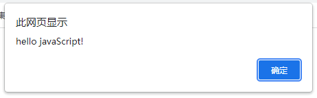
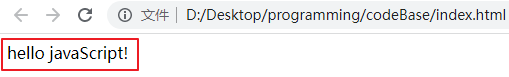
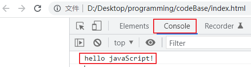
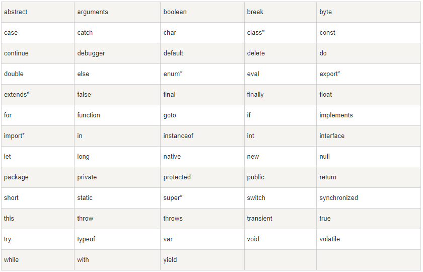
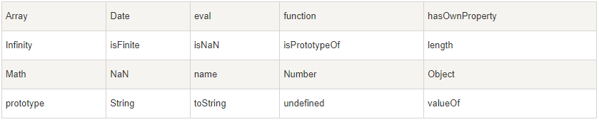
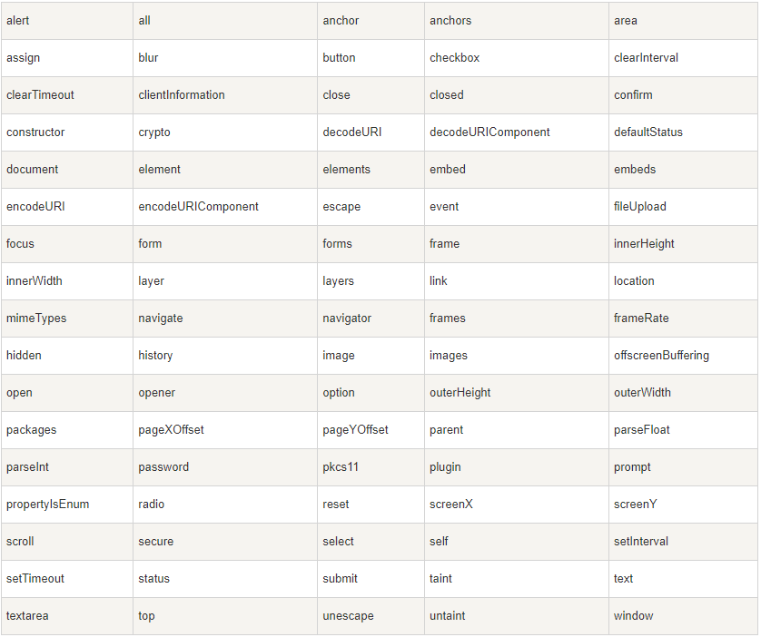
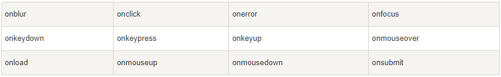
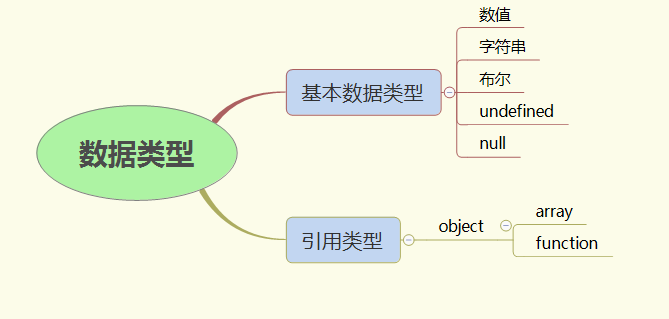

# 第2门课程：javaScript上

# 1. 第1单元-初识javaScript

一个网页包含了结构，样式和行为，前边的课程我们已经学习了是用`html`和`css`分别可以实现网页的结构和样式，但是此时的页面仅仅只可以浏览，没有其他的功能和交互效果。那么要实现页面的交互效果就需要用到`javaScript`这门语言了。

## javaScript的作用

所以说，`javaScript`的主要作用就是用来实现页面的交互效果（人机交互和服务器交互）。这里有的人认为有了javaScript的话，页面就是动态的页面了，没有的话就是静态页面了。
:::tip
其实这个认识是错误，页面的静态和动态指的是页面的内容是否可以动态的更新，而不是页面是否有什么效果。javaScript可以结合其他的一些技术比如：http,ajax等来实现服务器交互，从而让静态的网页变成动态的。
:::

既然我们知道了使用`javaScript`可以实现页面的交互，那么我们列举一下使用`javaScript`具体可以实现页面中的什么功能？

- 轮播图
- 选项卡
- 动态更新数据
- 动态渲染
- 页面动画
- 游戏编程
.......

## javaScript的组成

`javaScrpt`由三部分组成，分别是`ECMAScript`、`DOM`、`BOM`。其中，`ECMAScript`中规定了这门语言的基础的语法规则，`DOM`包含了如何动态的去操作页面中的标签节点（也就是我们写的html标签），`BOM`则包含了如何去控制浏览器的各种行为比如控制浏览器刷新、控制浏览器打开一个新的标签页，控制浏览器访问历史记录。

我们对于`javaScript`的学习顺序也是按照  `ECMAScript`、`DOM`、`BOM` 三部分进行学习。

## javaScript的引入方式

说了关于`javaScript`的很多内容，大家应该感觉还是比较抽象的，那么接下来我们就实际的动手来写一写`javaScript`。

`javaScript`代码是依赖于`html`文件运行的，类似于`css`。我们想要运行`javaScript`代码，就需要在`html`文件中引入`javaScript`。

这里，我们学习两种引入`javaScript`的方式即可。

### 内部引入

这种方式比较简单，就是在`html`中使用`script`标签，把`javaScript`代码写在`script`之间。

创建一份`index.html`文件，内容如下：

```html{13-18}
<!DOCTYPE html>
<html lang="en">

<head>
    <meta charset="UTF-8">
    <meta http-equiv="X-UA-Compatible" content="IE=edge">
    <meta name="viewport" content="width=device-width, initial-scale=1.0">
    <title>Document</title>
</head>

<body>

    <!-- 添加script标签 -->
    <!-- 标签中间可以写javaScript代码 -->
    <!-- alert('hello javaScript!');的意思是弹出hello javaScript -->
    <script>
        alert('hello javaScript!');
    </script>
</body>

</html>
```
演示效果如下：



:::tip 
为了方式我们一般简称`javaScript`为`js`
:::

### 外部引入

外部引入的方式需要我们创建一份`js`后缀的文件，并将`js`代码写入该文件中，然后通过`script`标签的`src`属性引入该`js`文件，引入路径遵守前边学过的路径规则（相对路径或者绝对路径）

创建一份`index.js`文件，并写入如下代码：

```js
 alert('hello javaScript!');
```

我们改变一下`index.html`中的代码(假设`index.html`和`index.js`在同一个目录中)

```html{14}
!DOCTYPE html>
<html lang="en">

<head>
    <meta charset="UTF-8">
    <meta http-equiv="X-UA-Compatible" content="IE=edge">
    <meta name="viewport" content="width=device-width, initial-scale=1.0">
    <title>Document</title>
</head>

<body>


    <script src="./index.js"></script>
</body>

</html>
```
显示的效果依然为: 


::: warning 
 注意：内部方式和外部方式不能同时使用，优先使用外部的引用方式，这样可以把`js`代码和`html`代码解耦，便于维护。
:::

## 三种输出方式

关于`js`代码的语法规则，我们会在一个较长的教学周期进行系统的讲解，本小结我们先简单学习一些可以输入内容的代码。

这些代码需要大家进行一定的记忆，将来我们彻底掌握了`js`的语法规则这些代码在我们看起来就是顺理成章的了。

我们要学的三种输出的方式分别是：

- `document.write(要输出的内容)` 把内容输出到页面
- `console.log(要输出的内容)` 把内容输出到控制台(按f12,点击conslole选项可以打开控制台)
- `alert(要输出的内容)` 把内容以弹窗的形式展示（前边已经看到过了）

在`index.js`中写入代码并分别查看效果

```js
document.write('hello javaScript!')
```


```js
console.log('hello javaScript!')
```


```js
alert('hello javaScript!')
```


:::tip
对于我们输出的内容一定要加上`''`或者`""`,至于是为什么呢？在后边的章节讲到`数据类型的`时候会有详细的解释。
:::

## 注释

对于`javaScript`代码而已，我们也可以添加注释，它有两种注释方式：

- 单行注释  `// 我是被注释的内容，程序运行的时候会忽略我`
- 多行注释  `/* 我是被注释的内容，程序运行的时候会忽略我,我可以书写多行 */`

一般添加的注释是给人看的，便于阅读，程序运行的时候会忽略注释部分

```js

/*
    以下代码是可以在页面，控制台，弹框中输出内容
*/

document.write('hello javaScript'); // 在页面中输出hello javaScript
console.log('hello javaScript'); // 在控制台中输出hello javaScript
alert('hello javaScript'); // 在弹框中输出hello javaScript
```

## 作业

1. 总结本章节的知识点

2. 请说出`javaScript`的作用

3. 动态页面和静态页面的区别

4. `javaScript`的引入方式，及其不同

5. `javaScript`的组成部分，及各部分的作用

6. `javaScript`的三种输出方式，以及特点

7. `javaScript`的注释如何书写

# 2. 第2单元-javaScript的基本语法

因为我们仅仅只是记忆了一些`js`代码，所以还无法讲解`js`语法。

本单元我们会先学习两个概念`变量`和`直接量`，这两个概念是编程的基础非常重要。

基于学习`变量`和`直接量`，我们会产出一些`js`代码，以此为基础我们可以探讨一些`js`中的语法。

## 变量

变量是一个可以存储单个可变信息的容器；

上述的解释告诉我们两个信息：

- 变量是个容器
- 容器中的内容是可变的

所以我们需要掌握的是

- 如何创建一个变量（容器)
- 如何查看容器中的内容
- 如何修改容器中的内容

### 如何创建变量

使用`var`表示符创建变量，语法格式是`var 变量名`

```js
var a; // 创建了一个变量a，该变量中没有存储任何内容
```

当然我们也可以创建一个变量的同时，给变量中放入内容

```js
var a = "hello"; // 创建了一个变量a，该变量中的内容是 hello
```

### 如何查看变量中内容

这个很简单，使用我们学习的输出的方法`document.write`、`console.log`、`alert`都可以在对应的位置输出变量中的内容。

```js
var a = 'hello javaScript';
document.write(a); //在页面中会显示 hello javaScript
```
### 如何修改变量中的内容

使用`=`可以修改变量中的内容，语法格式是`变量名 = 要修改的内容`

```js
var a = 'hello'; // 创建变量a，并放入的内容为 hello
a = 'javaSceript'; // 修改变量a中的内容为 javaScript
document.write(a); // 页面中显示 javaScript
```

还可以把一个容器中的内容放入另一个容器中

```js
var a = 'hello'; // 创建变量a，并放入内容为hello
var b = a; // 把变量a中的内容放入变量b中
console.log(b); // hello
console.log(a); // hello 虽然是把a中的内容放入了b中，但是并未清除a中的内容
```

### 变量的命名

大家应该发现了，变量我写的很随意，比如用`a`就能表示一个变量。那么是不是说变量名可以随便写呢？并不是这样的，变量名的命名还是有一些规则的。

- 由数字、字母、下划线或$（美元符）组成；
- 不能以数字开头；并且区分大小写；
- 不能用关键字，保留字命名（下边会讲到什么是关键字和保留字）；
- 建议驼峰命名；

::: tip
骆驼式命名法就是当变量名是由一个或多个单词连结在一起，而构成的唯一识别字时，第一个单词以小写字母开始；从第二个单词开始以后的每个单词的首字母都采用大写字母，例如：myFirstName、myLastName，这样的变量名看上去就像骆驼峰一样此起彼伏，故得名。
:::

::: warning
变量的命名是一个学问，优秀的变量命名决定了程序的可读性和可维护性，我们变量命名的时候一定不要随意命名，而是应该见名知意。尤其是初学者，要养成良好的变量命名习惯。
:::

## 直接量

所谓直接量就是不可再变化的量，也就是上述我们所说的放入变量中的内容，比如`hello`、`javaScript`等。

当然直接量有不同的类型，我们基础的带引号的只是其中的一种，在接下来的章节<数据类型中>会有详细的介绍。

直接量一般我们习惯称之为`值`，也就是放入变量中的内容，我们可以描述为`变量的值`

```js
var a = 'hello'; // 创建了变量a，变量a的值为 hello
var b = a; // 创建了变量b，并把变量a的值赋给了变量b
```

## 浅谈`js`的语法细节

通过对变量、直接量、以及`js`的输出方式的学习，我们已经可以写一写简单的`js`代码了，通过这些简单的代码我们来谈谈`javaScript`这门语言的语法细节。

### `js`的基本单元

什么叫基本单元呢？举个例子，比如我们学习英语的时候要学习基本的26个英文字母，然后由字母组成单词，单词组成语句。这样，我们才可以慢慢的掌握英语并进行日常交流，甚至写作等等。 那么其中26个字母就是英语这门语言的基本单元。

`javaScript`作为一门编程语言，它也有自己的基本单元，只要掌握了基本单元才能有助于我们更好的学习这门语言。

当然，`javaScript`的基本单元可不像英语的字母有26个那么多。它仅仅有以下这几项：
- 关键字（保留字）
- 变量
- 直接量
- 运算符

而且，其中的变量和直接量我们已经掌握了。所以，我们在这里再了解一下关键字和运算符是不是感觉马上就能掌握`javaScript`的核心了呢？:tada: ！


#### 关键字

关键字是`javaScript`中内置的一些标识符，这些标识符是有特殊意义的，这些特殊意义大体可以分为以下四类：
- 表示命令 （比如`var`的意思就是表示要创建变量了）
- 表示一些特殊的直接量 （比如 true false,后边会学到）
- 表示一些内置的变量 （比如 document window parseIn 等等这些以后也会讲到）
- 表示一些特殊的运算符（比如 typeof function 后边会讲到）

那么保留字又是怎么一回事呢？

因为`javaScript`一直在发展中，每年都会发布一些新的内容，有一些标识符还没有被纳入到语言体系中，但是已经确定了在将来的版本中会将该标识符加入进来变成关键字，那么此时这些还未成为关键字的标识符就被称为保留字了。


换句话说，就是随着`javaScript`的版本不断的更新，一些保留字会逐渐称为关键字。

这里有一个地址，里边罗列了`javaScript`中的一些关键字和保留字（这些大家不用记住，简单了解即可，因为将来这些关键字我们都会学到）

[javaScript关键字和保留字](https://www.runoob.com/js/js-reserved.html)

以下是部分截图






#### 运算符

比如我们在前边写到的`=`就是一个运算符，叫做`赋值运算符`。作用就是把右侧的值赋到左侧的变量中，所以`=`的左侧一般必须是一个变量。

当然除了这个运算符之外，还有很多运算符，我们下边的章节会有详细的介绍。

这里我们要了解`运算符`属于`javaScript`语言的一个基本单元，而且非常重要。


### 表达式和语句

表达式应不算是`js`中的基本单元了，它属于基本单元组成的新的概念，就像英语中使用字母可以组成单词一样，这里表达式已经算是"单词"的级别了。

那么表达式是由 `变量`或`直接量`或`运算符`组成的。而且表达式最终是可以计算出一个最终的值的。

比如： 我们可以说变量`a`是一个表达式，也可以说`'hello'`是一个表达式，`a = 'hello'`也可以称为表达式

那么`a = 'hello'`这个表达式的值是多少呢？  `console.log(a = 'hello')`看看结果吧！

如果给表达式添加一个用于命令的关键字的话，那么就会组成语句。

`a = 'hello'`是表达式，而 `var a = 'hello'`就是语句了，而语句是没有值的，所以，试试`console.log(var a = 'hello')`，看看有什么效果吧。

### 关于分号`;`

每行代码写完之后一般加`;`来表示这行代码结束了。

对于`js`是否应该加`;`，争论由来已久！其实加不加都无所谓，因为`js`这门语言并没有要求必须加`;`。

我们虽然不管先是否要加`;`, 但是我们关心的是代码的风格是否保持统一，不能有的加，有的不加！而应该如果要加就统一都加，如果不加就统一都不加。

### 关于空格

我们先看一行代码

```js
var a = 'hello';
```
上述代码中，关键字`var`和变量`a`之间的控制是必须的，否则代码会报错！ 但是，变量`a`和运算符`=`之间的空格以及运算符`=`和直接量`hello`之间的空格其实并不是必须的。

比如我们这样写

```js
var a='hello';
```
代码也是正确的，并不会报错。所以说，说上述的两个非必要控制仅仅只是一种代码风格。

:::tip
在运算符的左右添加空格是一种良好的编码习惯，希望大家在初学的时候就保持这种良好的习惯！
:::

## 作业

1. 练习如何创建变量

2. 练习如何给变量赋值

3. 阐述一下你对于变量，直接量，关键字，运算符，表达式，语句的理解

4. 补全如下代码：

```js
var a = '1';
var b = '2';
// 请补全代码使以下的输出结果达到预期,补全的代码中不能出现直接量

console.log(a); // 2
console.log(b); // 1

```

# 3. 第3单元-数据类型

数据类型是针对于直接量来说的，前边我们也提到过直接量有很多种类型，我们写的`'hello'`这种带引号的形式的直接量就属于其中的一种类型叫做字符串（string）

那么`javaScript`中的数据类型可以分为两大类分别是`基本数据类型`和`引用数据类型`

而基本类型又分为：`字符串（string）`、`数值（number）`、`布尔（boolean）`、`undefined`、`null`

而引用类型只有一种就是`对象（object）`

如下图：



## 基本类型

关于基本类型的数据我们需要掌握这几个方面：

- 该类型数据的书写特点
- 该类型数据的含义和作用
- 该类型数据的英文表示

### 字符串

字符串我们已经接触了一段时间了，这种数据的特点是需要添加`''`或者`""`

```js
var firstName = 'Wang';
var lastName = "SiCong";
```
:::tip
为了规范，还是不希望`''`和`""`混用，应该保持统一的风格，不过首选还是`''`
:::

任何可使用键盘敲出来的东西都可以放在`''`或者`""`中作为字符串

```js
var str = '!@#$%^&*()_+-=a-z0-9,.<>?/\|[]{}';
```
但是有个问题，比如我们想要输出`''`或者`""`该怎么办呢？

第一种方案就是如果要输出`''`那么该字符串就是用`""`包裹，如果要输出`""`，那么该字符串就用`''`包裹

```js
var book = '"天龙八部"';
var letter = "'射雕英雄传'";
console.log(book); // "天龙八部"
console.log(letter); // '射雕英雄传'
```
第二种方案就是使用`\`进行转义，比如`\'`就表示`'`没有特殊含义了只是一个普通的字符

```js
var book = '\'天龙八部\'';
var letter = "\"射雕英雄传\""
console.log(book); // '天龙八部'
console.log(letter); // "射雕英雄传"
```
:::tip
字符串的作用就不用多说了，比如我们页面中的文字等等都需要使用字符串这种数据类型，我们使用`string`这个单词表示字符串这种数据类型。
:::

### 数值

直接书写的 阿拉伯数字就是数值类型的数据，换句话就是我们在数学上如何写数字，那么数值类型就如何书写

支持正数，负数，小数

```js
var n = 1; 
var m = '1';
var x = -1;
var y = 3.14;
var z = 8.5;
```
:::warning
上述代码中，变量n和变量m的意义可完全不一样n是数值的1，而m是字符串仅仅是一个字符而已。数值是可以参与数学运算的，而字符串并不能参与数学运算
:::

当然了，我们直接写的数值都是十进制的，而且我们常用的也都是十进制。不过，`javaScript`还允许我们写二进制、八进制、十六进制。

这三种进制的在计算机中也是很常用的（你不懂这些进制？没关系，写着写着你就懂了）

如果我们要写二进制的数字那么需要以`0b`开头，八进制以`0`开头，十六进制以`0x`开头

```js
var a = 0b1101; // 二进制中只能出现0和1
var b = 017; // 八进制中大单个数字最大到7，就像是十进制中单个数字最大到9一样
var c = 0xa2; // 十六进制中最大的单个数字是15，使用阿拉伯数字就不能表示了，所以 a表示10，b->11 c->12 d->13 e-14 f-15, 所以十六进制中可能会出现 a-f的字母
```

:::tip
可以去在控制台中打印一下这些数字，不过呢会自动的被转换成十进制的数字。编程的时候难免会碰到一些算术问题，比如商品的价格，销量，账户存的钱等等，这些就需要使用数值这种数据类型了，我们使用英文单词`number`来表示数值这种数据类型。
:::


